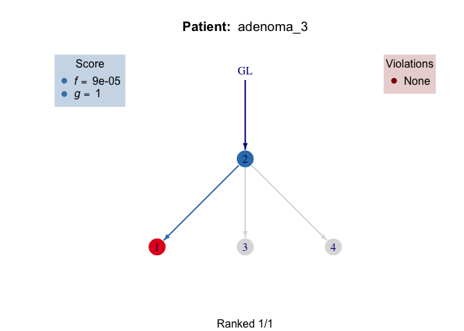
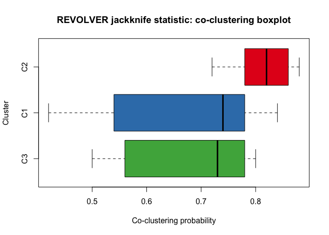
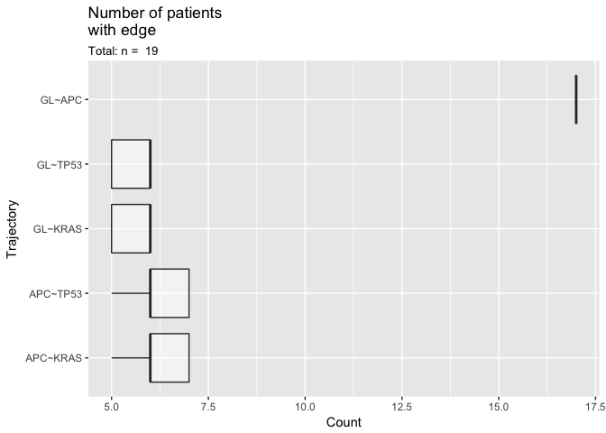

CRC analysis with REVOLVER
================
Giulio Caravagna
June 10, 2018

We present the Colorectal cancer (CRC) analysis with REVOLVER discussed
in the main REVOLVER paper. For information about this notebook, write
to

  - Giulio Caravagna, Institute for Cancer Research, London. Email:
    <giulio.caravagna@ed.ac.uk>.

REVOLVER is available as an R package at
[Github](https://github.com/caravagn/revolver).

``` r
devtools::install_github("caravagn/revolver")
```

Original data is available from the following manuscript:

  - Cross W et al. *The evolutionary landscape of colorectal
    carcinogenesis*. Nat Eco Evo, to appear,
2018.

### Building a cohort object

``` r
# Load REVOLVER and disable crayon's coloured output that renders badly in HTML,
# as well as REVOLVER's progress bars...
library(revolver)
options(crayon.enabled = FALSE)
options(revolver.progressBar = FALSE)
```

In this notebook we refer to “SNVs” to indicate mutations annotated in
the original paper (even if some of them are in/dels), and we call
“clones” the set of SNVs detected in the same samples of a patient.

The format of input `data` is REVOLVER’s standard data.frame, that we
pre-prepared. Notice that we subset data from Cross W et al to contain
just driver SNVs. This is not a general pre-requisite of REVOLVER, which
can process all mutations annotated in a phylogenetic tree.

``` r
# Load the SNVs that we prepared.
data(CRC)
data = CRC
print(head(data))
```

    ##   patientID variantID                           CCF is.clonal is.driver
    ## 1 adenoma_1    ACVR2A R1:1;R2:1;R3:1;R4:1;R5:1;R6:1      TRUE      TRUE
    ## 2 adenoma_1       APC R1:1;R2:1;R3:1;R4:1;R5:1;R6:1      TRUE      TRUE
    ## 4 adenoma_2       APC           R1:1;R2:1;R3:1;R4:1      TRUE      TRUE
    ## 6 adenoma_2      KRAS           R1:0;R2:0;R3:0;R4:1     FALSE      TRUE
    ## 7 adenoma_2     ARID2           R1:0;R2:0;R3:0;R4:1     FALSE      TRUE
    ## 8 adenoma_2      TP53           R1:1;R2:1;R3:1;R4:0     FALSE      TRUE
    ##      Misc cluster
    ## 1 NOTHING       1
    ## 2 NOTHING       1
    ## 4 NOTHING       1
    ## 6 NOTHING       2
    ## 7 NOTHING       2
    ## 8 NOTHING       3

The first thing to do is to build a `rev_cohort` S3 object in REVOLVER.
To do that, we need a parsing function to transform strings like
`"R1:1;R2:1;R3:1;R4:0"` into equivalent matrices. This does the job.

``` r
print(revolver:::CCF.parser)
```

    ## function(x)
    ## {
    ##   tk = strsplit(x, ';')[[1]]
    ##   tk = unlist(strsplit(tk, ':'))
    ## 
    ##   samples = tk[seq(1, length(tk), 2)]
    ## 
    ##   values = tk[seq(2, length(tk), 2)]
    ##   names(values) = samples
    ## 
    ##   return(values)
    ## }
    ## <environment: namespace:revolver>

``` r
revolver:::CCF.parser("R1:1;R2:1;R3:1;R4:0")
```

    ##  R1  R2  R3  R4 
    ## "1" "1" "1" "0"

We are now ready to build a REVOLVER object from `data`. We do that with
function `revolver_cohort`, and give it some parameters:

  - `ONLY.DRIVER = FALSE` to use all annotated SNVs;
  - `MIN.CLUSTER.SIZE = 0` to use all clusters in the data.

For this simple dataset these parameters are not very interesting in
practice, the first one is also useless because we have already selected
just driver events.

``` r
cohort = revolver_cohort(
  dataset = data,
  CCF.parser = revolver:::CCF.parser,
  annotation = 'CRC cohort of adenomas and carcinomas',
  options = list(
    ONLY.DRIVER = FALSE, 
    MIN.CLUSTER.SIZE = 0)
)
```

    ##  [ REVOLVER Cohort Constructor for version 1.0 ~ "Haggis and tatties" ] 
    ##   Use only alterations annotated as driver = 0  
    ##   Filter: minimum number of alterations in a group/ cluster = 0  
    ## 
    ## ----------
    ## Input data
    ## ----------
    ## # A tibble: 63 x 7
    ##    Misc    patientID variantID cluster is.driver is.clonal CCF            
    ##  * <chr>   <chr>     <chr>       <dbl> <lgl>     <lgl>     <chr>          
    ##  1 NOTHING adenoma_1 ACVR2A          1 TRUE      TRUE      R1:1;R2:1;R3:1…
    ##  2 NOTHING adenoma_1 APC             1 TRUE      TRUE      R1:1;R2:1;R3:1…
    ##  3 NOTHING adenoma_2 APC             1 TRUE      TRUE      R1:1;R2:1;R3:1…
    ##  4 NOTHING adenoma_2 KRAS            2 TRUE      FALSE     R1:0;R2:0;R3:0…
    ##  5 NOTHING adenoma_2 ARID2           2 TRUE      FALSE     R1:0;R2:0;R3:0…
    ##  6 NOTHING adenoma_2 TP53            3 TRUE      FALSE     R1:1;R2:1;R3:1…
    ##  7 NOTHING adenoma_3 PIK3CA          1 TRUE      FALSE     R1:0;R2:0;R3:0…
    ##  8 NOTHING adenoma_3 FBXW7           2 TRUE      TRUE      R1:1;R2:1;R3:1…
    ##  9 NOTHING adenoma_3 APC             2 TRUE      TRUE      R1:1;R2:1;R3:1…
    ## 10 NOTHING adenoma_3 AKAP9           3 TRUE      FALSE     R1:0;R2:0;R3:1…
    ## # ... with 53 more rows
    ## 
    ## ---------------------
    ## Extracting CCF values
    ## ---------------------

### Basic data reshaping

You can immediately start playing with the `cohort` object. If you
`print` it, function `revolver_check_cohor` will check the data.

``` r
print(cohort)
```

    ##  [ REVOLVER  1.0 ~ "Haggis and tatties" ] 
    ## 
    ##   CRC cohort of adenomas and carcinomas 
    ## 
    ##   Patient IDs     : adenoma_1,  adenoma_2,  adenoma_3,  adenoma_4,  adenoma_5,  adenoma_6,  ...
    ##   Cohort size     : 19 patients, 63 alterations, 20 drivers
    ##   Drivers         : ACVR2A,  APC,  KRAS,  ARID2,  TP53,  PIK3CA,  ... 
    ## 
    ##  ----------------------
    ##  Computations available
    ##  ----------------------
    ## 
    ##   Trees per patient    : NO
    ##   Fit via TL           : NO
    ##   REVOLVER clustering  : NO
    ##   Jackknife statistics : NO
    ## 
    ## 
    ##  CHECK  These drivers occurr once, will not be correlated: ACVR2A, AKAP9, ARID2, CHD4, GNAS, SMAD3, SMAD4, SOX9, TGIF1
    ##  CHECK  Patients with 1 drivers can only be expanded: adenoma_9, carcinoma_10, carcinoma_3

In this case, `revolver_check_cohor` reports us two messages:

  - driver SNVs (`ACVR2A`, `AKAP9`, `ARID2`, etc.) occur only in one
    patient,

  - and that 3 patients have only 1 clone/ cluster harbouring one (or
    possibly more) driver SNVs

Because REVOLVER correlates reccurrent drivers, we can remove
non-recurrent SNVs. For patients `adenoma_9`, `carcinoma_10` and
`carcinoma_3`, there is nothing that we should actually do. REVOLVER is
just informing us that, for those datasets, the only thing that we can
do is to expand the clone where the drivers occur, in the second step of
REVOLVER’s main algorithm.

To subset the data we can use a function `clonal.subclonal.table` that
is not exported by REVOLVER, but that creates a table of occurrences of
each annotated driver, sorted by marginal frequency.

``` r
# Recurrent SNVs are top of the table, try head(table) 
table = revolver:::clonal.subclonal.table(cohort)
tail(table, n = 10) # Show last-10
```

    ##        Clonal SubClonal Counts
    ## ARID1A      2         0      2
    ## ACVR2A      1         0      1
    ## ARID2       0         1      1
    ## AKAP9       0         1      1
    ## GNAS        0         1      1
    ## SMAD4       0         1      1
    ## CHD4        0         1      1
    ## TGIF1       1         0      1
    ## SMAD3       1         0      1
    ## SOX9        1         0      1

We take those drivers that occur in at least 2 patients, and use
`revolver_subsetDrivers` to subset the cohort object. After a call to
`revolver_subsetDrivers`, function `revolver_check_cohor` is called
again.

``` r
table = table[table$Counts > 1, ]
cohort = revolver_subsetDrivers(cohort, rownames(table))
```

    ##  [ REVOLVER subsetting drivers according to list ] 
    ##   - Drivers to keep = APC, KRAS, TP53, PIK3CA, FBXW7, KMT2C, TCF7L2, BRAF, NRAS, AMER1, ARID1A  
    ## Removing: ACVR2A, ARID2, AKAP9, GNAS, SMAD4, CHD4, TGIF1, SMAD3, SOX9
    ##  CHECK  Patients with 1 drivers can only be expanded: adenoma_1, adenoma_9, carcinoma_10, carcinoma_3

Now our cohort has only 11 drivers because we removed 9.

``` r
cohort
```

    ##  [ REVOLVER  1.0 ~ "Haggis and tatties" ] 
    ## 
    ##   CRC cohort of adenomas and carcinomas 
    ## 
    ##   Patient IDs     : adenoma_1,  adenoma_2,  adenoma_3,  adenoma_4,  adenoma_5,  adenoma_6,  ...
    ##   Cohort size     : 19 patients, 63 alterations, 11 drivers
    ##   Drivers         : APC,  KRAS,  TP53,  PIK3CA,  FBXW7,  KMT2C,  ... 
    ## 
    ##  ----------------------
    ##  Computations available
    ##  ----------------------
    ## 
    ##   Trees per patient    : NO
    ##   Fit via TL           : NO
    ##   REVOLVER clustering  : NO
    ##   Jackknife statistics : NO
    ## 
    ## 
    ##  CHECK  Patients with 1 drivers can only be expanded: adenoma_1, adenoma_9, carcinoma_10, carcinoma_3

### Constructing patient’s trees

To use REVOLVER we need to have a set of tree models for each one of our
input patients. In this case, because data is binary, we want to build
*mutation trees* as described in the main REVOLVER paper.

We have a function `revolver_compute_CLtrees` to compute them, and store
the result back in our `cohort` object. Each tree is scored by its
mutual information.

> CL stands for [Chow-Liu
> tree](https://en.wikipedia.org/wiki/Chow%E2%80%93Liu_tree), which is
> the statistical name for this type of tree-distribution. [Mutual
> Information](https://en.wikipedia.org/wiki/Mutual_information) is a
> standard measure of association between random variables, it is well
> known in the context of information theory.

The function has some arguments, and allows to generate either
exhaustively or via Montecarlo sampling the possible trees for each
patient. Parameters are

  - `sspace.cutoff = 10000`, the maximum number of trees to generate
    exhaustively, if that is above this value, we switch to Montecarlo;
  - `n.sampling = 5000`, if we do Montecarlo, this is how many we
    sample;
  - `store.max = 200`, regardless the generation strategy, this is the
    number of trees that we store, at maximum, for each patient;
  - `overwrite = FALSE`, this is just to say that, if we have already
    computed the trees for `patient`, we should skip this computation.

This chunk generates quite some output to recapitulate the generated
trees; we omit it from this markdown.

``` r
for(patient in cohort$patients)
  cohort = revolver_compute_CLtrees(
    cohort, 
    patient, 
    options = list(sspace.cutoff = 10000,
                   n.sampling = 5000,
                   store.max = 200,
                   overwrite = FALSE))
```

    ##  [ REVOLVER Construct mutational trees (Chow-Liu) for adenoma_1 ] 
    ##   Use precomputed trees = FALSE  
    ##   Maximum state space size to switch from exhaustive to Montecarlo search = 10000  
    ##   Number of Montecarlo samples, if not exhaustive = 5000  
    ##   Overwrite the tree if it is already available = FALSE  
    ##   Maximumum number of trees to store, if multiple are available = 200  
    ## 
    ## 
    ## --------------------------------------------
    ## Groups/ Clusters in the data of this patient
    ## --------------------------------------------
    ##   is.driver is.clonal nMuts R1 R2 R3 R4 R5 R6
    ## 1      TRUE      TRUE     2  1  1  1  1  1  1
    ## 
    ## This model has 1 node, we cannot compute its score.
    ## -------------------------------------------------------------------
    ## Creating rev_phylo objects for REVOLVER (this might take some time)
    ## -------------------------------------------------------------------
    ## Total number of trees with non-zero scores is 1 -- storing all
    ## 
      |                                                                       
      |                                                                 |   0%
    ##  [ REVOLVER Construct mutational trees (Chow-Liu) for adenoma_2 ] 
    ##   Use precomputed trees = FALSE  
    ##   Maximum state space size to switch from exhaustive to Montecarlo search = 10000  
    ##   Number of Montecarlo samples, if not exhaustive = 5000  
    ##   Overwrite the tree if it is already available = FALSE  
    ##   Maximumum number of trees to store, if multiple are available = 200  
    ## 
    ## 
    ## --------------------------------------------
    ## Groups/ Clusters in the data of this patient
    ## --------------------------------------------
    ##   is.driver is.clonal nMuts R1 R2 R3 R4
    ## 2      TRUE     FALSE     2  0  0  0  1
    ## 1      TRUE      TRUE     1  1  1  1  1
    ## 3      TRUE     FALSE     1  1  1  1  0
    ## 
    ## --------------------------------
    ## Computing Suppes' extended poset
    ## --------------------------------
    ## # A tibble: 2 x 2
    ##   from  to   
    ##   <chr> <chr>
    ## 1 1     2    
    ## 2 1     3    
    ## 
    ## ----------------------------------------------------------
    ## Computing solutions from poset (this might take some time)
    ## ----------------------------------------------------------
    ## There are no alternatives!
    ## 
      |                                                                       
      |                                                                 |   0%
    ## 
    ## ---------------------------------------------------------
    ## Scoring and ranking solutions (this might take some time)
    ## ---------------------------------------------------------
    ## Computing Mutual Information from data
    ## # A tibble: 3 x 3
    ##      `2`    `1`   `3`
    ##    <dbl>  <dbl> <dbl>
    ## 1 0.500  0.0505 0.223
    ## 2 0.0505 0.500  0.223
    ## 3 0.223  0.223  0.673
    ## Computing rank
    ## 
      |                                                                       
      |                                                                 |   0%
    ## Scores range from  0.0112764 (max) to 0.0112764 (min)
    ## 
    ## -------------------------------------------------------------------
    ## Creating rev_phylo objects for REVOLVER (this might take some time)
    ## -------------------------------------------------------------------
    ## Total number of trees with non-zero scores is 1 -- storing all
    ## 
      |                                                                       
      |                                                                 |   0%
    ##  [ REVOLVER Construct mutational trees (Chow-Liu) for adenoma_3 ] 
    ##   Use precomputed trees = FALSE  
    ##   Maximum state space size to switch from exhaustive to Montecarlo search = 10000  
    ##   Number of Montecarlo samples, if not exhaustive = 5000  
    ##   Overwrite the tree if it is already available = FALSE  
    ##   Maximumum number of trees to store, if multiple are available = 200  
    ## 
    ## 
    ## --------------------------------------------
    ## Groups/ Clusters in the data of this patient
    ## --------------------------------------------
    ##   is.driver is.clonal nMuts R1 R2 R3 R4 R5
    ## 2      TRUE      TRUE     5  1  1  1  1  1
    ## 1      TRUE     FALSE     1  0  0  0  1  1
    ## 3     FALSE     FALSE     1  0  0  1  0  0
    ## 4     FALSE     FALSE     1  0  1  0  0  0
    ## 
    ## --------------------------------
    ## Computing Suppes' extended poset
    ## --------------------------------
    ## # A tibble: 3 x 2
    ##   from  to   
    ##   <chr> <chr>
    ## 1 2     1    
    ## 2 2     3    
    ## 3 2     4    
    ## 
    ## ----------------------------------------------------------
    ## Computing solutions from poset (this might take some time)
    ## ----------------------------------------------------------
    ## There are no alternatives!
    ## 
      |                                                                       
      |                                                                 |   0%
    ## 
    ## ---------------------------------------------------------
    ## Scoring and ranking solutions (this might take some time)
    ## ---------------------------------------------------------
    ## Computing Mutual Information from data
    ## # A tibble: 4 x 4
    ##      `2`    `1`    `3`    `4`
    ##    <dbl>  <dbl>  <dbl>  <dbl>
    ## 1 0.451  0.0757 0.0336 0.0336
    ## 2 0.0757 0.637  0.0757 0.0757
    ## 3 0.0336 0.0757 0.451  0.0336
    ## 4 0.0336 0.0757 0.0336 0.451 
    ## Computing rank
    ## 
      |                                                                       
      |                                                                 |   0%
    ## Scores range from  8.522226e-05 (max) to 8.522226e-05 (min)
    ## 
    ## -------------------------------------------------------------------
    ## Creating rev_phylo objects for REVOLVER (this might take some time)
    ## -------------------------------------------------------------------
    ## Total number of trees with non-zero scores is 1 -- storing all
    ## 
      |                                                                       
      |                                                                 |   0%
    ##  [ REVOLVER Construct mutational trees (Chow-Liu) for adenoma_4 ] 
    ##   Use precomputed trees = FALSE  
    ##   Maximum state space size to switch from exhaustive to Montecarlo search = 10000  
    ##   Number of Montecarlo samples, if not exhaustive = 5000  
    ##   Overwrite the tree if it is already available = FALSE  
    ##   Maximumum number of trees to store, if multiple are available = 200  
    ## 
    ## 
    ## --------------------------------------------
    ## Groups/ Clusters in the data of this patient
    ## --------------------------------------------
    ##   is.driver is.clonal nMuts R1 R2 R3 R4
    ## 1      TRUE      TRUE     3  1  1  1  1
    ## 2      TRUE     FALSE     1  0  0  1  0
    ## 3     FALSE     FALSE     1  0  0  0  1
    ## 
    ## --------------------------------
    ## Computing Suppes' extended poset
    ## --------------------------------
    ## # A tibble: 2 x 2
    ##   from  to   
    ##   <chr> <chr>
    ## 1 1     2    
    ## 2 1     3    
    ## 
    ## ----------------------------------------------------------
    ## Computing solutions from poset (this might take some time)
    ## ----------------------------------------------------------
    ## There are no alternatives!
    ## 
      |                                                                       
      |                                                                 |   0%
    ## 
    ## ---------------------------------------------------------
    ## Scoring and ranking solutions (this might take some time)
    ## ---------------------------------------------------------
    ## Computing Mutual Information from data
    ## # A tibble: 3 x 3
    ##      `1`    `2`    `3`
    ##    <dbl>  <dbl>  <dbl>
    ## 1 0.500  0.0505 0.0505
    ## 2 0.0505 0.500  0.0505
    ## 3 0.0505 0.0505 0.500 
    ## Computing rank
    ## 
      |                                                                       
      |                                                                 |   0%
    ## Scores range from  0.002553716 (max) to 0.002553716 (min)
    ## 
    ## -------------------------------------------------------------------
    ## Creating rev_phylo objects for REVOLVER (this might take some time)
    ## -------------------------------------------------------------------
    ## Total number of trees with non-zero scores is 1 -- storing all
    ## 
      |                                                                       
      |                                                                 |   0%
    ##  [ REVOLVER Construct mutational trees (Chow-Liu) for adenoma_5 ] 
    ##   Use precomputed trees = FALSE  
    ##   Maximum state space size to switch from exhaustive to Montecarlo search = 10000  
    ##   Number of Montecarlo samples, if not exhaustive = 5000  
    ##   Overwrite the tree if it is already available = FALSE  
    ##   Maximumum number of trees to store, if multiple are available = 200  
    ## 
    ## 
    ## --------------------------------------------
    ## Groups/ Clusters in the data of this patient
    ## --------------------------------------------
    ##   is.driver is.clonal nMuts R1 R2 R3 R4
    ## 1      TRUE      TRUE     3  1  1  1  1
    ## 
    ## This model has 1 node, we cannot compute its score.
    ## -------------------------------------------------------------------
    ## Creating rev_phylo objects for REVOLVER (this might take some time)
    ## -------------------------------------------------------------------
    ## Total number of trees with non-zero scores is 1 -- storing all
    ## 
      |                                                                       
      |                                                                 |   0%
    ##  [ REVOLVER Construct mutational trees (Chow-Liu) for adenoma_6 ] 
    ##   Use precomputed trees = FALSE  
    ##   Maximum state space size to switch from exhaustive to Montecarlo search = 10000  
    ##   Number of Montecarlo samples, if not exhaustive = 5000  
    ##   Overwrite the tree if it is already available = FALSE  
    ##   Maximumum number of trees to store, if multiple are available = 200  
    ## 
    ## 
    ## --------------------------------------------
    ## Groups/ Clusters in the data of this patient
    ## --------------------------------------------
    ##   is.driver is.clonal nMuts R1 R2
    ## 1      TRUE      TRUE     2  1  1
    ## 
    ## This model has 1 node, we cannot compute its score.
    ## -------------------------------------------------------------------
    ## Creating rev_phylo objects for REVOLVER (this might take some time)
    ## -------------------------------------------------------------------
    ## Total number of trees with non-zero scores is 1 -- storing all
    ## 
      |                                                                       
      |                                                                 |   0%
    ##  [ REVOLVER Construct mutational trees (Chow-Liu) for adenoma_7 ] 
    ##   Use precomputed trees = FALSE  
    ##   Maximum state space size to switch from exhaustive to Montecarlo search = 10000  
    ##   Number of Montecarlo samples, if not exhaustive = 5000  
    ##   Overwrite the tree if it is already available = FALSE  
    ##   Maximumum number of trees to store, if multiple are available = 200  
    ## 
    ## 
    ## --------------------------------------------
    ## Groups/ Clusters in the data of this patient
    ## --------------------------------------------
    ##   is.driver is.clonal nMuts R1 R2
    ## 1      TRUE      TRUE     3  1  1
    ## 
    ## This model has 1 node, we cannot compute its score.
    ## -------------------------------------------------------------------
    ## Creating rev_phylo objects for REVOLVER (this might take some time)
    ## -------------------------------------------------------------------
    ## Total number of trees with non-zero scores is 1 -- storing all
    ## 
      |                                                                       
      |                                                                 |   0%
    ##  [ REVOLVER Construct mutational trees (Chow-Liu) for adenoma_8 ] 
    ##   Use precomputed trees = FALSE  
    ##   Maximum state space size to switch from exhaustive to Montecarlo search = 10000  
    ##   Number of Montecarlo samples, if not exhaustive = 5000  
    ##   Overwrite the tree if it is already available = FALSE  
    ##   Maximumum number of trees to store, if multiple are available = 200  
    ## 
    ## 
    ## --------------------------------------------
    ## Groups/ Clusters in the data of this patient
    ## --------------------------------------------
    ##   is.driver is.clonal nMuts R1 R2
    ## 1      TRUE      TRUE     4  1  1
    ## 
    ## This model has 1 node, we cannot compute its score.
    ## -------------------------------------------------------------------
    ## Creating rev_phylo objects for REVOLVER (this might take some time)
    ## -------------------------------------------------------------------
    ## Total number of trees with non-zero scores is 1 -- storing all
    ## 
      |                                                                       
      |                                                                 |   0%
    ##  [ REVOLVER Construct mutational trees (Chow-Liu) for adenoma_9 ] 
    ##   Use precomputed trees = FALSE  
    ##   Maximum state space size to switch from exhaustive to Montecarlo search = 10000  
    ##   Number of Montecarlo samples, if not exhaustive = 5000  
    ##   Overwrite the tree if it is already available = FALSE  
    ##   Maximumum number of trees to store, if multiple are available = 200  
    ## 
    ## 
    ## --------------------------------------------
    ## Groups/ Clusters in the data of this patient
    ## --------------------------------------------
    ##   is.driver is.clonal nMuts R1 R2
    ## 1      TRUE      TRUE     1  1  1
    ## 
    ## This model has 1 node, we cannot compute its score.
    ## -------------------------------------------------------------------
    ## Creating rev_phylo objects for REVOLVER (this might take some time)
    ## -------------------------------------------------------------------
    ## Total number of trees with non-zero scores is 1 -- storing all
    ## 
      |                                                                       
      |                                                                 |   0%
    ##  [ REVOLVER Construct mutational trees (Chow-Liu) for carcinoma_1 ] 
    ##   Use precomputed trees = FALSE  
    ##   Maximum state space size to switch from exhaustive to Montecarlo search = 10000  
    ##   Number of Montecarlo samples, if not exhaustive = 5000  
    ##   Overwrite the tree if it is already available = FALSE  
    ##   Maximumum number of trees to store, if multiple are available = 200  
    ## 
    ## 
    ## --------------------------------------------
    ## Groups/ Clusters in the data of this patient
    ## --------------------------------------------
    ##   is.driver is.clonal nMuts R1 R2 R3 R4
    ## 1      TRUE      TRUE     2  1  1  1  1
    ## 2     FALSE     FALSE     1  1  0  0  0
    ## 
    ## --------------------------------
    ## Computing Suppes' extended poset
    ## --------------------------------
    ## # A tibble: 1 x 2
    ##   from  to   
    ##   <chr> <chr>
    ## 1 1     2    
    ## 
    ## ----------------------------------------------------------
    ## Computing solutions from poset (this might take some time)
    ## ----------------------------------------------------------
    ## There are no alternatives!
    ## 
      |                                                                       
      |                                                                 |   0%
    ## 
    ## ---------------------------------------------------------
    ## Scoring and ranking solutions (this might take some time)
    ## ---------------------------------------------------------
    ## Computing Mutual Information from data
    ## # A tibble: 2 x 2
    ##      `1`    `2`
    ##    <dbl>  <dbl>
    ## 1 0.500  0.0505
    ## 2 0.0505 0.500 
    ## Computing rank
    ## 
      |                                                                       
      |                                                                 |   0%
    ## Scores range from  0.05053431 (max) to 0.05053431 (min)
    ## 
    ## -------------------------------------------------------------------
    ## Creating rev_phylo objects for REVOLVER (this might take some time)
    ## -------------------------------------------------------------------
    ## Total number of trees with non-zero scores is 1 -- storing all
    ## 
      |                                                                       
      |                                                                 |   0%
    ##  [ REVOLVER Construct mutational trees (Chow-Liu) for carcinoma_10 ] 
    ##   Use precomputed trees = FALSE  
    ##   Maximum state space size to switch from exhaustive to Montecarlo search = 10000  
    ##   Number of Montecarlo samples, if not exhaustive = 5000  
    ##   Overwrite the tree if it is already available = FALSE  
    ##   Maximumum number of trees to store, if multiple are available = 200  
    ## 
    ## 
    ## --------------------------------------------
    ## Groups/ Clusters in the data of this patient
    ## --------------------------------------------
    ##   is.driver is.clonal nMuts R1 R2 R3 R4 R5
    ## 1      TRUE      TRUE     1  1  1  1  1  1
    ## 
    ## This model has 1 node, we cannot compute its score.
    ## -------------------------------------------------------------------
    ## Creating rev_phylo objects for REVOLVER (this might take some time)
    ## -------------------------------------------------------------------
    ## Total number of trees with non-zero scores is 1 -- storing all
    ## 
      |                                                                       
      |                                                                 |   0%
    ##  [ REVOLVER Construct mutational trees (Chow-Liu) for carcinoma_2 ] 
    ##   Use precomputed trees = FALSE  
    ##   Maximum state space size to switch from exhaustive to Montecarlo search = 10000  
    ##   Number of Montecarlo samples, if not exhaustive = 5000  
    ##   Overwrite the tree if it is already available = FALSE  
    ##   Maximumum number of trees to store, if multiple are available = 200  
    ## 
    ## 
    ## --------------------------------------------
    ## Groups/ Clusters in the data of this patient
    ## --------------------------------------------
    ##   is.driver is.clonal nMuts R1 R2 R3 R4 R5 R6 R7
    ## 1      TRUE      TRUE     5  1  1  1  1  1  1  1
    ## 
    ## This model has 1 node, we cannot compute its score.
    ## -------------------------------------------------------------------
    ## Creating rev_phylo objects for REVOLVER (this might take some time)
    ## -------------------------------------------------------------------
    ## Total number of trees with non-zero scores is 1 -- storing all
    ## 
      |                                                                       
      |                                                                 |   0%
    ##  [ REVOLVER Construct mutational trees (Chow-Liu) for carcinoma_3 ] 
    ##   Use precomputed trees = FALSE  
    ##   Maximum state space size to switch from exhaustive to Montecarlo search = 10000  
    ##   Number of Montecarlo samples, if not exhaustive = 5000  
    ##   Overwrite the tree if it is already available = FALSE  
    ##   Maximumum number of trees to store, if multiple are available = 200  
    ## 
    ## 
    ## --------------------------------------------
    ## Groups/ Clusters in the data of this patient
    ## --------------------------------------------
    ##   is.driver is.clonal nMuts R1 R2 R3 R4 R5 R6
    ## 1      TRUE      TRUE     1  1  1  1  1  1  1
    ## 
    ## This model has 1 node, we cannot compute its score.
    ## -------------------------------------------------------------------
    ## Creating rev_phylo objects for REVOLVER (this might take some time)
    ## -------------------------------------------------------------------
    ## Total number of trees with non-zero scores is 1 -- storing all
    ## 
      |                                                                       
      |                                                                 |   0%
    ##  [ REVOLVER Construct mutational trees (Chow-Liu) for carcinoma_5 ] 
    ##   Use precomputed trees = FALSE  
    ##   Maximum state space size to switch from exhaustive to Montecarlo search = 10000  
    ##   Number of Montecarlo samples, if not exhaustive = 5000  
    ##   Overwrite the tree if it is already available = FALSE  
    ##   Maximumum number of trees to store, if multiple are available = 200  
    ## 
    ## 
    ## --------------------------------------------
    ## Groups/ Clusters in the data of this patient
    ## --------------------------------------------
    ##   is.driver is.clonal nMuts R1 R2 R3 R4 R5 R6
    ## 1      TRUE      TRUE     2  1  1  1  1  1  1
    ## 
    ## This model has 1 node, we cannot compute its score.
    ## -------------------------------------------------------------------
    ## Creating rev_phylo objects for REVOLVER (this might take some time)
    ## -------------------------------------------------------------------
    ## Total number of trees with non-zero scores is 1 -- storing all
    ## 
      |                                                                       
      |                                                                 |   0%
    ##  [ REVOLVER Construct mutational trees (Chow-Liu) for carcinoma_6 ] 
    ##   Use precomputed trees = FALSE  
    ##   Maximum state space size to switch from exhaustive to Montecarlo search = 10000  
    ##   Number of Montecarlo samples, if not exhaustive = 5000  
    ##   Overwrite the tree if it is already available = FALSE  
    ##   Maximumum number of trees to store, if multiple are available = 200  
    ## 
    ## 
    ## --------------------------------------------
    ## Groups/ Clusters in the data of this patient
    ## --------------------------------------------
    ##   is.driver is.clonal nMuts R1 R2 R3 R4 R5 R6 R7 R8 R9 R10 R11 R12 R13
    ## 1      TRUE      TRUE     5  1  1  1  1  1  1  1  1  1   1   1   1   1
    ## 
    ## This model has 1 node, we cannot compute its score.
    ## -------------------------------------------------------------------
    ## Creating rev_phylo objects for REVOLVER (this might take some time)
    ## -------------------------------------------------------------------
    ## Total number of trees with non-zero scores is 1 -- storing all
    ## 
      |                                                                       
      |                                                                 |   0%
    ##  [ REVOLVER Construct mutational trees (Chow-Liu) for carcinoma_7 ] 
    ##   Use precomputed trees = FALSE  
    ##   Maximum state space size to switch from exhaustive to Montecarlo search = 10000  
    ##   Number of Montecarlo samples, if not exhaustive = 5000  
    ##   Overwrite the tree if it is already available = FALSE  
    ##   Maximumum number of trees to store, if multiple are available = 200  
    ## 
    ## 
    ## --------------------------------------------
    ## Groups/ Clusters in the data of this patient
    ## --------------------------------------------
    ##   is.driver is.clonal nMuts R1 R2 R3 R4 R5 R6 R7 R8
    ## 1      TRUE      TRUE     4  1  1  1  1  1  1  1  1
    ## 
    ## This model has 1 node, we cannot compute its score.
    ## -------------------------------------------------------------------
    ## Creating rev_phylo objects for REVOLVER (this might take some time)
    ## -------------------------------------------------------------------
    ## Total number of trees with non-zero scores is 1 -- storing all
    ## 
      |                                                                       
      |                                                                 |   0%
    ##  [ REVOLVER Construct mutational trees (Chow-Liu) for carcinoma_8 ] 
    ##   Use precomputed trees = FALSE  
    ##   Maximum state space size to switch from exhaustive to Montecarlo search = 10000  
    ##   Number of Montecarlo samples, if not exhaustive = 5000  
    ##   Overwrite the tree if it is already available = FALSE  
    ##   Maximumum number of trees to store, if multiple are available = 200  
    ## 
    ## 
    ## --------------------------------------------
    ## Groups/ Clusters in the data of this patient
    ## --------------------------------------------
    ##   is.driver is.clonal nMuts R1 R2 R3 R4 R5
    ## 1      TRUE      TRUE     2  1  1  1  1  1
    ## 
    ## This model has 1 node, we cannot compute its score.
    ## -------------------------------------------------------------------
    ## Creating rev_phylo objects for REVOLVER (this might take some time)
    ## -------------------------------------------------------------------
    ## Total number of trees with non-zero scores is 1 -- storing all
    ## 
      |                                                                       
      |                                                                 |   0%
    ##  [ REVOLVER Construct mutational trees (Chow-Liu) for carcinoma_9_distal ] 
    ##   Use precomputed trees = FALSE  
    ##   Maximum state space size to switch from exhaustive to Montecarlo search = 10000  
    ##   Number of Montecarlo samples, if not exhaustive = 5000  
    ##   Overwrite the tree if it is already available = FALSE  
    ##   Maximumum number of trees to store, if multiple are available = 200  
    ## 
    ## 
    ## --------------------------------------------
    ## Groups/ Clusters in the data of this patient
    ## --------------------------------------------
    ##   is.driver is.clonal nMuts R1 R2 R3 R4 R5
    ## 1      TRUE      TRUE     3  1  1  1  1  1
    ## 
    ## This model has 1 node, we cannot compute its score.
    ## -------------------------------------------------------------------
    ## Creating rev_phylo objects for REVOLVER (this might take some time)
    ## -------------------------------------------------------------------
    ## Total number of trees with non-zero scores is 1 -- storing all
    ## 
      |                                                                       
      |                                                                 |   0%
    ##  [ REVOLVER Construct mutational trees (Chow-Liu) for carcinoma_9_proximal ] 
    ##   Use precomputed trees = FALSE  
    ##   Maximum state space size to switch from exhaustive to Montecarlo search = 10000  
    ##   Number of Montecarlo samples, if not exhaustive = 5000  
    ##   Overwrite the tree if it is already available = FALSE  
    ##   Maximumum number of trees to store, if multiple are available = 200  
    ## 
    ## 
    ## --------------------------------------------
    ## Groups/ Clusters in the data of this patient
    ## --------------------------------------------
    ##   is.driver is.clonal nMuts R1 R2 R3 R4 R5
    ## 1      TRUE      TRUE     5  1  1  1  1  1
    ## 
    ## This model has 1 node, we cannot compute its score.
    ## -------------------------------------------------------------------
    ## Creating rev_phylo objects for REVOLVER (this might take some time)
    ## -------------------------------------------------------------------
    ## Total number of trees with non-zero scores is 1 -- storing all
    ## 
      |                                                                       
      |                                                                 |   0%

Execution with this cohort is very fast, as we do not really have many
possible trees that are suitable for the data. After this code, our
`cohort` object is different, as we can see by printing it again.

``` r
cohort
```

    ##  [ REVOLVER  1.0 ~ "Haggis and tatties" ] 
    ## 
    ##   CRC cohort of adenomas and carcinomas 
    ## 
    ##   Patient IDs     : adenoma_1,  adenoma_2,  adenoma_3,  adenoma_4,  adenoma_5,  adenoma_6,  ...
    ##   Cohort size     : 19 patients, 63 alterations, 11 drivers
    ##   Drivers         : APC,  KRAS,  TP53,  PIK3CA,  FBXW7,  KMT2C,  ... 
    ## 
    ##  ----------------------
    ##  Computations available
    ##  ----------------------
    ## 
    ##   Trees per patient    : YES
    ##   Fit via TL           : NO
    ##   REVOLVER clustering  : NO
    ##   Jackknife statistics : NO
    ## 
    ##  ---------------------------
    ##  Summary for data and models
    ##  ---------------------------
    ## 
    ##              adenoma_1 :  k =   1 | t =   1 | n =  1 | r =  6 | m =    2 | d =  1    
    ##              adenoma_2 :  k =   1 | t =   1 | n =  3 | r =  4 | m =    4 | d =  3    
    ##              adenoma_3 :  k =   1 | t =   1 | n =  4 | r =  5 | m =    8 | d =  6    
    ##              adenoma_4 :  k =   1 | t =   1 | n =  3 | r =  4 | m =    5 | d =  4    
    ##              adenoma_5 :  k =   1 | t =   1 | n =  1 | r =  4 | m =    3 | d =  3    
    ##              adenoma_6 :  k =   1 | t =   1 | n =  1 | r =  2 | m =    2 | d =  2    
    ##              adenoma_7 :  k =   1 | t =   1 | n =  1 | r =  2 | m =    3 | d =  3    
    ##              adenoma_8 :  k =   1 | t =   1 | n =  1 | r =  2 | m =    4 | d =  4    
    ##              adenoma_9 :  k =   1 | t =   1 | n =  1 | r =  2 | m =    1 | d =  1    
    ##            carcinoma_1 :  k =   1 | t =   1 | n =  2 | r =  4 | m =    3 | d =  2    
    ##           carcinoma_10 :  k =   1 | t =   1 | n =  1 | r =  5 | m =    1 | d =  1    
    ##            carcinoma_2 :  k =   1 | t =   1 | n =  1 | r =  7 | m =    5 | d =  4    
    ##            carcinoma_3 :  k =   1 | t =   1 | n =  1 | r =  6 | m =    1 | d =  1    
    ##            carcinoma_5 :  k =   1 | t =   1 | n =  1 | r =  6 | m =    2 | d =  2    
    ##            carcinoma_6 :  k =   1 | t =   1 | n =  1 | r = 13 | m =    5 | d =  5    
    ##            carcinoma_7 :  k =   1 | t =   1 | n =  1 | r =  8 | m =    4 | d =  3    
    ##            carcinoma_8 :  k =   1 | t =   1 | n =  1 | r =  5 | m =    2 | d =  2    
    ##     carcinoma_9_distal :  k =   1 | t =   1 | n =  1 | r =  5 | m =    3 | d =  3    
    ##   carcinoma_9_proximal :  k =   1 | t =   1 | n =  1 | r =  5 | m =    5 | d =  4    
    ## 
    ##  Legend 
    ##       k : phylogenies  
    ##       t : combinations of information transfer 
    ##       n : groups (nodes of the tree) 
    ##       r : regions (inputs per patient) 
    ##       m : number of alterations 
    ##       d : number of driver alterations
    ## 
    ## 
    ##  CHECK  Patients with 1 drivers can only be expanded: adenoma_1, adenoma_9, carcinoma_10, carcinoma_3

We can also visualize trees. Trees are ranked by score, and stored in a
named list inside `cohort$phylogenies`; so for instance tree ranked 1 in
`adenoma_3` (which has 3 nodes) can be visualized by simply using the
`print` function of the associated `rev_phylo` S3 object.

``` r
tree = cohort$phylogenies[['adenoma_3']][[1]]
tree
```

    ## REVOLVER -- Phylogeny for patient adenoma_3 
    ## 
    ##  Nodes    : 5 with GL 
    ##  Edges    : 4 
    ##  Samples  : R1, R2, R3, R4, R5 (Multi-region) 
    ## 
    ##  Phylogeny:           Annotation: Ranked 1/1 
    ##         \-GL
    ##          \-2 :: FBXW7, APC, KMT2C, TCF7L2, KRAS
    ##           |-1 :: PIK3CA
    ##           |-3 [R3]
    ##           \-4 [R2]
    ## 
    ##  Transfer:
    ##         GL ---> FBXW7 
    ##         GL ---> APC 
    ##         GL ---> KMT2C 
    ##         GL ---> TCF7L2 
    ##         GL ---> KRAS 
    ##         FBXW7 ---> PIK3CA 
    ##         APC ---> PIK3CA 
    ##         KMT2C ---> PIK3CA 
    ##         TCF7L2 ---> PIK3CA 
    ##         KRAS ---> PIK3CA 
    ## 
    ##  Score    : 8.52222584590899e-05

The above visualization is faithful to the tree structure, and inform us
of other features of this tree, like its **information transfer**, the
score, sample attachment etc. We can see more stats for this tree, and
his associated data, which is stored in matrix `CCF`.

``` r
tree$CCF
```

    ##   is.driver is.clonal nMuts R1 R2 R3 R4 R5
    ## 2      TRUE      TRUE     5  1  1  1  1  1
    ## 1      TRUE     FALSE     1  0  0  0  1  1
    ## 3     FALSE     FALSE     1  0  0  1  0  0
    ## 4     FALSE     FALSE     1  0  1  0  0  0

``` r
stats.rev_phylo(tree)
```

    ## $probs
    ##             p(i)      p(j)    p(i,j)
    ## 2 -> 1 0.8333333 0.3333333 0.3333333
    ## 2 -> 3 0.8333333 0.1666667 0.1666667
    ## 2 -> 4 0.8333333 0.1666667 0.1666667
    ## 
    ## $violations
    ## tp pr pp 
    ##  0  0  0 
    ## 
    ## $gofit
    ## [1] 1
    ## 
    ## $Suppes
    ##        Temporal Priority Probability Raising
    ## 2 -> 1 ">"               ">"                
    ## 2 -> 3 ">"               ">"                
    ## 2 -> 4 ">"               ">"                
    ## 
    ## $CCF.pigeonhole
    ##     R1   R2   R3   R4   R5
    ## 2 TRUE TRUE TRUE TRUE TRUE

Function `stats.rev_phylo` computes violations for this tree. Some of
them, like `CCF.pigeonhole` are not interesting for a binary tree, while
we care about `Suppes` (here computed by adding a wilde-type node with
all 0s). We can definitely plot a tree; the colouring of the edges
reflect the information
transfer.

``` r
plot(tree)
```

<!-- -->

## Fitting models with REVOLVER

REVOLVER will fit a cohort with function `revolver_fit`. This function
implements the 2-steps algorithm described in the main paper. In this
case we use the following parameters:

  - `initial.solution = NA`, which tells REVOLVER to sample a random
    initial condition at every initialization of its EM.
  - `transitive.orderings = FALSE`, which tells REVOLVER not to compute
    transitive closures of the identified relations, in between the
    first and the second parts of the fitting algorithm (this should be
    the default unless you really understood the method and you want to
    play around with this parameter).
  - `max.iterations = 10`, which tells REVOLVER to force stop after 10
    EM-steps.
  - `parallel = verbose = FALSE`, which tells REVOLVER to use the
    sequential implementation, without verbose output.
  - `restarts = 1`, which tells REVOLVER to repeat the fit 2 times (1+1)
    - usually, you want this to be quite large, at least 10 - and store
    the one with lower median goodness-of-fit penalty.

<!-- end list -->

``` r
fit = revolver_fit(cohort, 
                   initial.solution = NA, 
                   transitive.orderings = FALSE, 
                   max.iterations = 10, 
                   parallel = FALSE, 
                   verbose = FALSE,
                   restarts = 1)
```

    ## REVOLVER 1.0 ~ "Haggis and tatties" -- CRC cohort of adenomas and carcinomas 
    ## 
    ##  CHECK  Patients with 1 drivers can only be expanded: adenoma_1, adenoma_9, carcinoma_10, carcinoma_3
    ##  == Fitting via Transfer Learning == 
    ## 
    ## Fitting  n = 19 patients 
    ## 
    ##               adenoma_1           adenoma_2           adenoma_3           adenoma_4           adenoma_5
    ##               adenoma_6           adenoma_7           adenoma_8           adenoma_9         carcinoma_1
    ##            carcinoma_10         carcinoma_2         carcinoma_3         carcinoma_5         carcinoma_6
    ##             carcinoma_7         carcinoma_8  carcinoma_9_distalcarcinoma_9_proximal
    ## Initial solution : Random
    ## 
    ## IID initial conditions : 1    parallel FALSE 
    ## 
    ## 
    ##  ~/-\~~/-\~~/-\~~/-\~~/-\~~/-\~~/-\~~/-\~~/-\~~/-\~~/-\~~/-\~~/-\~~/-\~~/-\~~/-\~~/-\~~/-\~~/-\~~/-\~
    ##  CHECK  Patients with 1 drivers can only be expanded: adenoma_1, adenoma_9, carcinoma_10, carcinoma_3
    ## 
    ## 1] Model selection via Expectation Maximization  
    ## 
    ##         Number of Solutions   1|   1|   1|   1|   1|   1|   1|   1|   1|   1|   1|   1|   1|   1|   1|   1|   1|   1|   1|
    ##    Combinations of Transfer   1|   1|   1|   1|   1|   1|   1|   1|   1|   1|   1|   1|   1|   1|   1|   1|   1|   1|   1|
    ## 
    ##              Initialization   1|   1|   1|   1|   1|   1|   1|   1|   1|   1|   1|   1|   1|   1|   1|   1|   1|   1|   1|
    ## 
    ## # 1    :     E: OK   M:    1|   1|   1|   1|   1|   1|   1|   1|   1|   1|   1|   1|   1|   1|   1|   1|   1|   1|   1|
    ## 
    ## Models' penalty: mean 0.6532616  - median 0.8571429  - sd 0.3782558
    ## 
    ## 2] Transfering orderings across patients : 
    ## 
    ##      Transitivities are disabled 
    ## 
    ##    Information Transfer : OK
    ##              Expansions :  
    ## 
      |                                                                       
      |                                                                 |   0%
    ## 
    ##  ~/-\~~/-\~~/-\~~/-\~~/-\~~/-\~~/-\~~/-\~~/-\~~/-\~~/-\~~/-\~~/-\~~/-\~~/-\~~/-\~~/-\~~/-\~~/-\~~/-\~
    ##  CHECK  Patients with 1 drivers can only be expanded: adenoma_1, adenoma_9, carcinoma_10, carcinoma_3
    ## 
    ## 1] Model selection via Expectation Maximization  
    ## 
    ##         Number of Solutions   1|   1|   1|   1|   1|   1|   1|   1|   1|   1|   1|   1|   1|   1|   1|   1|   1|   1|   1|
    ##    Combinations of Transfer   1|   1|   1|   1|   1|   1|   1|   1|   1|   1|   1|   1|   1|   1|   1|   1|   1|   1|   1|
    ## 
    ##              Initialization   1|   1|   1|   1|   1|   1|   1|   1|   1|   1|   1|   1|   1|   1|   1|   1|   1|   1|   1|
    ## 
    ## # 1    :     E: OK   M:    1|   1|   1|   1|   1|   1|   1|   1|   1|   1|   1|   1|   1|   1|   1|   1|   1|   1|   1|
    ## 
    ## Models' penalty: mean 0.6532616  - median 0.8571429  - sd 0.3782558
    ## 
    ## 2] Transfering orderings across patients : 
    ## 
    ##      Transitivities are disabled 
    ## 
    ##    Information Transfer : OK
    ##              Expansions :  
    ## 
      |                                                                       
      |                                                                 |   0%
    ## 
    ##  ~/-\~~/-\~~/-\~~/-\~~/-\~~/-\~~/-\~~/-\~~/-\~~/-\~~/-\~~/-\~~/-\~~/-\~~/-\~~/-\~~/-\~~/-\~~/-\~~/-\~
    ## 
    ## Median goodness-of-fit (from fit penalty): 0.857142857142857, 0.857142857142857   Best is  0.857142857142857

You can see the new `fit` S3 object of class `rev_cohort_fit` which is a
modification of `cohort`, and it will output the model fits as well.

``` r
fit
```

    ##  [ REVOLVER  1.0 ~ "Haggis and tatties" ] 
    ## 
    ##   CRC cohort of adenomas and carcinomas 
    ## 
    ##   Patient IDs     : adenoma_1,  adenoma_2,  adenoma_3,  adenoma_4,  adenoma_5,  adenoma_6,  ...
    ##   Cohort size     : 19 patients, 63 alterations, 11 drivers
    ##   Drivers         : APC,  KRAS,  TP53,  PIK3CA,  FBXW7,  KMT2C,  ... 
    ## 
    ##  ----------------------
    ##  Computations available
    ##  ----------------------
    ## 
    ##   Trees per patient    : YES
    ##   Fit via TL           : YES
    ##   REVOLVER clustering  : NO
    ##   Jackknife statistics : NO
    ## 
    ##  ---------------------------
    ##  Summary for data and models
    ##  ---------------------------
    ## 
    ##              adenoma_1 :  k =   1 | t =   1 | n =  1 | r =  6 | m =    2 | d =  1    [ Fit ]  #   1   | g =    1e+00 | f =    1e+00   
    ##              adenoma_2 :  k =   1 | t =   1 | n =  3 | r =  4 | m =    4 | d =  3    [ Fit ]  #   1   | g =    1e+00 | f =  1.1e-02   
    ##              adenoma_3 :  k =   1 | t =   1 | n =  4 | r =  5 | m =    8 | d =  6    [ Fit ]  #   1   | g =    1e+00 | f =  8.5e-05   
    ##              adenoma_4 :  k =   1 | t =   1 | n =  3 | r =  4 | m =    5 | d =  4    [ Fit ]  #   1   | g =    1e+00 | f =  2.6e-03   
    ##              adenoma_5 :  k =   1 | t =   1 | n =  1 | r =  4 | m =    3 | d =  3    [ Fit ]  #   1   | g =    1e+00 | f =    1e+00   
    ##              adenoma_6 :  k =   1 | t =   1 | n =  1 | r =  2 | m =    2 | d =  2    [ Fit ]  #   1   | g =    1e+00 | f =    1e+00   
    ##              adenoma_7 :  k =   1 | t =   1 | n =  1 | r =  2 | m =    3 | d =  3    [ Fit ]  #   1   | g =    1e+00 | f =    1e+00   
    ##              adenoma_8 :  k =   1 | t =   1 | n =  1 | r =  2 | m =    4 | d =  4    [ Fit ]  #   1   | g =    1e+00 | f =    1e+00   
    ##              adenoma_9 :  k =   1 | t =   1 | n =  1 | r =  2 | m =    1 | d =  1    [ Fit ]  #   1   | g =    1e+00 | f =    1e+00   
    ##            carcinoma_1 :  k =   1 | t =   1 | n =  2 | r =  4 | m =    3 | d =  2    [ Fit ]  #   1   | g =    1e+00 | f =  5.1e-02   
    ##           carcinoma_10 :  k =   1 | t =   1 | n =  1 | r =  5 | m =    1 | d =  1    [ Fit ]  #   1   | g =    1e+00 | f =    1e+00   
    ##            carcinoma_2 :  k =   1 | t =   1 | n =  1 | r =  7 | m =    5 | d =  4    [ Fit ]  #   1   | g =    1e+00 | f =    1e+00   
    ##            carcinoma_3 :  k =   1 | t =   1 | n =  1 | r =  6 | m =    1 | d =  1    [ Fit ]  #   1   | g =    1e+00 | f =    1e+00   
    ##            carcinoma_5 :  k =   1 | t =   1 | n =  1 | r =  6 | m =    2 | d =  2    [ Fit ]  #   1   | g =    1e+00 | f =    1e+00   
    ##            carcinoma_6 :  k =   1 | t =   1 | n =  1 | r = 13 | m =    5 | d =  5    [ Fit ]  #   1   | g =    1e+00 | f =    1e+00   
    ##            carcinoma_7 :  k =   1 | t =   1 | n =  1 | r =  8 | m =    4 | d =  3    [ Fit ]  #   1   | g =    1e+00 | f =    1e+00   
    ##            carcinoma_8 :  k =   1 | t =   1 | n =  1 | r =  5 | m =    2 | d =  2    [ Fit ]  #   1   | g =    1e+00 | f =    1e+00   
    ##     carcinoma_9_distal :  k =   1 | t =   1 | n =  1 | r =  5 | m =    3 | d =  3    [ Fit ]  #   1   | g =    1e+00 | f =    1e+00   
    ##   carcinoma_9_proximal :  k =   1 | t =   1 | n =  1 | r =  5 | m =    5 | d =  4    [ Fit ]  #   1   | g =    1e+00 | f =    1e+00   
    ## 
    ##  Legend 
    ##       k : phylogenies  
    ##       t : combinations of information transfer 
    ##       n : groups (nodes of the tree) 
    ##       r : regions (inputs per patient) 
    ##       m : number of alterations 
    ##       d : number of driver alterations
    ##       # : number of the solution selection (out of k)  
    ##       g : goodness-of-fit 
    ##       f : score of the model
    ## 
    ## 
    ##  CHECK  Patients with 1 drivers can only be expanded: adenoma_1, adenoma_9, carcinoma_10, carcinoma_3

You can plot the fit that, by default, will output to PDF files your
models. See the manual entry for the S3 class function
`?plot.rev_cohort_fit` and specifically option `out.file =
'REVOLVER-cohort.pdf'` to change destination. Here, we set layout
`"1x1"` which means that each plot goes in a full
    page.

``` r
plot(fit)
```

    ## Warning in is.na(file): is.na() applied to non-(list or vector) of type
    ## 'closure'

Notice that for each tree now REVOLVER visualizes also the expanded
evolutionary trajectories for driver mutations inside the same node, as
well as the information transfer for the model.

**Output file:** 

## Computing REVOLVER hierarchical clusters

In REVOLVER, once you have fit your models you can use the multinomial
fits and the trees to compute **hierarchical clusters** of tumours
likely driven by similar evolutionary pressures.

Clustering requires usually 3 steps

  - computation of REVOLVER’s **evolutionary distance** (*h*, in the
    manuscript);
  - identification of good clustering parameters for dendogram cuts;
  - actual dendogram cut.

We begin by using `revolver_evo_distance` to compute the distance
function. We set parameters that use the germline node `GL`, and skip
transitive closures. These should be standard settings.

``` r
  fit = revolver_evo_distance(fit, 
                              use.GL = TRUE, 
                              transitive.closure = FALSE)
```

    ##  [ REVOLVER evolutionary distance ] 
    ##   Use GL (germline) to compute the distance = TRUE  
    ##   Use transitive closures to compute the distance = FALSE  
    ## 
    ## ----------------------------------------------------
    ## Computing distance with 19 patients, 171 comparisons
    ## ----------------------------------------------------
    ## 
      |                                                                       
      |                                                                 |   0%# A tibble: 19 x 19
    ##    adenoma_1 adenoma_2 adenoma_3 adenoma_4 adenoma_5 adenoma_6 adenoma_7
    ##        <dbl>     <dbl>     <dbl>     <dbl>     <dbl>     <dbl>     <dbl>
    ##  1         0         0         0         0         0         0         0
    ##  2        14         0         0         0         0         0         0
    ##  3        22        22         0         0         0         0         0
    ##  4        14        14         8         0         0         0         0
    ##  5         5        19        21        19         0         0         0
    ##  6         7         7        15         7        12         0         0
    ##  7         4        18        22        14         9        11         0
    ##  8        14        14        16        14        19         7        18
    ##  9         0        14        22        14         5         7         4
    ## 10         7         7        29        21        12        14        11
    ## 11         0        14        22        14         5         7         4
    ## 12         6        20        28        20         7        13         6
    ## 13         0        14        22        14         5         7         4
    ## 14         7         7        29        21        12        14        11
    ## 15        18        18        14        12        23        11        22
    ## 16        14         0        22        14        19         7        18
    ## 17         7         7        29        21        12        14        11
    ## 18         9         9        31        23        14        16        13
    ## 19        15        15        25        29        14        22        19
    ## # ... with 12 more variables: adenoma_8 <dbl>, adenoma_9 <dbl>,
    ## #   carcinoma_1 <dbl>, carcinoma_10 <dbl>, carcinoma_2 <dbl>,
    ## #   carcinoma_3 <dbl>, carcinoma_5 <dbl>, carcinoma_6 <dbl>,
    ## #   carcinoma_7 <dbl>, carcinoma_8 <dbl>, carcinoma_9_distal <dbl>,
    ## #   carcinoma_9_proximal <dbl>

We then make use of the function `revolver_infoclustering` which will
portrait some possible clustering results where we to pick certain
parameters. Again, this is plot to a PDF file that you might want to
inspect (default output `'Rplot.pdf'`). We have some parameters also
here:

  - `min.group.size=3`, to set minimum group size to 3 tumours.
  - `do.plot=TRUE`, to ask for plots.

<!-- end list -->

``` r
  revolver_infoclustering(fit, 
                          min.group.size = 2, 
                          do.plot = TRUE)
```

**Output file:** 

In this case we feel that a good set of parameters is:

  - `hc.method = 'ward'`, the Ward method for dendogram computation,
  - `split.method = 'cutreeHybrid'`, and the hybrid cutting strategy for
    determine the output clusters.

The function plots the results in a nice heatmap format with annotated
features, and save it to the default files `"REVOLVER-clustering.pdf"`,
plus the consensus per group (file `"Consensus.pdf"`). In this case we
want all features to be annotated, and thus we set their minimum cutoff
(frequency) to 1.

``` r
fit = revolver_cluster(fit, 
                        hc.method = 'ward',
                        min.group.size = 3, 
                        split.method  = 'cutreeHybrid')
```

and we can plot the outputs to file as well.

``` r
revolver_plt_rclusters(fit, 
                       file = "REVOLVER-clustering.pdf",
                       cutoff.features_annotation = 1)
```

    ##  [ REVOLVER Plot: REVOLVER Cluster table with features table ] 
    ##   Cutoff to annotate features (min. observations) = 1  
    ##   Output file = REVOLVER-clustering.pdf  
    ## Features that will be annotated [ use.GL = TRUE ] 
    ##      from     to         edge count
    ## 1      GL    APC       GL~APC    19
    ## 2     APC   KRAS     APC~KRAS     7
    ## 3     APC   TP53     APC~TP53     7
    ## 11     GL  FBXW7     GL~FBXW7     3
    ## 13     GL TCF7L2    GL~TCF7L2     3
    ## 28    APC PIK3CA   APC~PIK3CA     3
    ## 5   FBXW7 PIK3CA FBXW7~PIK3CA     2
    ## 6     APC  KMT2C    APC~KMT2C     2
    ## 9  TCF7L2  KMT2C TCF7L2~KMT2C     2
    ## 10   KRAS  KMT2C   KRAS~KMT2C     2
    ## 21     GL   BRAF      GL~BRAF     2
    ## 26     GL   NRAS      GL~NRAS     2
    ## 29   KRAS PIK3CA  KRAS~PIK3CA     2
    ## 31     GL  AMER1     GL~AMER1     2
    ## 36     GL ARID1A    GL~ARID1A     2

**Output file:** 

## A One-step analysis

The breakdown of the above analysis is quite clear. So, we make
available to the user a unique function `revolver_analyzer` that wraps
all the above steps, and produce some further output not discussed in
this notebook. The function carries out clustering also without the
germline node, as we found that usefull in exploratory data analysis.

The function `revolver_analyzer` contains parameters that will be
forwarded to the appropriate function calls. It should be evident at
this point of the notebook what those parameters stand for.

``` r
revolver_analyzer(
  cohort, 
  type = 'binary', # type of data  
  cohort.name = 'CRC-Cross',
  folder.output = 'Drivers_all_standard_parameters', 
  do.plots = TRUE,
  options.trees = list(
    sspace.cutoff = 10000, 
    n.sampling = 5000, 
    store.max = 200, 
    overwrite = FALSE),
  options.fit = list(
    initial.solution = NA, 
    transitive.orderings = FALSE, 
    restarts = 10),
  options.clustering.withGL = list(
    transitive.closure = FALSE, 
    min.group.size = 3, 
    hc.method = 'ward', 
    cutoff.features_annotation = 1, 
    split.method = 'cutreeHybrid'),
  options.clustering.withoutGL = list(
    transitive.closure = FALSE, 
    min.group.size = 3, 
    hc.method = 'ward', 
    cutoff.features_annotation = 1, 
    split.method = 'cutreeDynamic')
)
```

## Assessing model confidence

The confidence of the models can be assessed with a resampling method
that exploits the jackknife. The procedure is parallle, and performs `N`
resampling steps where, at each iteration, it discards a randomly chosen
subset of patients (e.g., some % of `n`, the cohort size), and compute:

  - the probability that two patients are clustered together;
  - the probability that an edge is detected;
  - the number of models that have an edge.

To compute these statistics the fit and clustering are re-computed for
each resample; this should be done with the same parameters used in the
analysis of the full cohort. Here for example we show a computation with
`N=100` resamples and a leave out factor `p=0.1` (which means 2 patients
per iteration).

``` r
fit =  revolver_jackknife(fit, resamples = 10, leave.out = 0.1)
```

    ##  [ REVOLVER Jackknife ] 
    ##   - Resamples = 10  
    ##   - Leave out = 0.1  
    ## Registering to use 2 cores out of 4 via "parallel" ... OK.
    ## 
    ## -----------------------------------------
    ## Computing ... (this might take some time)
    ## -----------------------------------------

    ## Warning in e$fun(obj, substitute(ex), parent.frame(), e$data): already
    ## exporting variable(s): cohort

    ## Collected N = 10 resamples

    ## Warning in e$fun(obj, substitute(ex), parent.frame(), e$data): already
    ## exporting variable(s): cohort

    ## Collected N = 2 resamples
    ## 
    ## ---------------------------------------------
    ## Jackknife completed, analyzing results: N =10
    ## ---------------------------------------------
    ## Stopping parallel clusters ... OK.
    ## 
    ## ------------------------------------------------------------------
    ## Co-clustering of input patients (stability matrix, non-normalized)
    ## ------------------------------------------------------------------
    ## # A tibble: 19 x 19
    ##    adenoma_1 adenoma_2 adenoma_3 adenoma_4 adenoma_5 adenoma_6 adenoma_7
    ##        <dbl>     <dbl>     <dbl>     <dbl>     <dbl>     <dbl>     <dbl>
    ##  1         0         0         0         0         8         0         7
    ##  2         0         0         0         0         0         3         0
    ##  3         0         0         0         7         0         7         0
    ##  4         0         0         7         0         0         5         0
    ##  5         8         0         0         0         0         0         7
    ##  6         0         3         7         5         0         0         0
    ##  7         7         0         0         0         7         0         0
    ##  8         0         0         9         6         0         6         0
    ##  9         7         0         0         0         8         0         6
    ## 10         0         5         0         0         0         0         0
    ## 11         8         0         0         0         8         0         7
    ## 12         9         0         0         0         9         0         8
    ## 13         8         0         0         0         8         0         7
    ## 14         0         5         0         0         0         0         0
    ## 15         0         0         9         7         0         6         0
    ## 16         0         8         2         2         0         5         0
    ## 17         0         5         0         0         0         0         0
    ## 18         0         4         0         0         0         0         0
    ## 19         0         5         0         0         0         0         0
    ## # ... with 12 more variables: adenoma_8 <dbl>, adenoma_9 <dbl>,
    ## #   carcinoma_1 <dbl>, carcinoma_10 <dbl>, carcinoma_2 <dbl>,
    ## #   carcinoma_3 <dbl>, carcinoma_5 <dbl>, carcinoma_6 <dbl>,
    ## #   carcinoma_7 <dbl>, carcinoma_8 <dbl>, carcinoma_9_distal <dbl>,
    ## #   carcinoma_9_proximal <dbl>
    ## 
    ## ------------------
    ## Median per cluster
    ## ------------------
    ##  C2  C1  C3 
    ## 0.8 0.7 0.7 
    ## 
    ## -------------------------------
    ## Edge frequency across resamples
    ## -------------------------------
    ## # A tibble: 20 x 3
    ##    from   to     count
    ##  * <chr>  <chr>  <dbl>
    ##  1 GL     APC      1  
    ##  2 GL     FBXW7    1  
    ##  3 APC    PIK3CA   1  
    ##  4 FBXW7  PIK3CA   1  
    ##  5 KRAS   PIK3CA   1  
    ##  6 KMT2C  PIK3CA   1  
    ##  7 GL     TCF7L2   0.9
    ##  8 GL     BRAF     0.9
    ##  9 GL     ARID1A   0.9
    ## 10 TCF7L2 PIK3CA   0.9
    ## 11 APC    KRAS     0.8
    ## 12 APC    TP53     0.8
    ## 13 GL     NRAS     0.8
    ## 14 APC    KMT2C    0.7
    ## 15 TCF7L2 KMT2C    0.7
    ## 16 KRAS   KMT2C    0.7
    ## 17 GL     AMER1    0.7
    ## 18 GL     KMT2C    0.3
    ## 19 GL     KRAS     0.2
    ## 20 GL     TP53     0.2

Then, we can plot the jackknife statistics; we begin with the
co-clustering probability (stability measure).

``` r
revolver_plt_jackknife_coclust(fit, cutoff.annotate.numbers = .6)
```

    ##  [ REVOLVER Plot: co-clustering via jackknife (heatmap) ] 
    ##   Annotate number above value = 0.6  
    ##   Output file =  N/A   
    ## 
    ## --------------------
    ## Co-clustering matrix
    ## --------------------
    ## # A tibble: 19 x 19
    ##    adenoma_1 adenoma_2 adenoma_3 adenoma_4 adenoma_5 adenoma_6 adenoma_7
    ##        <dbl>     <dbl>     <dbl>     <dbl>     <dbl>     <dbl>     <dbl>
    ##  1       0         0         0         0         0.8       0         0.7
    ##  2       0         0         0         0         0         0.3       0  
    ##  3       0         0         0         0.7       0         0.7       0  
    ##  4       0         0         0.7       0         0         0.5       0  
    ##  5       0.8       0         0         0         0         0         0.7
    ##  6       0         0.3       0.7       0.5       0         0         0  
    ##  7       0.7       0         0         0         0.7       0         0  
    ##  8       0         0         0.9       0.6       0         0.6       0  
    ##  9       0.7       0         0         0         0.8       0         0.6
    ## 10       0         0.5       0         0         0         0         0  
    ## 11       0.8       0         0         0         0.8       0         0.7
    ## 12       0.9       0         0         0         0.9       0         0.8
    ## 13       0.8       0         0         0         0.8       0         0.7
    ## 14       0         0.5       0         0         0         0         0  
    ## 15       0         0         0.9       0.7       0         0.6       0  
    ## 16       0         0.8       0.2       0.2       0         0.5       0  
    ## 17       0         0.5       0         0         0         0         0  
    ## 18       0         0.4       0         0         0         0         0  
    ## 19       0         0.5       0         0         0         0         0  
    ## # ... with 12 more variables: adenoma_8 <dbl>, adenoma_9 <dbl>,
    ## #   carcinoma_1 <dbl>, carcinoma_10 <dbl>, carcinoma_2 <dbl>,
    ## #   carcinoma_3 <dbl>, carcinoma_5 <dbl>, carcinoma_6 <dbl>,
    ## #   carcinoma_7 <dbl>, carcinoma_8 <dbl>, carcinoma_9_distal <dbl>,
    ## #   carcinoma_9_proximal <dbl>

As well as the overall boxplot that gives us a visual information on the
median stability

``` r
revolver_plt_jackknife_coclust_bplot(fit)
```

    ##  [ REVOLVER Plot: co-clustering via jackknife (boxplot) ] 
    ##   Output file =  N/A   
    ## 
    ## ----------------------
    ## Co-clustering boxplot 
    ## ----------------------
    ## # A tibble: 3 x 2
    ##   entry value
    ## * <chr> <dbl>
    ## 1 C2      0.8
    ## 2 C1      0.7
    ## 3 C3      0.7

<!-- -->

Then we look into the edges that constitute the evolutionary
trajectories, and plot the edge-detection probability across
    resamples.

``` r
revolver_plt_jackknife_edge_prb(fit)
```

    ##  [ REVOLVER Plot: edge detection probability via jackknife (heatmap) ] 
    ##   Columns ordered by = heterogeneity  
    ##   Annotate number above value = 0.6  
    ##   Output file =  N/A   
    ## 
    ## -----------------------------------
    ## Frequency of edges across resamples
    ## -----------------------------------
    ## # A tibble: 19 x 19
    ##    adenoma_1 adenoma_2 adenoma_3 adenoma_4 adenoma_5 adenoma_6 adenoma_7
    ##        <dbl>     <dbl>     <dbl>     <dbl>     <dbl>     <dbl>     <dbl>
    ##  1       0         0         0         0         0.8       0         0.7
    ##  2       0         0         0         0         0         0.3       0  
    ##  3       0         0         0         0.7       0         0.7       0  
    ##  4       0         0         0.7       0         0         0.5       0  
    ##  5       0.8       0         0         0         0         0         0.7
    ##  6       0         0.3       0.7       0.5       0         0         0  
    ##  7       0.7       0         0         0         0.7       0         0  
    ##  8       0         0         0.9       0.6       0         0.6       0  
    ##  9       0.7       0         0         0         0.8       0         0.6
    ## 10       0         0.5       0         0         0         0         0  
    ## 11       0.8       0         0         0         0.8       0         0.7
    ## 12       0.9       0         0         0         0.9       0         0.8
    ## 13       0.8       0         0         0         0.8       0         0.7
    ## 14       0         0.5       0         0         0         0         0  
    ## 15       0         0         0.9       0.7       0         0.6       0  
    ## 16       0         0.8       0.2       0.2       0         0.5       0  
    ## 17       0         0.5       0         0         0         0         0  
    ## 18       0         0.4       0         0         0         0         0  
    ## 19       0         0.5       0         0         0         0         0  
    ## # ... with 12 more variables: adenoma_8 <dbl>, adenoma_9 <dbl>,
    ## #   carcinoma_1 <dbl>, carcinoma_10 <dbl>, carcinoma_2 <dbl>,
    ## #   carcinoma_3 <dbl>, carcinoma_5 <dbl>, carcinoma_6 <dbl>,
    ## #   carcinoma_7 <dbl>, carcinoma_8 <dbl>, carcinoma_9_distal <dbl>,
    ## #   carcinoma_9_proximal <dbl>

And we conclude with the average number of patients harbouring an edge

``` r
revolver_plt_jackknife_edge_counts(fit)
```

    ##  [ REVOLVER Plot: edge counts via jackknife (boxplot) ] 
    ##   Plot edges with mean count above value = 3  
    ##   Output file =  N/A   
    ## 
    ## --------------------------------------------
    ## Number of patients per edge across resamples
    ## --------------------------------------------
    ## # A tibble: 30 x 4
    ##    from  to    edge     count
    ##  * <chr> <chr> <fct>    <dbl>
    ##  1 GL    APC   GL~APC      17
    ##  2 APC   KRAS  APC~KRAS     7
    ##  3 APC   TP53  APC~TP53     6
    ##  4 GL    APC   GL~APC      17
    ##  5 APC   KRAS  APC~KRAS     6
    ##  6 APC   TP53  APC~TP53     6
    ##  7 GL    APC   GL~APC      17
    ##  8 APC   TP53  APC~TP53     7
    ##  9 APC   KRAS  APC~KRAS     6
    ## 10 GL    APC   GL~APC      17
    ## # ... with 20 more rows

<!-- -->
