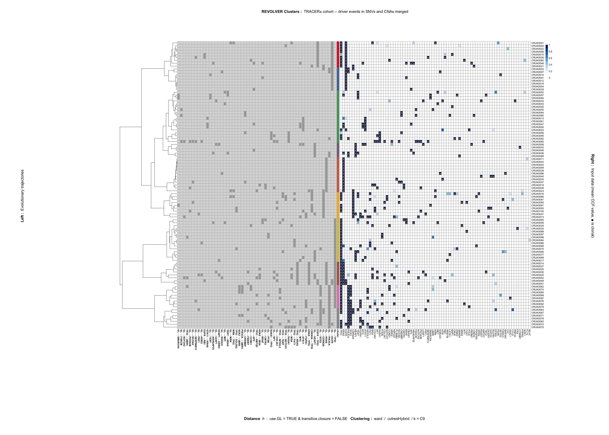

TRACERx analysis with REVOLVER
================
Giulio Caravagna
June 10, 2018

We present the analysis of the [TRACERx](http://tracerx.co.uk/) lung
cancer cohort discussed in the REVOLVER paper. For information about
this notebook, write to

  - Giulio Caravagna, Institute for Cancer Research, London. Email:
    <giulio.caravagna@ed.ac.uk>.

REVOLVER is available as an R package at
[Github](https://github.com/caravagn/revolver).

``` r
devtools::install_github("caravagn/revolver")
```

## Preliminaries: data preparation, adding Copy Number to SNVs

We first prepared an RData copy of Appendix 2 releases in [Jamal-Hanjani
et al; NEJM 2017](http://www.nejm.org/doi/full/10.1056/NEJMoa1616288)

``` r
load('[Data] TRACERx.appendix2.Rdata')
tibble::as.tibble(data)
```

    ## # A tibble: 76,831 x 26
    ##    MutationID   SampleID   chr  start   stop ref   var   Hugo_Symbol func 
    ##    <chr>        <chr>    <int>  <int>  <int> <chr> <chr> <chr>       <chr>
    ##  1 CRUK0062:23… CRUK0062    23 7.93e7 7.93e7 C     A     TBX22       intr…
    ##  2 CRUK0062:23… CRUK0062    23 1.82e7 1.82e7 T     C     BEND2       intr…
    ##  3 CRUK0062:3:… CRUK0062     3 4.93e6 4.93e6 A     G     ITPR1       inte…
    ##  4 CRUK0062:23… CRUK0062    23 1.24e8 1.24e8 C     T     TENM1       exon…
    ##  5 CRUK0062:16… CRUK0062    16 7.18e7 7.18e7 G     A     PHLPP2      intr…
    ##  6 CRUK0062:2:… CRUK0062     2 2.88e7 2.88e7 T     C     PLB1        intr…
    ##  7 CRUK0062:3:… CRUK0062     3 8.82e6 8.82e6 G     T     OXTR        inte…
    ##  8 CRUK0062:2:… CRUK0062     2 2.79e7 2.79e7 C     A     GPN1        intr…
    ##  9 CRUK0062:5:… CRUK0062     5 1.78e8 1.78e8 C     A     CLK4        intr…
    ## 10 CRUK0062:23… CRUK0062    23 8.61e7 8.61e7 G     A     DACH2       intr…
    ## # ... with 76,821 more rows, and 17 more variables: exonic.func <chr>,
    ## #   GL_VAF <dbl>, GL_nAlt <int>, GL_depth <int>, ITHState <int>,
    ## #   RegionSum <chr>, PyClonePhyloCluster <int>, PyClonePhyloCCF <chr>,
    ## #   PhyloCCF <chr>, MutCPN <chr>, MinorCPN <chr>, MajorCPN <chr>,
    ## #   PyClonePhyloClonal <chr>, ObsPyCloneCCF <chr>,
    ## #   ObsPyCloneCluster <int>, ObsPyCloneClonality <chr>, DriverMut <lgl>

We perform some basic data filtering. Because we will need clone
deconvolution (carried out through pyClone in the original paper), we
remove entries for which NA were produced during that analysis. Then, we
subset the data to the entries that are relevant to our analysis. For
every SNV, we will use as `variantID` the gene `Hugo_Symbol`; see
[REVOLVER Input
format](https://github.com/caravagn/revolver/wiki/2.-Input-Format).

``` r
data = data[!is.na(data$PyClonePhyloCluster), ]
data = data[c(
  'MutationID',
  'SampleID',
  'Hugo_Symbol',
  'PyClonePhyloCluster',
  'DriverMut',
  'PyClonePhyloClonal',
  'PyClonePhyloCCF'
)]
str(data)
```

    ## 'data.frame':    67677 obs. of  7 variables:
    ##  $ MutationID         : chr  "CRUK0062:3:4927416:A" "CRUK0062:16:71757811:G" "CRUK0062:2:28828826:T" "CRUK0062:3:8817359:G" ...
    ##  $ SampleID           : chr  "CRUK0062" "CRUK0062" "CRUK0062" "CRUK0062" ...
    ##  $ Hugo_Symbol        : chr  "ITPR1" "PHLPP2" "PLB1" "OXTR" ...
    ##  $ PyClonePhyloCluster: int  4 4 4 4 4 25 4 3 11 4 ...
    ##  $ DriverMut          : logi  FALSE FALSE FALSE FALSE FALSE FALSE ...
    ##  $ PyClonePhyloClonal : chr  "C" "C" "C" "C" ...
    ##  $ PyClonePhyloCCF    : chr  "R1:0.99;R2:0.99;R3:0.98;R4:0.97;R5:0.99;R6:0.99;R7:0.99" "R1:0.99;R2:0.99;R3:0.98;R4:0.97;R5:0.99;R6:0.99;R7:0.99" "R1:0.99;R2:0.99;R3:0.98;R4:0.97;R5:0.99;R6:0.99;R7:0.99" "R1:0.99;R2:0.99;R3:0.98;R4:0.97;R5:0.99;R6:0.99;R7:0.99" ...

Then, we extracted from the phylogenetic trees annotated in the
Supplementary Appendix of the paper all the subclonal Copy Number
Alterations (CNA) that have been mapped to pyClone subclones. We
selected all CNA at gene-level a resolution that allows us to perform
our analysis. The format with which we encoded these events (in this
preliminary data-preparation) is simply: `X:G` to denote the presence of
an amplification in gene `G` mapped to clone with ID `X`. Criteria for
calling CNA are described in the main paper.

``` r
amp = NULL
amp[['CRUK0001']] = c('2:CDK4', '2:LRIG3', '3:CARD11', '3:RAC1', '3:ETV1', '3:HNRNPA2B1', '3:HOXA9', '3:HOXA11', '3:HOXA13', '3:JAZF1', '3:EGFR', '3:CD79A',  '3:ZNF180',  '3:BCL3','4:CDK4','6:WIF1','6:HMGA2' )
amp[['CRUK0002']] = c('1:ETNK1', '1:KRAS','1:PPFIBP1',  '2:TERT', '2:DDIT3', '2:CDK4', '2:LRIG3','2:WIF1','2:MDM2','6:HMGA2')
amp[['CRUK0004']] = c('2:EGFR', '2:FUS', '2:TFEB', '3:CCND3', '3:HSP90AB1', '3:MLLT6', '3:LASP1', '3:ERBB2', '8:AKAP9', '8:CDK6')
amp[['CRUK0005']] = c('2:BRE', '2:TERT', '2:IL7R', '2:LIFR','2:CDK4', '4:LSM14A')
amp[['CRUK0006']] = c('1:TERT')
amp[['CRUK0007']] = c('1:SGK223')
amp[['CRUK0008']] = c('2:TCEA1', '2:PLAG1', '2:CHCHD7', '2:NCOA2', '2:HEY1', '2:CNBD1', '2:RUNX1T1', '2:COX6C', '2:RSPO2','2:EIF3E', '2:MYC', '2:NDRG1')
amp[['CRUK0009']] = c('1:NFE2L2', '1:ELN', '1:HIP1', '1:AKAP9', '1:CDK6', '1:TRRAP', '1:MET', '1:SND1','1:SMO','1:CREB3L2','1:TRIM24','1:KIAA1549','1:BRAF', '2:RHOH',  '2:TERT')
amp[['CRUK0010']] = c('1:TERT')
amp[['CRUK0012']] = c('1:ARNT', '1:SETDB1','1:TPM3','1:AURKA','1:GNAS','1:SS18L1','3:MUC1')
amp[['CRUK0013']] = c('3:KRAS', '3:PPFIBP1', '4:CARD11', '4:RAC1', '4:HNRNPA2B1','4:HOXA9','4:HOXA11','4:HOXA13','4:JAZF1','4:EGFR', '6:ETV1')
amp[['CRUK0016']] = c('1:TERT', '1:IL7R', '1:LIFR', '1:CCDC6','1:KDM5A','1:ERC1','1:CIITA','1:RMI2','1:TNFRSF17')
amp[['CRUK0017']] = c('1:MYC', '1:NDRG1', '1:DDIT3', '1:CDK4', '1:TPM4', '1:CCNE1', '1:CEP89', '1:CEBPA', '1:LSM14A', '2:TCEA1', '2:PLAG1', '2:CHCHD7', '2:NCOA2', '2:HEY1', '2:CNBD1', '2:RUNX1T1', '2:COX6C', '2:RSPO2', '2:EIF3E', '2:SS18L1', '3:CLTCL1', '3:SEPT5', '3:EWSR1','3:PDGFB' )
amp[['CRUK0018']] = c('8:CARD11','8:RAC1') 
amp[['CRUK0020']] = c('1:TFEB', '1:CCND3', '1:ETNK1', '1:KRAS','1:TAF15','4:JAK2','4:CD274', '4:PDCD1LG2') 
amp[['CRUK0021']] = c('1:EBF1', '1:PWWP2A', '1:RANBP17','1:TLX3','1:NPM1','1:EGFR' ) 
amp[['CRUK0022']] = c('1:ETV1', '1:HNRNPA2B1', '1:HOXA9', '1:HOXA11', '1:HOXA13', '1:JAZF1', '1:AKAP9', '1:CDK6', '1:TRRAP','1:EZH2','1:MNX1','1:RUNX1T1', '1:COX6C', '1:RSPO2', '1:EIF3E','1:NKX2−1','1:FOXA1','1:CCNE1','1:AKT2')
amp[['CRUK0024']] = c('1:MECOM', '1:EGFR', '1:TCEA1', '1:PLAG1', '1:CHCHD7', '1:NCOA2', '1:HEY1','1:CNBD1','1:RUNX1T1','1:COX6C')
amp[['CRUK0028']] = c('1:RAC1', '1:EGFR', '3:FOXL2')
amp[['CRUK0029']] = c('1:MALAT1', '1:CCND1', '1:NUMA1', '1:NKX2−1', '1:FOXA1','6:AKAP9')
amp[['CRUK0030']] = c('1:KRAS')
amp[['CRUK0031']] = c('1:WHSC1L1', '1:FGFR1', '1:NCOA2', '1:HEY1', '1:ETNK1', '1:PPFIBP1', '1:LCP1','1:BCR')
amp[['CRUK0032']] = c('1:NKX2−1', '1:FOXA1', '1:COL1A1', '1:HLF', '1:MSI2', '1:CLTC','1:CD79B','1:RNF213','4:CCND1','7:DDX5')
amp[['CRUK0034']] = c('1:FOXA1')
amp[['CRUK0035']] = c('1:ETV1', '1:HNRNPA2B1', '1:HOXA9', '1:HOXA11','1:HOXA13','1:JAZF1','1:ZNF180','1:BCL3','1:SS18L1')
amp[['CRUK0036']] = c('1:BCL9', '1:ARNT', '1:SETDB1', '1:MLLT11', '1:TPM3', '1:MUC1', '1:RIT1', '1:LMNA','1:PRCC','1:NTRK1','1:FCRL4','1:FCGR2B','1:PBX1', '1:TERT','1:IL7R','1:LIFR','1:VTI1A','1:TCF7L2','1:ETNK1','1:KRAS','1:PPFIBP1','2:COX6C')
amp[['CRUK0037']] = c('1:GNAS', '10:HOOK3')
amp[['CRUK0039']] = c('1:KDM5A', '1:ERC1', '1:CCND2','1:ZNF384','1:ETV6','1:ATF7IP','1:ETNK1','1:KRAS','1:PPFIBP1')
amp[['CRUK0041']] = c('1:TERT', '1:EGFR', '1:AKAP9', '1:HEY1', '1:RUNX1T1', '1:COX6C', '1:RSPO2','1:KDM5A','1:CCNE1')
amp[['CRUK0043']] = c('1:NKX2−1', '1:FOXA1')
amp[['CRUK0045']] = c('3:EML4')
amp[['CRUK0046']] = c('1:RHOH')
amp[['CRUK0047']] = c('1:TCEA1', '1:PLAG1', '1:CHCHD7', '1:HEY1', '1:COX6C', '1:RSPO2','1:EIF3E','1:MYC','1:NDRG1')
amp[['CRUK0048']] = c('1:BCL9', '1:TPM3', '1:EML4', '1:EGFR', '1:MYC','1:NDRG1','1:KIF5B', '1:FGFR2')
amp[['CRUK0049']] = c('1:EGFR', '1:KRAS', '1:PPFIBP1')
amp[['CRUK0050']] = c('1:NCOA2', '1:HEY1', '1:MYC', '3:CCND1')
amp[['CRUK0051']] = c('1:CARD11', '1:RAC1', '1:ETV1', '1:HNRNPA2B1','1:HOXA9','1:HOXA11','1:HOXA13','1:JAZF1', '1:EGFR')
amp[['CRUK0054']] = c('1:ARNT', '1:SETDB1', '1:MLLT11', '1:TPR','1:MDM4','1:SLC45A3','1:IRF6')
amp[['CRUK0057']] = c('1:BCL9', '1:ARNT', '1:SETDB1', '1:MLLT11','1:TERT','1:IL7R','1:LIFR','1:MYH11')
amp[['CRUK0061']] = c('1:CBFA2T3')
amp[['CRUK0062']] = c('2:RNF217−AS1', '2:IL21R', '3:KAT6A', '3:IKBKB', '3:HOOK3', '4:FOXL2', '4:WWTR1',  '4:GMPS',  '4:MLF1',  '4:MECOM',  '4:PIK3CA',  '4:SOX2', '4:ETV5',  '4:EIF4A2',  '4:BCL6',  '4:LPP', '4:TFRC', '4:CCND1', '8:BCR', '11:PAX5')
amp[['CRUK0063']] = c('1:RET', '2:WWTR1', '2:GMPS', '2:MLF1', '2:MECOM', '2:PIK3CA', '2:SOX2', '2:ETV5','2:EIF4A2','2:BCL6','2:LPP','2:TFRC', '2:TERT','3:IL7R', '3:LMO2')
amp[['CRUK0065']] = c('1:MECOM', '1:PIK3CA', '1:SOX2','1:ETV5','1:EIF4A2','1:BCL6','1:LPP','1:TFRC')
amp[['CRUK0066']] = c('1:FIP1L1', '1:CHIC2', '1:PDGFRA', '1:KIT', '1:KDR', '1:TERT', '1:IL7R', '1:LIFR','1:MDM2','1:AKT2','1:NCOA6','1:DSN1','1:MAFB','1:TOP1','1:PLCG1', '1:SDC4', '1:NFATC2', '1:AURKA', '1:GNAS')
amp[['CRUK0067']] = c('1:WWTR1', '1:GMPS', '1:MLF1', '1:MECOM', '1:PIK3CA','1:SOX2','1:ETV5','1:EIF4A2','1:BCL6','1:LPP','1:TFRC','1:TFEB','1:CCND3','1:HSP90AB1')
amp[['CRUK0068']] = c('1:MECOM', '1:PIK3CA', '1:SOX2', '1:ETV5','1:EIF4A2','1:BCL6','1:LPP','1:TFRC','9:TERT')
amp[['CRUK0069']] = c('1:CHIC2', '1:PDGFRA', '1:KIT', '1:KDR', '1:WHSC1L1', '1:FGFR1', '1:ERBB3', '1:NACA','1:NAB2','1:STAT6', '1:DDIT3','1:CDK4','1:CEP89','1:CEBPA','1:LSM14A','1:AKT2','2:IL7R','2:JAK3','3:ATP5B','4:FIP1L1', '4:NFATC2','4:AURKA','4:GNAS','4:SS18L1','11:LIFR')
amp[['CRUK0070']] = c('1:COL5A2', '1:SF3B1', '1:SOX2', '1:ETV5','1:EIF4A2','1:BCL6','1:LPP', '2:AKT2', '3:NFE2L2')
amp[['CRUK0071']] = c('1:OMA1', '1:JUN', '1:JAK1', '1:FOXL2', '1:WWTR1', '1:GMPS', '1:MLF1','1:MECOM','1:PIK3CA','1:SOX2','1:ETV5','1:EIF4A2','1:BCL6','1:LPP','1:TFRC')
amp[['CRUK0072']] = c('1:MECOM', '1:PIK3CA', '1:SOX2', '1:EGFR','1:MYC','1:NDRG1','2:FCGR2B','2:C2orf44','2:NCOA1','2:BCL11A','2:REL','2:XPO1')
amp[['CRUK0073']] = c('1:WHSC1L1', '1:FGFR1', '1:KAT6A', '1:IKBKB', '1:HOOK3', '1:TCEA1', '1:PLAG1', '1:CHCHD7','1:NCOA2','1:HEY1','1:CNBD1', '1:RUNX1T1','1:COX6C','1:RSPO2','1:EIF3E','1:MYC','1:NDRG1','1:KDM5A','1:ERC1')
amp[['CRUK0074']] = c('1:MLF1', '1:MECOM', '1:PIK3CA', '1:SOX2', '1:ETV5', '1:EIF4A2', '1:BCL6', '1:LPP','1:TFRC','1:CCND1','1:NKX2−1','1:FOXA1','1:AKT2','1:CD79A','3:LSM14A')
amp[['CRUK0075']] = c('1:WHSC1L1', '1:FGFR1', '1:CCNE1','1:CEP89','1:CEBPA','1:LSM14A','1:AKT2','1:CD79A','1:ZNF180','1:BCL3')
amp[['CRUK0076']] = c('1:REL', '1:XPO1', '1:PIK3CA', '1:SOX2', '1:ETV5', '1:EIF4A2', '1:BCL6','1:LPP','1:TFRC','1:IL7R','1:LIFR','1:WHSC1L1','1:FGFR1')
amp[['CRUK0077']] = c('1:TFEB','1:CCND3','1:HSP90AB1')
amp[['CRUK0078']] = c('1:PIK3CA', '1:SOX2', '1:ETV5', '1:EIF4A2', '1:BCL6', '1:LPP','1:TFRC','1:WHSC1L1','1:FGFR1','1:KAT6A','1:KDM5A','1:ERC1','1:SS18L1')
amp[['CRUK0079']] = c('1:WWTR1', '1:GMPS', '1:MLF1', '1:PIK3CA', '1:SOX2', '1:WHSC1L1','1:FGFR1','1:KAT6A','1:IKBKB','1:HOOK3', '1:CCNE1','1:CEP89','1:CEBPA','1:LSM14A','1:AKT2','1:CD79A','1:ZNF180','1:BCL3')
amp[['CRUK0080']] = c('1:SRSF3', '1:EGFR', '1:CCND1', '1:NUMA1', '1:BIRC3', '3:CALR','3:LYL1')
amp[['CRUK0082']] = c('1:TFG', '1:GATA2', '1:RPN1', '1:CNBP', '1:FOXL2', '1:WWTR1', '1:GMPS', '1:MLF1', '1:MECOM','1:PIK3CA', '1:SOX2','1:ETV5','1:EIF4A2','1:BCL6','1:LPP','1:TFRC','1:WHSC1L1','1:FGFR1','1:FSTL3')
amp[['CRUK0083']] = c('1:WWTR1', '1:GMPS', '1:MLF1', '1:MECOM', '1:PIK3CA', '1:SOX2','1:ETV5','1:EIF4A2','1:BCL6','1:LPP', '1:TFRC','1:WHSC1L1','1:FGFR1','1:KAT6A','1:IKBKB','1:HOOK3','1:MYC','1:NDRG1','2:CCNB1IP1','2:NKX2−1', '2:FOXA1')
amp[['CRUK0085']] = c('2:ARNT', '2:SETDB1', '2:MLLT11', '5:PLAG1', '5:CHCHD7')
amp[['CRUK0086']] = c('1:CARD11', '1:RAC1')
amp[['CRUK0088']] = c('1:ZNF521', '1:SS18', '1:SETBP1', '1:MALT1','1:BCL2','1:KDSR','2:CD79B', '2:CEBPA', '2:LSM14A')
amp[['CRUK0094']] = c('1:TERT')
amp[['CRUK0100']] = c('6:GOLGA5', '6:ZNF521', '6:SS18')
```

Similarly, we collected deletions annotated in the same figures.

``` r
del = NULL

del[['CRUK0016']] = c('1:CDKN2A', '1:ZMYM2')
del[['CRUK0003']] = c('1:CDKN2A')
del[['CRUK0021']] = c('1:CDKN2A')
del[['CRUK0023']] = c('1:CDKN2A')
del[['CRUK0063']] = c('2:PRF1')
del[['CRUK0067']] = c('1:CDKN2A')
del[['CRUK0085']] = c('7:CDKN2A', '8:SDHB')
del[['CRUK0086']] = c('1:FAT1')
del[['CRUK0098']] = c('1:PTEN')
del[['CRUK0100']] = c('1:CDKN2A')
```

Then, we define some functions that will help us packing SNVs and CNA
alltogether. A first function detects which CNAs are recurrent in the
cohort

``` r
recurrent.CNA = function(w) {
  w = unlist(w)
  w = sapply(w, strsplit, split =':')
  w = lapply(w, function(q)q[2])
  w = table(unlist(w))
  return(w)
}

recurrent.amp = recurrent.CNA(amp)
recurrent.del = recurrent.CNA(del)
```

And a second function transforms the above annotation in entries that
have the same format of the `data` dataframe

``` r
cn.To.Data = function(x, type)
{
  df = NULL

  for(a in 1:length(x))
  {
    patient = names(x)[a]
    entries = x[[a]]

    tk = sapply(entries, strsplit, split =':')
    groups = lapply(tk, function(q)q[1])
    cn = lapply(tk, function(q)q[2])

    for(e in 1:length(cn))
    {
      template = data[data$SampleID == patient & data$PyClonePhyloCluster == groups[[e]], , drop = FALSE]
      template = template[1, , drop = FALSE]

      new.entry = c(
        MutationID = paste('Annotated CN:', paste(type, '(', cn[[e]], ')', sep = '')),
        SampleID = patient,
        Hugo_Symbol = cn[[e]],
        PyClonePhyloCluster = groups[[e]],
        DriverMut = TRUE,
        PyClonePhyloClonal = template[1, 'PyClonePhyloClonal'],
        PyClonePhyloCCF = template[1, 'PyClonePhyloCCF'])
      names(new.entry) = colnames(data)

      df = rbind(df, new.entry)
    }
  }

  rownames(df) = NULL

  return(data.frame(df))
}
data = rbind(data, cn.To.Data(amp, 'amp'))
data = rbind(data, cn.To.Data(del, 'del'))
```

The overall data is now this (here we subset the new
    CNAs)

``` r
head(data[startsWith(data$MutationID, 'Annotated CN'), ])
```

    ##                        MutationID SampleID Hugo_Symbol PyClonePhyloCluster
    ## 1         Annotated CN: amp(CDK4) CRUK0001        CDK4                   2
    ## 2        Annotated CN: amp(LRIG3) CRUK0001       LRIG3                   2
    ## 3108    Annotated CN: amp(CARD11) CRUK0001      CARD11                   3
    ## 4         Annotated CN: amp(RAC1) CRUK0001        RAC1                   3
    ## 5112      Annotated CN: amp(ETV1) CRUK0001        ETV1                   3
    ## 625  Annotated CN: amp(HNRNPA2B1) CRUK0001   HNRNPA2B1                   3
    ##      DriverMut PyClonePhyloClonal      PyClonePhyloCCF
    ## 1         TRUE                  S R1:0.37;R2:0;R3:0.96
    ## 2         TRUE                  S R1:0.37;R2:0;R3:0.96
    ## 3108      TRUE                  C R1:0.99;R2:0.99;R3:1
    ## 4         TRUE                  C R1:0.99;R2:0.99;R3:1
    ## 5112      TRUE                  C R1:0.99;R2:0.99;R3:1
    ## 625       TRUE                  C R1:0.99;R2:0.99;R3:1

We convert the fields in the dataframe to the required R types

``` r
data$DriverMut = as.logical(data$DriverMut)
data$PyClonePhyloCluster = as.integer(data$PyClonePhyloCluster)

str(data)
```

    ## 'data.frame':    68295 obs. of  7 variables:
    ##  $ MutationID         : chr  "CRUK0062:3:4927416:A" "CRUK0062:16:71757811:G" "CRUK0062:2:28828826:T" "CRUK0062:3:8817359:G" ...
    ##  $ SampleID           : chr  "CRUK0062" "CRUK0062" "CRUK0062" "CRUK0062" ...
    ##  $ Hugo_Symbol        : chr  "ITPR1" "PHLPP2" "PLB1" "OXTR" ...
    ##  $ PyClonePhyloCluster: int  4 4 4 4 4 25 4 3 11 4 ...
    ##  $ DriverMut          : logi  FALSE FALSE FALSE FALSE FALSE FALSE ...
    ##  $ PyClonePhyloClonal : chr  "C" "C" "C" "C" ...
    ##  $ PyClonePhyloCCF    : chr  "R1:0.99;R2:0.99;R3:0.98;R4:0.97;R5:0.99;R6:0.99;R7:0.99" "R1:0.99;R2:0.99;R3:0.98;R4:0.97;R5:0.99;R6:0.99;R7:0.99" "R1:0.99;R2:0.99;R3:0.98;R4:0.97;R5:0.99;R6:0.99;R7:0.99" "R1:0.99;R2:0.99;R3:0.98;R4:0.97;R5:0.99;R6:0.99;R7:0.99" ...

## Preliminaries: subsetting data

In REVOLVER we really correlate those drivers that appear in at least a
certain number of patients, here modeled through variable
`MIN.RECURRENCE`. We begin some simple filtering that we finalize in the
next steps

``` r
MIN.RECURRENCE = 2

# Split the data by gene ID
data.split = data[data$DriverMut, ]
data.split = split(data.split, f = data.split$Hugo_Symbol)
head(data.split)
```

    ## $AKAP9
    ##                     MutationID SampleID Hugo_Symbol PyClonePhyloCluster
    ## 3610  Annotated CN: amp(AKAP9) CRUK0004       AKAP9                   8
    ## 6131  Annotated CN: amp(AKAP9) CRUK0009       AKAP9                   1
    ## 14743 Annotated CN: amp(AKAP9) CRUK0022       AKAP9                   1
    ## 17831 Annotated CN: amp(AKAP9) CRUK0029       AKAP9                   6
    ## 2432  Annotated CN: amp(AKAP9) CRUK0041       AKAP9                   1
    ##       DriverMut PyClonePhyloClonal
    ## 3610       TRUE                  S
    ## 6131       TRUE                  C
    ## 14743      TRUE                  C
    ## 17831      TRUE                  S
    ## 2432       TRUE                  C
    ##                                 PyClonePhyloCCF
    ## 3610               R1:0.01;R2:0.94;R3:0.01;R4:0
    ## 6131            R1:0.99;R2:0.99;R3:0.97;R4:0.99
    ## 14743                           R1:0.99;R2:0.99
    ## 17831 R2:0;R4:0.92;R5:0.82;R6:0;R7:0.03;R8:0.68
    ## 2432            R1:0.98;R2:0.99;R3:0.99;R4:0.99
    ## 
    ## $AKT2
    ##                    MutationID SampleID Hugo_Symbol PyClonePhyloCluster
    ## 1595  Annotated CN: amp(AKT2) CRUK0022        AKT2                   1
    ## 3554  Annotated CN: amp(AKT2) CRUK0066        AKT2                   1
    ## 40321 Annotated CN: amp(AKT2) CRUK0069        AKT2                   1
    ## 42014 Annotated CN: amp(AKT2) CRUK0070        AKT2                   2
    ## 48010 Annotated CN: amp(AKT2) CRUK0074        AKT2                   1
    ## 4892  Annotated CN: amp(AKT2) CRUK0075        AKT2                   1
    ## 5369  Annotated CN: amp(AKT2) CRUK0079        AKT2                   1
    ##       DriverMut PyClonePhyloClonal                PyClonePhyloCCF
    ## 1595       TRUE                  C                R1:0.99;R2:0.99
    ## 3554       TRUE                  C         R1:1;R2:1;R3:1;R4:0.99
    ## 40321      TRUE                  C       R1:1;R2:1;R3:1;R4:1;R5:1
    ## 42014      TRUE                  S R1:0;R2:0;R4:0;R6:0.95;R7:0.98
    ## 48010      TRUE                  C                   R1:0.99;R2:1
    ## 4892       TRUE                  C                   R1:1;R2:0.99
    ## 5369       TRUE                  C         R1:1;R2:0.99;R3:1;R4:1
    ## 
    ## $APC
    ##                   MutationID SampleID Hugo_Symbol PyClonePhyloCluster
    ## 24641 CRUK0046:5:112164611:C CRUK0046         APC                   1
    ## 39919 CRUK0048:5:112173860:G CRUK0048         APC                   1
    ## 53319 CRUK0047:5:112178402:A CRUK0047         APC                   1
    ## 57857 CRUK0028:5:112175021:C CRUK0028         APC                   1
    ##       DriverMut PyClonePhyloClonal              PyClonePhyloCCF
    ## 24641      TRUE                  C R1:1;R2:0.98;R3:0.99;R4:0.96
    ## 39919      TRUE                  C               R1:1;R2:1;R3:1
    ## 53319      TRUE                  C                 R1:0.99;R2:1
    ## 57857      TRUE                  C              R1:0.98;R2:0.97
    ## 
    ## $ARHGAP35
    ##                   MutationID SampleID Hugo_Symbol PyClonePhyloCluster
    ## 15545 CRUK0036:19:47491255:C CRUK0036    ARHGAP35                   1
    ## 23988 CRUK0009:19:47424497:C CRUK0009    ARHGAP35                   1
    ## 34334 CRUK0001:19:47440656:G CRUK0001    ARHGAP35                   2
    ## 40133 CRUK0048:19:47424411:G CRUK0048    ARHGAP35                   1
    ##       DriverMut PyClonePhyloClonal                 PyClonePhyloCCF
    ## 15545      TRUE                  C    R1:0.99;R2:0.98;R3:0.97;R4:1
    ## 23988      TRUE                  C R1:0.99;R2:0.99;R3:0.98;R4:0.99
    ## 34334      TRUE                  S            R1:0.19;R2:0;R3:0.95
    ## 40133      TRUE                  C                  R1:1;R2:1;R3:1
    ## 
    ## $ARID1A
    ##                  MutationID SampleID Hugo_Symbol PyClonePhyloCluster
    ## 3071  CRUK0065:1:27106535:G CRUK0065      ARID1A                  21
    ## 25952 CRUK0052:1:27023307:C CRUK0052      ARID1A                   1
    ##       DriverMut PyClonePhyloClonal
    ## 3071       TRUE                  S
    ## 25952      TRUE                  C
    ##                                       PyClonePhyloCCF
    ## 3071  R1:0.01;R2:0.01;R3:0.53;R4:0.29;R5:0.63;R6:0.66
    ## 25952                                  R1:1;R3:1;R4:1
    ## 
    ## $ARID1B
    ##                   MutationID SampleID Hugo_Symbol PyClonePhyloCluster
    ## 18240 CRUK0076:6:157470004:C CRUK0076      ARID1B                   1
    ## 21058 CRUK0017:6:157522149:C CRUK0017      ARID1B                   1
    ## 59858 CRUK0016:6:157522016:G CRUK0016      ARID1B                  16
    ## 76508 CRUK0032:6:157522253:G CRUK0032      ARID1B                   6
    ##       DriverMut PyClonePhyloClonal       PyClonePhyloCCF
    ## 18240      TRUE                  C   R1:1;R2:1;R3:1;R4:1
    ## 21058      TRUE                  C   R1:1;R2:1;R3:1;R4:1
    ## 59858      TRUE                  S          R1:0.95;R2:0
    ## 76508      TRUE                  S R1:0;R2:0;R3:0;R4:0.3

``` r
# Compute frequencies
occurrencesCount = lapply(data.split, function(x) unique(x['SampleID']))
recurrentDrivers = occurrencesCount[unlist(lapply(occurrencesCount, function(x) nrow(x) >= MIN.RECURRENCE))]

variantIDs.recurrentDrivers = names(recurrentDrivers)
driversToSkip = setdiff(names(occurrencesCount), variantIDs.recurrentDrivers)

cat('Below recurrence threshold : ', MIN.RECURRENCE, ':', paste(driversToSkip, collapse = ', '))
```

    ## Below recurrence threshold :  2 : ATP5B, ATR, B2M, BCL11A, BCL2, BIRC3, BLM, BRE, BRIP1, C2orf44, CALR, CASP8, CBFA2T3, CCDC6, CCNB1IP1, CCND2, CD274, CDC73, CDH1, CDKN2C, CIITA, CLTC, CLTCL1, CNBP, CNOT3, COL1A1, CREB3L2, CUL3, DDX5, DNMT3A, EBF1, ELN, ERBB3, ERCC3, ETV6, EWSR1, EXT1, EXT2, EZH2, FANCD2, FCRL4, FGFR2, FH, FSTL3, FUBP1, FUS, GATA2, GFAP, GOLGA5, GRIN2A, HIP1, HLF, HNF1A, IL21R, IRF6, JAK1, JAK2, JAK3, JUN, KDSR, KIAA1549, KIF5B, KLF5, KLF6, LASP1, LCP1, LMNA, LMO2, LYL1, MAFB, MALAT1, MALT1, MAP3K13, MDM4, MLLT6, MNX1, MSH2, MSI2, MUTYH, MYH11, NAB2, NACA, NBN, NCOA1, NIN, NPM1, NSD1, NTRK1, OMA1, PAX5, PBRM1, PBX1, PDCD1LG2, PDGFB, PLCG1, PMS2, POT1, PRCC, PTCH1, PTPRB, PTPRU, PWWP2A, RANBP17, RET, RMI2, RNF213, RNF217−AS1, RPN1, SDC4, SEPT5, SETBP1, SF3B1, SLC45A3, SMO, SND1, SRSF3, STAT6, STX2, TAF15, TCF7L2, TET2, TFG, TLX3, TNFAIP3, TNFRSF17, TOP1, TPM4, TPR, TRIM24, TSHR, VTI1A, ZFP36L1, ZMYM2, ZNF384

``` r
cat('Above recurrence threshold : ', MIN.RECURRENCE, ':', paste(variantIDs.recurrentDrivers, collapse = ', '))
```

    ## Above recurrence threshold :  2 : AKAP9, AKT2, APC, ARHGAP35, ARID1A, ARID1B, ARID2, ARNT, ASXL1, ATF7IP, ATM, AURKA, BAP1, BCL3, BCL6, BCL9, BCR, BRAF, CARD11, CBLB, CCND1, CCND3, CCNE1, CD79A, CD79B, CDK4, CDK6, CDKN2A, CEBPA, CEP89, CHCHD7, CHEK2, CHIC2, CIC, CMTR2, CNBD1, COL2A1, COL5A2, COX6C, CREBBP, CTNNB1, CUX1, CYLD, DDIT3, DICER1, DNM2, DOT1L, DSN1, EGFR, EIF3E, EIF4A2, EML4, EP300, ERBB2, ERC1, ERCC5, ETNK1, ETV1, ETV5, FANCC, FANCM, FAS, FAT1, FBXW7, FCGR2B, FGFR1, FIP1L1, FLT4, FOXA1, FOXL2, GATA3, GMPS, GNAS, HEY1, HMGA2, HNRNPA2B1, HOOK3, HOXA11, HOXA13, HOXA9, HSP90AB1, IKBKB, IKZF1, IL7R, JAZF1, KAT6A, KDM5A, KDR, KEAP1, KIT, KMT2C, KMT2D, KRAS, LATS1, LIFR, LPP, LRIG3, LSM14A, MAP3K1, MDM2, MECOM, MET, MGA, MLF1, MLH1, MLLT11, MUC1, MYC, NCOA2, NCOA6, NCOR1, NDRG1, NF1, NFATC2, NFE2L2, NKX2−1, NOTCH1, NOTCH2, NRAS, NUMA1, PASK, PDGFRA, PHOX2B, PIK3CA, PLAG1, PLXNB2, POLE, PPFIBP1, PRDM1, PRF1, PTEN, PTPRC, RAC1, RAD21, RASA1, RB1, REL, RHOH, RIT1, RNF43, RSPO2, RUNX1T1, SDHB, SERPINB13, SETD2, SETDB1, SGK223, SMAD4, SMARCA4, SOX2, SPEN, SS18, SS18L1, STK11, TCEA1, TERT, TFEB, TFRC, TP53, TPM3, TRRAP, TSC2, U2AF1, UBR5, WHSC1L1, WIF1, WRN, WT1, WWTR1, XPO1, ZNF180, ZNF521

``` r
# We change the DRIVER annotation to FALSE for all entries in "driversToSkip"
data[data$Hugo_Symbol %in% driversToSkip, 'DriverMut'] = FALSE

# We refactor data to be compliant with the format supported by REVOLVER
colnames(data) = c('Misc', 'patientID', 'variantID', 'cluster', 'is.driver', 'is.clonal', 'CCF')
data$is.clonal = ifelse(data$is.clonal  == 'C', TRUE, FALSE)

head(data)
```

    ##                     Misc patientID variantID cluster is.driver is.clonal
    ## 3   CRUK0062:3:4927416:A  CRUK0062     ITPR1       4     FALSE      TRUE
    ## 5 CRUK0062:16:71757811:G  CRUK0062    PHLPP2       4     FALSE      TRUE
    ## 6  CRUK0062:2:28828826:T  CRUK0062      PLB1       4     FALSE      TRUE
    ## 7   CRUK0062:3:8817359:G  CRUK0062      OXTR       4     FALSE      TRUE
    ## 8  CRUK0062:2:27855380:C  CRUK0062      GPN1       4     FALSE      TRUE
    ## 9 CRUK0062:5:178035542:C  CRUK0062      CLK4      25     FALSE     FALSE
    ##                                                       CCF
    ## 3 R1:0.99;R2:0.99;R3:0.98;R4:0.97;R5:0.99;R6:0.99;R7:0.99
    ## 5 R1:0.99;R2:0.99;R3:0.98;R4:0.97;R5:0.99;R6:0.99;R7:0.99
    ## 6 R1:0.99;R2:0.99;R3:0.98;R4:0.97;R5:0.99;R6:0.99;R7:0.99
    ## 7 R1:0.99;R2:0.99;R3:0.98;R4:0.97;R5:0.99;R6:0.99;R7:0.99
    ## 8 R1:0.99;R2:0.99;R3:0.98;R4:0.97;R5:0.99;R6:0.99;R7:0.99
    ## 9 R1:0.94;R2:0.84;R3:0.96;R4:0.89;R5:0.91;R6:0.97;R7:0.02

## Preliminaries: checking the cohort

We can now build a REVOLVER cohort object. We can use function
`revolver:::CCF.parser` to parse CCF values. Here we set the minimum
size to consider a clone to be `10`; clones with less than 10 SNVs/CNAs
will be
dropped.

``` r
# Load REVOLVER and disable crayon's coloured output that renders badly in HTML,
# as well as REVOLVER's progress bars...
library(revolver)
options(crayon.enabled = FALSE)
options(revolver.progressBar = FALSE)

TRACERx.COHORT = revolver_cohort(
  dataset = data,
  CCF.parser = revolver:::CCF.parser,
  annotation = 'TRACERx cohort -- driver events in SNVs and CNAs merged',
  options = list(
    ONLY.DRIVER = FALSE,
    MIN.CLUSTER.SIZE = 10)
)
```

    ##  [ REVOLVER Cohort Constructor for version 1.0 ~ "Haggis and tatties" ] 
    ##   Use only alterations annotated as driver = 0  
    ##   Filter: minimum number of alterations in a group/ cluster = 10  
    ## 
    ## ----------
    ## Input data
    ## ----------
    ## # A tibble: 68,295 x 7
    ##    Misc      patientID variantID cluster is.driver is.clonal CCF          
    ##  * <chr>     <chr>     <chr>       <int> <lgl>     <lgl>     <chr>        
    ##  1 CRUK0062… CRUK0062  ITPR1           4 FALSE     TRUE      R1:0.99;R2:0…
    ##  2 CRUK0062… CRUK0062  PHLPP2          4 FALSE     TRUE      R1:0.99;R2:0…
    ##  3 CRUK0062… CRUK0062  PLB1            4 FALSE     TRUE      R1:0.99;R2:0…
    ##  4 CRUK0062… CRUK0062  OXTR            4 FALSE     TRUE      R1:0.99;R2:0…
    ##  5 CRUK0062… CRUK0062  GPN1            4 FALSE     TRUE      R1:0.99;R2:0…
    ##  6 CRUK0062… CRUK0062  CLK4           25 FALSE     FALSE     R1:0.94;R2:0…
    ##  7 CRUK0062… CRUK0062  ALLC            4 FALSE     TRUE      R1:0.99;R2:0…
    ##  8 CRUK0062… CRUK0062  WDFY3           3 FALSE     FALSE     R1:0;R2:0;R3…
    ##  9 CRUK0062… CRUK0062  APBB2          11 FALSE     FALSE     R1:0.08;R2:0…
    ## 10 CRUK0062… CRUK0062  DBP             4 FALSE     TRUE      R1:0.99;R2:0…
    ## # ... with 68,285 more rows
    ## 
    ## ---------------------------------
    ## Checking size of groups/ clusters
    ## ---------------------------------
    ## Rows before filtering: 68295 
    ## 
    ## # A tibble: 93 x 7
    ##    Misc        patientID variantID cluster is.driver is.clonal CCF        
    ##  * <chr>       <chr>     <chr>       <int> <lgl>     <lgl>     <chr>      
    ##  1 CRUK0001:2… CRUK0001  ARHGEF4        12 FALSE     FALSE     R1:0.9;R2:…
    ##  2 CRUK0001:2… CRUK0001  LPIN1          13 FALSE     FALSE     R1:0.9;R2:…
    ##  3 CRUK0001:1… CRUK0001  PTPRQ          14 FALSE     FALSE     R1:0.9;R2:…
    ##  4 CRUK0001:8… CRUK0001  EIF3E          15 FALSE     FALSE     R1:0.89;R2…
    ##  5 CRUK0001:8… CRUK0001  COL22A1        16 FALSE     FALSE     R1:0.9;R2:…
    ##  6 CRUK0001:2… CRUK0001  EML4           17 FALSE     FALSE     R1:0.9;R2:…
    ##  7 CRUK0001:2… CRUK0001  PPP4R1L        18 FALSE     FALSE     R1:0.91;R2…
    ##  8 CRUK0001:4… CRUK0001  NKX3-2         19 FALSE     FALSE     R1:0.91;R2…
    ##  9 CRUK0001:2… CRUK0001  ZFP64          20 FALSE     FALSE     R1:0.91;R2…
    ## 10 CRUK0001:1… CRUK0001  USP1           21 FALSE     FALSE     R1:0.83;R2…
    ## # ... with 83 more rows
    ## # A tibble: 24 x 7
    ##    Misc        patientID variantID cluster is.driver is.clonal CCF        
    ##  * <chr>       <chr>     <chr>       <int> <lgl>     <lgl>     <chr>      
    ##  1 CRUK0002:1… CRUK0002  WDFY4           8 FALSE     FALSE     R1:0.45;R2…
    ##  2 CRUK0002:3… CRUK0002  CMTM8           8 FALSE     FALSE     R1:0.46;R2…
    ##  3 CRUK0002:1… CRUK0002  C1R             8 FALSE     FALSE     R1:0.45;R2…
    ##  4 CRUK0002:1… CRUK0002  TEFM            8 FALSE     FALSE     R1:0.43;R2…
    ##  5 CRUK0002:2… CRUK0002  SLC5A4          8 FALSE     FALSE     R1:0.45;R2…
    ##  6 CRUK0002:1… CRUK0002  PEX10           8 FALSE     FALSE     R1:0.78;R2…
    ##  7 CRUK0002:5… CRUK0002  PAPD7           8 FALSE     FALSE     R1:0.54;R2…
    ##  8 CRUK0002:3… CRUK0002  TKT             8 FALSE     FALSE     R1:0.39;R2…
    ##  9 CRUK0002:7… CRUK0002  PCLO            9 FALSE     FALSE     R1:0.01;R2…
    ## 10 CRUK0002:1… CRUK0002  HIST3H2A        9 FALSE     FALSE     R1:0.06;R2…
    ## # ... with 14 more rows
    ## # A tibble: 21 x 7
    ##    Misc       patientID variantID cluster is.driver is.clonal CCF         
    ##  * <chr>      <chr>     <chr>       <int> <lgl>     <lgl>     <chr>       
    ##  1 CRUK0003:… CRUK0003  MIR4529         7 FALSE     FALSE     R1:0;R2:0;R…
    ##  2 CRUK0003:… CRUK0003  SMC3            7 FALSE     FALSE     R1:0;R2:0;R…
    ##  3 CRUK0003:… CRUK0003  RECK            9 FALSE     FALSE     R1:0;R2:0.0…
    ##  4 CRUK0003:… CRUK0003  PDE10A          9 FALSE     FALSE     R1:0;R2:0.0…
    ##  5 CRUK0003:… CRUK0003  TAAR2           9 FALSE     FALSE     R1:0;R2:0.0…
    ##  6 CRUK0003:… CRUK0003  EYA1            9 FALSE     FALSE     R1:0;R2:0.0…
    ##  7 CRUK0003:… CRUK0003  FBXL19          9 FALSE     FALSE     R1:0;R2:0.0…
    ##  8 CRUK0003:… CRUK0003  ARSA            9 FALSE     FALSE     R1:0;R2:0.0…
    ##  9 CRUK0003:… CRUK0003  ZP4             9 FALSE     FALSE     R1:0;R2:0.0…
    ## 10 CRUK0003:… CRUK0003  EBF3            9 FALSE     FALSE     R1:0;R2:0.0…
    ## # ... with 11 more rows
    ## # A tibble: 19 x 7
    ##    Misc       patientID variantID cluster is.driver is.clonal CCF         
    ##  * <chr>      <chr>     <chr>       <int> <lgl>     <lgl>     <chr>       
    ##  1 CRUK0004:… CRUK0004  H19             7 FALSE     FALSE     R1:0.04;R2:…
    ##  2 CRUK0004:… CRUK0004  NAA35           7 FALSE     FALSE     R1:0.04;R2:…
    ##  3 CRUK0004:… CRUK0004  CCDC147         7 FALSE     FALSE     R1:0.08;R2:…
    ##  4 CRUK0004:… CRUK0004  CAPN10          7 FALSE     FALSE     R1:0.04;R2:…
    ##  5 CRUK0004:… CRUK0004  DDX54           7 FALSE     FALSE     R1:0.04;R2:…
    ##  6 CRUK0004:… CRUK0004  EHMT1           7 FALSE     FALSE     R1:0.1;R2:0…
    ##  7 CRUK0004:… CRUK0004  NTRK2           7 FALSE     FALSE     R1:0.04;R2:…
    ##  8 CRUK0004:… CRUK0004  A2M             7 FALSE     FALSE     R1:0.04;R2:…
    ##  9 CRUK0004:… CRUK0004  SRP68           7 FALSE     FALSE     R1:0.04;R2:…
    ## 10 CRUK0004:… CRUK0004  GLYATL3         7 FALSE     FALSE     R1:0.02;R2:…
    ## 11 CRUK0004:… CRUK0004  NR5A2           9 FALSE     FALSE     R1:0.85;R2:…
    ## 12 CRUK0004:… CRUK0004  JAM2            9 FALSE     FALSE     R1:0.84;R2:…
    ## 13 CRUK0004:… CRUK0004  ABCC8           9 FALSE     FALSE     R1:0.85;R2:…
    ## 14 CRUK0004:… CRUK0004  EPC2            9 FALSE     FALSE     R1:0.85;R2:…
    ## 15 CRUK0004:… CRUK0004  UBA7           10 FALSE     FALSE     R1:0.19;R2:…
    ## 16 CRUK0004:… CRUK0004  PTK6           11 FALSE     FALSE     R1:0.29;R2:…
    ## 17 CRUK0004:… CRUK0004  ZNF599         12 FALSE     FALSE     R1:0.86;R2:…
    ## 18 CRUK0004:… CRUK0004  SMOC1          13 FALSE     FALSE     R1:0.96;R2:…
    ## 19 CRUK0004:… CRUK0004  UGT3A2         14 FALSE     FALSE     R1:0.23;R2:…
    ## # A tibble: 55 x 7
    ##    Misc       patientID variantID cluster is.driver is.clonal CCF         
    ##  * <chr>      <chr>     <chr>       <int> <lgl>     <lgl>     <chr>       
    ##  1 CRUK0005:… CRUK0005  CD247          10 FALSE     FALSE     R1:0.84;R2:…
    ##  2 CRUK0005:… CRUK0005  BPIFB3         10 FALSE     FALSE     R1:0.82;R2:…
    ##  3 CRUK0005:… CRUK0005  HEBP1          10 FALSE     FALSE     R1:0.84;R2:…
    ##  4 CRUK0005:… CRUK0005  H2AFZ          10 FALSE     FALSE     R1:0.85;R2:…
    ##  5 CRUK0005:… CRUK0005  CRB1           10 FALSE     FALSE     R1:0.82;R2:…
    ##  6 CRUK0005:… CRUK0005  AP5Z1          10 FALSE     FALSE     R1:0.85;R2:…
    ##  7 CRUK0005:… CRUK0005  PIK3CG         10 FALSE     FALSE     R1:0.85;R2:…
    ##  8 CRUK0005:… CRUK0005  COL15A1        11 FALSE     FALSE     R1:0;R2:0.6…
    ##  9 CRUK0005:… CRUK0005  STARD9         11 FALSE     FALSE     R1:0;R2:0.8…
    ## 10 CRUK0005:… CRUK0005  LCMT1          11 FALSE     FALSE     R1:0;R2:0.4…
    ## # ... with 45 more rows
    ## # A tibble: 16 x 7
    ##    Misc          patientID variantID cluster is.driver is.clonal CCF      
    ##  * <chr>         <chr>     <chr>       <int> <lgl>     <lgl>     <chr>    
    ##  1 CRUK0006:16:… CRUK0006  PTX4            8 FALSE     FALSE     R1:1;R2:…
    ##  2 CRUK0006:16:… CRUK0006  RBFOX1          8 FALSE     FALSE     R1:1;R2:…
    ##  3 CRUK0006:16:… CRUK0006  LMF1            8 FALSE     FALSE     R1:1;R2:…
    ##  4 CRUK0006:16:… CRUK0006  RAB40C          8 FALSE     FALSE     R1:1;R2:…
    ##  5 CRUK0006:16:… CRUK0006  ITFG3           8 FALSE     FALSE     R1:0.99;…
    ##  6 CRUK0006:12:… CRUK0006  LRP1            9 FALSE     FALSE     R1:0.43;…
    ##  7 CRUK0006:19:… CRUK0006  TNPO2          10 FALSE     FALSE     R1:0.4;R…
    ##  8 CRUK0006:11:… CRUK0006  ACRV1          11 FALSE     FALSE     R1:0.42;…
    ##  9 CRUK0006:5:3… CRUK0006  NIPBL          12 FALSE     FALSE     R1:0.37;…
    ## 10 CRUK0006:4:8… CRUK0006  FAM13A         13 FALSE     FALSE     R1:0.5;R…
    ## 11 CRUK0006:14:… CRUK0006  SYNE2          14 FALSE     FALSE     R1:0.99;…
    ## 12 CRUK0006:17:… CRUK0006  RAI1           15 FALSE     FALSE     R1:0.48;…
    ## 13 CRUK0006:5:1… CRUK0006  FBN2           16 FALSE     FALSE     R1:0.99;…
    ## 14 CRUK0006:14:… CRUK0006  DLGAP5         17 FALSE     FALSE     R1:0.99;…
    ## 15 CRUK0006:4:1… CRUK0006  SLC25A4        18 FALSE     FALSE     R1:0.99;…
    ## 16 CRUK0006:14:… CRUK0006  CHGA           19 FALSE     FALSE     R1:0.99;…
    ## # A tibble: 16 x 7
    ##    Misc          patientID variantID cluster is.driver is.clonal CCF      
    ##  * <chr>         <chr>     <chr>       <int> <lgl>     <lgl>     <chr>    
    ##  1 CRUK0008:4:1… CRUK0008  LEF1            5 FALSE     FALSE     R1:0.25;…
    ##  2 CRUK0008:8:5… CRUK0008  PXDNL           5 FALSE     FALSE     R1:0.38;…
    ##  3 CRUK0008:12:… CRUK0008  PLEKHG7         5 FALSE     FALSE     R1:0.25;…
    ##  4 CRUK0008:19:… CRUK0008  AKAP8           5 FALSE     FALSE     R1:0.25;…
    ##  5 CRUK0008:20:… CRUK0008  TAF4            5 FALSE     FALSE     R1:0.25;…
    ##  6 CRUK0008:5:1… CRUK0008  PCDHGA4         5 FALSE     FALSE     R1:0.25;…
    ##  7 CRUK0008:9:2… CRUK0008  VLDLR           5 FALSE     FALSE     R1:0.25;…
    ##  8 CRUK0008:13:… CRUK0008  POSTN           5 FALSE     FALSE     R1:0.25;…
    ##  9 CRUK0008:3:1… CRUK0008  CCDC80          5 FALSE     FALSE     R1:0.25;…
    ## 10 CRUK0008:19:… CRUK0008  MUC16           6 FALSE     FALSE     R1:0.05;…
    ## 11 CRUK0008:15:… CRUK0008  STARD9          6 FALSE     FALSE     R1:0.09;…
    ## 12 CRUK0008:1:8… CRUK0008  ZNHIT6          6 FALSE     FALSE     R1:0.05;…
    ## 13 CRUK0008:22:… CRUK0008  RNF185          6 FALSE     FALSE     R1:0.07;…
    ## 14 CRUK0008:17:… CRUK0008  TLK2            6 FALSE     FALSE     R1:0.09;…
    ## 15 CRUK0008:1:1… CRUK0008  GPSM2           6 FALSE     FALSE     R1:0.08;…
    ## 16 CRUK0008:20:… CRUK0008  ARFGEF2         6 FALSE     FALSE     R1:0.04;…
    ## # A tibble: 34 x 7
    ##    Misc        patientID variantID cluster is.driver is.clonal CCF        
    ##  * <chr>       <chr>     <chr>       <int> <lgl>     <lgl>     <chr>      
    ##  1 CRUK0009:1… CRUK0009  ZNF304         11 FALSE     FALSE     R1:0.94;R2…
    ##  2 CRUK0009:1… CRUK0009  DNAH17         11 FALSE     FALSE     R1:0.95;R2…
    ##  3 CRUK0009:2… CRUK0009  TM9SF4         11 FALSE     FALSE     R1:0.94;R2…
    ##  4 CRUK0009:9… CRUK0009  GCNT1          11 FALSE     FALSE     R1:0.94;R2…
    ##  5 CRUK0009:1… CRUK0009  SCUBE2         11 FALSE     FALSE     R1:0.94;R2…
    ##  6 CRUK0009:1… CRUK0009  HNRNPUL2       11 FALSE     FALSE     R1:0.94;R2…
    ##  7 CRUK0009:4… CRUK0009  NPFFR2         11 FALSE     FALSE     R1:0.95;R2…
    ##  8 CRUK0009:1… CRUK0009  PARD6G         11 FALSE     FALSE     R1:0.94;R2…
    ##  9 CRUK0009:7… CRUK0009  ADCK2          11 FALSE     FALSE     R1:0.94;R2…
    ## 10 CRUK0009:1… CRUK0009  EVI5L          12 FALSE     FALSE     R1:0.01;R2…
    ## # ... with 24 more rows
    ## # A tibble: 15 x 7
    ##    Misc         patientID variantID   cluster is.driver is.clonal CCF     
    ##  * <chr>        <chr>     <chr>         <int> <lgl>     <lgl>     <chr>   
    ##  1 CRUK0010:9:… CRUK0010  MSANTD3-TM…       4 FALSE     FALSE     R1:0.51…
    ##  2 CRUK0010:1:… CRUK0010  INADL             4 FALSE     FALSE     R1:0.43…
    ##  3 CRUK0010:15… CRUK0010  CYP1A2            4 FALSE     FALSE     R1:0.37…
    ##  4 CRUK0010:8:… CRUK0010  MROH5             4 FALSE     FALSE     R1:0.38…
    ##  5 CRUK0010:14… CRUK0010  ATG2B             4 FALSE     FALSE     R1:0.36…
    ##  6 CRUK0010:12… CRUK0010  TSPAN8            5 FALSE     FALSE     R1:0.01…
    ##  7 CRUK0010:18… CRUK0010  MAPK4             5 FALSE     FALSE     R1:0.01…
    ##  8 CRUK0010:12… CRUK0010  B4GALNT1          5 FALSE     FALSE     R1:0.01…
    ##  9 CRUK0010:2:… CRUK0010  TNS1              6 FALSE     FALSE     R1:0.93…
    ## 10 CRUK0010:2:… CRUK0010  RAMP1             6 FALSE     FALSE     R1:0.93…
    ## 11 CRUK0010:2:… CRUK0010  LRRTM4            6 FALSE     FALSE     R1:0.92…
    ## 12 CRUK0010:2:… CRUK0010  KANSL3            6 FALSE     FALSE     R1:0.92…
    ## 13 CRUK0010:2:… CRUK0010  MMADHC            6 FALSE     FALSE     R1:0.91…
    ## 14 CRUK0010:2:… CRUK0010  FBXO41            6 FALSE     FALSE     R1:0.92…
    ## 15 CRUK0010:12… CRUK0010  SLC2A3            7 FALSE     FALSE     R1:0.24…
    ## # A tibble: 30 x 7
    ##    Misc         patientID variantID cluster is.driver is.clonal CCF       
    ##  * <chr>        <chr>     <chr>       <int> <lgl>     <lgl>     <chr>     
    ##  1 CRUK0011:1:… CRUK0011  EPS8L3         10 FALSE     FALSE     R1:0.92;R…
    ##  2 CRUK0011:4:… CRUK0011  POLN           10 FALSE     FALSE     R1:0.92;R…
    ##  3 CRUK0011:9:… CRUK0011  GNA14          10 FALSE     FALSE     R1:0.92;R…
    ##  4 CRUK0011:6:… CRUK0011  UBE3D          10 FALSE     FALSE     R1:0.92;R…
    ##  5 CRUK0011:15… CRUK0011  CYFIP1         10 FALSE     FALSE     R1:0.92;R…
    ##  6 CRUK0011:16… CRUK0011  JPH3           10 FALSE     FALSE     R1:0.92;R…
    ##  7 CRUK0011:16… CRUK0011  BANP           10 FALSE     FALSE     R1:0.92;R…
    ##  8 CRUK0011:9:… CRUK0011  PTPRD          11 FALSE     FALSE     R1:0.93;R…
    ##  9 CRUK0011:6:… CRUK0011  GRIK2          11 FALSE     FALSE     R1:0.92;R…
    ## 10 CRUK0011:10… CRUK0011  DNAJC9-A…      11 FALSE     FALSE     R1:0.91;R…
    ## # ... with 20 more rows
    ## # A tibble: 7 x 7
    ##   Misc           patientID variantID cluster is.driver is.clonal CCF      
    ## * <chr>          <chr>     <chr>       <int> <lgl>     <lgl>     <chr>    
    ## 1 CRUK0012:16:1… CRUK0012  BAIAP3          6 FALSE     FALSE     R1:0.68;…
    ## 2 CRUK0012:11:1… CRUK0012  SAA2-SAA4       7 FALSE     FALSE     R1:0.67;…
    ## 3 CRUK0012:6:41… CRUK0012  FOXP4           8 FALSE     FALSE     R1:0.61;…
    ## 4 CRUK0012:11:6… CRUK0012  PGA5            9 FALSE     FALSE     R1:0.65;…
    ## 5 CRUK0012:16:6… CRUK0012  SLC12A4        10 FALSE     FALSE     R1:0.59;…
    ## 6 CRUK0012:6:84… CRUK0012  RIPPLY2        11 FALSE     FALSE     R1:0.58;…
    ## 7 CRUK0012:14:7… CRUK0012  SMOC1          12 FALSE     FALSE     R1:0.11;…
    ## # A tibble: 42 x 7
    ##    Misc      patientID variantID  cluster is.driver is.clonal CCF         
    ##  * <chr>     <chr>     <chr>        <int> <lgl>     <lgl>     <chr>       
    ##  1 CRUK0013… CRUK0013  DNAH17           5 FALSE     FALSE     LN1:0.91;LN…
    ##  2 CRUK0013… CRUK0013  PTPRD            5 FALSE     FALSE     LN1:0.91;LN…
    ##  3 CRUK0013… CRUK0013  FOLR4            5 FALSE     FALSE     LN1:0.91;LN…
    ##  4 CRUK0013… CRUK0013  MSR1             5 FALSE     FALSE     LN1:0.91;LN…
    ##  5 CRUK0013… CRUK0013  ITGAV            5 FALSE     FALSE     LN1:0.91;LN…
    ##  6 CRUK0013… CRUK0013  ANKRD53          5 FALSE     FALSE     LN1:0.91;LN…
    ##  7 CRUK0013… CRUK0013  DMGDH            5 FALSE     FALSE     LN1:0.91;LN…
    ##  8 CRUK0013… CRUK0013  LRRC9            5 FALSE     FALSE     LN1:0.91;LN…
    ##  9 CRUK0013… CRUK0013  TMX3             5 FALSE     FALSE     LN1:0.91;LN…
    ## 10 CRUK0013… CRUK0013  RP11-452N…       5 FALSE     FALSE     LN1:0.91;LN…
    ## # ... with 32 more rows
    ## # A tibble: 4 x 7
    ##   Misc           patientID variantID cluster is.driver is.clonal CCF      
    ## * <chr>          <chr>     <chr>       <int> <lgl>     <lgl>     <chr>    
    ## 1 CRUK0014:14:7… CRUK0014  SMOC1           4 FALSE     FALSE     R1:0.16;…
    ## 2 CRUK0014:3:14… CRUK0014  ZIC4            4 FALSE     FALSE     R1:0.21;…
    ## 3 CRUK0014:13:4… CRUK0014  DGKH            4 FALSE     FALSE     R1:0.17;…
    ## 4 CRUK0014:4:20… CRUK0014  SLIT2           5 FALSE     FALSE     R1:0.95;…
    ## # A tibble: 21 x 7
    ##    Misc          patientID variantID cluster is.driver is.clonal CCF      
    ##  * <chr>         <chr>     <chr>       <int> <lgl>     <lgl>     <chr>    
    ##  1 CRUK0015:15:… CRUK0015  SIN3A           4 FALSE     FALSE     R1:0.56;…
    ##  2 CRUK0015:3:1… CRUK0015  PTPLB           4 FALSE     FALSE     R1:0.47;…
    ##  3 CRUK0015:11:… CRUK0015  B4GALNT4        4 FALSE     FALSE     R1:0.62;…
    ##  4 CRUK0015:20:… CRUK0015  PDYN            4 FALSE     FALSE     R1:0.43;…
    ##  5 CRUK0015:21:… CRUK0015  DOPEY2          4 FALSE     FALSE     R1:0.45;…
    ##  6 CRUK0015:18:… CRUK0015  EPG5            4 FALSE     FALSE     R1:0.46;…
    ##  7 CRUK0015:21:… CRUK0015  BRWD1           4 FALSE     FALSE     R1:0.44;…
    ##  8 CRUK0015:2:2… CRUK0015  C2orf57         4 FALSE     FALSE     R1:0.46;…
    ##  9 CRUK0015:19:… CRUK0015  ZNF677          4 FALSE     FALSE     R1:0.42;…
    ## 10 CRUK0015:3:1… CRUK0015  ARL14           5 FALSE     FALSE     R1:0.39;…
    ## # ... with 11 more rows
    ## # A tibble: 301 x 7
    ##    Misc          patientID variantID cluster is.driver is.clonal CCF      
    ##  * <chr>         <chr>     <chr>       <int> <lgl>     <lgl>     <chr>    
    ##  1 CRUK0016:9:8… CRUK0016  RASEF          13 FALSE     FALSE     R1:0.32;…
    ##  2 CRUK0016:8:8… CRUK0016  DCAF4L2        13 FALSE     FALSE     R1:0.33;…
    ##  3 CRUK0016:12:… CRUK0016  KDM5A          13 FALSE     FALSE     R1:0.32;…
    ##  4 CRUK0016:8:1… CRUK0016  TRPS1          13 FALSE     FALSE     R1:0.33;…
    ##  5 CRUK0016:8:1… CRUK0016  EPPK1          13 FALSE     FALSE     R1:0.31;…
    ##  6 CRUK0016:1:5… CRUK0016  OSBPL9         14 FALSE     FALSE     R1:0.23;…
    ##  7 CRUK0016:2:1… CRUK0016  CNTNAP5        15 FALSE     FALSE     R1:0.43;…
    ##  8 CRUK0016:9:1… CRUK0016  WDR34          17 FALSE     FALSE     R1:0.45;…
    ##  9 CRUK0016:20:… CRUK0016  TMC2           17 FALSE     FALSE     R1:0.45;…
    ## 10 CRUK0016:17:… CRUK0016  SMYD4          17 FALSE     FALSE     R1:0.45;…
    ## # ... with 291 more rows
    ## # A tibble: 49 x 7
    ##    Misc       patientID variantID cluster is.driver is.clonal CCF         
    ##  * <chr>      <chr>     <chr>       <int> <lgl>     <lgl>     <chr>       
    ##  1 CRUK0017:… CRUK0017  IL17REL        11 FALSE     FALSE     R1:0.01;R2:…
    ##  2 CRUK0017:… CRUK0017  TMPRSS11A      11 FALSE     FALSE     R1:0.01;R2:…
    ##  3 CRUK0017:… CRUK0017  WDR11          11 FALSE     FALSE     R1:0.01;R2:…
    ##  4 CRUK0017:… CRUK0017  TCN1           11 FALSE     FALSE     R1:0.09;R2:…
    ##  5 CRUK0017:… CRUK0017  MAP3K9         11 FALSE     FALSE     R1:0.01;R2:…
    ##  6 CRUK0017:… CRUK0017  NKD1           11 FALSE     FALSE     R1:0.15;R2:…
    ##  7 CRUK0017:… CRUK0017  GGTLC2         11 FALSE     FALSE     R1:0;R2:0.4…
    ##  8 CRUK0017:… CRUK0017  F5             11 FALSE     FALSE     R1:0.01;R2:…
    ##  9 CRUK0017:… CRUK0017  HTR6           12 FALSE     FALSE     R1:0;R2:0;R…
    ## 10 CRUK0017:… CRUK0017  C10orf55       12 FALSE     FALSE     R1:0;R2:0;R…
    ## # ... with 39 more rows
    ## # A tibble: 19 x 7
    ##    Misc       patientID variantID cluster is.driver is.clonal CCF         
    ##  * <chr>      <chr>     <chr>       <int> <lgl>     <lgl>     <chr>       
    ##  1 CRUK0018:… CRUK0018  MVK            10 FALSE     FALSE     R1:0.96;R2:…
    ##  2 CRUK0018:… CRUK0018  TMEM119        10 FALSE     FALSE     R1:0.96;R2:…
    ##  3 CRUK0018:… CRUK0018  C12orf40       10 FALSE     FALSE     R1:0.96;R2:…
    ##  4 CRUK0018:… CRUK0018  MUC19          10 FALSE     FALSE     R1:0.96;R2:…
    ##  5 CRUK0018:… CRUK0018  EP400          10 FALSE     FALSE     R1:0.96;R2:…
    ##  6 CRUK0018:… CRUK0018  WSCD2          10 FALSE     FALSE     R1:0.96;R2:…
    ##  7 CRUK0018:… CRUK0018  ADAMTS20       10 FALSE     FALSE     R1:0.96;R2:…
    ##  8 CRUK0018:… CRUK0018  SLC12A1        11 FALSE     FALSE     R1:0.01;R2:…
    ##  9 CRUK0018:… CRUK0018  SMNDC1         11 FALSE     FALSE     R1:0.01;R2:…
    ## 10 CRUK0018:… CRUK0018  ARID3C         11 FALSE     FALSE     R1:0.01;R2:…
    ## 11 CRUK0018:… CRUK0018  CACNA2D4       11 FALSE     FALSE     R1:0.01;R2:…
    ## 12 CRUK0018:… CRUK0018  KRTAP2-3       12 FALSE     FALSE     R1:0.9;R2:0…
    ## 13 CRUK0018:… CRUK0018  DNAAF3         12 FALSE     FALSE     R1:0.77;R2:…
    ## 14 CRUK0018:… CRUK0018  KIF18B         12 FALSE     FALSE     R1:0.9;R2:0…
    ## 15 CRUK0018:… CRUK0018  KRT15          12 FALSE     FALSE     R1:0.9;R2:0…
    ## 16 CRUK0018:… CRUK0018  KLRD1          13 FALSE     FALSE     R1:0;R2:0.9…
    ## 17 CRUK0018:… CRUK0018  IQSEC3         13 FALSE     FALSE     R1:0;R2:0.9…
    ## 18 CRUK0018:… CRUK0018  NLGN2          14 FALSE     FALSE     R1:0.83;R2:…
    ## 19 CRUK0018:… CRUK0018  PRIM2          15 FALSE     FALSE     R1:0.67;R2:…
    ## # A tibble: 2 x 7
    ##   Misc           patientID variantID cluster is.driver is.clonal CCF      
    ## * <chr>          <chr>     <chr>       <int> <lgl>     <lgl>     <chr>    
    ## 1 CRUK0019:7:12… CRUK0019  POT1            4 FALSE     FALSE     R1:0.19;…
    ## 2 CRUK0019:10:1… CRUK0019  MGEA5           5 FALSE     FALSE     R1:0.33;…
    ## # A tibble: 27 x 7
    ##    Misc          patientID variantID cluster is.driver is.clonal CCF      
    ##  * <chr>         <chr>     <chr>       <int> <lgl>     <lgl>     <chr>    
    ##  1 CRUK0020:18:… CRUK0020  PPP4R1          7 FALSE     FALSE     R1:0.43;…
    ##  2 CRUK0020:13:… CRUK0020  MCF2L           8 FALSE     FALSE     R1:0.39;…
    ##  3 CRUK0020:1:2… CRUK0020  HTR1D           9 FALSE     FALSE     R1:0.45;…
    ##  4 CRUK0020:10:… CRUK0020  HELLS          10 FALSE     FALSE     R1:0.47;…
    ##  5 CRUK0020:15:… CRUK0020  ANXA2          11 FALSE     FALSE     R1:0.47;…
    ##  6 CRUK0020:16:… CRUK0020  ZFP90          12 FALSE     FALSE     R1:0.56;…
    ##  7 CRUK0020:7:1… CRUK0020  ACHE           13 FALSE     FALSE     R1:0.95;…
    ##  8 CRUK0020:9:8… CRUK0020  PTPRD          14 FALSE     FALSE     R1:0.95;…
    ##  9 CRUK0020:18:… CRUK0020  ROCK1          15 FALSE     FALSE     R1:0.69;…
    ## 10 CRUK0020:2:2… CRUK0020  ABCB6          16 FALSE     FALSE     R1:0.95;…
    ## # ... with 17 more rows
    ## # A tibble: 1 x 7
    ##   Misc           patientID variantID cluster is.driver is.clonal CCF      
    ## * <chr>          <chr>     <chr>       <int> <lgl>     <lgl>     <chr>    
    ## 1 CRUK0021:12:4… CRUK0021  MUC19           6 FALSE     FALSE     R1:0.8;R…
    ## # A tibble: 19 x 7
    ##    Misc          patientID variantID cluster is.driver is.clonal CCF      
    ##  * <chr>         <chr>     <chr>       <int> <lgl>     <lgl>     <chr>    
    ##  1 CRUK0022:11:… CRUK0022  ILK             4 FALSE     FALSE     R1:0.29;…
    ##  2 CRUK0022:13:… CRUK0022  MTMR6           4 FALSE     FALSE     R1:0.24;…
    ##  3 CRUK0022:9:1… CRUK0022  RC3H2           4 FALSE     FALSE     R1:0.24;…
    ##  4 CRUK0022:19:… CRUK0022  ARHGEF18        4 FALSE     FALSE     R1:0.24;…
    ##  5 CRUK0022:5:4… CRUK0022  C7              4 FALSE     FALSE     R1:0.24;…
    ##  6 CRUK0022:19:… CRUK0022  SUV420H2        4 FALSE     FALSE     R1:0.25;…
    ##  7 CRUK0022:7:1… CRUK0022  LHFPL3          4 FALSE     FALSE     R1:0.24;…
    ##  8 CRUK0022:11:… CRUK0022  ATHL1           5 FALSE     FALSE     R1:0.01;…
    ##  9 CRUK0022:12:… CRUK0022  C12orf66        5 FALSE     FALSE     R1:0.01;…
    ## 10 CRUK0022:2:1… CRUK0022  SCN2A           5 FALSE     FALSE     R1:0.02;…
    ## 11 CRUK0022:2:2… CRUK0022  COPS7B          5 FALSE     FALSE     R1:0.01;…
    ## 12 CRUK0022:10:… CRUK0022  NSUN6           5 FALSE     FALSE     R1:0.01;…
    ## 13 CRUK0022:10:… CRUK0022  BMPR1A          6 FALSE     FALSE     R1:0.08;…
    ## 14 CRUK0022:14:… CRUK0022  INF2            7 FALSE     FALSE     R1:0.09;…
    ## 15 CRUK0022:9:3… CRUK0022  RFX3            8 FALSE     FALSE     R1:0.85;…
    ## 16 CRUK0022:17:… CRUK0022  POLR2A          8 FALSE     FALSE     R1:0.83;…
    ## 17 CRUK0022:15:… CRUK0022  AVEN            9 FALSE     FALSE     R1:0.85;…
    ## 18 CRUK0022:4:4… CRUK0022  CORIN          10 FALSE     FALSE     R1:0.82;…
    ## 19 CRUK0022:1:1… CRUK0022  KIF1B          11 FALSE     FALSE     R1:0.88;…
    ## # A tibble: 25 x 7
    ##    Misc         patientID variantID cluster is.driver is.clonal CCF       
    ##  * <chr>        <chr>     <chr>       <int> <lgl>     <lgl>     <chr>     
    ##  1 CRUK0023:22… CRUK0023  TUBGCP6         9 FALSE     FALSE     R1:0;R2:0…
    ##  2 CRUK0023:2:… CRUK0023  EVX2            9 FALSE     FALSE     R1:0;R2:0…
    ##  3 CRUK0023:10… CRUK0023  WDFY4           9 FALSE     FALSE     R1:0;R2:0…
    ##  4 CRUK0023:7:… CRUK0023  PRRT4           9 FALSE     FALSE     R1:0;R2:0…
    ##  5 CRUK0023:3:… CRUK0023  ZIC1            9 FALSE     FALSE     R1:0;R2:0…
    ##  6 CRUK0023:8:… CRUK0023  FER1L6          9 FALSE     FALSE     R1:0;R2:0…
    ##  7 CRUK0023:5:… CRUK0023  PCDHA10         9 FALSE     FALSE     R1:0;R2:0…
    ##  8 CRUK0023:10… CRUK0023  ABLIM1          9 FALSE     FALSE     R1:0;R2:0…
    ##  9 CRUK0023:10… CRUK0023  SAMD8           9 FALSE     FALSE     R1:0;R2:0…
    ## 10 CRUK0023:14… CRUK0023  NPAS3           9 FALSE     FALSE     R1:0;R2:0…
    ## # ... with 15 more rows
    ## # A tibble: 72 x 7
    ##    Misc        patientID variantID cluster is.driver is.clonal CCF        
    ##  * <chr>       <chr>     <chr>       <int> <lgl>     <lgl>     <chr>      
    ##  1 CRUK0024:1… CRUK0024  TNR             9 FALSE     FALSE     R1:0;R3:0.…
    ##  2 CRUK0024:3… CRUK0024  MED12L          9 FALSE     FALSE     R1:0.01;R3…
    ##  3 CRUK0024:1… CRUK0024  FLI1            9 FALSE     FALSE     R1:0.01;R3…
    ##  4 CRUK0024:1… CRUK0024  FGFR2           9 FALSE     FALSE     R1:0;R3:0.…
    ##  5 CRUK0024:2… CRUK0024  KCNJ3           9 FALSE     FALSE     R1:0.01;R3…
    ##  6 CRUK0024:2… CRUK0024  LY75            9 FALSE     FALSE     R1:0.01;R3…
    ##  7 CRUK0024:5… CRUK0024  CDH9            9 FALSE     FALSE     R1:0.01;R3…
    ##  8 CRUK0024:1… CRUK0024  LYST            9 FALSE     FALSE     R1:0.01;R3…
    ##  9 CRUK0024:1… CRUK0024  MTMR11          9 FALSE     FALSE     R1:0.01;R3…
    ## 10 CRUK0024:6… CRUK0024  NOX3           10 FALSE     FALSE     R1:0.8;R3:…
    ## # ... with 62 more rows
    ## # A tibble: 22 x 7
    ##    Misc        patientID variantID cluster is.driver is.clonal CCF        
    ##  * <chr>       <chr>     <chr>       <int> <lgl>     <lgl>     <chr>      
    ##  1 CRUK0025:1… CRUK0025  NDUFS8          7 FALSE     FALSE     R1:0.87;R2…
    ##  2 CRUK0025:1… CRUK0025  EPG5            7 FALSE     FALSE     R1:0.87;R2…
    ##  3 CRUK0025:2… CRUK0025  HES6            7 FALSE     FALSE     R1:0.87;R2…
    ##  4 CRUK0025:1… CRUK0025  MMP27           7 FALSE     FALSE     R1:0.87;R2…
    ##  5 CRUK0025:1… CRUK0025  APLP2           7 FALSE     FALSE     R1:0.86;R2…
    ##  6 CRUK0025:7… CRUK0025  BAZ1B           7 FALSE     FALSE     R1:0.87;R2…
    ##  7 CRUK0025:1… CRUK0025  CASC5           7 FALSE     FALSE     R1:0.79;R2…
    ##  8 CRUK0025:7… CRUK0025  EPHB6           7 FALSE     FALSE     R1:0.86;R2…
    ##  9 CRUK0025:1… CRUK0025  ERN1            7 FALSE     FALSE     R1:0.83;R2…
    ## 10 CRUK0025:1… CRUK0025  NWD1            7 FALSE     FALSE     R1:0.72;R2…
    ## # ... with 12 more rows
    ## # A tibble: 7 x 7
    ##   Misc           patientID variantID cluster is.driver is.clonal CCF      
    ## * <chr>          <chr>     <chr>       <int> <lgl>     <lgl>     <chr>    
    ## 1 CRUK0026:4:20… CRUK0026  SLIT2           4 FALSE     FALSE     R1:0.97;…
    ## 2 CRUK0026:15:4… CRUK0026  RNU6-28P        4 FALSE     FALSE     R1:0.96;…
    ## 3 CRUK0026:1:15… CRUK0026  TDRKH           4 FALSE     FALSE     R1:0.89;…
    ## 4 CRUK0026:1:15… CRUK0026  OR10J3          4 FALSE     FALSE     R1:0.91;…
    ## 5 CRUK0026:1:16… CRUK0026  ADCY10          4 FALSE     FALSE     R1:0.85;…
    ## 6 CRUK0026:19:3… CRUK0026  YIF1B           5 FALSE     FALSE     R1:0.85;…
    ## 7 CRUK0026:15:6… CRUK0026  MAP2K5          6 FALSE     FALSE     R1:0.9;R…
    ## # A tibble: 16 x 7
    ##    Misc          patientID variantID cluster is.driver is.clonal CCF      
    ##  * <chr>         <chr>     <chr>       <int> <lgl>     <lgl>     <chr>    
    ##  1 CRUK0027:1:2… CRUK0027  USH2A           6 FALSE     FALSE     R1:0;R2:…
    ##  2 CRUK0027:1:2… CRUK0027  GPR3            6 FALSE     FALSE     R1:0;R2:…
    ##  3 CRUK0027:17:… CRUK0027  CCDC103         6 FALSE     FALSE     R1:0;R2:…
    ##  4 CRUK0027:4:5… CRUK0027  CEP135          6 FALSE     FALSE     R1:0;R2:…
    ##  5 CRUK0027:14:… CRUK0027  NDRG2           6 FALSE     FALSE     R1:0.01;…
    ##  6 CRUK0027:10:… CRUK0027  PNLIPRP2        8 FALSE     FALSE     R1:0.96;…
    ##  7 CRUK0027:10:… CRUK0027  CWF19L1         8 FALSE     FALSE     R1:0.96;…
    ##  8 CRUK0027:10:… CRUK0027  EIF3A           8 FALSE     FALSE     R1:0.95;…
    ##  9 CRUK0027:10:… CRUK0027  ACSL5           8 FALSE     FALSE     R1:0.93;…
    ## 10 CRUK0027:10:… CRUK0027  OAT             8 FALSE     FALSE     R1:0.86;…
    ## 11 CRUK0027:21:… CRUK0027  LTN1            9 FALSE     FALSE     R1:0.97;…
    ## 12 CRUK0027:21:… CRUK0027  USP25           9 FALSE     FALSE     R1:0.97;…
    ## 13 CRUK0027:21:… CRUK0027  GRIK1           9 FALSE     FALSE     R1:0.97;…
    ## 14 CRUK0027:19:… CRUK0027  KLK15          10 FALSE     FALSE     R1:0.96;…
    ## 15 CRUK0027:17:… CRUK0027  MAP2K3         11 FALSE     FALSE     R1:0.58;…
    ## 16 CRUK0027:6:5… CRUK0027  PRIM2          12 FALSE     FALSE     R1:0.68;…
    ## # A tibble: 33 x 7
    ##    Misc          patientID variantID cluster is.driver is.clonal CCF      
    ##  * <chr>         <chr>     <chr>       <int> <lgl>     <lgl>     <chr>    
    ##  1 CRUK0028:2:3… CRUK0028  THUMPD2         2 FALSE     FALSE     R1:0;R2:…
    ##  2 CRUK0028:11:… CRUK0028  PPP2R5B         2 FALSE     FALSE     R1:0;R2:…
    ##  3 CRUK0028:2:8… CRUK0028  EIF2AK3         2 FALSE     FALSE     R1:0;R2:…
    ##  4 CRUK0028:17:… CRUK0028  KCNJ12          2 FALSE     FALSE     R1:0;R2:…
    ##  5 CRUK0028:8:7… CRUK0028  ZC2HC1A         2 FALSE     FALSE     R1:0;R2:…
    ##  6 CRUK0028:20:… CRUK0028  NCOA6           2 TRUE      FALSE     R1:0;R2:…
    ##  7 CRUK0028:1:1… CRUK0028  CDC73           2 FALSE     FALSE     R1:0;R2:…
    ##  8 CRUK0028:2:2… CRUK0028  CPS1            2 FALSE     FALSE     R1:0;R2:…
    ##  9 CRUK0028:4:5… CRUK0028  CEP135          2 FALSE     FALSE     R1:0;R2:…
    ## 10 CRUK0028:20:… CRUK0028  PTPN1           2 FALSE     FALSE     R1:0.01;…
    ## # ... with 23 more rows
    ## # A tibble: 54 x 7
    ##    Misc      patientID variantID cluster is.driver is.clonal CCF          
    ##  * <chr>     <chr>     <chr>       <int> <lgl>     <lgl>     <chr>        
    ##  1 CRUK0029… CRUK0029  CARD10          7 FALSE     FALSE     R2:0;R4:0.93…
    ##  2 CRUK0029… CRUK0029  KDM2A           7 FALSE     FALSE     R2:0;R4:0.94…
    ##  3 CRUK0029… CRUK0029  PICALM          7 FALSE     FALSE     R2:0;R4:0.94…
    ##  4 CRUK0029… CRUK0029  RHOT2           7 FALSE     FALSE     R2:0;R4:0.92…
    ##  5 CRUK0029… CRUK0029  GRIN3A          7 FALSE     FALSE     R2:0;R4:0.94…
    ##  6 CRUK0029… CRUK0029  PTGES2          7 FALSE     FALSE     R2:0.01;R4:0…
    ##  7 CRUK0029… CRUK0029  SLC9B2          7 FALSE     FALSE     R2:0;R4:0.92…
    ##  8 CRUK0029… CRUK0029  PLEKHN1         7 FALSE     FALSE     R2:0;R4:0.93…
    ##  9 CRUK0029… CRUK0029  ITPKA           7 FALSE     FALSE     R2:0.01;R4:0…
    ## 10 CRUK0029… CRUK0029  ZSWIM6          8 FALSE     FALSE     R2:0.01;R4:0…
    ## # ... with 44 more rows
    ## # A tibble: 25 x 7
    ##    Misc        patientID variantID cluster is.driver is.clonal CCF        
    ##  * <chr>       <chr>     <chr>       <int> <lgl>     <lgl>     <chr>      
    ##  1 CRUK0030:1… CRUK0030  SCUBE2          4 FALSE     FALSE     R1:0.48;R2…
    ##  2 CRUK0030:4… CRUK0030  GRIA2           4 FALSE     FALSE     R1:0.47;R2…
    ##  3 CRUK0030:1… CRUK0030  KCNC1           4 FALSE     FALSE     R1:0.47;R2…
    ##  4 CRUK0030:2… CRUK0030  KIF1A           4 FALSE     FALSE     R1:0.47;R2…
    ##  5 CRUK0030:3… CRUK0030  RAB7A           4 FALSE     FALSE     R1:0.47;R2…
    ##  6 CRUK0030:2… CRUK0030  USP40           5 FALSE     FALSE     R1:0.01;R2…
    ##  7 CRUK0030:1… CRUK0030  LONP1           5 FALSE     FALSE     R1:0;R2:0.…
    ##  8 CRUK0030:1… CRUK0030  OLFML2B         5 FALSE     FALSE     R1:0;R2:0.…
    ##  9 CRUK0030:1… CRUK0030  PDCD4           6 FALSE     FALSE     R1:0.95;R2…
    ## 10 CRUK0030:3… CRUK0030  DLEC1           6 FALSE     FALSE     R1:0.95;R2…
    ## # ... with 15 more rows
    ## # A tibble: 71 x 7
    ##    Misc        patientID variantID cluster is.driver is.clonal CCF        
    ##  * <chr>       <chr>     <chr>       <int> <lgl>     <lgl>     <chr>      
    ##  1 CRUK0031:4… CRUK0031  FAT4            9 FALSE     FALSE     R1:0.96;R2…
    ##  2 CRUK0031:8… CRUK0031  ADAM32          9 FALSE     FALSE     R1:0.93;R2…
    ##  3 CRUK0031:2… CRUK0031  SLC35F6         9 FALSE     FALSE     R1:0.89;R2…
    ##  4 CRUK0031:1… CRUK0031  PHC2            9 FALSE     FALSE     R1:0.95;R2…
    ##  5 CRUK0031:1… CRUK0031  UBL5            9 FALSE     FALSE     R1:0.95;R2…
    ##  6 CRUK0031:1… CRUK0031  RASAL3          9 FALSE     FALSE     R1:0.95;R2…
    ##  7 CRUK0031:1… CRUK0031  FUK             9 FALSE     FALSE     R1:0.95;R2…
    ##  8 CRUK0031:1… CRUK0031  SORCS1         10 FALSE     FALSE     R1:0.03;R2…
    ##  9 CRUK0031:4… CRUK0031  SEC24D         10 FALSE     FALSE     R1:0.05;R2…
    ## 10 CRUK0031:1… CRUK0031  MXRA8          10 FALSE     FALSE     R1:0.05;R2…
    ## # ... with 61 more rows
    ## # A tibble: 30 x 7
    ##    Misc        patientID variantID cluster is.driver is.clonal CCF        
    ##  * <chr>       <chr>     <chr>       <int> <lgl>     <lgl>     <chr>      
    ##  1 CRUK0032:1… CRUK0032  DNAH9          12 FALSE     FALSE     R1:0;R2:0.…
    ##  2 CRUK0032:5… CRUK0032  DAB2           12 FALSE     FALSE     R1:0;R2:0.…
    ##  3 CRUK0032:3… CRUK0032  CPB1           12 FALSE     FALSE     R1:0;R2:0.…
    ##  4 CRUK0032:1… CRUK0032  LHX8           12 FALSE     FALSE     R1:0;R2:0.…
    ##  5 CRUK0032:5… CRUK0032  CARTPT         12 FALSE     FALSE     R1:0;R2:0.…
    ##  6 CRUK0032:3… CRUK0032  ALDH1L1        12 FALSE     FALSE     R1:0;R2:0.…
    ##  7 CRUK0032:1… CRUK0032  CNTN5          12 FALSE     FALSE     R1:0;R2:0.…
    ##  8 CRUK0032:1… CRUK0032  WWOX           13 FALSE     FALSE     R1:0.84;R2…
    ##  9 CRUK0032:1… CRUK0032  GFRA1          13 FALSE     FALSE     R1:0.84;R2…
    ## 10 CRUK0032:1… CRUK0032  DDX23          13 FALSE     FALSE     R1:0.84;R2…
    ## # ... with 20 more rows
    ## # A tibble: 22 x 7
    ##    Misc          patientID variantID cluster is.driver is.clonal CCF      
    ##  * <chr>         <chr>     <chr>       <int> <lgl>     <lgl>     <chr>    
    ##  1 CRUK0033:8:2… CRUK0033  HR              2 FALSE     FALSE     R1:0.01;…
    ##  2 CRUK0033:10:… CRUK0033  FRMPD2          2 FALSE     FALSE     R1:0.01;…
    ##  3 CRUK0033:15:… CRUK0033  SLC28A1         2 FALSE     FALSE     R1:0.01;…
    ##  4 CRUK0033:2:6… CRUK0033  GFPT1           2 FALSE     FALSE     R1:0.01;…
    ##  5 CRUK0033:5:1… CRUK0033  LMAN2           2 FALSE     FALSE     R1:0.02;…
    ##  6 CRUK0033:11:… CRUK0033  KCNQ1           2 FALSE     FALSE     R1:0.01;…
    ##  7 CRUK0033:7:1… CRUK0033  LAMB1           2 FALSE     FALSE     R1:0.02;…
    ##  8 CRUK0033:19:… CRUK0033  SCAMP4          3 FALSE     FALSE     R1:0;R2:…
    ##  9 CRUK0033:1:3… CRUK0033  WRAP73          3 FALSE     FALSE     R1:0;R2:…
    ## 10 CRUK0033:4:1… CRUK0033  TACC3           4 FALSE     FALSE     R1:0.01;…
    ## # ... with 12 more rows
    ## # A tibble: 15 x 7
    ##    Misc       patientID variantID    cluster is.driver is.clonal CCF      
    ##  * <chr>      <chr>     <chr>          <int> <lgl>     <lgl>     <chr>    
    ##  1 CRUK0034:… CRUK0034  FAM167B            8 FALSE     FALSE     R1:0;R2:…
    ##  2 CRUK0034:… CRUK0034  MTOR               8 FALSE     FALSE     R1:0;R2:…
    ##  3 CRUK0034:… CRUK0034  NCS1               8 FALSE     FALSE     R1:0;R2:…
    ##  4 CRUK0034:… CRUK0034  ZCCHC14            8 FALSE     FALSE     R1:0;R2:…
    ##  5 CRUK0034:… CRUK0034  KSR2               8 FALSE     FALSE     R1:0;R2:…
    ##  6 CRUK0034:… CRUK0034  SOX5               8 FALSE     FALSE     R1:0;R2:…
    ##  7 CRUK0034:… CRUK0034  KIAA1751           8 FALSE     FALSE     R1:0;R2:…
    ##  8 CRUK0034:… CRUK0034  CD163L1            8 FALSE     FALSE     R1:0.01;…
    ##  9 CRUK0034:… CRUK0034  HIST1H2AM;H…       8 FALSE     FALSE     R1:0;R2:…
    ## 10 CRUK0034:… CRUK0034  WNT9A              8 FALSE     FALSE     R1:0;R2:…
    ## 11 CRUK0034:… CRUK0034  FAM155A            9 FALSE     FALSE     R1:0.89;…
    ## 12 CRUK0034:… CRUK0034  MYOCD              9 FALSE     FALSE     R1:0.9;R…
    ## 13 CRUK0034:… CRUK0034  GPM6A              9 FALSE     FALSE     R1:0.89;…
    ## 14 CRUK0034:… CRUK0034  MIR670             9 FALSE     FALSE     R1:0.77;…
    ## 15 CRUK0034:… CRUK0034  OR4N3P            10 FALSE     FALSE     R1:0.49;…
    ## # A tibble: 2 x 7
    ##   Misc        patientID variantID cluster is.driver is.clonal CCF         
    ## * <chr>       <chr>     <chr>       <int> <lgl>     <lgl>     <chr>       
    ## 1 CRUK0035:1… CRUK0035  C10orf71        6 FALSE     FALSE     LN1:0.02;R1…
    ## 2 CRUK0035:1… CRUK0035  NUCKS1          7 FALSE     FALSE     LN1:0.02;R1…
    ## # A tibble: 50 x 7
    ##    Misc        patientID variantID  cluster is.driver is.clonal CCF       
    ##  * <chr>       <chr>     <chr>        <int> <lgl>     <lgl>     <chr>     
    ##  1 CRUK0036:1… CRUK0036  DENND5A          3 FALSE     FALSE     R1:0;R2:0…
    ##  2 CRUK0036:1… CRUK0036  MOV10            3 FALSE     FALSE     R1:0;R2:0…
    ##  3 CRUK0036:1… CRUK0036  NPAP1            3 FALSE     FALSE     R1:0;R2:0…
    ##  4 CRUK0036:1… CRUK0036  PDGFD            3 FALSE     FALSE     R1:0;R2:0…
    ##  5 CRUK0036:1… CRUK0036  TTC13            3 FALSE     FALSE     R1:0;R2:0…
    ##  6 CRUK0036:1… CRUK0036  RP11-829H…       3 FALSE     FALSE     R1:0;R2:0…
    ##  7 CRUK0036:1… CRUK0036  NPAS4            3 FALSE     FALSE     R1:0;R2:0…
    ##  8 CRUK0036:8… CRUK0036  GDF6             3 FALSE     FALSE     R1:0;R2:0…
    ##  9 CRUK0036:8… CRUK0036  ZHX1             3 FALSE     FALSE     R1:0;R2:0…
    ## 10 CRUK0036:1… CRUK0036  OR4K15           3 FALSE     FALSE     R1:0;R2:0…
    ## # ... with 40 more rows
    ## # A tibble: 75 x 7
    ##    Misc       patientID variantID cluster is.driver is.clonal CCF         
    ##  * <chr>      <chr>     <chr>       <int> <lgl>     <lgl>     <chr>       
    ##  1 CRUK0037:… CRUK0037  PCDHA12         7 FALSE     FALSE     R1:0;R2:0;R…
    ##  2 CRUK0037:… CRUK0037  MROH2A          7 FALSE     FALSE     R1:0;R2:0;R…
    ##  3 CRUK0037:… CRUK0037  TTC28           7 FALSE     FALSE     R1:0;R2:0;R…
    ##  4 CRUK0037:… CRUK0037  ARMC9           7 FALSE     FALSE     R1:0;R2:0;R…
    ##  5 CRUK0037:… CRUK0037  ARSB            7 FALSE     FALSE     R1:0;R2:0;R…
    ##  6 CRUK0037:… CRUK0037  COL23A1         7 FALSE     FALSE     R1:0;R2:0;R…
    ##  7 CRUK0037:… CRUK0037  P2RY6           7 FALSE     FALSE     R1:0;R2:0;R…
    ##  8 CRUK0037:… CRUK0037  SOS1            7 FALSE     FALSE     R1:0;R2:0;R…
    ##  9 CRUK0037:… CRUK0037  TMPRSS12        7 FALSE     FALSE     R1:0;R2:0;R…
    ## 10 CRUK0037:… CRUK0037  SPDEF           7 FALSE     FALSE     R1:0;R2:0;R…
    ## # ... with 65 more rows
    ## # A tibble: 7 x 7
    ##   Misc           patientID variantID cluster is.driver is.clonal CCF      
    ## * <chr>          <chr>     <chr>       <int> <lgl>     <lgl>     <chr>    
    ## 1 CRUK0038:17:7… CRUK0038  HN1             4 FALSE     FALSE     R1:0.35;…
    ## 2 CRUK0038:18:4… CRUK0038  RNF165          4 FALSE     FALSE     R1:0.29;…
    ## 3 CRUK0038:14:1… CRUK0038  DYNC1H1         4 FALSE     FALSE     R1:0.29;…
    ## 4 CRUK0038:2:15… CRUK0038  NEB             4 FALSE     FALSE     R1:0.29;…
    ## 5 CRUK0038:16:3… CRUK0038  FAM57B          4 FALSE     FALSE     R1:0.29;…
    ## 6 CRUK0038:15:6… CRUK0038  FEM1B           4 FALSE     FALSE     R1:0.29;…
    ## 7 CRUK0038:7:12… CRUK0038  LRRC4           5 FALSE     FALSE     R1:0.3;R…
    ## # A tibble: 9 x 7
    ##   Misc          patientID variantID cluster is.driver is.clonal CCF       
    ## * <chr>         <chr>     <chr>       <int> <lgl>     <lgl>     <chr>     
    ## 1 CRUK0039:11:… CRUK0039  OR5AN1          9 FALSE     FALSE     R1:0;R2:0…
    ## 2 CRUK0039:6:1… CRUK0039  PHACTR2         9 FALSE     FALSE     R1:0;R2:0…
    ## 3 CRUK0039:1:2… CRUK0039  OBSCN           9 FALSE     FALSE     R1:0;R2:0…
    ## 4 CRUK0039:5:5… CRUK0039  PARP8           9 FALSE     FALSE     R1:0;R2:0…
    ## 5 CRUK0039:17:… CRUK0039  HNF1B           9 FALSE     FALSE     R1:0;R2:0…
    ## 6 CRUK0039:11:… CRUK0039  CARD16          9 FALSE     FALSE     R1:0;R2:0…
    ## 7 CRUK0039:4:1… CRUK0039  INPP4B         11 FALSE     FALSE     R1:0;R2:0…
    ## 8 CRUK0039:4:1… CRUK0039  KIAA1109       11 FALSE     FALSE     R1:0;R2:0…
    ## 9 CRUK0039:4:8… CRUK0039  CDS1           11 FALSE     FALSE     R1:0;R2:0…
    ## # A tibble: 3 x 7
    ##   Misc           patientID variantID cluster is.driver is.clonal CCF      
    ## * <chr>          <chr>     <chr>       <int> <lgl>     <lgl>     <chr>    
    ## 1 CRUK0040:4:28… CRUK0040  SH3BP2          3 FALSE     FALSE     R1:0.65;…
    ## 2 CRUK0040:10:7… CRUK0040  TAF3            4 FALSE     FALSE     R1:0.97;…
    ## 3 CRUK0040:19:5… CRUK0040  RDH13           4 FALSE     FALSE     R1:0.86;…
    ## # A tibble: 5 x 7
    ##   Misc        patientID variantID cluster is.driver is.clonal CCF         
    ## * <chr>       <chr>     <chr>       <int> <lgl>     <lgl>     <chr>       
    ## 1 CRUK0041:1… CRUK0041  TC2N            4 FALSE     FALSE     R1:0.91;R2:…
    ## 2 CRUK0041:2… CRUK0041  SUN2            4 FALSE     FALSE     R1:0.91;R2:…
    ## 3 CRUK0041:7… CRUK0041  MALSU1          5 FALSE     FALSE     R1:0.75;R2:…
    ## 4 CRUK0041:1… CRUK0041  LINC00221       5 FALSE     FALSE     R1:0.74;R2:…
    ## 5 CRUK0041:5… CRUK0041  DMXL1           6 FALSE     FALSE     R1:0.87;R2:…
    ## # A tibble: 13 x 7
    ##    Misc          patientID variantID cluster is.driver is.clonal CCF      
    ##  * <chr>         <chr>     <chr>       <int> <lgl>     <lgl>     <chr>    
    ##  1 CRUK0043:19:… CRUK0043  SLC7A9          3 FALSE     FALSE     R1:0.02;…
    ##  2 CRUK0043:16:… CRUK0043  SPSB3           3 FALSE     FALSE     R1:0.02;…
    ##  3 CRUK0043:3:4… CRUK0043  WDR6            3 FALSE     FALSE     R1:0.03;…
    ##  4 CRUK0043:1:2… CRUK0043  PLXNA2          4 FALSE     FALSE     R1:0.68;…
    ##  5 CRUK0043:16:… CRUK0043  TBL3            4 FALSE     FALSE     R1:0.8;R…
    ##  6 CRUK0043:12:… CRUK0043  ARNTL2          4 FALSE     FALSE     R1:0.73;…
    ##  7 CRUK0043:10:… CRUK0043  H2AFY2          5 FALSE     FALSE     R1:0.34;…
    ##  8 CRUK0043:15:… CRUK0043  OR4N3P          5 FALSE     FALSE     R1:0.23;…
    ##  9 CRUK0043:13:… CRUK0043  COL4A1          6 FALSE     FALSE     R1:0.67;…
    ## 10 CRUK0043:14:… CRUK0043  EML1            7 FALSE     FALSE     R1:0.44;…
    ## 11 CRUK0043:11:… CRUK0043  NCAPD3          8 FALSE     FALSE     R1:0.4;R…
    ## 12 CRUK0043:3:1… CRUK0043  TMEM43          9 FALSE     FALSE     R1:0.75;…
    ## 13 CRUK0043:5:1… CRUK0043  FER            10 FALSE     FALSE     R1:0.73;…
    ## # A tibble: 8 x 7
    ##   Misc          patientID variantID  cluster is.driver is.clonal CCF      
    ## * <chr>         <chr>     <chr>        <int> <lgl>     <lgl>     <chr>    
    ## 1 CRUK0044:17:… CRUK0044  SENP3-EIF…       5 FALSE     FALSE     R1:0.01;…
    ## 2 CRUK0044:17:… CRUK0044  SPAG5            5 FALSE     FALSE     R1:0.01;…
    ## 3 CRUK0044:17:… CRUK0044  NARR             5 FALSE     FALSE     R1:0.01;…
    ## 4 CRUK0044:17:… CRUK0044  TVP23C           5 FALSE     FALSE     R1:0.01;…
    ## 5 CRUK0044:17:… CRUK0044  MYH8             5 FALSE     FALSE     R1:0.01;…
    ## 6 CRUK0044:17:… CRUK0044  DNAH9            5 FALSE     FALSE     R1:0.01;…
    ## 7 CRUK0044:1:2… CRUK0044  WNT3A            6 FALSE     FALSE     R1:0.5;R…
    ## 8 CRUK0044:13:… CRUK0044  ITM2B            7 FALSE     FALSE     R1:0.42;…
    ## # A tibble: 52 x 7
    ##    Misc        patientID variantID cluster is.driver is.clonal CCF        
    ##  * <chr>       <chr>     <chr>       <int> <lgl>     <lgl>     <chr>      
    ##  1 CRUK0046:1… CRUK0046  ITGA5           2 FALSE     FALSE     R1:0.24;R2…
    ##  2 CRUK0046:1… CRUK0046  DNAJC3          2 FALSE     FALSE     R1:0.18;R2…
    ##  3 CRUK0046:1… CRUK0046  OR5D16          2 FALSE     FALSE     R1:0.18;R2…
    ##  4 CRUK0046:1… CRUK0046  LHPP            2 FALSE     FALSE     R1:0.15;R2…
    ##  5 CRUK0046:7… CRUK0046  ADAM22          2 FALSE     FALSE     R1:0.15;R2…
    ##  6 CRUK0046:1… CRUK0046  ZNF516          2 FALSE     FALSE     R1:0.15;R2…
    ##  7 CRUK0046:7… CRUK0046  FIGNL1          2 FALSE     FALSE     R1:0.16;R2…
    ##  8 CRUK0046:1… CRUK0046  F10             2 FALSE     FALSE     R1:0.15;R2…
    ##  9 CRUK0046:1… CRUK0046  ZNF629          2 FALSE     FALSE     R1:0.15;R2…
    ## 10 CRUK0046:9… CRUK0046  PTGES2          2 FALSE     FALSE     R1:0.15;R2…
    ## # ... with 42 more rows
    ## # A tibble: 28 x 7
    ##    Misc        patientID variantID  cluster is.driver is.clonal CCF       
    ##  * <chr>       <chr>     <chr>        <int> <lgl>     <lgl>     <chr>     
    ##  1 CRUK0048:2… CRUK0048  PGAP1            4 FALSE     FALSE     R1:0.05;R…
    ##  2 CRUK0048:2… CRUK0048  SEPT5-GP1…       4 FALSE     FALSE     R1:0.03;R…
    ##  3 CRUK0048:3… CRUK0048  KALRN            4 FALSE     FALSE     R1:0.12;R…
    ##  4 CRUK0048:2… CRUK0048  SRMS             4 FALSE     FALSE     R1:0.04;R…
    ##  5 CRUK0048:4… CRUK0048  C4orf45          4 FALSE     FALSE     R1:0.06;R…
    ##  6 CRUK0048:1… CRUK0048  ELMSAN1          5 FALSE     FALSE     R1:0.03;R…
    ##  7 CRUK0048:5… CRUK0048  CDH12            5 FALSE     FALSE     R1:0.02;R…
    ##  8 CRUK0048:3… CRUK0048  ZBBX             5 FALSE     FALSE     R1:0.02;R…
    ##  9 CRUK0048:1… CRUK0048  ABTB2            6 FALSE     FALSE     R1:0.02;R…
    ## 10 CRUK0048:1… CRUK0048  OR52H1           7 FALSE     FALSE     R1:0.71;R…
    ## # ... with 18 more rows
    ## # A tibble: 73 x 7
    ##    Misc          patientID variantID cluster is.driver is.clonal CCF      
    ##  * <chr>         <chr>     <chr>       <int> <lgl>     <lgl>     <chr>    
    ##  1 CRUK0049:4:1… CRUK0049  TLL1            6 FALSE     FALSE     R1:0.11;…
    ##  2 CRUK0049:19:… CRUK0049  CACTIN          6 FALSE     FALSE     R1:0.06;…
    ##  3 CRUK0049:19:… CRUK0049  TLE2            6 FALSE     FALSE     R1:0.07;…
    ##  4 CRUK0049:18:… CRUK0049  ZCCHC2          6 FALSE     FALSE     R1:0.06;…
    ##  5 CRUK0049:19:… CRUK0049  CYP4F11         6 FALSE     FALSE     R1:0.07;…
    ##  6 CRUK0049:12:… CRUK0049  TSPAN8          6 FALSE     FALSE     R1:0.09;…
    ##  7 CRUK0049:19:… CRUK0049  CYP4F12         6 FALSE     FALSE     R1:0.06;…
    ##  8 CRUK0049:6:1… CRUK0049  BVES            7 FALSE     FALSE     R1:0.01;…
    ##  9 CRUK0049:5:2… CRUK0049  CDH10           7 FALSE     FALSE     R1:0.01;…
    ## 10 CRUK0049:6:7… CRUK0049  DSP             7 FALSE     FALSE     R1:0.01;…
    ## # ... with 63 more rows
    ## # A tibble: 40 x 7
    ##    Misc       patientID variantID cluster is.driver is.clonal CCF         
    ##  * <chr>      <chr>     <chr>       <int> <lgl>     <lgl>     <chr>       
    ##  1 CRUK0050:… CRUK0050  FOCAD           2 FALSE     FALSE     R1:0;R2:0;R…
    ##  2 CRUK0050:… CRUK0050  TRAPPC9         2 FALSE     FALSE     R1:0;R2:0;R…
    ##  3 CRUK0050:… CRUK0050  IL12A-AS1       2 FALSE     FALSE     R1:0;R2:0;R…
    ##  4 CRUK0050:… CRUK0050  BSN             2 FALSE     FALSE     R1:0;R2:0;R…
    ##  5 CRUK0050:… CRUK0050  WDR3            2 FALSE     FALSE     R1:0;R2:0;R…
    ##  6 CRUK0050:… CRUK0050  XPO5            2 FALSE     FALSE     R1:0.01;R2:…
    ##  7 CRUK0050:… CRUK0050  CUL9            2 FALSE     FALSE     R1:0;R2:0;R…
    ##  8 CRUK0050:… CRUK0050  KLHL1           2 FALSE     FALSE     R1:0;R2:0;R…
    ##  9 CRUK0050:… CRUK0050  OR5M1           3 FALSE     FALSE     R1:0.35;R2:…
    ## 10 CRUK0050:… CRUK0050  PHLPP1          3 FALSE     FALSE     R1:0.35;R2:…
    ## # ... with 30 more rows
    ## # A tibble: 13 x 7
    ##    Misc        patientID variantID cluster is.driver is.clonal CCF        
    ##  * <chr>       <chr>     <chr>       <int> <lgl>     <lgl>     <chr>      
    ##  1 CRUK0051:8… CRUK0051  NECAB1          5 FALSE     FALSE     R2:0;R3:0.…
    ##  2 CRUK0051:1… CRUK0051  MYO7A           5 FALSE     FALSE     R2:0;R3:0.…
    ##  3 CRUK0051:1… CRUK0051  KCNMA1          5 FALSE     FALSE     R2:0;R3:0.…
    ##  4 CRUK0051:1… CRUK0051  DENND1B         5 FALSE     FALSE     R2:0;R3:0.…
    ##  5 CRUK0051:7… CRUK0051  OR9A2           5 FALSE     FALSE     R2:0;R3:0.…
    ##  6 CRUK0051:7… CRUK0051  DAGLB           5 FALSE     FALSE     R2:0;R3:0.…
    ##  7 CRUK0051:6… CRUK0051  PNRC1           5 FALSE     FALSE     R2:0;R3:0.…
    ##  8 CRUK0051:2… CRUK0051  NEB             5 FALSE     FALSE     R2:0;R3:0.…
    ##  9 CRUK0051:4… CRUK0051  ANK2            6 FALSE     FALSE     R2:0.86;R3…
    ## 10 CRUK0051:4… CRUK0051  PABPC4L         6 FALSE     FALSE     R2:0.79;R3…
    ## 11 CRUK0051:7… CRUK0051  CHCHD2          7 FALSE     FALSE     R2:0.87;R3…
    ## 12 CRUK0051:1… CRUK0051  OR14A16         8 FALSE     FALSE     R2:0.81;R3…
    ## 13 CRUK0051:4… CRUK0051  ASB5            9 FALSE     FALSE     R2:0.41;R3…
    ## # A tibble: 12 x 7
    ##    Misc        patientID variantID cluster is.driver is.clonal CCF        
    ##  * <chr>       <chr>     <chr>       <int> <lgl>     <lgl>     <chr>      
    ##  1 CRUK0052:1… CRUK0052  PROZ            6 FALSE     FALSE     R1:0.76;R3…
    ##  2 CRUK0052:9… CRUK0052  DENND4C         6 FALSE     FALSE     R1:0.9;R3:…
    ##  3 CRUK0052:1… CRUK0052  ERCC5           6 FALSE     FALSE     R1:0.87;R3…
    ##  4 CRUK0052:1… CRUK0052  DTX3            6 FALSE     FALSE     R1:0.79;R3…
    ##  5 CRUK0052:2… CRUK0052  LRRTM1          6 FALSE     FALSE     R1:0.88;R3…
    ##  6 CRUK0052:3… CRUK0052  GOLGB1          6 FALSE     FALSE     R1:0.81;R3…
    ##  7 CRUK0052:3… CRUK0052  SYN2            8 FALSE     FALSE     R1:1;R3:0.…
    ##  8 CRUK0052:3… CRUK0052  SYN2            8 FALSE     FALSE     R1:1;R3:1;…
    ##  9 CRUK0052:2… CRUK0052  PNPLA5          9 FALSE     FALSE     R1:0;R3:0;…
    ## 10 CRUK0052:2… CRUK0052  CCDC116         9 FALSE     FALSE     R1:0;R3:0;…
    ## 11 CRUK0052:4… CRUK0052  SLIT2          10 FALSE     FALSE     R1:0.96;R3…
    ## 12 CRUK0052:1… CRUK0052  USH2A          11 FALSE     FALSE     R1:0.45;R3…
    ## # A tibble: 24 x 7
    ##    Misc          patientID variantID cluster is.driver is.clonal CCF      
    ##  * <chr>         <chr>     <chr>       <int> <lgl>     <lgl>     <chr>    
    ##  1 CRUK0054:1:2… CRUK0054  CACNA1S         2 FALSE     FALSE     R1:0;R2:…
    ##  2 CRUK0054:11:… CRUK0054  PITPNM1         2 FALSE     FALSE     R1:0;R2:…
    ##  3 CRUK0054:11:… CRUK0054  TNKS1BP1        2 FALSE     FALSE     R1:0;R2:…
    ##  4 CRUK0054:5:1… CRUK0054  SLC4A9          2 FALSE     FALSE     R1:0;R2:…
    ##  5 CRUK0054:2:3… CRUK0054  MAP4K3          2 FALSE     FALSE     R1:0;R2:…
    ##  6 CRUK0054:3:4… CRUK0054  IMPDH2          2 FALSE     FALSE     R1:0;R2:…
    ##  7 CRUK0054:16:… CRUK0054  NQO1            2 FALSE     FALSE     R1:0;R2:…
    ##  8 CRUK0054:7:1… CRUK0054  CPA1            2 FALSE     FALSE     R1:0;R2:…
    ##  9 CRUK0054:14:… CRUK0054  PLEKHD1         2 FALSE     FALSE     R1:0;R2:…
    ## 10 CRUK0054:2:1… CRUK0054  NONE            3 FALSE     FALSE     R1:0.81;…
    ## # ... with 14 more rows
    ## # A tibble: 3 x 7
    ##   Misc               patientID variantID cluster is.driver is.clonal CCF  
    ## * <chr>              <chr>     <chr>       <int> <lgl>     <lgl>     <chr>
    ## 1 CRUK0055:2:277219… CRUK0055  GCKR            3 FALSE     FALSE     R2:0…
    ## 2 CRUK0055:2:141474… CRUK0055  LRP1B           4 FALSE     FALSE     R2:0…
    ## 3 CRUK0055:2:158178… CRUK0055  ERMN            4 FALSE     FALSE     R2:0…
    ## # A tibble: 12 x 7
    ##    Misc        patientID variantID cluster is.driver is.clonal CCF        
    ##  * <chr>       <chr>     <chr>       <int> <lgl>     <lgl>     <chr>      
    ##  1 CRUK0056:2… CRUK0056  FN1             4 FALSE     FALSE     R1:0.94;R2…
    ##  2 CRUK0056:1… CRUK0056  LIPK            4 FALSE     FALSE     R1:0.94;R2…
    ##  3 CRUK0056:1… CRUK0056  CALR3           4 FALSE     FALSE     R1:0.94;R2…
    ##  4 CRUK0056:1… CRUK0056  FA2H            4 FALSE     FALSE     R1:0.94;R2…
    ##  5 CRUK0056:1… CRUK0056  PIH1D1          4 FALSE     FALSE     R1:0.94;R2…
    ##  6 CRUK0056:5… CRUK0056  MATR3           4 FALSE     FALSE     R1:0.94;R2…
    ##  7 CRUK0056:1… CRUK0056  OR2B11          4 FALSE     FALSE     R1:0.94;R2…
    ##  8 CRUK0056:5… CRUK0056  GRPEL2          4 FALSE     FALSE     R1:0.94;R2…
    ##  9 CRUK0056:5… CRUK0056  GPR98           4 FALSE     FALSE     R1:0.94;R2…
    ## 10 CRUK0056:6… CRUK0056  ROS1            5 FALSE     FALSE     R1:0.89;R2…
    ## 11 CRUK0056:1… CRUK0056  ATHL1           6 FALSE     FALSE     R1:0.01;R2…
    ## 12 CRUK0056:3… CRUK0056  EPHA3           6 FALSE     FALSE     R1:0.01;R2…
    ## # A tibble: 9 x 7
    ##   Misc           patientID variantID cluster is.driver is.clonal CCF      
    ## * <chr>          <chr>     <chr>       <int> <lgl>     <lgl>     <chr>    
    ## 1 CRUK0057:13:9… CRUK0057  SLC15A1         5 FALSE     FALSE     R1:0;R2:…
    ## 2 CRUK0057:13:1… CRUK0057  COL4A2          5 FALSE     FALSE     R1:0;R2:…
    ## 3 CRUK0057:13:9… CRUK0057  UBAC2           5 FALSE     FALSE     R1:0;R2:…
    ## 4 CRUK0057:13:1… CRUK0057  TPP2            5 FALSE     FALSE     R1:0;R2:…
    ## 5 CRUK0057:21:3… CRUK0057  KRTAP11-1       6 FALSE     FALSE     R1:1;R2:1
    ## 6 CRUK0057:21:3… CRUK0057  KRTAP19-4       6 FALSE     FALSE     R1:1;R2:1
    ## 7 CRUK0057:21:3… CRUK0057  N6AMT1          6 FALSE     FALSE     R1:1;R2:1
    ## 8 CRUK0057:8:94… CRUK0057  TNKS            7 FALSE     FALSE     R1:0.13;…
    ## 9 CRUK0057:9:13… CRUK0057  GARNL3          8 FALSE     FALSE     R1:0.85;…
    ## # A tibble: 8 x 7
    ##   Misc           patientID variantID cluster is.driver is.clonal CCF      
    ## * <chr>          <chr>     <chr>       <int> <lgl>     <lgl>     <chr>    
    ## 1 CRUK0058:6:43… CRUK0058  VEGFA           2 FALSE     FALSE     R1:0.71;…
    ## 2 CRUK0058:2:98… CRUK0058  ZAP70           2 FALSE     FALSE     R1:0.81;…
    ## 3 CRUK0058:5:61… CRUK0058  KIF2A           2 FALSE     FALSE     R1:0.69;…
    ## 4 CRUK0058:1:11… CRUK0058  RBM15           3 FALSE     FALSE     R1:0.01;…
    ## 5 CRUK0058:1:46… CRUK0058  RAD54L          3 FALSE     FALSE     R1:0.01;…
    ## 6 CRUK0058:12:8… CRUK0058  LRRIQ1          4 FALSE     FALSE     R1:0.57;…
    ## 7 CRUK0058:12:6… CRUK0058  SRGAP1          4 FALSE     FALSE     R1:0.62;…
    ## 8 CRUK0058:6:89… CRUK0058  GABRR2          5 FALSE     FALSE     R1:0.31;…
    ## # A tibble: 6 x 7
    ##   Misc           patientID variantID cluster is.driver is.clonal CCF      
    ## * <chr>          <chr>     <chr>       <int> <lgl>     <lgl>     <chr>    
    ## 1 CRUK0059:11:6… CRUK0059  RAB1B           2 FALSE     FALSE     R1:0.87;…
    ## 2 CRUK0059:2:15… CRUK0059  DDX1            3 FALSE     FALSE     R1:0.08;…
    ## 3 CRUK0059:2:85… CRUK0059  RETSAT          4 FALSE     FALSE     R1:0.36;…
    ## 4 CRUK0059:20:6… CRUK0059  GMEB2           4 FALSE     FALSE     R1:0.33;…
    ## 5 CRUK0059:6:44… CRUK0059  AARS2           5 FALSE     FALSE     R1:0.76;…
    ## 6 CRUK0059:5:75… CRUK0059  IQGAP2          5 FALSE     FALSE     R1:0.73;…
    ## # A tibble: 10 x 7
    ##    Misc             patientID variantID cluster is.driver is.clonal CCF   
    ##  * <chr>            <chr>     <chr>       <int> <lgl>     <lgl>     <chr> 
    ##  1 CRUK0060:15:341… CRUK0060  RYR3            2 FALSE     FALSE     R1:0.…
    ##  2 CRUK0060:21:455… CRUK0060  C21orf33        2 FALSE     FALSE     R1:0.…
    ##  3 CRUK0060:16:172… CRUK0060  XYLT1           2 FALSE     FALSE     R1:0.…
    ##  4 CRUK0060:16:818… CRUK0060  PLCG2           2 FALSE     FALSE     R1:0.6
    ##  5 CRUK0060:11:189… CRUK0060  MRGPRX1         2 FALSE     FALSE     R1:0.…
    ##  6 CRUK0060:15:685… CRUK0060  FEM1B           2 FALSE     FALSE     R1:0.…
    ##  7 CRUK0060:4:7145… CRUK0060  AMBN            2 FALSE     FALSE     R1:0.…
    ##  8 CRUK0060:19:542… CRUK0060  MIR517B         2 FALSE     FALSE     R1:0.…
    ##  9 CRUK0060:11:934… CRUK0060  KIAA1731        2 FALSE     FALSE     R1:0.…
    ## 10 CRUK0060:11:189… CRUK0060  MRGPRX1         2 FALSE     FALSE     R1:0.…
    ## # A tibble: 11 x 7
    ##    Misc          patientID variantID cluster is.driver is.clonal CCF      
    ##  * <chr>         <chr>     <chr>       <int> <lgl>     <lgl>     <chr>    
    ##  1 CRUK0061:8:1… CRUK0061  PLEC            2 FALSE     FALSE     R1:0.23;…
    ##  2 CRUK0061:4:1… CRUK0061  CLCN3           2 FALSE     FALSE     R1:0.2;R…
    ##  3 CRUK0061:2:1… CRUK0061  DDX18           2 FALSE     FALSE     R1:0.2;R…
    ##  4 CRUK0061:10:… CRUK0061  CYP2C9          2 FALSE     FALSE     R1:0.2;R…
    ##  5 CRUK0061:12:… CRUK0061  PLEKHG7         2 FALSE     FALSE     R1:0.2;R…
    ##  6 CRUK0061:16:… CRUK0061  SPNS1           3 FALSE     FALSE     R1:0.01;…
    ##  7 CRUK0061:19:… CRUK0061  KANK3           3 FALSE     FALSE     R1:0.01;…
    ##  8 CRUK0061:10:… CRUK0061  WDFY4           4 FALSE     FALSE     R1:0.59;…
    ##  9 CRUK0061:1:2… CRUK0061  KCNH1           4 FALSE     FALSE     R1:0.47;…
    ## 10 CRUK0061:5:7… CRUK0061  JMY             5 FALSE     FALSE     R1:0.72;…
    ## 11 CRUK0061:14:… CRUK0061  SMOC1           6 FALSE     FALSE     R1:0.96;…
    ## # A tibble: 113 x 7
    ##    Misc      patientID variantID cluster is.driver is.clonal CCF          
    ##  * <chr>     <chr>     <chr>       <int> <lgl>     <lgl>     <chr>        
    ##  1 CRUK0062… CRUK0062  ZDBF2          19 FALSE     FALSE     R1:0.04;R2:0…
    ##  2 CRUK0062… CRUK0062  CAPN8          19 FALSE     FALSE     R1:0.03;R2:0…
    ##  3 CRUK0062… CRUK0062  NCS1           19 FALSE     FALSE     R1:0.03;R2:0…
    ##  4 CRUK0062… CRUK0062  CD63           19 FALSE     FALSE     R1:0.03;R2:0…
    ##  5 CRUK0062… CRUK0062  SLC35D3        19 FALSE     FALSE     R1:0.03;R2:0…
    ##  6 CRUK0062… CRUK0062  CACNB4         19 FALSE     FALSE     R1:0.03;R2:0…
    ##  7 CRUK0062… CRUK0062  SUPT6H         19 FALSE     FALSE     R1:0.06;R2:0…
    ##  8 CRUK0062… CRUK0062  LRRN3          19 FALSE     FALSE     R1:0.07;R2:0…
    ##  9 CRUK0062… CRUK0062  PPP1R9A        19 FALSE     FALSE     R1:0.03;R2:0…
    ## 10 CRUK0062… CRUK0062  OBSCN          20 FALSE     FALSE     R1:0.28;R2:0…
    ## # ... with 103 more rows
    ## # A tibble: 26 x 7
    ##    Misc      patientID variantID  cluster is.driver is.clonal CCF         
    ##  * <chr>     <chr>     <chr>        <int> <lgl>     <lgl>     <chr>       
    ##  1 CRUK0063… CRUK0063  CHKB-CPT1B       7 FALSE     FALSE     R3:0;R4:0.3…
    ##  2 CRUK0063… CRUK0063  SKI              7 FALSE     FALSE     R3:0;R4:0.3…
    ##  3 CRUK0063… CRUK0063  PEX12            7 FALSE     FALSE     R3:0;R4:0.3…
    ##  4 CRUK0063… CRUK0063  ZNF335           7 FALSE     FALSE     R3:0;R4:0.3…
    ##  5 CRUK0063… CRUK0063  DLGAP2           7 FALSE     FALSE     R3:0;R4:0.3…
    ##  6 CRUK0063… CRUK0063  COPZ1            7 FALSE     FALSE     R3:0;R4:0.3…
    ##  7 CRUK0063… CRUK0063  OIP5             8 FALSE     FALSE     R3:0.01;R4:…
    ##  8 CRUK0063… CRUK0063  SLC26A10         8 FALSE     FALSE     R3:0.01;R4:…
    ##  9 CRUK0063… CRUK0063  NDUFB3           8 FALSE     FALSE     R3:0;R4:0.0…
    ## 10 CRUK0063… CRUK0063  DOCK4            8 FALSE     FALSE     R3:0.01;R4:…
    ## # ... with 16 more rows
    ## # A tibble: 5 x 7
    ##   Misc           patientID variantID cluster is.driver is.clonal CCF      
    ## * <chr>          <chr>     <chr>       <int> <lgl>     <lgl>     <chr>    
    ## 1 CRUK0064:1:17… CRUK0064  RFWD2           6 FALSE     FALSE     R1:0.58;…
    ## 2 CRUK0064:15:7… CRUK0064  LARP6           7 FALSE     FALSE     R1:0.71;…
    ## 3 CRUK0064:11:6… CRUK0064  RTN3            8 FALSE     FALSE     R1:0.74;…
    ## 4 CRUK0064:19:1… CRUK0064  CALR            9 FALSE     FALSE     R1:0.51;…
    ## 5 CRUK0064:3:31… CRUK0064  CRBN           10 FALSE     FALSE     R1:0.58;…
    ## # A tibble: 74 x 7
    ##    Misc      patientID variantID  cluster is.driver is.clonal CCF         
    ##  * <chr>     <chr>     <chr>        <int> <lgl>     <lgl>     <chr>       
    ##  1 CRUK0065… CRUK0065  WBSCR16         20 FALSE     FALSE     R1:0;R2:0;R…
    ##  2 CRUK0065… CRUK0065  ZNF316          20 FALSE     FALSE     R1:0;R2:0;R…
    ##  3 CRUK0065… CRUK0065  RP11-314C…      20 FALSE     FALSE     R1:0;R2:0;R…
    ##  4 CRUK0065… CRUK0065  TBC1D7          20 FALSE     FALSE     R1:0;R2:0;R…
    ##  5 CRUK0065… CRUK0065  KIAA1109        20 FALSE     FALSE     R1:0;R2:0;R…
    ##  6 CRUK0065… CRUK0065  PER2            20 FALSE     FALSE     R1:0;R2:0;R…
    ##  7 CRUK0065… CRUK0065  SYNPO2          20 FALSE     FALSE     R1:0;R2:0;R…
    ##  8 CRUK0065… CRUK0065  RPS25           20 FALSE     FALSE     R1:0;R2:0;R…
    ##  9 CRUK0065… CRUK0065  IKZF1           20 FALSE     FALSE     R1:0;R2:0;R…
    ## 10 CRUK0065… CRUK0065  SLX4            21 FALSE     FALSE     R1:0.01;R2:…
    ## # ... with 64 more rows
    ## # A tibble: 43 x 7
    ##    Misc       patientID variantID cluster is.driver is.clonal CCF         
    ##  * <chr>      <chr>     <chr>       <int> <lgl>     <lgl>     <chr>       
    ##  1 CRUK0066:… CRUK0066  CRELD2         10 FALSE     FALSE     R1:0.01;R2:…
    ##  2 CRUK0066:… CRUK0066  PRAME          10 FALSE     FALSE     R1:0;R2:0.7…
    ##  3 CRUK0066:… CRUK0066  GNAS           10 FALSE     FALSE     R1:0;R2:0.7…
    ##  4 CRUK0066:… CRUK0066  ANK1           10 FALSE     FALSE     R1:0.01;R2:…
    ##  5 CRUK0066:… CRUK0066  CNTRL          10 FALSE     FALSE     R1:0.01;R2:…
    ##  6 CRUK0066:… CRUK0066  HECTD1         10 FALSE     FALSE     R1:0;R2:0.6…
    ##  7 CRUK0066:… CRUK0066  EXOC3L4        10 FALSE     FALSE     R1:0.01;R2:…
    ##  8 CRUK0066:… CRUK0066  ATHL1          11 FALSE     FALSE     R1:0.04;R2:…
    ##  9 CRUK0066:… CRUK0066  ATP5O          12 FALSE     FALSE     R1:0.99;R2:…
    ## 10 CRUK0066:… CRUK0066  CYYR1          12 FALSE     FALSE     R1:0.99;R2:…
    ## # ... with 33 more rows
    ## # A tibble: 8 x 7
    ##   Misc           patientID variantID cluster is.driver is.clonal CCF      
    ## * <chr>          <chr>     <chr>       <int> <lgl>     <lgl>     <chr>    
    ## 1 CRUK0067:14:2… CRUK0067  PRMT5           6 FALSE     FALSE     R1:0.01;…
    ## 2 CRUK0067:9:12… CRUK0067  CDK5RAP2        6 FALSE     FALSE     R1:0.01;…
    ## 3 CRUK0067:20:5… CRUK0067  CTCFL           7 FALSE     FALSE     R1:0.89;…
    ## 4 CRUK0067:2:16… CRUK0067  LY75            7 FALSE     FALSE     R1:0.74;…
    ## 5 CRUK0067:11:5… CRUK0067  OR5W2           7 FALSE     FALSE     R1:0.91;…
    ## 6 CRUK0067:6:57… CRUK0067  PRIM2           8 FALSE     FALSE     R1:0.7;R…
    ## 7 CRUK0067:2:23… CRUK0067  ATG16L1         9 FALSE     FALSE     R1:0.79;…
    ## 8 CRUK0067:14:7… CRUK0067  NRXN3          10 FALSE     FALSE     R1:0.56;…
    ## # A tibble: 58 x 7
    ##    Misc       patientID variantID cluster is.driver is.clonal CCF         
    ##  * <chr>      <chr>     <chr>       <int> <lgl>     <lgl>     <chr>       
    ##  1 CRUK0068:… CRUK0068  SYNPO          11 FALSE     FALSE     R1:0.93;R2:…
    ##  2 CRUK0068:… CRUK0068  ZW10           11 FALSE     FALSE     R1:0.95;R2:…
    ##  3 CRUK0068:… CRUK0068  ABCF2          11 FALSE     FALSE     R1:0.96;R2:…
    ##  4 CRUK0068:… CRUK0068  UNC93A         11 FALSE     FALSE     R1:0.95;R2:…
    ##  5 CRUK0068:… CRUK0068  LAMB4          11 FALSE     FALSE     R1:0.93;R2:…
    ##  6 CRUK0068:… CRUK0068  IMMP2L         11 FALSE     FALSE     R1:0.93;R2:…
    ##  7 CRUK0068:… CRUK0068  KIAA1841       11 FALSE     FALSE     R1:0.93;R2:…
    ##  8 CRUK0068:… CRUK0068  LUZP2          12 FALSE     FALSE     R1:0.94;R2:…
    ##  9 CRUK0068:… CRUK0068  NUTM1          12 FALSE     FALSE     R1:0.91;R2:…
    ## 10 CRUK0068:… CRUK0068  EYA4           12 FALSE     FALSE     R1:0.92;R2:…
    ## # ... with 48 more rows
    ## # A tibble: 71 x 7
    ##    Misc      patientID variantID cluster is.driver is.clonal CCF          
    ##  * <chr>     <chr>     <chr>       <int> <lgl>     <lgl>     <chr>        
    ##  1 CRUK0069… CRUK0069  WNT10A         15 FALSE     FALSE     R1:0.92;R2:0…
    ##  2 CRUK0069… CRUK0069  ANKRD11        15 FALSE     FALSE     R1:0.67;R2:0…
    ##  3 CRUK0069… CRUK0069  RAB11FIP1      15 FALSE     FALSE     R1:0.76;R2:0…
    ##  4 CRUK0069… CRUK0069  SEMA5A         16 FALSE     FALSE     R1:0.89;R2:0…
    ##  5 CRUK0069… CRUK0069  RFWD2          17 FALSE     FALSE     R1:0.88;R2:0…
    ##  6 CRUK0069… CRUK0069  CHST13         18 FALSE     FALSE     R1:1;R2:1;R3…
    ##  7 CRUK0069… CRUK0069  OR56A3         18 FALSE     FALSE     R1:1;R2:1;R3…
    ##  8 CRUK0069… CRUK0069  UBQLN3         18 FALSE     FALSE     R1:1;R2:1;R3…
    ##  9 CRUK0069… CRUK0069  TMCC1          18 FALSE     FALSE     R1:1;R2:1;R3…
    ## 10 CRUK0069… CRUK0069  ADPRH          18 FALSE     FALSE     R1:1;R2:1;R3…
    ## # ... with 61 more rows
    ## # A tibble: 28 x 7
    ##    Misc       patientID variantID cluster is.driver is.clonal CCF         
    ##  * <chr>      <chr>     <chr>       <int> <lgl>     <lgl>     <chr>       
    ##  1 CRUK0070:… CRUK0070  HIST1H2AC       9 FALSE     FALSE     R1:0.01;R2:…
    ##  2 CRUK0070:… CRUK0070  EZH2            9 FALSE     FALSE     R1:0.01;R2:…
    ##  3 CRUK0070:… CRUK0070  KLRC1           9 FALSE     FALSE     R1:0.01;R2:…
    ##  4 CRUK0070:… CRUK0070  PNRC1           9 FALSE     FALSE     R1:0.01;R2:…
    ##  5 CRUK0070:… CRUK0070  RAB3IP          9 FALSE     FALSE     R1:0.01;R2:…
    ##  6 CRUK0070:… CRUK0070  RC3H2           9 FALSE     FALSE     R1:0.01;R2:…
    ##  7 CRUK0070:… CRUK0070  ZNF395          9 FALSE     FALSE     R1:0.01;R2:…
    ##  8 CRUK0070:… CRUK0070  CSRP2           9 FALSE     FALSE     R1:0;R2:0.5…
    ##  9 CRUK0070:… CRUK0070  MYO6            9 FALSE     FALSE     R1:0.01;R2:…
    ## 10 CRUK0070:… CRUK0070  RABEP1         10 FALSE     FALSE     R1:0;R2:0.1…
    ## # ... with 18 more rows
    ## # A tibble: 69 x 7
    ##    Misc      patientID variantID cluster is.driver is.clonal CCF          
    ##  * <chr>     <chr>     <chr>       <int> <lgl>     <lgl>     <chr>        
    ##  1 CRUK0071… CRUK0071  CDHR3          10 FALSE     FALSE     R1:0.05;R2:0…
    ##  2 CRUK0071… CRUK0071  GIGYF1         10 FALSE     FALSE     R1:0.05;R2:0…
    ##  3 CRUK0071… CRUK0071  SMARCD3        10 FALSE     FALSE     R1:0.05;R2:0…
    ##  4 CRUK0071… CRUK0071  NELL2          10 FALSE     FALSE     R1:0.05;R2:0…
    ##  5 CRUK0071… CRUK0071  MSRA           10 FALSE     FALSE     R1:0.05;R2:0…
    ##  6 CRUK0071… CRUK0071  CPA1           10 FALSE     FALSE     R1:0.05;R2:0…
    ##  7 CRUK0071… CRUK0071  KLHL14         10 FALSE     FALSE     R1:0.05;R2:0…
    ##  8 CRUK0071… CRUK0071  CAMSAP1        10 FALSE     FALSE     R1:0.06;R2:0…
    ##  9 CRUK0071… CRUK0071  ANXA6          10 FALSE     FALSE     R1:0.05;R2:0…
    ## 10 CRUK0071… CRUK0071  GRM8           11 FALSE     FALSE     R1:0.38;R2:0…
    ## # ... with 59 more rows
    ## # A tibble: 42 x 7
    ##    Misc         patientID variantID cluster is.driver is.clonal CCF       
    ##  * <chr>        <chr>     <chr>       <int> <lgl>     <lgl>     <chr>     
    ##  1 CRUK0072:7:… CRUK0072  ICA1            5 FALSE     FALSE     R1:0;R2:0…
    ##  2 CRUK0072:5:… CRUK0072  PCDHGA1         5 FALSE     FALSE     R1:0;R2:0…
    ##  3 CRUK0072:1:… CRUK0072  OR6N1           5 FALSE     FALSE     R1:0;R2:0…
    ##  4 CRUK0072:9:… CRUK0072  DDX58           5 FALSE     FALSE     R1:0;R2:0…
    ##  5 CRUK0072:1:… CRUK0072  TMEM82          5 FALSE     FALSE     R1:0;R2:0…
    ##  6 CRUK0072:13… CRUK0072  ATP7B           5 FALSE     FALSE     R1:0;R2:0…
    ##  7 CRUK0072:13… CRUK0072  VWA8            5 FALSE     FALSE     R1:0;R2:0…
    ##  8 CRUK0072:3:… CRUK0072  NUDT16          5 FALSE     FALSE     R1:0;R2:0…
    ##  9 CRUK0072:14… CRUK0072  CHMP4A          6 FALSE     FALSE     R1:0.37;R…
    ## 10 CRUK0072:7:… CRUK0072  PTPRN2          6 FALSE     FALSE     R1:0.26;R…
    ## # ... with 32 more rows
    ## # A tibble: 31 x 7
    ##    Misc          patientID variantID cluster is.driver is.clonal CCF      
    ##  * <chr>         <chr>     <chr>       <int> <lgl>     <lgl>     <chr>    
    ##  1 CRUK0073:12:… CRUK0073  ETNK1           4 FALSE     FALSE     R1:0.16;…
    ##  2 CRUK0073:6:1… CRUK0073  TULP4           4 FALSE     FALSE     R1:0.2;R…
    ##  3 CRUK0073:3:1… CRUK0073  EHHADH          4 FALSE     FALSE     R1:0.19;…
    ##  4 CRUK0073:21:… CRUK0073  SIK1            4 FALSE     FALSE     R1:0.26;…
    ##  5 CRUK0073:5:1… CRUK0073  PITX1           4 FALSE     FALSE     R1:0.22;…
    ##  6 CRUK0073:14:… CRUK0073  FOXA1           4 FALSE     FALSE     R1:0.18;…
    ##  7 CRUK0073:4:1… CRUK0073  MFSD8           5 FALSE     FALSE     R1:0.24;…
    ##  8 CRUK0073:19:… CRUK0073  ZNF460          5 FALSE     FALSE     R1:0.24;…
    ##  9 CRUK0073:8:1… CRUK0073  PARP10          5 FALSE     FALSE     R1:0.25;…
    ## 10 CRUK0073:8:1… CRUK0073  CSMD3           6 FALSE     FALSE     R1:0;R2:…
    ## # ... with 21 more rows
    ## # A tibble: 1 x 7
    ##   Misc          patientID variantID cluster is.driver is.clonal CCF       
    ## * <chr>         <chr>     <chr>       <int> <lgl>     <lgl>     <chr>     
    ## 1 CRUK0074:3:7… CRUK0074  ROBO1           4 FALSE     FALSE     R1:0.37;R…
    ## # A tibble: 4 x 7
    ##   Misc            patientID variantID cluster is.driver is.clonal CCF     
    ## * <chr>           <chr>     <chr>       <int> <lgl>     <lgl>     <chr>   
    ## 1 CRUK0075:6:507… CRUK0075  TFAP2D          5 FALSE     FALSE     R1:0.94…
    ## 2 CRUK0075:6:433… CRUK0075  ZNF318          5 FALSE     FALSE     R1:0.94…
    ## 3 CRUK0075:6:541… CRUK0075  TINAG           5 FALSE     FALSE     R1:0.94…
    ## 4 CRUK0075:6:420… CRUK0075  CCND3           5 FALSE     FALSE     R1:0.94…
    ## # A tibble: 53 x 7
    ##    Misc        patientID variantID cluster is.driver is.clonal CCF        
    ##  * <chr>       <chr>     <chr>       <int> <lgl>     <lgl>     <chr>      
    ##  1 CRUK0076:1… CRUK0076  SEPHS1          7 FALSE     FALSE     R1:0;R2:0.…
    ##  2 CRUK0076:5… CRUK0076  HTR1A           7 FALSE     FALSE     R1:0;R2:0.…
    ##  3 CRUK0076:2… CRUK0076  SATB2           7 FALSE     FALSE     R1:0;R2:0.…
    ##  4 CRUK0076:3… CRUK0076  LRTM1           7 FALSE     FALSE     R1:0;R2:0.…
    ##  5 CRUK0076:2… CRUK0076  TMEM214         7 FALSE     FALSE     R1:0;R2:0.…
    ##  6 CRUK0076:1… CRUK0076  CACNG7          7 FALSE     FALSE     R1:0;R2:0.…
    ##  7 CRUK0076:1… CRUK0076  GTF3C1          7 FALSE     FALSE     R1:0;R2:0.…
    ##  8 CRUK0076:6… CRUK0076  FAM135A         7 FALSE     FALSE     R1:0;R2:0.…
    ##  9 CRUK0076:8… CRUK0076  SLC26A7         7 FALSE     FALSE     R1:0;R2:0.…
    ## 10 CRUK0076:7… CRUK0076  NOM1            8 FALSE     FALSE     R1:0.55;R2…
    ## # ... with 43 more rows
    ## # A tibble: 58 x 7
    ##    Misc        patientID variantID cluster is.driver is.clonal CCF        
    ##  * <chr>       <chr>     <chr>       <int> <lgl>     <lgl>     <chr>      
    ##  1 CRUK0077:6… CRUK0077  TUBE1           8 FALSE     FALSE     R1:0.9;R2:…
    ##  2 CRUK0077:6… CRUK0077  LAMA2           8 FALSE     FALSE     R1:0.8;R2:…
    ##  3 CRUK0077:1… CRUK0077  AC002511…       8 FALSE     FALSE     R1:0.72;R2…
    ##  4 CRUK0077:1… CRUK0077  SPNS1           8 FALSE     FALSE     R1:0.81;R2…
    ##  5 CRUK0077:3… CRUK0077  SLC2A2          8 FALSE     FALSE     R1:0.88;R2…
    ##  6 CRUK0077:3… CRUK0077  PLCH1           8 FALSE     FALSE     R1:0.89;R2…
    ##  7 CRUK0077:1… CRUK0077  PPP1R12A        8 FALSE     FALSE     R1:0.9;R2:…
    ##  8 CRUK0077:1… CRUK0077  UHRF1BP1L       8 FALSE     FALSE     R1:0.73;R2…
    ##  9 CRUK0077:2… CRUK0077  GPD2            8 FALSE     FALSE     R1:0.62;R2…
    ## 10 CRUK0077:1… CRUK0077  PWP1            8 FALSE     FALSE     R1:0.67;R2…
    ## # ... with 48 more rows
    ## # A tibble: 23 x 7
    ##    Misc        patientID variantID  cluster is.driver is.clonal CCF       
    ##  * <chr>       <chr>     <chr>        <int> <lgl>     <lgl>     <chr>     
    ##  1 CRUK0078:2… CRUK0078  CTNNA2           6 FALSE     FALSE     R2:0;R3:0…
    ##  2 CRUK0078:1… CRUK0078  IL17C            6 FALSE     FALSE     R2:0;R3:0…
    ##  3 CRUK0078:7… CRUK0078  PLXNA4           6 FALSE     FALSE     R2:0;R3:0…
    ##  4 CRUK0078:5… CRUK0078  FAM134B          6 FALSE     FALSE     R2:0;R3:0…
    ##  5 CRUK0078:1… CRUK0078  IL32             6 FALSE     FALSE     R2:0;R3:0…
    ##  6 CRUK0078:1… CRUK0078  MBD6             6 FALSE     FALSE     R2:0;R3:0…
    ##  7 CRUK0078:2… CRUK0078  C20orf197        6 FALSE     FALSE     R2:0;R3:0…
    ##  8 CRUK0078:1… CRUK0078  GBP6             7 FALSE     FALSE     R2:0.01;R…
    ##  9 CRUK0078:1… CRUK0078  TYR              7 FALSE     FALSE     R2:0.01;R…
    ## 10 CRUK0078:2… CRUK0078  LOC101929…       7 FALSE     FALSE     R2:0.01;R…
    ## # ... with 13 more rows
    ## # A tibble: 15 x 7
    ##    Misc       patientID variantID cluster is.driver is.clonal CCF         
    ##  * <chr>      <chr>     <chr>       <int> <lgl>     <lgl>     <chr>       
    ##  1 CRUK0079:… CRUK0079  KAT2B           6 FALSE     FALSE     R1:0;R2:0.7…
    ##  2 CRUK0079:… CRUK0079  RHO             6 FALSE     FALSE     R1:0;R2:0.7…
    ##  3 CRUK0079:… CRUK0079  PELI3           6 FALSE     FALSE     R1:0;R2:0.7…
    ##  4 CRUK0079:… CRUK0079  SAMSN1          6 FALSE     FALSE     R1:0;R2:0.7…
    ##  5 CRUK0079:… CRUK0079  TNFAIP3         6 FALSE     FALSE     R1:0;R2:0.7…
    ##  6 CRUK0079:… CRUK0079  UBE3B           6 FALSE     FALSE     R1:0;R2:0.6…
    ##  7 CRUK0079:… CRUK0079  FOCAD           6 FALSE     FALSE     R1:0;R2:0.6…
    ##  8 CRUK0079:… CRUK0079  LPA             6 FALSE     FALSE     R1:0;R2:0.6…
    ##  9 CRUK0079:… CRUK0079  LEKR1           6 FALSE     FALSE     R1:0;R2:0.7…
    ## 10 CRUK0079:… CRUK0079  ZNF438          7 FALSE     FALSE     R1:0.01;R2:…
    ## 11 CRUK0079:… CRUK0079  STAR            7 FALSE     FALSE     R1:0.01;R2:…
    ## 12 CRUK0079:… CRUK0079  UNC80           8 FALSE     FALSE     R1:0.5;R2:0…
    ## 13 CRUK0079:… CRUK0079  RNF175          8 FALSE     FALSE     R1:0.64;R2:…
    ## 14 CRUK0079:… CRUK0079  FAM208B         9 FALSE     FALSE     R1:0.01;R2:…
    ## 15 CRUK0079:… CRUK0079  CDH18          10 FALSE     FALSE     R1:0.61;R2:…
    ## # A tibble: 16 x 7
    ##    Misc       patientID variantID  cluster is.driver is.clonal CCF        
    ##  * <chr>      <chr>     <chr>        <int> <lgl>     <lgl>     <chr>      
    ##  1 CRUK0080:… CRUK0080  CTSA             4 FALSE     FALSE     R3:0.01;R4…
    ##  2 CRUK0080:… CRUK0080  CTSA             4 FALSE     FALSE     R3:0.01;R4…
    ##  3 CRUK0080:… CRUK0080  EPPK1            4 FALSE     FALSE     R3:0.01;R4…
    ##  4 CRUK0080:… CRUK0080  PSMD11           4 FALSE     FALSE     R3:0.01;R4…
    ##  5 CRUK0080:… CRUK0080  LRGUK            4 FALSE     FALSE     R3:0.01;R4…
    ##  6 CRUK0080:… CRUK0080  SCARA5           5 FALSE     FALSE     R3:0;R4:0.…
    ##  7 CRUK0080:… CRUK0080  SLC3A1           5 FALSE     FALSE     R3:0;R4:0.…
    ##  8 CRUK0080:… CRUK0080  PLCG2            5 FALSE     FALSE     R3:0;R4:0.…
    ##  9 CRUK0080:… CRUK0080  GCKR             5 FALSE     FALSE     R3:0;R4:0.…
    ## 10 CRUK0080:… CRUK0080  PML              6 FALSE     FALSE     R3:0.96;R4…
    ## 11 CRUK0080:… CRUK0080  UNC45A           6 FALSE     FALSE     R3:0.96;R4…
    ## 12 CRUK0080:… CRUK0080  LPCAT4           6 FALSE     FALSE     R3:0.96;R4…
    ## 13 CRUK0080:… CRUK0080  PML              6 FALSE     FALSE     R3:0.96;R4…
    ## 14 CRUK0080:… CRUK0080  SECISBP2L        6 FALSE     FALSE     R3:0.96;R4…
    ## 15 CRUK0080:… CRUK0080  RP11-752G…       6 FALSE     FALSE     R3:0.96;R4…
    ## 16 CRUK0080:… CRUK0080  ZNF169           7 FALSE     FALSE     R3:0.03;R4…
    ## # A tibble: 3 x 7
    ##   Misc          patientID variantID cluster is.driver is.clonal CCF       
    ## * <chr>         <chr>     <chr>       <int> <lgl>     <lgl>     <chr>     
    ## 1 CRUK0081:3:5… CRUK0081  TLR9            4 FALSE     FALSE     R1:0.93;R…
    ## 2 CRUK0081:3:5… CRUK0081  TMEM110         4 FALSE     FALSE     R1:0.93;R…
    ## 3 CRUK0081:3:6… CRUK0081  LRIG1           4 FALSE     FALSE     R1:0.93;R…
    ## # A tibble: 27 x 7
    ##    Misc      patientID variantID cluster is.driver is.clonal CCF          
    ##  * <chr>     <chr>     <chr>       <int> <lgl>     <lgl>     <chr>        
    ##  1 CRUK0082… CRUK0082  TMPRSS6         5 FALSE     FALSE     R1:0.69;R2:0…
    ##  2 CRUK0082… CRUK0082  AHI1            5 FALSE     FALSE     R1:0.7;R2:0.…
    ##  3 CRUK0082… CRUK0082  WDR17           5 FALSE     FALSE     R1:0.69;R2:0…
    ##  4 CRUK0082… CRUK0082  STAG1           5 FALSE     FALSE     R1:0.69;R2:0…
    ##  5 CRUK0082… CRUK0082  RTN4R           5 FALSE     FALSE     R1:0.7;R2:0.…
    ##  6 CRUK0082… CRUK0082  SNRPN           5 FALSE     FALSE     R1:0.67;R2:0…
    ##  7 CRUK0082… CRUK0082  ACHE            6 FALSE     FALSE     R1:0.03;R2:0…
    ##  8 CRUK0082… CRUK0082  DNM2            6 TRUE      FALSE     R1:0.03;R2:0…
    ##  9 CRUK0082… CRUK0082  KLK15           6 FALSE     FALSE     R1:0.03;R2:0…
    ## 10 CRUK0082… CRUK0082  MED13           6 FALSE     FALSE     R1:0.03;R2:0…
    ## # ... with 17 more rows
    ## # A tibble: 36 x 7
    ##    Misc        patientID variantID cluster is.driver is.clonal CCF        
    ##  * <chr>       <chr>     <chr>       <int> <lgl>     <lgl>     <chr>      
    ##  1 CRUK0083:1… CRUK0083  OR10J1          7 FALSE     FALSE     R1:0;R2:0;…
    ##  2 CRUK0083:1… CRUK0083  SIPA1L1         7 FALSE     FALSE     R1:0;R2:0;…
    ##  3 CRUK0083:2… CRUK0083  COL9A3          7 FALSE     FALSE     R1:0;R2:0;…
    ##  4 CRUK0083:5… CRUK0083  CHD1            7 FALSE     FALSE     R1:0;R2:0;…
    ##  5 CRUK0083:5… CRUK0083  TRAPPC13        7 FALSE     FALSE     R1:0;R2:0;…
    ##  6 CRUK0083:8… CRUK0083  ZNF7            7 FALSE     FALSE     R1:0;R2:0;…
    ##  7 CRUK0083:1… CRUK0083  PNPLA6          7 FALSE     FALSE     R1:0;R2:0;…
    ##  8 CRUK0083:8… CRUK0083  PLEC            7 FALSE     FALSE     R1:0;R2:0;…
    ##  9 CRUK0083:5… CRUK0083  MIR1289-2       8 FALSE     FALSE     R1:0;R2:0.…
    ## 10 CRUK0083:1… CRUK0083  SETD1A          8 FALSE     FALSE     R1:0;R2:0.…
    ## # ... with 26 more rows
    ## # A tibble: 50 x 7
    ##    Misc        patientID variantID cluster is.driver is.clonal CCF        
    ##  * <chr>       <chr>     <chr>       <int> <lgl>     <lgl>     <chr>      
    ##  1 CRUK0084:3… CRUK0084  DUSP7           2 FALSE     FALSE     R1:0;R2:0;…
    ##  2 CRUK0084:3… CRUK0084  NXPE3           2 FALSE     FALSE     R1:0;R2:0;…
    ##  3 CRUK0084:1… CRUK0084  CHST14          2 FALSE     FALSE     R1:0;R2:0;…
    ##  4 CRUK0084:1… CRUK0084  LRRC27          2 FALSE     FALSE     R1:0;R2:0;…
    ##  5 CRUK0084:1… CRUK0084  S1PR5           2 FALSE     FALSE     R1:0;R2:0;…
    ##  6 CRUK0084:1… CRUK0084  PRODH2          2 FALSE     FALSE     R1:0;R2:0;…
    ##  7 CRUK0084:4… CRUK0084  MYL5            2 FALSE     FALSE     R1:0;R2:0;…
    ##  8 CRUK0084:8… CRUK0084  KBTBD11         2 FALSE     FALSE     R1:0;R2:0;…
    ##  9 CRUK0084:1… CRUK0084  APLP1           2 FALSE     FALSE     R1:0;R2:0;…
    ## 10 CRUK0084:1… CRUK0084  ABCA7           3 FALSE     FALSE     R1:0;R2:0.…
    ## # ... with 40 more rows
    ## # A tibble: 53 x 7
    ##    Misc        patientID variantID cluster is.driver is.clonal CCF        
    ##  * <chr>       <chr>     <chr>       <int> <lgl>     <lgl>     <chr>      
    ##  1 CRUK0085:1… CRUK0085  SLC6A4          6 FALSE     FALSE     R1:0;R2:0;…
    ##  2 CRUK0085:1… CRUK0085  ITGA5           6 FALSE     FALSE     R1:0;R2:0;…
    ##  3 CRUK0085:1… CRUK0085  TRIM21          6 FALSE     FALSE     R1:0;R2:0;…
    ##  4 CRUK0085:1… CRUK0085  PRR12           6 FALSE     FALSE     R1:0;R2:0;…
    ##  5 CRUK0085:4… CRUK0085  FDCSP           6 FALSE     FALSE     R1:0;R2:0;…
    ##  6 CRUK0085:1… CRUK0085  MUC19           6 FALSE     FALSE     R1:0;R2:0;…
    ##  7 CRUK0085:1… CRUK0085  B3GNT3          6 FALSE     FALSE     R1:0;R2:0;…
    ##  8 CRUK0085:1… CRUK0085  SMG6            6 FALSE     FALSE     R1:0;R2:0;…
    ##  9 CRUK0085:1… CRUK0085  C1orf63         6 FALSE     FALSE     R1:0;R2:0;…
    ## 10 CRUK0085:3… CRUK0085  CCDC36          6 FALSE     FALSE     R1:0;R2:0;…
    ## # ... with 43 more rows
    ## # A tibble: 20 x 7
    ##    Misc        patientID variantID cluster is.driver is.clonal CCF        
    ##  * <chr>       <chr>     <chr>       <int> <lgl>     <lgl>     <chr>      
    ##  1 CRUK0086:4… CRUK0086  TBC1D19         2 FALSE     FALSE     R1:0;R2:0.…
    ##  2 CRUK0086:3… CRUK0086  MAATS1          2 FALSE     FALSE     R1:0;R2:0.…
    ##  3 CRUK0086:5… CRUK0086  FBN2            2 FALSE     FALSE     R1:0;R2:0.…
    ##  4 CRUK0086:2… CRUK0086  ADAM33          2 FALSE     FALSE     R1:0;R2:0.…
    ##  5 CRUK0086:9… CRUK0086  FBXW5           2 FALSE     FALSE     R1:0;R2:0.…
    ##  6 CRUK0086:1… CRUK0086  TAF15           2 FALSE     FALSE     R1:0;R2:0.…
    ##  7 CRUK0086:1… CRUK0086  LINGO1          2 FALSE     FALSE     R1:0;R2:0.…
    ##  8 CRUK0086:5… CRUK0086  PCDHGA6         2 FALSE     FALSE     R1:0;R2:0.…
    ##  9 CRUK0086:1… CRUK0086  ADAMTSL3        2 FALSE     FALSE     R1:0;R2:0.…
    ## 10 CRUK0086:1… CRUK0086  DLEU1           2 FALSE     FALSE     R1:0;R2:0.…
    ## 11 CRUK0086:6… CRUK0086  TREM1           3 FALSE     FALSE     R1:0.03;R2…
    ## 12 CRUK0086:1… CRUK0086  AQP2            3 FALSE     FALSE     R1:0.03;R2…
    ## 13 CRUK0086:1… CRUK0086  GPR180          3 FALSE     FALSE     R1:0.06;R2…
    ## 14 CRUK0086:1… CRUK0086  ADCY6           3 FALSE     FALSE     R1:0.03;R2…
    ## 15 CRUK0086:1… CRUK0086  FOXG1           3 FALSE     FALSE     R1:0.03;R2…
    ## 16 CRUK0086:1… CRUK0086  PPP1R8          4 FALSE     FALSE     R1:0.65;R2…
    ## 17 CRUK0086:2… CRUK0086  KIDINS220       4 FALSE     FALSE     R1:0.64;R2…
    ## 18 CRUK0086:1… CRUK0086  TEAD1           4 FALSE     FALSE     R1:0.65;R2…
    ## 19 CRUK0086:1… CRUK0086  YES1            5 FALSE     FALSE     R1:0.05;R2…
    ## 20 CRUK0086:2… CRUK0086  LZTR1           6 FALSE     FALSE     R1:0.64;R2…
    ## # A tibble: 12 x 7
    ##    Misc        patientID variantID  cluster is.driver is.clonal CCF       
    ##  * <chr>       <chr>     <chr>        <int> <lgl>     <lgl>     <chr>     
    ##  1 CRUK0087:1… CRUK0087  UCP2             3 FALSE     FALSE     R1:0.87;R…
    ##  2 CRUK0087:1… CRUK0087  CYP2S1           3 FALSE     FALSE     R1:0.87;R…
    ##  3 CRUK0087:1… CRUK0087  KIAA0513         3 FALSE     FALSE     R1:0.87;R…
    ##  4 CRUK0087:5… CRUK0087  ADAMTS12         3 FALSE     FALSE     R1:0.87;R…
    ##  5 CRUK0087:1… CRUK0087  SALL3            3 FALSE     FALSE     R1:0.87;R…
    ##  6 CRUK0087:1… CRUK0087  GPRC5C           3 FALSE     FALSE     R1:0.87;R…
    ##  7 CRUK0087:1… CRUK0087  DMPK             3 FALSE     FALSE     R1:0.87;R…
    ##  8 CRUK0087:1… CRUK0087  MPPED2           4 FALSE     FALSE     R1:0.02;R…
    ##  9 CRUK0087:8… CRUK0087  RDH10            5 FALSE     FALSE     R1:0.01;R…
    ## 10 CRUK0087:1… CRUK0087  LOC100128…       5 FALSE     FALSE     R1:0.01;R…
    ## 11 CRUK0087:7… CRUK0087  MGAM             5 FALSE     FALSE     R1:0.01;R…
    ## 12 CRUK0087:1… CRUK0087  OR6C2            5 FALSE     FALSE     R1:0.01;R…
    ## # A tibble: 7 x 7
    ##   Misc           patientID variantID cluster is.driver is.clonal CCF      
    ## * <chr>          <chr>     <chr>       <int> <lgl>     <lgl>     <chr>    
    ## 1 CRUK0088:19:3… CRUK0088  DAPK3           3 FALSE     FALSE     R1:0.87;…
    ## 2 CRUK0088:1:23… CRUK0088  RYR2            3 FALSE     FALSE     R1:0.85;…
    ## 3 CRUK0088:1:10… CRUK0088  COL11A1         3 FALSE     FALSE     R1:0.88;…
    ## 4 CRUK0088:4:55… CRUK0088  KDR             3 FALSE     FALSE     R1:0.88;…
    ## 5 CRUK0088:8:14… CRUK0088  EPPK1           3 FALSE     FALSE     R1:0.71;…
    ## 6 CRUK0088:12:6… CRUK0088  USP15           4 FALSE     FALSE     R1:0.46;…
    ## 7 CRUK0088:20:3… CRUK0088  ASXL1           5 FALSE     FALSE     R1:0.57;…
    ## # A tibble: 3 x 7
    ##   Misc             patientID variantID  cluster is.driver is.clonal CCF   
    ## * <chr>            <chr>     <chr>        <int> <lgl>     <lgl>     <chr> 
    ## 1 CRUK0089:8:5273… CRUK0089  PCMTD1           2 FALSE     FALSE     R2:0.…
    ## 2 CRUK0089:10:470… CRUK0089  LOC100996…       2 FALSE     FALSE     R2:0.…
    ## 3 CRUK0089:11:456… CRUK0089  OR52M1           2 FALSE     FALSE     R2:0.…
    ## # A tibble: 17 x 7
    ##    Misc          patientID variantID cluster is.driver is.clonal CCF      
    ##  * <chr>         <chr>     <chr>       <int> <lgl>     <lgl>     <chr>    
    ##  1 CRUK0090:11:… CRUK0090  ARAP1           2 FALSE     FALSE     R1:0.1;R…
    ##  2 CRUK0090:11:… CRUK0090  FAM76B          2 FALSE     FALSE     R1:0.09;…
    ##  3 CRUK0090:11:… CRUK0090  RSF1            2 FALSE     FALSE     R1:0.1;R…
    ##  4 CRUK0090:11:… CRUK0090  PGR             2 FALSE     FALSE     R1:0.1;R…
    ##  5 CRUK0090:11:… CRUK0090  PDZD3           2 FALSE     FALSE     R1:0.1;R…
    ##  6 CRUK0090:11:… CRUK0090  OR4C16          2 FALSE     FALSE     R1:0.1;R…
    ##  7 CRUK0090:11:… CRUK0090  TMEM132A        2 FALSE     FALSE     R1:0.1;R…
    ##  8 CRUK0090:11:… CRUK0090  MRPL21          2 FALSE     FALSE     R1:0.1;R…
    ##  9 CRUK0090:5:1… CRUK0090  FNIP1           3 FALSE     FALSE     R1:0.54;…
    ## 10 CRUK0090:15:… CRUK0090  UNC13C          3 FALSE     FALSE     R1:0.54;…
    ## 11 CRUK0090:6:3… CRUK0090  DUSP22          3 FALSE     FALSE     R1:0.63;…
    ## 12 CRUK0090:17:… CRUK0090  SMARCD2         3 FALSE     FALSE     R1:0.59;…
    ## 13 CRUK0090:5:6… CRUK0090  PIK3R1          3 FALSE     FALSE     R1:0.52;…
    ## 14 CRUK0090:19:… CRUK0090  DDX49           3 FALSE     FALSE     R1:0.52;…
    ## 15 CRUK0090:11:… CRUK0090  C11orf80        3 FALSE     FALSE     R1:0.62;…
    ## 16 CRUK0090:11:… CRUK0090  MYO7A           3 FALSE     FALSE     R1:0.66;…
    ## 17 CRUK0090:1:1… CRUK0090  DENND1B         4 FALSE     FALSE     R1:0.76;…
    ## # A tibble: 37 x 7
    ##    Misc        patientID variantID cluster is.driver is.clonal CCF        
    ##  * <chr>       <chr>     <chr>       <int> <lgl>     <lgl>     <chr>      
    ##  1 CRUK0094:6… CRUK0094  SYNE1           4 FALSE     FALSE     R1:0.3;R2:…
    ##  2 CRUK0094:2… CRUK0094  TTN             4 FALSE     FALSE     R1:0.28;R2…
    ##  3 CRUK0094:2… CRUK0094  ABCA12          4 FALSE     FALSE     R1:0.28;R2…
    ##  4 CRUK0094:1… CRUK0094  C19orf26        4 FALSE     FALSE     R1:0.28;R2…
    ##  5 CRUK0094:1… CRUK0094  STX2            4 FALSE     FALSE     R1:0.28;R2…
    ##  6 CRUK0094:5… CRUK0094  SLC30A5         4 FALSE     FALSE     R1:0.28;R2…
    ##  7 CRUK0094:1… CRUK0094  BST2            4 FALSE     FALSE     R1:0.28;R2…
    ##  8 CRUK0094:1… CRUK0094  PALD1           4 FALSE     FALSE     R1:0.28;R2…
    ##  9 CRUK0094:1… CRUK0094  CD27-AS1        4 FALSE     FALSE     R1:0.27;R2…
    ## 10 CRUK0094:1… CRUK0094  TCN1            4 FALSE     FALSE     R1:0.28;R2…
    ## # ... with 27 more rows
    ## # A tibble: 38 x 7
    ##    Misc        patientID variantID cluster is.driver is.clonal CCF        
    ##  * <chr>       <chr>     <chr>       <int> <lgl>     <lgl>     <chr>      
    ##  1 CRUK0095:9… CRUK0095  MAMDC4          3 FALSE     FALSE     R1:0;R2:0.…
    ##  2 CRUK0095:8… CRUK0095  FAM135B         3 FALSE     FALSE     R1:0;R2:0.…
    ##  3 CRUK0095:2… CRUK0095  TTN             3 FALSE     FALSE     R1:0;R2:0.…
    ##  4 CRUK0095:1… CRUK0095  CDH23           3 FALSE     FALSE     R1:0;R2:0.…
    ##  5 CRUK0095:6… CRUK0095  DNAH8           3 FALSE     FALSE     R1:0;R2:0.…
    ##  6 CRUK0095:1… CRUK0095  TTYH1           3 FALSE     FALSE     R1:0;R2:0.…
    ##  7 CRUK0095:2… CRUK0095  ZAP70           3 FALSE     FALSE     R1:0;R2:0.…
    ##  8 CRUK0095:1… CRUK0095  KPNA6           4 FALSE     FALSE     R1:0.76;R2…
    ##  9 CRUK0095:6… CRUK0095  STX7            4 FALSE     FALSE     R1:0.76;R2…
    ## 10 CRUK0095:1… CRUK0095  CSMD2           4 FALSE     FALSE     R1:0.68;R2…
    ## # ... with 28 more rows
    ## # A tibble: 50 x 7
    ##    Misc      patientID variantID cluster is.driver is.clonal CCF          
    ##  * <chr>     <chr>     <chr>       <int> <lgl>     <lgl>     <chr>        
    ##  1 CRUK0096… CRUK0096  C11orf35        2 FALSE     FALSE     R1:0;R2:0;R3…
    ##  2 CRUK0096… CRUK0096  DCUN1D4         2 FALSE     FALSE     R1:0;R2:0;R3…
    ##  3 CRUK0096… CRUK0096  MORN5           2 FALSE     FALSE     R1:0;R2:0;R3…
    ##  4 CRUK0096… CRUK0096  MROH5           2 FALSE     FALSE     R1:0;R2:0;R3…
    ##  5 CRUK0096… CRUK0096  MROH2B          2 FALSE     FALSE     R1:0;R2:0;R3…
    ##  6 CRUK0096… CRUK0096  SH2D4B          2 FALSE     FALSE     R1:0;R2:0;R3…
    ##  7 CRUK0096… CRUK0096  PGLYRP3         2 FALSE     FALSE     R1:0;R2:0;R3…
    ##  8 CRUK0096… CRUK0096  CNTNAP4         2 FALSE     FALSE     R1:0;R2:0;R3…
    ##  9 CRUK0096… CRUK0096  DMXL2           2 FALSE     FALSE     R1:0;R2:0;R3…
    ## 10 CRUK0096… CRUK0096  TMPRSS15        3 FALSE     FALSE     R1:0;R2:0;R3…
    ## # ... with 40 more rows
    ## # A tibble: 26 x 7
    ##    Misc         patientID variantID   cluster is.driver is.clonal CCF     
    ##  * <chr>        <chr>     <chr>         <int> <lgl>     <lgl>     <chr>   
    ##  1 CRUK0097:20… CRUK0097  SPATA25;NE…       4 FALSE     FALSE     R1:0.5;…
    ##  2 CRUK0097:22… CRUK0097  ASPHD2            4 FALSE     FALSE     R1:0.43…
    ##  3 CRUK0097:15… CRUK0097  SV2B              4 FALSE     FALSE     R1:0.43…
    ##  4 CRUK0097:1:… CRUK0097  NT5C1A            4 FALSE     FALSE     R1:0.43…
    ##  5 CRUK0097:19… CRUK0097  FPR1              4 FALSE     FALSE     R1:0.42…
    ##  6 CRUK0097:5:… CRUK0097  FAM173B           4 FALSE     FALSE     R1:0.43…
    ##  7 CRUK0097:6:… CRUK0097  FILIP1            4 FALSE     FALSE     R1:0.42…
    ##  8 CRUK0097:10… CRUK0097  WDR96             4 FALSE     FALSE     R1:0.4;…
    ##  9 CRUK0097:17… CRUK0097  NT5C3B            5 FALSE     FALSE     R1:0.96…
    ## 10 CRUK0097:16… CRUK0097  CDIP1             5 FALSE     FALSE     R1:0.96…
    ## # ... with 16 more rows
    ## # A tibble: 16 x 7
    ##    Misc        patientID variantID cluster is.driver is.clonal CCF        
    ##  * <chr>       <chr>     <chr>       <int> <lgl>     <lgl>     <chr>      
    ##  1 CRUK0098:1… CRUK0098  MAP2K2          5 FALSE     FALSE     R1:0.42;R2…
    ##  2 CRUK0098:2… CRUK0098  CAMKMT          5 FALSE     FALSE     R1:0.01;R2…
    ##  3 CRUK0098:1… CRUK0098  CACTIN-A…       5 FALSE     FALSE     R1:0.01;R2…
    ##  4 CRUK0098:1… CRUK0098  APC2            5 FALSE     FALSE     R1:0.01;R2…
    ##  5 CRUK0098:1… CRUK0098  MED29           6 FALSE     FALSE     R1:0.81;R2…
    ##  6 CRUK0098:1… CRUK0098  ACAP3           7 FALSE     FALSE     R1:0.01;R2…
    ##  7 CRUK0098:1… CRUK0098  PRAMEF12        7 FALSE     FALSE     R1:0.01;R2…
    ##  8 CRUK0098:1… CRUK0098  NPHP4           7 FALSE     FALSE     R1:0.01;R2…
    ##  9 CRUK0098:1… CRUK0098  AJAP1           7 FALSE     FALSE     R1:0.01;R2…
    ## 10 CRUK0098:1… CRUK0098  RERE            7 FALSE     FALSE     R1:0.01;R2…
    ## 11 CRUK0098:1… CRUK0098  TMEM201         7 FALSE     FALSE     R1:0.04;R2…
    ## 12 CRUK0098:2… CRUK0098  CEBPB           8 FALSE     FALSE     R1:0.48;R2…
    ## 13 CRUK0098:8… CRUK0098  RAB2A           9 FALSE     FALSE     R1:0.13;R2…
    ## 14 CRUK0098:1… CRUK0098  EDC3           10 FALSE     FALSE     R1:0.54;R2…
    ## 15 CRUK0098:1… CRUK0098  CIAPIN1        11 FALSE     FALSE     R1:0.93;R2…
    ## 16 CRUK0098:1… CRUK0098  ZBTB40         12 FALSE     FALSE     R1:0.4;R2:…
    ## # A tibble: 32 x 7
    ##    Misc        patientID variantID cluster is.driver is.clonal CCF        
    ##  * <chr>       <chr>     <chr>       <int> <lgl>     <lgl>     <chr>      
    ##  1 CRUK0099:2… CRUK0099  PLCB1           3 FALSE     FALSE     R1:0;R3:0.…
    ##  2 CRUK0099:1… CRUK0099  OR2M2           3 FALSE     FALSE     R1:0.01;R3…
    ##  3 CRUK0099:1… CRUK0099  SORCS1          3 FALSE     FALSE     R1:0;R3:0.…
    ##  4 CRUK0099:1… CRUK0099  PEG3            3 FALSE     FALSE     R1:0;R3:0.…
    ##  5 CRUK0099:4… CRUK0099  LPHN3           3 FALSE     FALSE     R1:0;R3:0.…
    ##  6 CRUK0099:1… CRUK0099  ADRA2A          3 FALSE     FALSE     R1:0;R3:0.…
    ##  7 CRUK0099:1… CRUK0099  AGL             3 FALSE     FALSE     R1:0;R3:0.…
    ##  8 CRUK0099:1… CRUK0099  ZNF347          3 FALSE     FALSE     R1:0;R3:0.…
    ##  9 CRUK0099:1… CRUK0099  SNX27           4 FALSE     FALSE     R1:0;R3:0;…
    ## 10 CRUK0099:1… CRUK0099  OR6C6           4 FALSE     FALSE     R1:0;R3:0;…
    ## # ... with 22 more rows
    ## # A tibble: 29 x 7
    ##    Misc        patientID variantID cluster is.driver is.clonal CCF        
    ##  * <chr>       <chr>     <chr>       <int> <lgl>     <lgl>     <chr>      
    ##  1 CRUK0100:1… CRUK0100  OR11L1          5 FALSE     FALSE     R1:0.31;R2…
    ##  2 CRUK0100:8… CRUK0100  CSMD1           5 FALSE     FALSE     R1:0.23;R2…
    ##  3 CRUK0100:7… CRUK0100  ADCYAP1R1       5 FALSE     FALSE     R1:0.17;R2…
    ##  4 CRUK0100:1… CRUK0100  NFRKB           5 FALSE     FALSE     R1:0.16;R2…
    ##  5 CRUK0100:7… CRUK0100  TNS3            5 FALSE     FALSE     R1:0.16;R2…
    ##  6 CRUK0100:1… CRUK0100  DFFB            5 FALSE     FALSE     R1:0.16;R2…
    ##  7 CRUK0100:7… CRUK0100  CFTR            5 FALSE     FALSE     R1:0.16;R2…
    ##  8 CRUK0100:1… CRUK0100  EFCAB5          5 FALSE     FALSE     R1:0.16;R2…
    ##  9 CRUK0100:2… CRUK0100  ADA             5 FALSE     FALSE     R1:0.16;R2…
    ## 10 CRUK0100:1… CRUK0100  HERC1           5 FALSE     FALSE     R1:0.16;R2…
    ## # ... with 19 more rows
    ## 
    ## Rows after filtering: 65421 
    ## 
    ## ---------------------
    ## Extracting CCF values
    ## ---------------------

We perform some basic inspection via function `revolver_check_cohort`,
we do that to mainly detect [parallel evolution
events](https://github.com/caravagn/revolver/wiki/1.-Pipeline-and-Guidelines)

``` r
revolver_check_cohort(TRACERx.COHORT)
```

    ## 
    ##  CHECK  Duplicated driver variantID in patient:  CRUK0001 : MGA CDK4 
    ##                          Misc patientID variantID cluster is.driver
    ## 1     Annotated CN: amp(CDK4)  CRUK0001      CDK4       2      TRUE
    ## 32979  CRUK0001:15:42019435:T  CRUK0001       MGA       3      TRUE
    ## 33610  CRUK0001:15:41961225:C  CRUK0001       MGA       4      TRUE
    ## 1513  Annotated CN: amp(CDK4)  CRUK0001      CDK4       4      TRUE
    ##       is.clonal                  CCF
    ## 1         FALSE R1:0.37;R2:0;R3:0.96
    ## 32979      TRUE R1:0.99;R2:0.99;R3:1
    ## 33610     FALSE R1:0.89;R2:0.11;R3:0
    ## 1513      FALSE R1:0.88;R2:0.28;R3:0
    ## 
    ##  CHECK  Duplicated driver variantID in patient:  CRUK0003 : CTNNB1 
    ##                       Misc patientID variantID cluster is.driver is.clonal
    ## 6247 CRUK0003:3:41266098:A  CRUK0003    CTNNB1       4      TRUE     FALSE
    ## 6318 CRUK0003:3:41266125:C  CRUK0003    CTNNB1       4      TRUE     FALSE
    ##                                 CCF
    ## 6247 R1:0;R2:0;R3:0.49;R6:0.01;R4:0
    ## 6318 R1:0;R2:0;R3:0.49;R6:0.01;R4:0
    ## 
    ##  CHECK  Duplicated driver variantID in patient:  CRUK0004 : EGFR 
    ##                          Misc patientID variantID cluster is.driver
    ## 15006   CRUK0004:7:55241708:G  CRUK0004      EGFR       2      TRUE
    ## 2830  Annotated CN: amp(EGFR)  CRUK0004      EGFR       2      TRUE
    ##       is.clonal                             CCF
    ## 15006      TRUE R1:0.99;R2:0.98;R3:0.99;R4:0.98
    ## 2830       TRUE R1:0.99;R2:0.99;R3:0.99;R4:0.98
    ## 
    ##  CHECK  Duplicated driver variantID in patient:  CRUK0009 : BRAF 
    ##                          Misc patientID variantID cluster is.driver
    ## 23922  CRUK0009:7:140453134:T  CRUK0009      BRAF       1      TRUE
    ## 701   Annotated CN: amp(BRAF)  CRUK0009      BRAF       1      TRUE
    ##       is.clonal                             CCF
    ## 23922      TRUE R1:0.99;R2:0.99;R3:0.98;R4:0.99
    ## 701        TRUE R1:0.99;R2:0.99;R3:0.97;R4:0.99
    ## 
    ##  CHECK  Duplicated driver variantID in patient:  CRUK0020 : MGA BAP1 
    ##                         Misc patientID variantID cluster is.driver
    ## 49430 CRUK0020:15:42035086:-  CRUK0020       MGA       1      TRUE
    ## 51090 CRUK0020:15:42042784:C  CRUK0020       MGA       1      TRUE
    ## 49514  CRUK0020:3:52437799:C  CRUK0020      BAP1       3      TRUE
    ## 49881  CRUK0020:3:52443736:C  CRUK0020      BAP1       3      TRUE
    ##       is.clonal            CCF
    ## 49430      TRUE      R1:1;R2:1
    ## 51090      TRUE      R1:1;R2:1
    ## 49514     FALSE R1:0.9;R2:0.08
    ## 49881     FALSE  R1:0.9;R2:0.1
    ## 
    ##  CHECK  Duplicated driver variantID in patient:  CRUK0021 : EGFR 
    ##                          Misc patientID variantID cluster is.driver
    ## 48462   CRUK0021:7:55259515:T  CRUK0021      EGFR       1      TRUE
    ## 14012 Annotated CN: amp(EGFR)  CRUK0021      EGFR       1      TRUE
    ##       is.clonal          CCF
    ## 48462      TRUE R1:1;R2:0.99
    ## 14012      TRUE R1:1;R2:0.99
    ## 
    ##  CHECK  Duplicated driver variantID in patient:  CRUK0030 : KRAS 
    ##                           Misc patientID variantID cluster is.driver
    ## 35934   CRUK0030:12:25398284:C  CRUK0030      KRAS       1      TRUE
    ## 179100 Annotated CN: amp(KRAS)  CRUK0030      KRAS       1      TRUE
    ##        is.clonal                  CCF
    ## 35934       TRUE R1:1;R2:0.98;R3:0.98
    ## 179100      TRUE R1:1;R2:0.98;R3:0.98
    ## 
    ##  CHECK  Duplicated driver variantID in patient:  CRUK0034 : ATM 
    ##                         Misc patientID variantID cluster is.driver
    ## 4538 CRUK0034:11:108122671:T  CRUK0034       ATM       1      TRUE
    ## 4591 CRUK0034:11:108202177:G  CRUK0034       ATM       1      TRUE
    ##      is.clonal            CCF
    ## 4538      TRUE R1:1;R2:1;R3:1
    ## 4591      TRUE R1:1;R2:1;R3:1
    ## 
    ##  CHECK  Duplicated driver variantID in patient:  CRUK0036 : KRAS 
    ##                          Misc patientID variantID cluster is.driver
    ## 15371  CRUK0036:12:25398284:C  CRUK0036      KRAS       1      TRUE
    ## 2273  Annotated CN: amp(KRAS)  CRUK0036      KRAS       1      TRUE
    ##       is.clonal                          CCF
    ## 15371      TRUE R1:0.99;R2:0.98;R3:0.97;R4:1
    ## 2273       TRUE R1:0.99;R2:0.98;R3:0.97;R4:1
    ## 
    ##  CHECK  Duplicated driver variantID in patient:  CRUK0039 : KRAS KRAS 
    ##                          Misc patientID variantID cluster is.driver
    ## 27879  CRUK0039:12:25398285:C  CRUK0039      KRAS       1      TRUE
    ## 2392  Annotated CN: amp(KRAS)  CRUK0039      KRAS       1      TRUE
    ## 29082  CRUK0039:12:25398284:C  CRUK0039      KRAS       2      TRUE
    ##       is.clonal               CCF
    ## 27879      TRUE R1:1;R2:1;R3:0.98
    ## 2392       TRUE R1:1;R2:1;R3:0.98
    ## 29082     FALSE R1:0;R2:0.62;R3:0
    ## 
    ##  CHECK  Duplicated driver variantID in patient:  CRUK0048 : TP53 
    ##                        Misc patientID variantID cluster is.driver
    ## 40037 CRUK0048:17:7578475:G  CRUK0048      TP53       1      TRUE
    ## 40176 CRUK0048:17:7577548:C  CRUK0048      TP53       1      TRUE
    ##       is.clonal            CCF
    ## 40037      TRUE R1:1;R2:1;R3:1
    ## 40176      TRUE R1:1;R2:1;R3:1
    ## 
    ##  CHECK  Duplicated driver variantID in patient:  CRUK0060 : KMT2C 
    ##                         Misc patientID variantID cluster is.driver
    ## 71858 CRUK0060:7:151851456:C  CRUK0060     KMT2C       1      TRUE
    ## 72006 CRUK0060:7:151864398:G  CRUK0060     KMT2C       1      TRUE
    ##       is.clonal     CCF
    ## 71858      TRUE R1:0.99
    ## 72006      TRUE    R1:1
    ## 
    ##  CHECK  Duplicated driver variantID in patient:  CRUK0063 : PIK3CA 
    ##                           Misc patientID variantID cluster is.driver
    ## 7071    CRUK0063:3:178936082:G  CRUK0063    PIK3CA       2      TRUE
    ## 3283 Annotated CN: amp(PIK3CA)  CRUK0063    PIK3CA       2      TRUE
    ##      is.clonal                                  CCF
    ## 7071      TRUE R3:0.93;R4:0.99;R5:0.99;R6:0.99;R7:1
    ## 3283      TRUE R3:0.93;R4:0.99;R5:0.99;R6:0.99;R7:1
    ## 
    ##  CHECK  Duplicated driver variantID in patient:  CRUK0064 : FAT1 
    ##                         Misc patientID variantID cluster is.driver
    ## 55409 CRUK0064:4:187521364:G  CRUK0064      FAT1       2      TRUE
    ## 55100 CRUK0064:4:187549878:G  CRUK0064      FAT1       3      TRUE
    ##       is.clonal             CCF
    ## 55409     FALSE R1:0.64;R2:0.11
    ## 55100     FALSE R1:0.67;R2:0.01
    ## 
    ##  CHECK  Duplicated driver variantID in patient:  CRUK0065 : PIK3CA NCOA6 
    ##                           Misc patientID variantID cluster is.driver
    ## 3393 Annotated CN: amp(PIK3CA)  CRUK0065    PIK3CA       1      TRUE
    ## 3392    CRUK0065:3:178936091:G  CRUK0065    PIK3CA       2      TRUE
    ## 3341    CRUK0065:20:33345184:C  CRUK0065     NCOA6       6      TRUE
    ## 3146    CRUK0065:20:33328437:C  CRUK0065     NCOA6      15      TRUE
    ##      is.clonal                                          CCF
    ## 3393      TRUE          R1:1;R2:0.99;R3:0.99;R4:1;R5:1;R6:1
    ## 3392     FALSE             R1:0;R2:0;R3:0;R4:0;R5:0.48;R6:0
    ## 3341     FALSE          R1:0;R2:0;R3:0;R4:0;R5:0.01;R6:0.83
    ## 3146     FALSE R1:0;R2:0.01;R3:0.02;R4:0.35;R5:0.61;R6:0.94
    ## 
    ##  CHECK  Duplicated driver variantID in patient:  CRUK0067 : TP53 
    ##                        Misc patientID variantID cluster is.driver
    ## 61029 CRUK0067:17:7579699:C  CRUK0067      TP53       1      TRUE
    ## 61254 CRUK0067:17:7577100:T  CRUK0067      TP53       1      TRUE
    ##       is.clonal          CCF
    ## 61029      TRUE R1:0.99;R3:1
    ## 61254      TRUE R1:0.98;R3:1
    ## 
    ##  CHECK  Duplicated driver variantID in patient:  CRUK0099 : TP53 
    ##                       Misc patientID variantID cluster is.driver is.clonal
    ## 9502 CRUK0099:17:7578508:C  CRUK0099      TP53       1      TRUE      TRUE
    ## 9627 CRUK0099:17:7574017:C  CRUK0099      TP53       1      TRUE      TRUE
    ##                               CCF
    ## 9502 R1:0.95;R3:0.96;R6:0.91;R7:1
    ## 9627 R1:0.95;R3:0.96;R6:0.91;R7:1
    ## 
    ##  CHECK  These drivers occurr once, will not be correlated: ARID1A, DOT1L, SDHB
    ##  CHECK  Patients with 1 drivers can only be expanded: CRUK0019, CRUK0042, CRUK0044, CRUK0059, CRUK0061, CRUK0084

We observe that there are some such events. However, some of them are
due to the fact that we have added CNAs to SNVs with the same
`variantID`. In a situation where CNAs where matched to SNVs, this
creates false events of parallel evolution. This is clear, for instance,
in `CRUK0004` where `EGFR` harbours both an SNV and a CNA amplification:
this is not a real parallel evoltion
event.

| *Misc*                  | *patientID* | *variantID* | *cluster* | *is.driver* | *is.clonal* | *CCF*                           |
| ----------------------- | ----------- | ----------- | --------- | ----------- | ----------- | ------------------------------- |
| CRUK0004:7:55241708:G   | CRUK0004    | EGFR        | 2         | TRUE        | TRUE        | R1:0.99;R2:0.98;R3:0.99;R4:0.98 |
| Annotated CN: amp(EGFR) | CRUK0004    | EGFR        | 2         | TRUE        | TRUE        | R1:0.99;R2:0.99;R3:0.99;R4:0.98 |

We manually curated removal of these conflicting situations. We
prioritized clonal events over subclonal, in case of real parallel
evolution events, and in the cases of double annotations such as above,
we just removed one of the two events. For these cases this does not
really change the computation since we have the same keyword `EGFR` to
correlate the
event.

``` r
TRACERx.COHORT = revolver_removeDriver(TRACERx.COHORT, 'CRUK0001', 'MGA', 'CRUK0001:15:41961225:C', '4')
```

    ##  [ REVOLVER remove driver across all samples ] 
    ##   - Patient = CRUK0001  
    ##   - Alteration ID = MGA  
    ##   - Misc = CRUK0001:15:41961225:C  
    ##   - Group/ cluster = 4

``` r
TRACERx.COHORT = revolver_removeDriver(TRACERx.COHORT, 'CRUK0001', 'CDK4', 'Annotated CN: amp(CDK4)', '4')
```

    ##  [ REVOLVER remove driver across all samples ] 
    ##   - Patient = CRUK0001  
    ##   - Alteration ID = CDK4  
    ##   - Misc = Annotated CN: amp(CDK4)  
    ##   - Group/ cluster = 4

``` r
TRACERx.COHORT = revolver_removeDriver(TRACERx.COHORT, 'CRUK0003', 'CTNNB1', 'CRUK0003:3:41266125:C', '4')
```

    ##  [ REVOLVER remove driver across all samples ] 
    ##   - Patient = CRUK0003  
    ##   - Alteration ID = CTNNB1  
    ##   - Misc = CRUK0003:3:41266125:C  
    ##   - Group/ cluster = 4

``` r
TRACERx.COHORT = revolver_removeDriver(TRACERx.COHORT, 'CRUK0004', 'EGFR', 'Annotated CN: amp(EGFR)', '2')
```

    ##  [ REVOLVER remove driver across all samples ] 
    ##   - Patient = CRUK0004  
    ##   - Alteration ID = EGFR  
    ##   - Misc = Annotated CN: amp(EGFR)  
    ##   - Group/ cluster = 2

``` r
TRACERx.COHORT = revolver_removeDriver(TRACERx.COHORT, 'CRUK0009', 'BRAF', 'Annotated CN: amp(BRAF)', '1')
```

    ##  [ REVOLVER remove driver across all samples ] 
    ##   - Patient = CRUK0009  
    ##   - Alteration ID = BRAF  
    ##   - Misc = Annotated CN: amp(BRAF)  
    ##   - Group/ cluster = 1

``` r
TRACERx.COHORT = revolver_removeDriver(TRACERx.COHORT, 'CRUK0020', 'MGA', 'CRUK0020:15:42042784:C', '1')
```

    ##  [ REVOLVER remove driver across all samples ] 
    ##   - Patient = CRUK0020  
    ##   - Alteration ID = MGA  
    ##   - Misc = CRUK0020:15:42042784:C  
    ##   - Group/ cluster = 1

``` r
TRACERx.COHORT = revolver_removeDriver(TRACERx.COHORT, 'CRUK0020', 'BAP1', 'CRUK0020:3:52443736:C', '3')
```

    ##  [ REVOLVER remove driver across all samples ] 
    ##   - Patient = CRUK0020  
    ##   - Alteration ID = BAP1  
    ##   - Misc = CRUK0020:3:52443736:C  
    ##   - Group/ cluster = 3

``` r
TRACERx.COHORT = revolver_removeDriver(TRACERx.COHORT, 'CRUK0021', 'EGFR', 'Annotated CN: amp(EGFR)', '1')
```

    ##  [ REVOLVER remove driver across all samples ] 
    ##   - Patient = CRUK0021  
    ##   - Alteration ID = EGFR  
    ##   - Misc = Annotated CN: amp(EGFR)  
    ##   - Group/ cluster = 1

``` r
TRACERx.COHORT = revolver_removeDriver(TRACERx.COHORT, 'CRUK0030', 'KRAS', 'Annotated CN: amp(KRAS)', '1')
```

    ##  [ REVOLVER remove driver across all samples ] 
    ##   - Patient = CRUK0030  
    ##   - Alteration ID = KRAS  
    ##   - Misc = Annotated CN: amp(KRAS)  
    ##   - Group/ cluster = 1

``` r
TRACERx.COHORT = revolver_removeDriver(TRACERx.COHORT, 'CRUK0034', 'ATM', 'CRUK0034:11:108202177:G', '1')
```

    ##  [ REVOLVER remove driver across all samples ] 
    ##   - Patient = CRUK0034  
    ##   - Alteration ID = ATM  
    ##   - Misc = CRUK0034:11:108202177:G  
    ##   - Group/ cluster = 1

``` r
TRACERx.COHORT = revolver_removeDriver(TRACERx.COHORT, 'CRUK0036', 'KRAS', 'Annotated CN: amp(KRAS)', '1')
```

    ##  [ REVOLVER remove driver across all samples ] 
    ##   - Patient = CRUK0036  
    ##   - Alteration ID = KRAS  
    ##   - Misc = Annotated CN: amp(KRAS)  
    ##   - Group/ cluster = 1

``` r
TRACERx.COHORT = revolver_removeDriver(TRACERx.COHORT, 'CRUK0039', 'KRAS', 'Annotated CN: amp(KRAS)', '1')
```

    ##  [ REVOLVER remove driver across all samples ] 
    ##   - Patient = CRUK0039  
    ##   - Alteration ID = KRAS  
    ##   - Misc = Annotated CN: amp(KRAS)  
    ##   - Group/ cluster = 1

``` r
TRACERx.COHORT = revolver_removeDriver(TRACERx.COHORT, 'CRUK0039', 'KRAS', 'CRUK0039:12:25398284:C', '2')
```

    ##  [ REVOLVER remove driver across all samples ] 
    ##   - Patient = CRUK0039  
    ##   - Alteration ID = KRAS  
    ##   - Misc = CRUK0039:12:25398284:C  
    ##   - Group/ cluster = 2

``` r
TRACERx.COHORT = revolver_removeDriver(TRACERx.COHORT, 'CRUK0048', 'TP53', 'CRUK0048:17:7578475:G', '1')
```

    ##  [ REVOLVER remove driver across all samples ] 
    ##   - Patient = CRUK0048  
    ##   - Alteration ID = TP53  
    ##   - Misc = CRUK0048:17:7578475:G  
    ##   - Group/ cluster = 1

``` r
TRACERx.COHORT = revolver_removeDriver(TRACERx.COHORT, 'CRUK0060', 'KMT2C', 'CRUK0060:7:151851456:C', '1')
```

    ##  [ REVOLVER remove driver across all samples ] 
    ##   - Patient = CRUK0060  
    ##   - Alteration ID = KMT2C  
    ##   - Misc = CRUK0060:7:151851456:C  
    ##   - Group/ cluster = 1

``` r
TRACERx.COHORT = revolver_removeDriver(TRACERx.COHORT, 'CRUK0063', 'PIK3CA', 'Annotated CN: amp(PIK3CA)', '2')
```

    ##  [ REVOLVER remove driver across all samples ] 
    ##   - Patient = CRUK0063  
    ##   - Alteration ID = PIK3CA  
    ##   - Misc = Annotated CN: amp(PIK3CA)  
    ##   - Group/ cluster = 2

``` r
TRACERx.COHORT = revolver_removeDriver(TRACERx.COHORT, 'CRUK0063', 'CDKN2A', 'CRUK0063:9:21971020:A', '16')
```

    ##  [ REVOLVER remove driver across all samples ] 
    ##   - Patient = CRUK0063  
    ##   - Alteration ID = CDKN2A  
    ##   - Misc = CRUK0063:9:21971020:A  
    ##   - Group/ cluster = 16

``` r
TRACERx.COHORT = revolver_removeDriver(TRACERx.COHORT, 'CRUK0064', 'FAT1', 'CRUK0064:4:187549878:G', '3')
```

    ##  [ REVOLVER remove driver across all samples ] 
    ##   - Patient = CRUK0064  
    ##   - Alteration ID = FAT1  
    ##   - Misc = CRUK0064:4:187549878:G  
    ##   - Group/ cluster = 3

``` r
TRACERx.COHORT = revolver_removeDriver(TRACERx.COHORT, 'CRUK0065', 'NCOA6', 'CRUK0065:20:33328437:C', '15')
```

    ##  [ REVOLVER remove driver across all samples ] 
    ##   - Patient = CRUK0065  
    ##   - Alteration ID = NCOA6  
    ##   - Misc = CRUK0065:20:33328437:C  
    ##   - Group/ cluster = 15

``` r
TRACERx.COHORT = revolver_removeDriver(TRACERx.COHORT, 'CRUK0065', 'PIK3CA', 'CRUK0065:3:178936091:G', '2')
```

    ##  [ REVOLVER remove driver across all samples ] 
    ##   - Patient = CRUK0065  
    ##   - Alteration ID = PIK3CA  
    ##   - Misc = CRUK0065:3:178936091:G  
    ##   - Group/ cluster = 2

``` r
TRACERx.COHORT = revolver_removeDriver(TRACERx.COHORT, 'CRUK0067', 'TP53', 'CRUK0067:17:7577100:T', '1')
```

    ##  [ REVOLVER remove driver across all samples ] 
    ##   - Patient = CRUK0067  
    ##   - Alteration ID = TP53  
    ##   - Misc = CRUK0067:17:7577100:T  
    ##   - Group/ cluster = 1

``` r
TRACERx.COHORT = revolver_removeDriver(TRACERx.COHORT, 'CRUK0071', 'CMTR2', 'CRUK0071:16:71319565:C', '25')
```

    ##  [ REVOLVER remove driver across all samples ] 
    ##   - Patient = CRUK0071  
    ##   - Alteration ID = CMTR2  
    ##   - Misc = CRUK0071:16:71319565:C  
    ##   - Group/ cluster = 25

``` r
TRACERx.COHORT = revolver_removeDriver(TRACERx.COHORT, 'CRUK0099', 'TP53', 'CRUK0099:17:7578508:C', '1')
```

    ##  [ REVOLVER remove driver across all samples ] 
    ##   - Patient = CRUK0099  
    ##   - Alteration ID = TP53  
    ##   - Misc = CRUK0099:17:7578508:C  
    ##   - Group/ cluster = 1

Once we re-run `revolver_check_cohort` these conflicts are vanished (the
others remain).

``` r
revolver_check_cohort(TRACERx.COHORT)
```

    ## 
    ##  CHECK  These drivers occurr once, will not be correlated: ARID1A, DOT1L, SDHB
    ##  CHECK  Patients with 1 drivers can only be expanded: CRUK0019, CRUK0042, CRUK0044, CRUK0059, CRUK0061, CRUK0084

## Starting with some analysis

To begin with, we reshape the cohort object to avoid spaces in any name
that is not supposed to have that; see [REVOLVER Input
format](https://github.com/caravagn/revolver/wiki/2.-Input-Format).

``` r
TRACERx.COHORT$variantIDs.driver = gsub(TRACERx.COHORT$variantIDs.driver, pattern = '−', replacement = '_')
TRACERx.COHORT$dataset$variantID = gsub(TRACERx.COHORT$dataset$variantID, pattern = '−', replacement = '_')
```

Then we load the list of selected drivers in Table S23 of the main
manuscript.

``` r
drivers.TableS23 = c("TP53", "KRAS", "EGFR", "PIK3CA", "TERT", "CDKN2A", "FAT1", "MGA", "SOX2", "NFE2L2", "COL5A2", "FGFR1", "KEAP1", "NF1", "MYC", "UBR5", "CCND1", "KMT2D", "NOTCH1", "NOTCH2", "PLXNB2", "STK11", "FANCM", "KMT2C", "NCOA6", "RASA1", "ARID1B", "ARID2", "CREBBP", "PTPRC", "ARHGAP35", "ATM", "MET", "PDGFRA", "PTEN", "PTPRB", "RB1", "RBM10", "APC", "ASXL1", "ATRX", "", "BRIP1", "COL2A1", "KDM5C", "PASK", "SMARCA4", "SPEN", "WRN", "AMER1", "BRAF", "CHEK2", "CMTR2", "CYLD", "DICER1", "DNM2", "DOT1L", "EP300", "FAS", "FBXW7", "GATA3", "NCOR1", "PHOX2B", "PRF1", "SGK223", "SMAD4", "WAS", "WT1", "BAP1", "CBLB", "CIC", "CTNNB1", "CUL3", "CUX1", "FLT4", "IKZF1", "LATS1", "MAP3K1", "NRAS", "POLE", "PRDM1", "RAD21", "RNF43", "SERPINB13", "U2AF1", "ARID1A", "BCOR", "FANCC", "MLH1", "SETD2", "TSC2")
```

And we match them against what we prepared so far

``` r
table = revolver:::clonal.subclonal.table(TRACERx.COHORT)
print(table)
```

    ##           Clonal SubClonal Counts
    ## TP53          53         3     56
    ## KRAS          24         4     28
    ## EGFR          21         1     22
    ## PIK3CA        20         1     21
    ## CDKN2A        14         0     14
    ## SOX2          14         0     14
    ## TERT          11         2     13
    ## KEAP1         12         0     12
    ## ETV5          12         0     12
    ## EIF4A2        12         0     12
    ## BCL6          12         0     12
    ## LPP           12         0     12
    ## MECOM         11         0     11
    ## TFRC          11         0     11
    ## NF1            5         4      9
    ## MGA            7         2      9
    ## NFE2L2         6         3      9
    ## FAT1           7         2      9
    ## WHSC1L1        9         0      9
    ## FGFR1          9         0      9
    ## IL7R           6         2      8
    ## LSM14A         5         3      8
    ## STK11          8         0      8
    ## HEY1           7         1      8
    ## COX6C          6         2      8
    ## MYC            8         0      8
    ## COL5A2         6         2      8
    ## MLF1           8         0      8
    ## NOTCH1         4         3      7
    ## LIFR           6         1      7
    ## NDRG1          7         0      7
    ## FOXA1          6         1      7
    ## AKT2           6         1      7
    ## UBR5           1         6      7
    ## WWTR1          7         0      7
    ## GMPS           7         0      7
    ## RAC1           4         2      6
    ## PPFIBP1        4         2      6
    ## PLXNB2         3         3      6
    ## PLAG1          4         2      6
    ## CHCHD7         4         2      6
    ## NCOA2          5         1      6
    ## RUNX1T1        5         1      6
    ## RSPO2          5         1      6
    ## NKX2_1         5         1      6
    ## KMT2D          4         2      6
    ## RASA1          6         0      6
    ## CDK4           4         1      5
    ## CARD11         3         2      5
    ## ETV1           4         1      5
    ## HNRNPA2B1      4         1      5
    ## HOXA9          4         1      5
    ## HOXA11         4         1      5
    ## HOXA13         4         1      5
    ## JAZF1          4         1      5
    ## ETNK1          4         1      5
    ## AKAP9          3         2      5
    ## TCEA1          4         1      5
    ## EIF3E          4         1      5
    ## ARID2          4         1      5
    ## ARNT           4         1      5
    ## SETDB1         4         1      5
    ## SS18L1         3         2      5
    ## KDM5A          5         0      5
    ## CCNE1          5         0      5
    ## CEBPA          4         1      5
    ## COL2A1         5         0      5
    ## CCND1          4         1      5
    ## NCOA6          4         1      5
    ## KAT6A          4         1      5
    ## PTEN           5         0      5
    ## ARHGAP35       3         1      4
    ## CD79A          4         0      4
    ## ZNF180         4         0      4
    ## BCL3           4         0      4
    ## RB1            2         2      4
    ## TFEB           4         0      4
    ## CCND3          3         1      4
    ## CMTR2          4         0      4
    ## BRAF           4         0      4
    ## CNBD1          3         1      4
    ## GNAS           3         1      4
    ## ERC1           4         0      4
    ## ARID1B         2         2      4
    ## CEP89          4         0      4
    ## NCOR1          1         3      4
    ## APC            4         0      4
    ## FBXW7          4         0      4
    ## MLLT11         3         1      4
    ## CREBBP         4         0      4
    ## ERCC5          1         3      4
    ## FANCM          3         1      4
    ## IKBKB          3         1      4
    ## HOOK3          3         1      4
    ## WRN            3         0      3
    ## MET            3         0      3
    ## DDIT3          3         0      3
    ## EP300          0         3      3
    ## SMAD4          2         1      3
    ## HSP90AB1       2         1      3
    ## CDK6           2         1      3
    ## NRAS           2         1      3
    ## SGK223         3         0      3
    ## U2AF1          3         0      3
    ## TPM3           3         0      3
    ## AURKA          2         1      3
    ## BAP1           2         1      3
    ## CBLB           2         1      3
    ## PTPRC          0         3      3
    ## DNM2           2         1      3
    ## LATS1          2         1      3
    ## PRF1           3         0      3
    ## ATM            2         1      3
    ## SERPINB13      3         0      3
    ## BCL9           3         0      3
    ## PHOX2B         3         0      3
    ## NOTCH2         3         0      3
    ## SMARCA4        3         0      3
    ## FOXL2          3         0      3
    ## LRIG3          1         1      2
    ## PASK           1         1      2
    ## WIF1           1         1      2
    ## HMGA2          0         2      2
    ## IKZF1          0         2      2
    ## MDM2           2         0      2
    ## CTNNB1         1         1      2
    ## ERBB2          1         1      2
    ## MAP3K1         1         1      2
    ## FANCC          1         1      2
    ## PRDM1          2         0      2
    ## RIT1           2         0      2
    ## KMT2C          2         0      2
    ## TRRAP          2         0      2
    ## RHOH           1         1      2
    ## SETD2          1         1      2
    ## FLT4           0         2      2
    ## MUC1           1         1      2
    ## RNF43          1         1      2
    ## SPEN           2         0      2
    ## ASXL1          1         1      2
    ## CHEK2          2         0      2
    ## CIC            1         1      2
    ## POLE           2         0      2
    ## NUMA1          2         0      2
    ## TSC2           2         0      2
    ## BCR            1         1      2
    ## RAD21          2         0      2
    ## CD79B          1         1      2
    ## FAS            1         1      2
    ## FCGR2B         1         1      2
    ## ATF7IP         2         0      2
    ## GATA3          2         0      2
    ## EML4           1         1      2
    ## CYLD           0         2      2
    ## MLH1           0         2      2
    ## DSN1           1         1      2
    ## FIP1L1         1         1      2
    ## CHIC2          2         0      2
    ## PDGFRA         2         0      2
    ## KIT            2         0      2
    ## KDR            2         0      2
    ## NFATC2         1         1      2
    ## REL            1         1      2
    ## XPO1           1         1      2
    ## DICER1         2         0      2
    ## WT1            2         0      2
    ## CUX1           2         0      2
    ## ZNF521         1         1      2
    ## SS18           1         1      2
    ## DOT1L          1         0      1
    ## ARID1A         1         0      1
    ## SDHB           1         0      1

``` r
table = table[rownames(table) %in% drivers.TableS23, ]
table = table[table$Counts > 1, ]
print(table)
```

    ##           Clonal SubClonal Counts
    ## TP53          53         3     56
    ## KRAS          24         4     28
    ## EGFR          21         1     22
    ## PIK3CA        20         1     21
    ## CDKN2A        14         0     14
    ## SOX2          14         0     14
    ## TERT          11         2     13
    ## KEAP1         12         0     12
    ## NF1            5         4      9
    ## MGA            7         2      9
    ## NFE2L2         6         3      9
    ## FAT1           7         2      9
    ## FGFR1          9         0      9
    ## STK11          8         0      8
    ## MYC            8         0      8
    ## COL5A2         6         2      8
    ## NOTCH1         4         3      7
    ## UBR5           1         6      7
    ## PLXNB2         3         3      6
    ## KMT2D          4         2      6
    ## RASA1          6         0      6
    ## ARID2          4         1      5
    ## COL2A1         5         0      5
    ## CCND1          4         1      5
    ## NCOA6          4         1      5
    ## PTEN           5         0      5
    ## ARHGAP35       3         1      4
    ## RB1            2         2      4
    ## CMTR2          4         0      4
    ## BRAF           4         0      4
    ## ARID1B         2         2      4
    ## NCOR1          1         3      4
    ## APC            4         0      4
    ## FBXW7          4         0      4
    ## CREBBP         4         0      4
    ## FANCM          3         1      4
    ## WRN            3         0      3
    ## MET            3         0      3
    ## EP300          0         3      3
    ## SMAD4          2         1      3
    ## NRAS           2         1      3
    ## SGK223         3         0      3
    ## U2AF1          3         0      3
    ## BAP1           2         1      3
    ## CBLB           2         1      3
    ## PTPRC          0         3      3
    ## DNM2           2         1      3
    ## LATS1          2         1      3
    ## PRF1           3         0      3
    ## ATM            2         1      3
    ## SERPINB13      3         0      3
    ## PHOX2B         3         0      3
    ## NOTCH2         3         0      3
    ## SMARCA4        3         0      3
    ## PASK           1         1      2
    ## IKZF1          0         2      2
    ## CTNNB1         1         1      2
    ## MAP3K1         1         1      2
    ## FANCC          1         1      2
    ## PRDM1          2         0      2
    ## KMT2C          2         0      2
    ## SETD2          1         1      2
    ## FLT4           0         2      2
    ## RNF43          1         1      2
    ## SPEN           2         0      2
    ## ASXL1          1         1      2
    ## CHEK2          2         0      2
    ## CIC            1         1      2
    ## POLE           2         0      2
    ## TSC2           2         0      2
    ## RAD21          2         0      2
    ## FAS            1         1      2
    ## GATA3          2         0      2
    ## CYLD           0         2      2
    ## MLH1           0         2      2
    ## PDGFRA         2         0      2
    ## DICER1         2         0      2
    ## WT1            2         0      2
    ## CUX1           2         0      2

``` r
TRACERx.COHORT = revolver_subsetDrivers(TRACERx.COHORT, rownames(table))
```

    ##  [ REVOLVER subsetting drivers according to list ] 
    ##   - Drivers to keep = TP53, KRAS, EGFR, PIK3CA, CDKN2A, SOX2, TERT, KEAP1, NF1, MGA, NFE2L2, FAT1, FGFR1, STK11, MYC, COL5A2, NOTCH1, UBR5, PLXNB2, KMT2D, RASA1, ARID2, COL2A1, CCND1, NCOA6, PTEN, ARHGAP35, RB1, CMTR2, BRAF, ARID1B, NCOR1, APC, FBXW7, CREBBP, FANCM, WRN, MET, EP300, SMAD4, NRAS, SGK223, U2AF1, BAP1, CBLB, PTPRC, DNM2, LATS1, PRF1, ATM, SERPINB13, PHOX2B, NOTCH2, SMARCA4, PASK, IKZF1, CTNNB1, MAP3K1, FANCC, PRDM1, KMT2C, SETD2, FLT4, RNF43, SPEN, ASXL1, CHEK2, CIC, POLE, TSC2, RAD21, FAS, GATA3, CYLD, MLH1, PDGFRA, DICER1, WT1, CUX1  
    ## Removing: ETV5, EIF4A2, BCL6, LPP, MECOM, TFRC, WHSC1L1, IL7R, LSM14A, HEY1, COX6C, MLF1, LIFR, NDRG1, FOXA1, AKT2, WWTR1, GMPS, RAC1, PPFIBP1, PLAG1, CHCHD7, NCOA2, RUNX1T1, RSPO2, NKX2_1, CDK4, CARD11, ETV1, HNRNPA2B1, HOXA9, HOXA11, HOXA13, JAZF1, ETNK1, AKAP9, TCEA1, EIF3E, ARNT, SETDB1, SS18L1, KDM5A, CCNE1, CEBPA, KAT6A, CD79A, ZNF180, BCL3, TFEB, CCND3, CNBD1, GNAS, ERC1, CEP89, MLLT11, ERCC5, IKBKB, HOOK3, DDIT3, HSP90AB1, CDK6, TPM3, AURKA, BCL9, FOXL2, LRIG3, WIF1, HMGA2, MDM2, ERBB2, RIT1, TRRAP, RHOH, MUC1, NUMA1, BCR, CD79B, FCGR2B, ATF7IP, EML4, DSN1, FIP1L1, CHIC2, KIT, KDR, NFATC2, REL, XPO1, ZNF521, SS18, DOT1L, ARID1A, SDHB
    ##  CHECK  Patients with 1 drivers can only be expanded: CRUK0012, CRUK0019, CRUK0042, CRUK0043, CRUK0044, CRUK0045, CRUK0054, CRUK0059, CRUK0061, CRUK0084

> In the current release we make available the `data.frame` of the
> actual SNVs and CNAs used from the TRACERx cohort in a data object
> that you can load as `data(TRACERx)`.

We are so ready to run the full analysis via function
`revolver_analyzer`. The analysis carried out in the main manuscript is
done with the parameters below. We do not run it here as the full
analysis takes ~25 mins, the majority of them due to computing
phylogenetic trees.

``` r
# Automatic analysis: not run here
revolver_analyzer(
  TRACERx.COHORT, 
  type = 'CCF', 
  cohort.name = 'TRACERx',
  folder.output = 'Drivers_TabS23_in_>=2_patients',
  do.plots = TRUE,
  options.trees = list(
    sspace.cutoff = 10000, 
    n.sampling = 5000, 
    store.max = 200, 
    overwrite = FALSE),
  options.fit = list(
    initial.solution = NA, 
    transitive.orderings = FALSE, 
    restarts = 10),
  options.clustering.withGL = list(
    transitive.closure = FALSE, 
    min.group.size = 3, 
    hc.method = 'ward', 
    cutoff.features_annotation = 1, 
    split.method = 'cutreeHybrid'),
  options.clustering.withoutGL = list(
    transitive.closure = FALSE, 
    min.group.size = 3, 
    hc.method = 'ward', 
    cutoff.features_annotation = 1, 
    split.method = 'cutreeDynamic')
)
```

An example phylogenetic tree is shown for patient `'CRUK0002`; with the
error-model derived from a modified version of
[Clonevol](https://www.ncbi.nlm.nih.gov/pubmed/28950321) we compute 3
possible phylogenetic trees.

``` r
phylo = revolver_compute_phylogenies(TRACERx.COHORT, 'CRUK0002')
```

    ##  [ REVOLVER Construct phylogenetic trees for CRUK0002 ] 
    ##   Use precomputed trees = FALSE  
    ##   Maximum state space size to switch from exhaustive to Montecarlo search = 10000  
    ##   Number of Montecarlo samples, if not exhaustive = 5000  
    ##   Overwrite the tree if it is already available = FALSE  
    ##   Maximumum number of trees to store, if multiple are available = 100  
    ## 
    ## 
    ## --------------------------------------------
    ## Groups/ Clusters in the data of this patient
    ## --------------------------------------------
    ##   is.driver is.clonal nMuts   R1   R2   R3
    ## 1      TRUE     FALSE    72 0.00 0.92 0.00
    ## 2      TRUE      TRUE    69 0.99 0.98 0.99
    ## 3     FALSE     FALSE    48 0.00 0.00 0.49
    ## 4     FALSE     FALSE    29 0.01 0.01 0.93
    ## 5      TRUE     FALSE    24 0.78 0.00 0.00
    ## 6      TRUE     FALSE    23 0.98 0.03 0.98
    ## 7     FALSE     FALSE    15 0.00 0.41 0.00
    ## 
    ## ---------------------------------------------------------------------------------
    ## Using ClonEvol to build phylogentic trees, per region (this might take some time)
    ## ---------------------------------------------------------------------------------
    ## # A tibble: 3 x 2
    ##   region Solutions
    ## * <fct>      <int>
    ## 1 R1             1
    ## 2 R2             3
    ## 3 R3             1
    ## 
    ## ---------------------------------------------------------------------
    ## Hashing, merging and generating solutions (this might take some time)
    ## ---------------------------------------------------------------------
    ## Hashed 5 trees
    ## Created graph of all possible ancestries
    ## 3 solutions; sampling is Exhaustive.
    ## 
      |                                                                       
      |                                                                 |   0%
    ## 
    ## ---------------------------------------------------------
    ## Scoring and ranking solutions (this might take some time)
    ## ---------------------------------------------------------
    ## Computing Pigeonhole Principle
    ## 
    ## Computing rank
    ## 
      |                                                                       
      |                                                                 |   0%
    ## Scores range from  0.6 (max) to 0.06666667 (min)
    ## 
    ## ------------------------------------------------------------------
    ## Creating rev_phylo object for REVOLVER (this might take some time)
    ## ------------------------------------------------------------------
    ## Total number of trees with non-zero scores is 3 -- storing all
    ## 
      |                                                                       
      |                                                                 |   0%
    ##  
    ##  Combinations of Information Transfer :  2

``` r
print(phylo$phylogenies)
```

    ## $CRUK0002
    ## $CRUK0002[[1]]
    ## REVOLVER -- Phylogeny for patient CRUK0002 
    ## 
    ##  Nodes    : 8 with GL 
    ##  Edges    : 7 
    ##  Samples  : R1, R2, R3 (Multi-region) 
    ## 
    ##  Phylogeny:           Annotation: Ranked 1/3 
    ##         \-GL
    ##          \-2 :: MET, TERT
    ##           |-1 [R2] :: RB1, IKZF1, KRAS
    ##           | \-7 [R2]
    ##           \-6 :: EP300
    ##            |-4
    ##            | \-3 [R3]
    ##            \-5 [R1] :: NF1
    ## 
    ##  Transfer:
    ##         GL ---> MET 
    ##         GL ---> TERT 
    ##         MET ---> RB1 
    ##         TERT ---> RB1 
    ##         MET ---> IKZF1 
    ##         TERT ---> IKZF1 
    ##         MET ---> KRAS 
    ##         TERT ---> KRAS 
    ##         MET ---> EP300 
    ##         TERT ---> EP300 
    ##         EP300 ---> NF1 
    ## 
    ##  Score    : 0.6 
    ## 
    ## $CRUK0002[[2]]
    ## REVOLVER -- Phylogeny for patient CRUK0002 
    ## 
    ##  Nodes    : 8 with GL 
    ##  Edges    : 7 
    ##  Samples  : R1, R2, R3 (Multi-region) 
    ## 
    ##  Phylogeny:           Annotation: Ranked 2/3 
    ##         \-GL
    ##          \-2 :: MET, TERT
    ##           \-1 [R2] :: RB1, IKZF1, KRAS
    ##            |-6 :: EP300
    ##            | |-4
    ##            | | \-3 [R3]
    ##            | \-5 [R1] :: NF1
    ##            \-7 [R2]
    ## 
    ##  Transfer:
    ##         GL ---> MET 
    ##         GL ---> TERT 
    ##         RB1 ---> EP300 
    ##         IKZF1 ---> EP300 
    ##         KRAS ---> EP300 
    ##         MET ---> RB1 
    ##         TERT ---> RB1 
    ##         MET ---> IKZF1 
    ##         TERT ---> IKZF1 
    ##         MET ---> KRAS 
    ##         TERT ---> KRAS 
    ##         EP300 ---> NF1 
    ## 
    ##  Score    : 0.0666666666666667 
    ## 
    ## $CRUK0002[[3]]
    ## REVOLVER -- Phylogeny for patient CRUK0002 
    ## 
    ##  Nodes    : 8 with GL 
    ##  Edges    : 7 
    ##  Samples  : R1, R2, R3 (Multi-region) 
    ## 
    ##  Phylogeny:           Annotation: Ranked 3/3 
    ##         \-GL
    ##          \-2 :: MET, TERT
    ##           \-1 [R2] :: RB1, IKZF1, KRAS
    ##            \-7 [R2]
    ##             \-6 :: EP300
    ##              |-4
    ##              | \-3 [R3]
    ##              \-5 [R1] :: NF1
    ## 
    ##  Transfer:
    ##         GL ---> MET 
    ##         GL ---> TERT 
    ##         RB1 ---> EP300 
    ##         IKZF1 ---> EP300 
    ##         KRAS ---> EP300 
    ##         MET ---> RB1 
    ##         TERT ---> RB1 
    ##         MET ---> IKZF1 
    ##         TERT ---> IKZF1 
    ##         MET ---> KRAS 
    ##         TERT ---> KRAS 
    ##         EP300 ---> NF1 
    ## 
    ##  Score    : 0.0666666666666667

We can also plot the phylogenetic trees for this patient; in this case
it goes directly to file
`REVOLVER-report-patient-data-models-CRUK0002.pdf`

``` r
plot(phylo, patients = 'CRUK0002')
```

    ##  [ REVOLVER Plot: Cohort (models) ] 
    ##   - Patients = CRUK0002  
    ##   - Number of trees per patient = 12

    ## Warning in is.na(file): is.na() applied to non-(list or vector) of type
    ## 'closure'

    ## 
    ## -------------------
    ## Processing CRUK0002
    ## -------------------
    ##  [ REVOLVER Plot: report on data and trees for CRUK0002 ] 
    ##  [ REVOLVER Plot: data for CRUK0002 ] 
    ##  [ REVOLVER Plot: tree scores for CRUK0002 ]

    ##  [ REVOLVER Plot: top 3 ranked trees for CRUK0002 -- out of 3 ] 
    ## Progress:

    ## .1

    ## .2

    ## .3
    ##  [ REVOLVER jamPDF to CRUK0002-data_scores.pdf ] 
    ##   - Input files = CRUK0002-data.pdf, CRUK0002-trees_scores.pdf  
    ##   - PDF layout = 2x1  
    ##   - PDF page type = a4  
    ##   - PDF crop white margins = TRUE  
    ##   - PDF delete input files = TRUE  
    ##  [ REVOLVER jamPDF to CRUK0002-trees.pdf ] 
    ##   - Input files = CRUK0002-trees.pdf  
    ##   - PDF layout = 4x4  
    ##   - PDF page type = a4  
    ##   - PDF crop white margins = TRUE  
    ##   - PDF delete input files = TRUE  
    ##  [ REVOLVER jamPDF to REVOLVER-report-patient-data-models-CRUK0002.pdf ] 
    ##   - Input files = CRUK0002-data_scores.pdf, CRUK0002-trees.pdf  
    ##   - PDF layout = 1x2  
    ##   - PDF page type = a4  
    ##   - PDF crop white margins = TRUE  
    ##   - PDF delete input files = TRUE

**Output file:**
[“REVOLVER-report-patient-data-models-CRUK0002.pdf”](./https://github.com/caravagn/revolver.misc/blob/master/vignette_TRACERx_Hanjani_et_al/REVOLVER-report-patient-data-models-CRUK0002.pdf)

Once the analysis has been carried out, one can assess confidence of the
estimates with the jackknife; [see the other
vignettes](https://github.com/caravagn/revolver/wiki/7.-Vignettes/) for
an example. We suggest running these analyses on a cluster machine to
speed up the computation (on a 40-core machines jackknife analysis
requires ~30 minutes exploiting 90% of the available cores in parallel).

## Pre-computed results made available

The results from the computation of the jacckknife are available in an
RData object (~100MB) that you can download from this repository:

  - [TRACERx-jackknife.RData](TRACERx-jackknife.RData)

<!-- end list -->

``` r
load('TRACERx-jackknife.RData', verbose = TRUE)
```

    ## Loading objects:
    ##   cohort

``` r
cohort
```

    ##  [ REVOLVER  "Haggis and tatties" ] 
    ## 
    ##   TRACERx cohort -- driver events in SNVs and CNAs merged 
    ## 
    ##   Patient IDs     : CRUK0001,  CRUK0002,  CRUK0003,  CRUK0004,  CRUK0005,  CRUK0006,  ...
    ##   Cohort size     : 99 patients, 65421 alterations, 79 drivers
    ##   Drivers         : NF1,  ARHGAP35,  TP53,  MGA,  WRN,  EGFR,  ... 
    ## 
    ##  ----------------------
    ##  Computations available
    ##  ----------------------
    ## 
    ##   Trees per patient    : YES
    ##   Fit via TL           : YES
    ##   REVOLVER clustering  : YES
    ##   Jackknife statistics : YES
    ## 
    ##  ---------------------------
    ##  Summary for data and models
    ##  ---------------------------
    ## 
    ##   CRUK0001 :  k = 200 | t =  11 | n = 11 | r =  3 | m = 2100 | d =  7    [ Fit ]  #   1   | g =    2e-01 | f =  6.5e-05   [ Cluster  C4 ]
    ##   CRUK0002 :  k =   3 | t =   2 | n =  7 | r =  3 | m =  280 | d =  7    [ Fit ]  #   1   | g =    1e+00 | f =    6e-01   [ Cluster  C1 ]
    ##   CRUK0003 :  k =   1 | t =   1 | n =  7 | r =  5 | m =  330 | d =  4    [ Fit ]  #   1   | g =    8e-01 | f =    8e-01   [ Cluster  C6 ]
    ##   CRUK0004 :  k =  18 | t =   1 | n =  7 | r =  4 | m =  323 | d =  4    [ Fit ]  #   1   | g =  2.5e-01 | f =    2e-02   [ Cluster  C4 ]
    ##   CRUK0005 :  k = 200 | t =   1 | n = 10 | r =  4 | m = 1582 | d =  6    [ Fit ]  #   1   | g =  1.4e-01 | f =  1.3e-04   [ Cluster  C2 ]
    ##   CRUK0006 :  k = 200 | t =   3 | n =  7 | r =  2 | m = 1856 | d =  6    [ Fit ]  #   1   | g =    5e-01 | f =  3.5e-04   [ Cluster  C2 ]
    ##   CRUK0007 :  k =   1 | t =   1 | n =  3 | r =  2 | m =  109 | d =  3    [ Fit ]  #   1   | g =    1e+00 | f =    1e+00   [ Cluster  C6 ]
    ##   CRUK0008 :  k =   1 | t =   1 | n =  4 | r =  2 | m =  365 | d =  6    [ Fit ]  #   1   | g =    1e+00 | f =    1e+00   [ Cluster C10 ]
    ##   CRUK0009 :  k =  55 | t =   1 | n = 10 | r =  4 | m =  487 | d =  7    [ Fit ]  #   1   | g =    5e-01 | f =  6.2e-03   [ Cluster  C2 ]
    ##   CRUK0010 :  k =   1 | t =   1 | n =  3 | r =  2 | m =  141 | d =  3    [ Fit ]  #   1   | g =    1e+00 | f =    1e+00   [ Cluster  C6 ]
    ##   CRUK0011 :  k =  30 | t =   1 | n =  9 | r =  3 | m =  672 | d =  2    [ Fit ]  #   1   | g =  6.7e-01 | f =  2.5e-02   [ Cluster  C3 ]
    ##   CRUK0012 :  k =   2 | t =   1 | n =  5 | r =  2 | m =  163 | d =  1    [ Fit ]  #   1   | g =    5e-01 | f =  2.5e-01   [ Cluster  C6 ]
    ##   CRUK0013 :  k =   4 | t =   4 | n =  5 | r =  5 | m =  207 | d =  4    [ Fit ]  #   1   | g =  6.4e-01 | f =  2.4e-01   [ Cluster  C1 ]
    ##   CRUK0014 :  k =   1 | t =   1 | n =  3 | r =  2 | m =   71 | d =  3    [ Fit ]  #   1   | g =    1e+00 | f =    1e+00   [ Cluster  C9 ]
    ##   CRUK0015 :  k =   1 | t =   1 | n =  3 | r =  2 | m =  124 | d =  4    [ Fit ]  #   1   | g =    1e+00 | f =    1e+00   [ Cluster  C4 ]
    ##   CRUK0016 :  k =  56 | t =  14 | n = 13 | r =  2 | m = 2051 | d = 11    [ Fit ]  #   4   | g =  6.2e-02 | f =  3.3e-04   [ Cluster  C5 ]
    ##   CRUK0017 :  k = 200 | t =   1 | n = 11 | r =  4 | m = 1256 | d =  6    [ Fit ]  #   1   | g =  2.1e-01 | f =  5.5e-04   [ Cluster  C2 ]
    ##   CRUK0018 :  k =  10 | t =   1 | n =  9 | r =  4 | m =  653 | d =  4    [ Fit ]  #   1   | g =  5.6e-01 | f =  4.7e-02   [ Cluster  C3 ]
    ##   CRUK0019 :  k =   1 | t =   1 | n =  3 | r =  2 | m =  110 | d =  1    [ Fit ]  #   1   | g =    1e+00 | f =    1e+00   [ Cluster  C6 ]
    ##   CRUK0020 :  k =  11 | t =   2 | n =  6 | r =  2 | m = 3378 | d = 10    [ Fit ]  #   8   | g =  2.5e-01 | f =  6.9e-03   [ Cluster  C9 ]
    ##   CRUK0021 :  k =   4 | t =   1 | n =  5 | r =  2 | m =  221 | d =  4    [ Fit ]  #   1   | g =    5e-01 | f =  1.2e-01   [ Cluster  C4 ]
    ##   CRUK0022 :  k =   2 | t =   1 | n =  3 | r =  2 | m =  262 | d =  3    [ Fit ]  #   1   | g =    5e-01 | f =  2.5e-01   [ Cluster  C4 ]
    ##   CRUK0023 :  k =   2 | t =   2 | n =  8 | r =  4 | m =  364 | d =  6    [ Fit ]  #   1   | g =  5.6e-01 | f =  2.8e-01   [ Cluster  C3 ]
    ##   CRUK0024 :  k =  36 | t =   2 | n = 10 | r =  4 | m =  926 | d =  6    [ Fit ]  #   1   | g =    5e-01 | f =  1.5e-02   [ Cluster  C1 ]
    ##   CRUK0025 :  k =   2 | t =   1 | n =  6 | r =  3 | m =  532 | d =  3    [ Fit ]  #   1   | g =    1e+00 | f =  6.7e-01   [ Cluster  C9 ]
    ##   CRUK0026 :  k =   1 | t =   1 | n =  3 | r =  2 | m =  157 | d =  4    [ Fit ]  #   1   | g =    1e+00 | f =    1e+00   [ Cluster  C4 ]
    ##   CRUK0027 :  k =  25 | t =   1 | n =  6 | r =  2 | m =  990 | d =  3    [ Fit ]  #   1   | g =    5e-01 | f =  7.8e-03   [ Cluster  C9 ]
    ##   CRUK0028 :  k =   1 | t =   1 | n =  1 | r =  2 | m =   74 | d =  2    [ Fit ]  #   1   | g =    1e+00 | f =    1e+00   [ Cluster  C6 ]
    ##   CRUK0029 :  k =  24 | t =   1 | n =  6 | r =  6 | m =  399 | d =  4    [ Fit ]  #   1   | g =  5.8e-01 | f =  3.1e-02   [ Cluster  C2 ]
    ##   CRUK0030 :  k =   1 | t =   1 | n =  3 | r =  3 | m =  268 | d =  6    [ Fit ]  #   1   | g =    1e+00 | f =    1e+00   [ Cluster  C9 ]
    ##   CRUK0031 :  k = 200 | t =   1 | n =  8 | r =  3 | m =  907 | d =  5    [ Fit ]  #   1   | g =  4.4e-01 | f =  7.7e-04   [ Cluster  C5 ]
    ##   CRUK0032 :  k =   4 | t =   1 | n = 11 | r =  4 | m = 1170 | d =  6    [ Fit ]  #   1   | g =  7.5e-01 | f =  1.2e-01   [ Cluster  C1 ]
    ##   CRUK0033 :  k =   1 | t =   1 | n =  1 | r =  2 | m =   49 | d =  2    [ Fit ]  #   1   | g =    1e+00 | f =    1e+00   [ Cluster C10 ]
    ##   CRUK0034 :  k =   1 | t =   1 | n =  7 | r =  3 | m =  938 | d =  4    [ Fit ]  #   1   | g =    1e+00 | f =    1e+00   [ Cluster  C3 ]
    ##   CRUK0035 :  k =   1 | t =   1 | n =  5 | r =  4 | m =  227 | d =  3    [ Fit ]  #   1   | g =    1e+00 | f =    1e+00   [ Cluster  C2 ]
    ##   CRUK0036 :  k =   1 | t =   1 | n =  2 | r =  4 | m =  212 | d =  5    [ Fit ]  #   1   | g =    1e+00 | f =    1e+00   [ Cluster C10 ]
    ##   CRUK0037 :  k =  12 | t =   1 | n =  7 | r =  5 | m =  479 | d =  3    [ Fit ]  #   1   | g =    8e-01 | f =  8.5e-02   [ Cluster  C3 ]
    ##   CRUK0038 :  k =   1 | t =   1 | n =  3 | r =  2 | m =  135 | d =  2    [ Fit ]  #   1   | g =    1e+00 | f =    1e+00   [ Cluster  C3 ]
    ##   CRUK0039 :  k = 200 | t =   1 | n =  9 | r =  3 | m = 1330 | d =  4    [ Fit ]  #   1   | g =  6.7e-01 | f =  6.6e-04   [ Cluster  C3 ]
    ##   CRUK0040 :  k =   1 | t =   1 | n =  2 | r =  2 | m =  358 | d =  4    [ Fit ]  #   1   | g =    1e+00 | f =    1e+00   [ Cluster  C3 ]
    ##   CRUK0041 :  k =   1 | t =   1 | n =  3 | r =  4 | m =  248 | d =  3    [ Fit ]  #   1   | g =    1e+00 | f =    1e+00   [ Cluster  C6 ]
    ##   CRUK0042 :  k =   1 | t =   1 | n =  1 | r =  1 | m =   77 | d =  1    [ Fit ]  #   1   | g =    1e+00 | f =    1e+00   [ Cluster  C3 ]
    ##   CRUK0043 :  k =   1 | t =   1 | n =  2 | r =  2 | m =   96 | d =  1    [ Fit ]  #   1   | g =    1e+00 | f =    1e+00   [ Cluster  C1 ]
    ##   CRUK0044 :  k =   4 | t =   1 | n =  4 | r =  2 | m =  462 | d =  1    [ Fit ]  #   1   | g =    5e-01 | f =  8.3e-02   [ Cluster  C3 ]
    ##   CRUK0045 :  k =   1 | t =   1 | n =  3 | r =  2 | m =  171 | d =  1    [ Fit ]  #   1   | g =    1e+00 | f =    1e+00   [ Cluster  C1 ]
    ##   CRUK0046 :  k =   1 | t =   1 | n =  1 | r =  4 | m =  187 | d =  2    [ Fit ]  #   1   | g =    1e+00 | f =    1e+00   [ Cluster C10 ]
    ##   CRUK0047 :  k =   1 | t =   1 | n =  3 | r =  2 | m =  281 | d =  4    [ Fit ]  #   1   | g =    1e+00 | f =    1e+00   [ Cluster  C1 ]
    ##   CRUK0048 :  k =   2 | t =   1 | n =  3 | r =  3 | m =  461 | d =  7    [ Fit ]  #   1   | g =  6.7e-01 | f =  4.4e-01   [ Cluster  C4 ]
    ##   CRUK0049 :  k =  10 | t =   1 | n =  5 | r =  2 | m =  950 | d =  5    [ Fit ]  #   1   | g =    5e-01 | f =  4.2e-02   [ Cluster C11 ]
    ##   CRUK0050 :  k =   1 | t =   1 | n =  1 | r =  5 | m =  181 | d =  3    [ Fit ]  #   1   | g =    1e+00 | f =    1e+00   [ Cluster  C1 ]
    ##   CRUK0051 :  k =   1 | t =   1 | n =  4 | r =  3 | m =  655 | d =  5    [ Fit ]  #   1   | g =    1e+00 | f =    1e+00   [ Cluster C11 ]
    ##   CRUK0052 :  k =   2 | t =   1 | n =  6 | r =  3 | m = 1390 | d =  9    [ Fit ]  #   1   | g =  6.7e-01 | f =  3.3e-01   [ Cluster  C9 ]
    ##   CRUK0054 :  k =   1 | t =   1 | n =  1 | r =  2 | m =  187 | d =  1    [ Fit ]  #   1   | g =    1e+00 | f =    1e+00   [ Cluster  C6 ]
    ##   CRUK0055 :  k =   1 | t =   1 | n =  2 | r =  1 | m = 1859 | d =  3    [ Fit ]  #   1   | g =    1e+00 | f =    1e+00   [ Cluster  C1 ]
    ##   CRUK0056 :  k =   3 | t =   1 | n =  3 | r =  3 | m =  383 | d =  3    [ Fit ]  #   1   | g =    1e+00 | f =  3.3e-01   [ Cluster  C1 ]
    ##   CRUK0057 :  k =   2 | t =   1 | n =  4 | r =  2 | m = 1165 | d =  5    [ Fit ]  #   1   | g =    5e-01 | f =  2.5e-01   [ Cluster  C1 ]
    ##   CRUK0058 :  k =   1 | t =   1 | n =  1 | r =  2 | m =  134 | d =  2    [ Fit ]  #   1   | g =    1e+00 | f =    1e+00   [ Cluster  C4 ]
    ##   CRUK0059 :  k =   1 | t =   1 | n =  1 | r =  2 | m =   61 | d =  1    [ Fit ]  #   1   | g =    1e+00 | f =    1e+00   [ Cluster  C3 ]
    ##   CRUK0060 :  k =   1 | t =   1 | n =  1 | r =  1 | m = 2327 | d = 11    [ Fit ]  #   1   | g =    1e+00 | f =    1e+00   [ Cluster  C1 ]
    ##   CRUK0061 :  k =   1 | t =   1 | n =  1 | r =  2 | m =  286 | d =  1    [ Fit ]  #   1   | g =    1e+00 | f =    1e+00   [ Cluster  C1 ]
    ##   CRUK0062 :  k = 200 | t =   2 | n = 18 | r =  7 | m = 1145 | d =  7    [ Fit ]  #   1   | g =  1.1e-01 | f =  4.3e-07   [ Cluster  C7 ]
    ##   CRUK0063 :  k = 150 | t =   6 | n =  7 | r =  5 | m =  533 | d = 11    [ Fit ]  #  11   | g =  1.6e-01 | f =    2e-03   [ Cluster  C8 ]
    ##   CRUK0064 :  k =   4 | t =   1 | n =  5 | r =  2 | m =  730 | d =  3    [ Fit ]  #   1   | g =    5e-01 | f =  1.1e-01   [ Cluster  C2 ]
    ##   CRUK0065 :  k = 200 | t =   1 | n = 19 | r =  6 | m = 1139 | d =  9    [ Fit ]  #   1   | g =  2.9e-02 | f =  3.2e-09   [ Cluster  C7 ]
    ##   CRUK0066 :  k = 200 | t =   1 | n =  9 | r =  4 | m =  579 | d =  8    [ Fit ]  #   1   | g =  4.2e-01 | f =  2.6e-03   [ Cluster  C5 ]
    ##   CRUK0067 :  k =   2 | t =   1 | n =  5 | r =  2 | m =  455 | d =  6    [ Fit ]  #   1   | g =    5e-01 | f =  2.5e-01   [ Cluster  C8 ]
    ##   CRUK0068 :  k =  32 | t =   1 | n = 11 | r =  4 | m =  936 | d =  8    [ Fit ]  #   1   | g =  7.5e-01 | f =  4.2e-02   [ Cluster  C7 ]
    ##   CRUK0069 :  k = 200 | t =   1 | n = 14 | r =  5 | m =  958 | d =  5    [ Fit ]  #   1   | g =  1.5e-01 | f =  3.5e-04   [ Cluster  C2 ]
    ##   CRUK0070 :  k =   1 | t =   1 | n =  8 | r =  5 | m =  412 | d =  6    [ Fit ]  #   1   | g =    1e+00 | f =    1e+00   [ Cluster  C2 ]
    ##   CRUK0071 :  k =   6 | t =   1 | n =  9 | r =  6 | m =  645 | d =  4    [ Fit ]  #   1   | g =  8.3e-01 | f =  3.1e-01   [ Cluster  C8 ]
    ##   CRUK0072 :  k =   2 | t =   1 | n =  4 | r =  3 | m =  431 | d =  6    [ Fit ]  #   1   | g =  6.7e-01 | f =  4.4e-01   [ Cluster  C8 ]
    ##   CRUK0073 :  k =   1 | t =   1 | n =  3 | r =  2 | m =  473 | d =  9    [ Fit ]  #   1   | g =    1e+00 | f =    1e+00   [ Cluster  C5 ]
    ##   CRUK0074 :  k =   8 | t =   1 | n =  5 | r =  2 | m = 1080 | d =  6    [ Fit ]  #   1   | g =    1e+00 | f =  6.2e-02   [ Cluster  C7 ]
    ##   CRUK0075 :  k =   3 | t =   1 | n =  4 | r =  2 | m = 1004 | d =  8    [ Fit ]  #   1   | g =    1e+00 | f =  2.5e-01   [ Cluster  C8 ]
    ##   CRUK0076 :  k =   8 | t =   1 | n =  8 | r =  4 | m = 1109 | d =  8    [ Fit ]  #   1   | g =  5.6e-01 | f =  6.2e-02   [ Cluster  C7 ]
    ##   CRUK0077 :  k =   4 | t =   1 | n =  7 | r =  4 | m =  690 | d =  3    [ Fit ]  #   1   | g =  5.6e-01 | f =  1.4e-01   [ Cluster  C2 ]
    ##   CRUK0078 :  k =  17 | t =   1 | n =  5 | r =  3 | m =  371 | d =  5    [ Fit ]  #   1   | g =  6.7e-01 | f =  3.7e-02   [ Cluster  C8 ]
    ##   CRUK0079 :  k =   2 | t =   1 | n =  5 | r =  4 | m =  590 | d =  6    [ Fit ]  #   1   | g =    1e+00 | f =    8e-01   [ Cluster  C7 ]
    ##   CRUK0080 :  k =   1 | t =   1 | n =  3 | r =  4 | m =  339 | d =  5    [ Fit ]  #   1   | g =    1e+00 | f =    1e+00   [ Cluster  C4 ]
    ##   CRUK0081 :  k =   1 | t =   1 | n =  3 | r =  2 | m =  713 | d =  6    [ Fit ]  #   1   | g =    1e+00 | f =    1e+00   [ Cluster  C5 ]
    ##   CRUK0082 :  k =   7 | t =   1 | n =  4 | r =  5 | m =  507 | d =  8    [ Fit ]  #   1   | g =    6e-01 | f =  1.5e-01   [ Cluster  C7 ]
    ##   CRUK0083 :  k =  32 | t =   1 | n =  7 | r =  4 | m = 1038 | d =  7    [ Fit ]  #   1   | g =    1e+00 | f =  3.7e-02   [ Cluster  C8 ]
    ##   CRUK0084 :  k =   1 | t =   1 | n =  1 | r =  4 | m =  332 | d =  1    [ Fit ]  #   1   | g =    1e+00 | f =    1e+00   [ Cluster  C1 ]
    ##   CRUK0085 :  k =   1 | t =   1 | n =  6 | r =  4 | m = 1462 | d =  4    [ Fit ]  #   1   | g =    1e+00 | f =    1e+00   [ Cluster  C1 ]
    ##   CRUK0086 :  k =   1 | t =   1 | n =  1 | r =  3 | m =  586 | d =  3    [ Fit ]  #   1   | g =    1e+00 | f =    1e+00   [ Cluster  C2 ]
    ##   CRUK0087 :  k =   1 | t =   1 | n =  2 | r =  3 | m =  557 | d =  4    [ Fit ]  #   1   | g =    1e+00 | f =    1e+00   [ Cluster  C7 ]
    ##   CRUK0088 :  k =   1 | t =   1 | n =  2 | r =  2 | m =  575 | d =  2    [ Fit ]  #   1   | g =    1e+00 | f =    1e+00   [ Cluster  C2 ]
    ##   CRUK0089 :  k =   1 | t =   1 | n =  1 | r =  1 | m =  974 | d =  3    [ Fit ]  #   1   | g =    1e+00 | f =    1e+00   [ Cluster C10 ]
    ##   CRUK0090 :  k =   1 | t =   1 | n =  1 | r =  2 | m = 1233 | d =  5    [ Fit ]  #   1   | g =    1e+00 | f =    1e+00   [ Cluster  C5 ]
    ##   CRUK0091 :  k =   1 | t =   1 | n =  1 | r =  1 | m =  818 | d =  3    [ Fit ]  #   1   | g =    1e+00 | f =    1e+00   [ Cluster  C5 ]
    ##   CRUK0092 :  k =   1 | t =   1 | n =  1 | r =  1 | m =  249 | d =  5    [ Fit ]  #   1   | g =    1e+00 | f =    1e+00   [ Cluster  C1 ]
    ##   CRUK0093 :  k =   1 | t =   1 | n =  2 | r =  1 | m = 1505 | d =  7    [ Fit ]  #   1   | g =    1e+00 | f =    1e+00   [ Cluster  C5 ]
    ##   CRUK0094 :  k =   1 | t =   1 | n =  3 | r =  4 | m =   77 | d =  2    [ Fit ]  #   1   | g =    1e+00 | f =    1e+00   [ Cluster  C1 ]
    ##   CRUK0095 :  k =   1 | t =   1 | n =  2 | r =  3 | m =  229 | d =  3    [ Fit ]  #   1   | g =    1e+00 | f =    1e+00   [ Cluster  C1 ]
    ##   CRUK0096 :  k =   1 | t =   1 | n =  1 | r =  7 | m =  453 | d =  3    [ Fit ]  #   1   | g =    1e+00 | f =    1e+00   [ Cluster  C3 ]
    ##   CRUK0097 :  k =   1 | t =   1 | n =  3 | r =  2 | m =  520 | d =  2    [ Fit ]  #   1   | g =    1e+00 | f =    1e+00   [ Cluster  C2 ]
    ##   CRUK0098 :  k =   1 | t =   1 | n =  4 | r =  3 | m =  865 | d =  3    [ Fit ]  #   1   | g =    1e+00 | f =    1e+00   [ Cluster  C2 ]
    ##   CRUK0099 :  k =   1 | t =   1 | n =  2 | r =  4 | m =  450 | d =  3    [ Fit ]  #   1   | g =    1e+00 | f =    1e+00   [ Cluster  C2 ]
    ##   CRUK0100 :  k =   3 | t =   1 | n =  5 | r =  3 | m =  842 | d =  6    [ Fit ]  #   1   | g =    1e+00 | f =  4.4e-01   [ Cluster  C5 ]
    ## 
    ##  Legend 
    ##       k : phylogenies  
    ##       t : combinations of information transfer 
    ##       n : groups (nodes of the tree) 
    ##       r : regions (inputs per patient) 
    ##       m : number of alterations 
    ##       d : number of driver alterations
    ##       # : number of the solution selection (out of k)  
    ##       g : goodness-of-fit 
    ##       f : score of the model
    ## 
    ##  --------------------
    ##  Summary for clusters
    ##  --------------------
    ## 
    ##     C4 :  n =   18 | jackknife = 0.8015
    ##     C6 :  n =    5 | jackknife = 0.7910
    ##     C1 :  n =    2 | jackknife = 0.6040
    ##    C10 :  n =   15 | jackknife = 0.3860
    ##     C3 :  n =   12 | jackknife = 0.8050
    ##     C5 :  n =    9 | jackknife = 0.7195
    ##     C2 :  n =    9 | jackknife = 0.7970
    ##     C9 :  n =    8 | jackknife = 0.8060
    ##    C11 :  n =    8 | jackknife = 0.7860
    ##     C7 :  n =    7 | jackknife = 0.8005
    ##     C8 :  n =    6 | jackknife = 0.6390
    ## 
    ##  Legend 
    ##               n : number of patients in the cluster
    ##       jackknife : median co-clustering probability estiamted with jackknife
    ## 
    ## 
    ##  CHECK  Patients with 1 drivers can only be expanded: CRUK0012, CRUK0019, CRUK0042, CRUK0043, CRUK0044, CRUK0045, CRUK0054, CRUK0059, CRUK0061, CRUK0084

Just verify that they are the same

``` r
suppressWarnings(
  revolver_plt_rclusters(cohort)
)
```

    ##  [ REVOLVER Plot: REVOLVER Cluster table with features table ] 
    ##   Cutoff to annotate features (min. observations) = 2  
    ##   Output file =  N/A   
    ## Features that will be annotated [ use.GL = TRUE ] 
    ##       from        to         edge count
    ## 35      GL      TP53      GL~TP53    31
    ## 9       GL      EGFR      GL~EGFR    20
    ## 20      GL    PIK3CA    GL~PIK3CA    20
    ## 72      GL      KRAS      GL~KRAS    20
    ## 22      GL    CDKN2A    GL~CDKN2A    14
    ## 349     GL      SOX2      GL~SOX2    14
    ## 5     EGFR      TP53    EGFR~TP53    13
    ## 43      GL     KEAP1     GL~KEAP1    12
    ## 101 CDKN2A      TP53  CDKN2A~TP53    10
    ## 80    KRAS      TP53    KRAS~TP53     9
    ## 201     GL     FGFR1     GL~FGFR1     9
    ## 53      GL     STK11     GL~STK11     8
    ## 56      GL       MYC       GL~MYC     8
    ## 78    TP53      KRAS    TP53~KRAS     8
    ## 90    TP53      FAT1    TP53~FAT1     7
    ## 7       GL       MGA       GL~MGA     6
    ## 315     GL     RASA1     GL~RASA1     6
    ## 24    TP53    NOTCH1  TP53~NOTCH1     5
    ## 29    TP53      TERT    TP53~TERT     5
    ## 58    TP53    NFE2L2  TP53~NFE2L2     5
    ## 139     GL    COL2A1    GL~COL2A1     5
    ## 191     GL       NF1       GL~NF1     5
    ## 313  RASA1      TP53   RASA1~TP53     5
    ## 418     GL      PTEN      GL~PTEN     5
    ## 33      GL     CMTR2     GL~CMTR2     4
    ## 34      GL      BRAF      GL~BRAF     4
    ## 116   KRAS       MGA     KRAS~MGA     4
    ## 153   TP53     KMT2D   TP53~KMT2D     4
    ## 180     GL       APC       GL~APC     4
    ## 184     GL     CCND1     GL~CCND1     4
    ## 190     GL     FBXW7     GL~FBXW7     4
    ## 229     GL    CREBBP    GL~CREBBP     4
    ## 340 PIK3CA      UBR5  PIK3CA~UBR5     4
    ## 342   SOX2      UBR5    SOX2~UBR5     4
    ## 431   TP53    COL5A2  TP53~COL5A2     4
    ## 4      WRN      TP53     WRN~TP53     3
    ## 8       GL       WRN       GL~WRN     3
    ## 13    TERT      KRAS    TERT~KRAS     3
    ## 16      GL       MET       GL~MET     3
    ## 46      GL    SGK223    GL~SGK223     3
    ## 47   KEAP1     ARID2  KEAP1~ARID2     3
    ## 55      GL     U2AF1     GL~U2AF1     3
    ## 64      GL  ARHGAP35  GL~ARHGAP35     3
    ## 70      GL      TERT      GL~TERT     3
    ## 75   STK11      KRAS   STK11~KRAS     3
    ## 87    EGFR       RB1     EGFR~RB1     3
    ## 138     GL     ARID2     GL~ARID2     3
    ## 140     GL      PRF1      GL~PRF1     3
    ## 172     GL SERPINB13 GL~SERPINB13     3
    ## 228     GL     NCOA6     GL~NCOA6     3
    ## 236     GL    PHOX2B    GL~PHOX2B     3
    ## 295   TP53      UBR5    TP53~UBR5     3
    ## 301     GL    NOTCH2    GL~NOTCH2     3
    ## 311     GL     FANCM     GL~FANCM     3
    ## 318     GL   SMARCA4   GL~SMARCA4     3

<!-- -->
