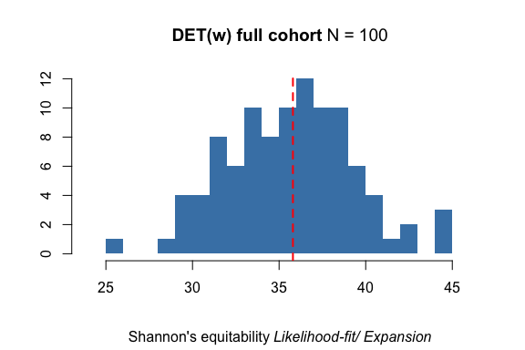
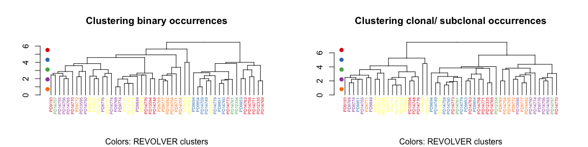

Plotting functions in REVOLVER
================
Giulio Caravagna
June 10, 2018

All the examples refer to the breast cancer cohort, available in the
package
release.

``` r
# Load REVOLVER and disable crayon's coloured output that renders badly in HTML,
# as well as REVOLVER's progress bars...
library(revolver)

options(crayon.enabled = FALSE)
options(revolver.progressBar = FALSE)

data("Breast.fit") # Yates et al.
Breast.fit
```

    ##  [ REVOLVER  v1.0 "Haggis and tatties" (reviewer's beta) ] 
    ## 
    ##   Breast cohort 
    ## 
    ##   Patient IDs     : PD9193,  PD9694,  PD9768,  PD9769,  PD9770,  PD9771,  ...
    ##   Cohort size     : 50 patients, 403 alterations, 54 drivers
    ##   Drivers         : SMARCA4,  GATA3,  +8q,  -8p,  CREBBP,  SETD2,  ... 
    ## 
    ##  ----------------------
    ##  Computations available
    ##  ----------------------
    ## 
    ##   Trees per patient    : YES
    ##   Fit via TL           : YES
    ##   REVOLVER clustering  : YES
    ##   Jackknife statistics : YES
    ## 
    ##  ---------------------------
    ##  Summary for data and models
    ##  ---------------------------
    ## 
    ##    PD9193 :  k =   3 | t =   2 | n =  4 | r =  8 | m =    6 | d =  4     [ Fit ]  #   2   | g =  6.2e-01 | f =    2e-04   [ Cluster  C1 ]
    ##    PD9694 :  k =   4 | t =   4 | n =  4 | r = 17 | m =    9 | d =  8     [ Fit ]  #   1   | g =  9.4e-01 | f =  1.4e-03   [ Cluster  C4 ]
    ##    PD9768 :  k =   6 | t =   2 | n =  4 | r =  6 | m =    4 | d =  3     [ Fit ]  #   1   | g =    1e+00 | f =  5.9e-03   [ Cluster  C3 ]
    ##    PD9769 :  k =   1 | t =   1 | n =  1 | r =  2 | m =    9 | d =  7     [ Fit ]  #   1   | g =    1e+00 | f =    1e+00   [ Cluster  C5 ]
    ##    PD9770 :  k =  64 | t =   4 | n =  7 | r =  6 | m =   12 | d =  7     [ Fit ]  #   1   | g =  1.7e-01 | f =  5.6e-06   [ Cluster  C2 ]
    ##    PD9771 :  k =   4 | t =   4 | n =  4 | r =  6 | m =    9 | d =  7     [ Fit ]  #   2   | g =  6.7e-01 | f =  3.6e-03   [ Cluster  C5 ]
    ##    PD9772 :  k =   1 | t =   1 | n =  2 | r =  3 | m =   11 | d =  7     [ Fit ]  #   1   | g =    1e+00 | f =  2.2e-01   [ Cluster  C5 ]
    ##    PD9773 :  k =   1 | t =   1 | n =  2 | r =  3 | m =    4 | d =  4     [ Fit ]  #   1   | g =    1e+00 | f =  8.5e-02   [ Cluster  C2 ]
    ##    PD9774 :  k =   1 | t =   1 | n =  1 | r =  2 | m =    3 | d =  2     [ Fit ]  #   1   | g =    1e+00 | f =    1e+00   [ Cluster  C3 ]
    ##    PD9775 :  k =   1 | t =   1 | n =  1 | r =  2 | m =    2 | d =  2     [ Fit ]  #   1   | g =    1e+00 | f =    1e+00   [ Cluster  C2 ]
    ##    PD9776 :  k =   1 | t =   1 | n =  2 | r =  4 | m =   10 | d =  7     [ Fit ]  #   1   | g =    1e+00 | f =  2.2e-01   [ Cluster  C3 ]
    ##    PD9777 :  k =   2 | t =   2 | n =  3 | r =  4 | m =    9 | d =  7     [ Fit ]  #   1   | g =    1e+00 | f =  2.6e-02   [ Cluster  C5 ]
    ##    PD9849 :  k =   1 | t =   1 | n =  2 | r =  8 | m =    5 | d =  5     [ Fit ]  #   1   | g =    1e+00 | f =  1.9e-01   [ Cluster  C3 ]
    ##    PD9850 :  k = 200 | t = 105 | n =  8 | r =  7 | m =   17 | d = 14     [ Fit ]  #   5   | g =  6.1e-01 | f =    2e-07   [ Cluster  C2 ]
    ##    PD9851 :  k =   2 | t =   2 | n =  3 | r =  8 | m =    5 | d =  4     [ Fit ]  #   2   | g =    5e-01 | f =  9.7e-03   [ Cluster  C4 ]
    ##    PD9852 :  k =   5 | t =   1 | n =  4 | r =  7 | m =   10 | d =  5     [ Fit ]  #   1   | g =  8.6e-01 | f =  1.3e-04   [ Cluster  C2 ]
    ##    PD9853 :  k =   1 | t =   1 | n =  2 | r =  8 | m =    8 | d =  5     [ Fit ]  #   1   | g =    1e+00 | f =  1.4e-02   [ Cluster  C4 ]
    ##    PD9854 :  k =   1 | t =   1 | n =  2 | r =  8 | m =    6 | d =  5     [ Fit ]  #   1   | g =    1e+00 | f =  1.9e-01   [ Cluster  C4 ]
    ##   PD12334 :  k =   2 | t =   2 | n =  4 | r =  8 | m =   20 | d = 13     [ Fit ]  #   1   | g =    1e+00 | f =  3.2e-04   [ Cluster  C6 ]
    ##   PD12335 :  k =   4 | t =   1 | n =  5 | r =  8 | m =   13 | d =  6     [ Fit ]  #   1   | g =  6.2e-01 | f =  3.7e-04   [ Cluster  C1 ]
    ##   PD13594 :  k =   3 | t =   1 | n =  4 | r =  9 | m =    7 | d =  4     [ Fit ]  #   2   | g =  2.2e-01 | f =  7.8e-03   [ Cluster  C1 ]
    ##   PD13595 :  k =   4 | t =   1 | n =  5 | r =  8 | m =   12 | d =  6     [ Fit ]  #   1   | g =  8.8e-01 | f =  8.4e-06   [ Cluster  C3 ]
    ##   PD14492 :  k =   2 | t =   1 | n =  3 | r =  8 | m =    8 | d =  6     [ Fit ]  #   1   | g =  8.8e-01 | f =  3.6e-03   [ Cluster  C5 ]
    ##   PD14705 :  k =   1 | t =   1 | n =  2 | r = 10 | m =   10 | d = 10     [ Fit ]  #   1   | g =    1e+00 | f =  9.1e-03   [ Cluster  C5 ]
    ##   PD14748 :  k =   1 | t =   1 | n =  2 | r =  7 | m =    2 | d =  2     [ Fit ]  #   1   | g =    1e+00 | f =  8.5e-02   [ Cluster  C1 ]
    ##   PD14749 :  k =   1 | t =   1 | n =  1 | r =  2 | m =    8 | d =  6     [ Fit ]  #   1   | g =    1e+00 | f =    1e+00   [ Cluster  C4 ]
    ##   PD14750 :  k =   1 | t =   1 | n =  1 | r =  3 | m =    9 | d =  8     [ Fit ]  #   1   | g =    1e+00 | f =    1e+00   [ Cluster  C3 ]
    ##   PD14751 :  k =   1 | t =   1 | n =  2 | r =  2 | m =    8 | d =  5     [ Fit ]  #   1   | g =    1e+00 | f =  1.7e-01   [ Cluster  C2 ]
    ##   PD14753 :  k = 200 | t =  39 | n = 11 | r =  5 | m =   19 | d = 14     [ Fit ]  #   2   | g =  2.4e-01 | f =  1.9e-07   [ Cluster  C2 ]
    ##   PD14754 :  k =   1 | t =   1 | n =  1 | r =  2 | m =   12 | d =  9     [ Fit ]  #   1   | g =    1e+00 | f =    1e+00   [ Cluster  C5 ]
    ##   PD14755 :  k =   1 | t =   1 | n =  3 | r =  9 | m =    7 | d =  5     [ Fit ]  #   1   | g =  5.6e-01 | f =  1.3e-02   [ Cluster  C3 ]
    ##   PD14756 :  k =   1 | t =   1 | n =  2 | r =  2 | m =    8 | d =  5     [ Fit ]  #   1   | g =    1e+00 | f =  1.7e-01   [ Cluster  C3 ]
    ##   PD14757 :  k =   1 | t =   1 | n =  3 | r =  8 | m =    7 | d =  6     [ Fit ]  #   1   | g =    1e+00 | f =  1.9e-03   [ Cluster  C6 ]
    ##   PD14758 :  k =   1 | t =   1 | n =  2 | r =  9 | m =    6 | d =  5     [ Fit ]  #   1   | g =    1e+00 | f =  1.1e-02   [ Cluster  C1 ]
    ##   PD14759 :  k =   1 | t =   1 | n =  1 | r = 10 | m =    4 | d =  4     [ Fit ]  #   1   | g =    1e+00 | f =    1e+00   [ Cluster  C4 ]
    ##   PD14760 :  k =   1 | t =   1 | n =  1 | r =  7 | m =    4 | d =  4     [ Fit ]  #   1   | g =    1e+00 | f =    1e+00   [ Cluster  C4 ]
    ##   PD14761 :  k =   1 | t =   1 | n =  1 | r =  5 | m =    7 | d =  5     [ Fit ]  #   1   | g =    1e+00 | f =    1e+00   [ Cluster  C6 ]
    ##   PD14762 :  k =   2 | t =   1 | n =  3 | r = 11 | m =    3 | d =  2     [ Fit ]  #   1   | g =    1e+00 | f =  1.3e-02   [ Cluster  C2 ]
    ##   PD14763 :  k =   1 | t =   1 | n =  2 | r = 15 | m =    7 | d =  7     [ Fit ]  #   1   | g =    1e+00 | f =  1.5e-01   [ Cluster  C1 ]
    ##   PD14765 :  k =   1 | t =   1 | n =  2 | r =  5 | m =    8 | d =  7     [ Fit ]  #   1   | g =    1e+00 | f =  2.2e-01   [ Cluster  C3 ]
    ##   PD14767 :  k =   6 | t =   6 | n =  4 | r =  7 | m =    8 | d =  8     [ Fit ]  #   2   | g =  7.1e-01 | f =  7.4e-03   [ Cluster  C2 ]
    ##   PD14768 :  k =   8 | t =   3 | n =  4 | r =  4 | m =   12 | d =  7     [ Fit ]  #   6   | g =  7.5e-01 | f =    9e-04   [ Cluster  C2 ]
    ##   PD14769 :  k =   1 | t =   1 | n =  1 | r =  2 | m =    9 | d =  5     [ Fit ]  #   1   | g =    1e+00 | f =    1e+00   [ Cluster  C1 ]
    ##   PD14770 :  k =   2 | t =   2 | n =  3 | r =  3 | m =    6 | d =  5     [ Fit ]  #   1   | g =    1e+00 | f =  4.7e-02   [ Cluster  C1 ]
    ##   PD14771 :  k =   1 | t =   1 | n =  1 | r =  2 | m =    5 | d =  4     [ Fit ]  #   1   | g =    1e+00 | f =    1e+00   [ Cluster  C1 ]
    ##   PD14773 :  k =   1 | t =   1 | n =  1 | r =  2 | m =    4 | d =  3     [ Fit ]  #   1   | g =    1e+00 | f =    1e+00   [ Cluster  C1 ]
    ##   PD14774 :  k =   3 | t =   1 | n =  5 | r =  3 | m =   11 | d =  9     [ Fit ]  #   1   | g =    0e+00 | f =  2.2e-03   [ Cluster  C3 ]
    ##   PD14775 :  k =   1 | t =   1 | n =  1 | r =  2 | m =    2 | d =  2     [ Fit ]  #   1   | g =    1e+00 | f =    1e+00   [ Cluster  C2 ]
    ##   PD14776 :  k =   1 | t =   1 | n =  2 | r =  3 | m =    9 | d =  4     [ Fit ]  #   1   | g =    1e+00 | f =  2.2e-01   [ Cluster  C1 ]
    ##   PD14779 :  k =   1 | t =   1 | n =  1 | r =  2 | m =    9 | d =  7     [ Fit ]  #   1   | g =    1e+00 | f =    1e+00   [ Cluster  C4 ]
    ## 
    ##  Legend 
    ##       k : phylogenies  
    ##       t : combinations of information transfer 
    ##       n : groups (nodes of the tree) 
    ##       r : regions (inputs per patient) 
    ##       m : number of alterations 
    ##       d : number of driver alterations
    ##       # : number of the solution selection (out of k)  
    ##       g : goodness-of-fit 
    ##       f : score of the model
    ## 
    ##  --------------------
    ##  Summary for clusters
    ##  --------------------
    ## 
    ##     C1 :  n =   11 | jackknife = 0.674
    ##     C4 :  n =   11 | jackknife = 0.788
    ##     C6 :  n =   10 | jackknife = 0.671
    ##     C3 :  n =    8 | jackknife = 0.670
    ##     C5 :  n =    7 | jackknife = 0.724
    ##     C2 :  n =    3 | jackknife = 0.646
    ## 
    ##  Legend 
    ##               n : number of patients in the cluster
    ##       jackknife : median co-clustering probability estiamted with jackknife

There are three types of plotting functions in REVOLVER:

  - functions `revolver_report_xxx` where `xxx` is one of `patient`,
    `fit` or `clusters`. These functions use `revolver_plt_xxx` plots to
    render a PDF report about a patient, fits and REVOLVER’s clusters.

  - functions `revolver_plt_xxx` where `xxx` identifies the plot. These
    functions plot to the graphic device, but often accept a parameter
    `file` to save the plot to PDF (in that case, the device is created
    with `pdf`);

  - `plot` functions for S3 objects that combine some of the above
    function; see the bottom of this document.

## PDF reports

> To assemble PDFs, REVOLVER uses
> [PDFjam](https://warwick.ac.uk/fac/sci/statistics/staff/academic-research/firth/software/pdfjam/),
> which is available for all Unix-like systems, and is compatible with
> Windows via Cygwin; check that you have it installed in your system.

  - Print to file a PDF report with data, trees and their rank for
    patient `PD9770`

<!-- end list -->

``` r
revolver_report_patient(Breast.fit, 'PD9770', cex = 1.5)
```

Example output:
[“REVOLVER-report-patient-data-models-PD9770.pdf”](https://github.com/caravagn/revolver.misc/blob/master/vignette_plotting_functions/REVOLVER-report-patient-data-models-PD9770.pdf).

Print to file

a PDF report with fit, evolutionary trajectories (exploded) and
information transfer for patient `PD9770`

``` r
revolver_report_fit_patient(Breast.fit, 'PD9770', cex = 3)
```

<!-- ```{r, eval = FALSE} -->

<!-- revolver_report_clusters(Breast.fit, cex = 1.5) -->

<!-- ``` -->

**Assembling your own PDFs.** You can assemble a bunch of PDFs via
function
`jamPDF`.

``` r
# Take file "1.pdf", "2.pdf", merge them to a unique PDF with layout "2x1"
jamPDF(
  in.files = c("1.pdf", "2.pdf"),
  out.file = 'newfile.pdf',
  layout = '2x1',                 # the layout (matrix style)
  delete.original = TRUE          # delete original files
  crop.white = TRUE,              # crop white borders for overly large PDF canvases
  page = 'a4'                     # resize each page to fit A4 paper
)                 
```

## Plotting functions

### Data and trees for a patient

**Plotting a REVOLVER tree.** The top-ranked tree for patient `PD14753`,
among all the ones available is

``` r
tree = Breast.fit$phylogenies$PD14753[[1]]

revolver_plt_tree(x = tree, type = 'binary')
```

<!-- -->

`type = 'binary'` tells which data we are using, and defines how to
compute “Violations” via `stats.rev_phylo`: for `binary` the field
reported is `$Suppes`, a violation is when the inequality holds as `<`.
For `CCF`, the field reported is `$CCF.pigeonhole` and violations are
due to the pigeonhole principle.

``` r
stats.rev_phylo(tree)
```

    ## $probs
    ##              p(i)      p(j)    p(i,j)
    ## 3 -> 4  0.6666667 0.5000000 0.5000000
    ## 3 -> 2  0.6666667 0.5000000 0.5000000
    ## 1 -> 3  0.8333333 0.6666667 0.6666667
    ## 1 -> 6  0.8333333 0.6666667 0.6666667
    ## 7 -> 10 0.3333333 0.1666667 0.1666667
    ## 4 -> 11 0.5000000 0.1666667 0.1666667
    ## 6 -> 5  0.6666667 0.1666667 0.1666667
    ## 6 -> 9  0.6666667 0.3333333 0.3333333
    ## 2 -> 7  0.5000000 0.3333333 0.3333333
    ## 2 -> 8  0.5000000 0.3333333 0.3333333
    ## 
    ## $violations
    ## tp pr pp 
    ##  0  0  6 
    ## 
    ## $gofit
    ## [1] 0.192
    ## 
    ## $Suppes
    ##         Temporal Priority Probability Raising
    ## 3 -> 4  ">"               ">"                
    ## 3 -> 2  ">"               ">"                
    ## 1 -> 3  ">"               ">"                
    ## 1 -> 6  ">"               ">"                
    ## 7 -> 10 ">"               ">"                
    ## 4 -> 11 ">"               ">"                
    ## 6 -> 5  ">"               ">"                
    ## 6 -> 9  ">"               ">"                
    ## 2 -> 7  ">"               ">"                
    ## 2 -> 8  ">"               ">"                
    ## 
    ## $CCF.pigeonhole
    ##   PD14753a PD14753c PD14753d PD14753e PD14753f
    ## 3    FALSE     TRUE    FALSE     TRUE     TRUE
    ## 1    FALSE    FALSE    FALSE     TRUE     TRUE
    ## 7     TRUE     TRUE     TRUE     TRUE     TRUE
    ## 4     TRUE     TRUE     TRUE     TRUE     TRUE
    ## 6     TRUE     TRUE     TRUE     TRUE     TRUE
    ## 2     TRUE     TRUE    FALSE     TRUE     TRUE

In this graphics colours encode information about the trajectories
described by this tree. In particular, the colour of the edge determines
the paths: i.e., here because 11 is below 3, the edge is coloured
orange. Observe that nodes/ groups 4, 7, 8 and 9 have no driver
annotated and are in light gray.

**Plotting data for a patient.** You can plot a `pheatmap` of the input
data, annotated with driver and clonality status. In that plot each row
is a group of alterations that occur in the same set of samples (with
binary data), or a group of alterations associated to the same cluster/
clone (with CCF data). Every group may have or not drivers associated;
columns represent samples (regions, for
instance).

``` r
revolver_plt_patient_data(Breast.fit, patient = 'PD14753')
```

<!-- -->

**Plotting all the trees of a patient (the distribution).** We plot the
score of the trees for a patient with a barplot (sorted). Each bar is a
tree, and is coloured according to its information transfer; repeated
colours mean that more than one tree transfer the same orderings among
the drivers. The more colours then, the more combinations of transfers
are available.

``` r
# Here we have 8trees with 3 different information transfers
revolver_plt_patient_trees_scores(Breast.fit, patient = 'PD14768')
```

<!-- -->

We can visualize the top `K` trees for a patient by iteratively applying
tree plotting functions, as wrapped via `revolver_plt_patient_trees`.
The number of plots is limited above by `K`, and the number of trees
available for the
patient.

``` r
# Inspect the information transfer (observe the different ordering of the tree nodes).
revolver_plt_patient_trees(Breast.fit, patient = 'PD14768', max.phylogenies = 12, file = NA, cex = 1)
```

<!-- -->

So, `PD14768` has some combinations of transfer repeated because group 2
has no drivers, and thus all the models that predict a branch towards 3
and 4, leads to the same trasnfer.

### Visualizing fits

**Plotting a patient’s fit, its trajectories and the information
transfer.** The fit of a patient is accessible via a direct function,
which wraps a call to
`revolver_plt_tree`

``` r
 revolver_plt_fit_patient(Breast.fit, patient = 'PD9850')
```

    ##  [ REVOLVER Plot: fit for a patient ]

<!-- -->

From the model fit, REVOLVER compute the expansion of all the nodes of
the tree with at least one drivers associated, which leads us to the
evolutionary trajectories of the
model

``` r
revolver_plt_trajectories_patient(Breast.fit, patient = 'PD9850')
```

    ##  [ REVOLVER Plot: trajectories from the fit of PD9850 ]

<!-- -->

At the same time, we can extract the information transfer from the model
fit, and annotate some basic information on the
plots

``` r
revolver_plt_itransfer_patient(Breast.fit, patient = 'PD9850')
```

    ##  [ REVOLVER Plot: information transfer from the fit of PD9850 ]

<!-- -->

**Plotting w, the penalty of the fit.** The penalty-per-patient is shown
with a simple barplot computed by marginalizing **w** over the
alterations

``` r
revolver_plt_penalty_barplot(Breast.fit)
```

    ##  [ REVOLVER Plot: barplot of penalty across patients  ] 
    ##   Output file =  N/A

<!-- -->

While the penalty across patients and alterations is shown with a
`pheatmap`. This can be plot for the models fit at the end of the TL fit
(likelihood fit + expansion step), by default, or you can use
`type="before.expansion"` to use the models computed after likelihood
fit (without the expansion). If you prefer, you can plot the normalized
version of **w** with `normalized =
    TRUE`.

``` r
revolver_plt_penalty_matrix(Breast.fit)
```

    ##  [ REVOLVER Plot: matrix of penalty across patients and alterations ] 
    ##   Normalize w = FALSE  
    ##   Use fits before/ after expansion = after.expansion  
    ##   Output file =  N/A

<!-- -->

**Plotting the index of Divergent Evolutionary Trajectories (DET).** The
DET for the cohort is estimated via a non-parametric bootstrap with `N`
resamples, and visualized in a histogram.

``` r
revolver_plt_DET_index(Breast.fit, N = 100)
```

    ##  [ REVOLVER Plot: boostrapped DET index (full cohort) ] 
    ##   Type of index = Shannon  
    ##   Use fits before/ after expansion = after.expansion  
    ##   Number of non parametric bootstrap replicates = 100  
    ##   Output file =  N/A   
    ## 
    ##  DONE

<!-- -->

    ##   [1] 36.58310 33.94250 30.10426 34.56350 37.10766 38.17583 36.28816
    ##   [8] 35.06624 34.06850 32.16168 35.69785 36.75939 34.74318 38.71252
    ##  [15] 36.56308 36.84374 35.88490 36.27426 34.37698 37.28695 37.53044
    ##  [22] 37.42462 38.04100 35.27596 33.60850 35.74741 35.72149 36.28510
    ##  [29] 41.07925 39.11374 37.51561 33.24746 37.39879 33.30640 37.37908
    ##  [36] 31.30006 37.49331 34.82463 35.12689 36.69929 31.56922 39.68761
    ##  [43] 34.53637 39.60182 33.72110 36.77199 35.78958 30.32023 35.92934
    ##  [50] 36.46091 28.80465 37.93906 38.70931 36.68910 32.71071 35.49088
    ##  [57] 38.16556 35.95108 40.42975 32.93079 35.71519 38.20119 31.14034
    ##  [64] 38.60086 36.96020 35.19287 28.43058 36.61744 35.76702 35.84270
    ##  [71] 30.08855 35.49883 35.89843 38.64846 37.17336 34.58858 38.32433
    ##  [78] 35.63135 37.32966 37.01169 37.60855 37.25636 36.93804 31.28884
    ##  [85] 31.74194 34.93898 36.63121 31.05876 34.80086 36.46907 38.64670
    ##  [92] 34.43522 37.08601 38.50238 37.82725 33.74016 35.70950 40.14945
    ##  [99] 28.51001 35.27897

For each driver, it is reported as estimated empirically from data

``` r
revolver_plt_DET_index_driver(Breast.fit)
```

    ##  [ REVOLVER Plot: empirical DET index (per driver) ] 
    ##   Type of index = Shannon  
    ##   Use fits before/ after expansion = after.expansion  
    ##   Output file =  N/A

<!-- -->

    ##         TP53         -16q         -17p          +8q          -8p 
    ##    0.3538413    0.8169559    0.8237813    0.7768861    0.8691981 
    ##       PIK3CA amp(8p11.22)          +1q        GATA3         PTEN 
    ##    0.9225389    0.8527925    0.9023328    0.0000000    0.9755038 
    ##       MAP2K4       ARID1B         AKT1         INSR       ARID1A 
    ##    0.0000000    0.9823888    0.0000000    0.0000000    0.0000000 
    ##       FANCD2         ROS1      MAP3K12         TSC2       CREBBP 
    ##    0.9182958    1.0000000    1.0000000    0.0000000    1.0000000 
    ##          KDR         BPTF amp(8q24.21)         IRS2         MLL2 
    ##    1.0000000    1.0000000    0.8917812    0.0000000    0.0000000 
    ##        IGF2R       DICER1        KDM6A amp(11q13.3)       NOTCH4 
    ##    0.8962406    1.0000000    1.0000000    0.0000000    0.0000000 
    ##   amp(17q12)        MED12          MLL      COL22A1       CARD11 
    ##    0.0000000    1.0000000    1.0000000    1.0000000    0.9182958 
    ##         CDH1      TNFAIP3         FLT4   amp(19q12)       MED12L 
    ##    0.0000000    1.0000000    0.9246935    0.0000000    0.0000000 
    ##        BRCA2     upd(17p)         FLT3     HSP90AB1      SMARCA4 
    ##    0.9629611    0.0000000    0.0000000    0.9591479    1.0000000 
    ##        SETD2         BAP1       NOTCH2       NOTCH3         GNAS 
    ##    1.0000000    1.0000000    1.0000000    1.0000000    1.0000000 
    ##         MLL3       PDGFRA        FBXW7       CDKN2A 
    ##    1.0000000    1.0000000    1.0000000    1.0000000

<!-- revolver_penaltyPlot(fit) -->
<!-- plot(fit, out.file = paste(cohort.name, '.fit.pdf', sep = ''), plot.stat = TRUE, layout = '1x1',  palette = 'Dark2') -->

### Visualizing clusters

**Plotting features from REVOLVER clustering.** You can visualize
REVOLVER clusters and trajectories (features) to spot relevant
trajectories in each
group.

``` r
revolver_plt_rclusters(Breast.fit, cutoff.features_annotation = 3, cex = 1)
```

    ##  [ REVOLVER Plot: REVOLVER Cluster table with features table ] 
    ##   Cutoff to annotate features (min. observations) = 3  
    ##   Output file =  N/A   
    ## Features that will be annotated [ use.GL = TRUE ] 
    ##             from           to              edge count
    ## 18            GL         TP53           GL~TP53    27
    ## 16          TP53          +8q          TP53~+8q    16
    ## 10          -16q         -17p         -16q~-17p    13
    ## 14            GL         -16q           GL~-16q    13
    ## 26          -17p          +1q          -17p~+1q    13
    ## 9           -16q          +8q          -16q~+8q    12
    ## 20          TP53         -17p         TP53~-17p    11
    ## 23          TP53          +1q          TP53~+1q     8
    ## 50          TP53          -8p          TP53~-8p     8
    ## 24           +8q amp(8q24.21)  +8q~amp(8q24.21)     7
    ## 29          TP53       PIK3CA       TP53~PIK3CA     6
    ## 74          TP53         -16q         TP53~-16q     6
    ## 3            -8p          +8q           -8p~+8q     5
    ## 8           -16q amp(8p11.22) -16q~amp(8p11.22)     5
    ## 30        PIK3CA          -8p        PIK3CA~-8p     5
    ## 44  amp(8p11.22)          +1q  amp(8p11.22)~+1q     5
    ## 125           GL       ARID1A         GL~ARID1A     5
    ## 132           GL amp(11q13.3)   GL~amp(11q13.3)     5
    ## 133           GL          +1q            GL~+1q     5
    ## 161           GL          +8q            GL~+8q     5
    ## 4             GL        GATA3          GL~GATA3     4
    ## 55           +1q         FLT4          +1q~FLT4     4
    ## 141          +8q       PIK3CA        +8q~PIK3CA     4
    ## 163           GL         -17p           GL~-17p     4

    ## Warning in strwidth(colnames(annotation_row), units = "in"): conversion
    ## failure on 'GL → TP53' in 'mbcsToSbcs': dot substituted for <e2>

    ## Warning in strwidth(colnames(annotation_row), units = "in"): conversion
    ## failure on 'GL → TP53' in 'mbcsToSbcs': dot substituted for <86>

    ## Warning in strwidth(colnames(annotation_row), units = "in"): conversion
    ## failure on 'GL → TP53' in 'mbcsToSbcs': dot substituted for <92>

    ## Warning in strwidth(colnames(annotation_row), units = "in"): conversion
    ## failure on 'TP53 → +8q' in 'mbcsToSbcs': dot substituted for <e2>

    ## Warning in strwidth(colnames(annotation_row), units = "in"): conversion
    ## failure on 'TP53 → +8q' in 'mbcsToSbcs': dot substituted for <86>

    ## Warning in strwidth(colnames(annotation_row), units = "in"): conversion
    ## failure on 'TP53 → +8q' in 'mbcsToSbcs': dot substituted for <92>

    ## Warning in strwidth(colnames(annotation_row), units = "in"): conversion
    ## failure on '-16q → -17p' in 'mbcsToSbcs': dot substituted for <e2>

    ## Warning in strwidth(colnames(annotation_row), units = "in"): conversion
    ## failure on '-16q → -17p' in 'mbcsToSbcs': dot substituted for <86>

    ## Warning in strwidth(colnames(annotation_row), units = "in"): conversion
    ## failure on '-16q → -17p' in 'mbcsToSbcs': dot substituted for <92>

    ## Warning in strwidth(colnames(annotation_row), units = "in"): conversion
    ## failure on 'GL → -16q' in 'mbcsToSbcs': dot substituted for <e2>

    ## Warning in strwidth(colnames(annotation_row), units = "in"): conversion
    ## failure on 'GL → -16q' in 'mbcsToSbcs': dot substituted for <86>

    ## Warning in strwidth(colnames(annotation_row), units = "in"): conversion
    ## failure on 'GL → -16q' in 'mbcsToSbcs': dot substituted for <92>

    ## Warning in strwidth(colnames(annotation_row), units = "in"): conversion
    ## failure on '-17p → +1q' in 'mbcsToSbcs': dot substituted for <e2>

    ## Warning in strwidth(colnames(annotation_row), units = "in"): conversion
    ## failure on '-17p → +1q' in 'mbcsToSbcs': dot substituted for <86>

    ## Warning in strwidth(colnames(annotation_row), units = "in"): conversion
    ## failure on '-17p → +1q' in 'mbcsToSbcs': dot substituted for <92>

    ## Warning in strwidth(colnames(annotation_row), units = "in"): conversion
    ## failure on '-16q → +8q' in 'mbcsToSbcs': dot substituted for <e2>

    ## Warning in strwidth(colnames(annotation_row), units = "in"): conversion
    ## failure on '-16q → +8q' in 'mbcsToSbcs': dot substituted for <86>

    ## Warning in strwidth(colnames(annotation_row), units = "in"): conversion
    ## failure on '-16q → +8q' in 'mbcsToSbcs': dot substituted for <92>

    ## Warning in strwidth(colnames(annotation_row), units = "in"): conversion
    ## failure on 'TP53 → -17p' in 'mbcsToSbcs': dot substituted for <e2>

    ## Warning in strwidth(colnames(annotation_row), units = "in"): conversion
    ## failure on 'TP53 → -17p' in 'mbcsToSbcs': dot substituted for <86>

    ## Warning in strwidth(colnames(annotation_row), units = "in"): conversion
    ## failure on 'TP53 → -17p' in 'mbcsToSbcs': dot substituted for <92>

    ## Warning in strwidth(colnames(annotation_row), units = "in"): conversion
    ## failure on 'TP53 → +1q' in 'mbcsToSbcs': dot substituted for <e2>

    ## Warning in strwidth(colnames(annotation_row), units = "in"): conversion
    ## failure on 'TP53 → +1q' in 'mbcsToSbcs': dot substituted for <86>

    ## Warning in strwidth(colnames(annotation_row), units = "in"): conversion
    ## failure on 'TP53 → +1q' in 'mbcsToSbcs': dot substituted for <92>

    ## Warning in strwidth(colnames(annotation_row), units = "in"): conversion
    ## failure on 'TP53 → -8p' in 'mbcsToSbcs': dot substituted for <e2>

    ## Warning in strwidth(colnames(annotation_row), units = "in"): conversion
    ## failure on 'TP53 → -8p' in 'mbcsToSbcs': dot substituted for <86>

    ## Warning in strwidth(colnames(annotation_row), units = "in"): conversion
    ## failure on 'TP53 → -8p' in 'mbcsToSbcs': dot substituted for <92>

    ## Warning in strwidth(colnames(annotation_row), units = "in"): conversion
    ## failure on '+8q → amp(8q24.21)' in 'mbcsToSbcs': dot substituted for <e2>

    ## Warning in strwidth(colnames(annotation_row), units = "in"): conversion
    ## failure on '+8q → amp(8q24.21)' in 'mbcsToSbcs': dot substituted for <86>

    ## Warning in strwidth(colnames(annotation_row), units = "in"): conversion
    ## failure on '+8q → amp(8q24.21)' in 'mbcsToSbcs': dot substituted for <92>

    ## Warning in strwidth(colnames(annotation_row), units = "in"): conversion
    ## failure on 'TP53 → PIK3CA' in 'mbcsToSbcs': dot substituted for <e2>

    ## Warning in strwidth(colnames(annotation_row), units = "in"): conversion
    ## failure on 'TP53 → PIK3CA' in 'mbcsToSbcs': dot substituted for <86>

    ## Warning in strwidth(colnames(annotation_row), units = "in"): conversion
    ## failure on 'TP53 → PIK3CA' in 'mbcsToSbcs': dot substituted for <92>

    ## Warning in strwidth(colnames(annotation_row), units = "in"): conversion
    ## failure on 'TP53 → -16q' in 'mbcsToSbcs': dot substituted for <e2>

    ## Warning in strwidth(colnames(annotation_row), units = "in"): conversion
    ## failure on 'TP53 → -16q' in 'mbcsToSbcs': dot substituted for <86>

    ## Warning in strwidth(colnames(annotation_row), units = "in"): conversion
    ## failure on 'TP53 → -16q' in 'mbcsToSbcs': dot substituted for <92>

    ## Warning in strwidth(colnames(annotation_row), units = "in"): conversion
    ## failure on '-8p → +8q' in 'mbcsToSbcs': dot substituted for <e2>

    ## Warning in strwidth(colnames(annotation_row), units = "in"): conversion
    ## failure on '-8p → +8q' in 'mbcsToSbcs': dot substituted for <86>

    ## Warning in strwidth(colnames(annotation_row), units = "in"): conversion
    ## failure on '-8p → +8q' in 'mbcsToSbcs': dot substituted for <92>

    ## Warning in strwidth(colnames(annotation_row), units = "in"): conversion
    ## failure on '-16q → amp(8p11.22)' in 'mbcsToSbcs': dot substituted for <e2>

    ## Warning in strwidth(colnames(annotation_row), units = "in"): conversion
    ## failure on '-16q → amp(8p11.22)' in 'mbcsToSbcs': dot substituted for <86>

    ## Warning in strwidth(colnames(annotation_row), units = "in"): conversion
    ## failure on '-16q → amp(8p11.22)' in 'mbcsToSbcs': dot substituted for <92>

    ## Warning in strwidth(colnames(annotation_row), units = "in"): conversion
    ## failure on 'PIK3CA → -8p' in 'mbcsToSbcs': dot substituted for <e2>

    ## Warning in strwidth(colnames(annotation_row), units = "in"): conversion
    ## failure on 'PIK3CA → -8p' in 'mbcsToSbcs': dot substituted for <86>

    ## Warning in strwidth(colnames(annotation_row), units = "in"): conversion
    ## failure on 'PIK3CA → -8p' in 'mbcsToSbcs': dot substituted for <92>

    ## Warning in strwidth(colnames(annotation_row), units = "in"): conversion
    ## failure on 'amp(8p11.22) → +1q' in 'mbcsToSbcs': dot substituted for <e2>

    ## Warning in strwidth(colnames(annotation_row), units = "in"): conversion
    ## failure on 'amp(8p11.22) → +1q' in 'mbcsToSbcs': dot substituted for <86>

    ## Warning in strwidth(colnames(annotation_row), units = "in"): conversion
    ## failure on 'amp(8p11.22) → +1q' in 'mbcsToSbcs': dot substituted for <92>

    ## Warning in strwidth(colnames(annotation_row), units = "in"): conversion
    ## failure on 'GL → ARID1A' in 'mbcsToSbcs': dot substituted for <e2>

    ## Warning in strwidth(colnames(annotation_row), units = "in"): conversion
    ## failure on 'GL → ARID1A' in 'mbcsToSbcs': dot substituted for <86>

    ## Warning in strwidth(colnames(annotation_row), units = "in"): conversion
    ## failure on 'GL → ARID1A' in 'mbcsToSbcs': dot substituted for <92>

    ## Warning in strwidth(colnames(annotation_row), units = "in"): conversion
    ## failure on 'GL → amp(11q13.3)' in 'mbcsToSbcs': dot substituted for <e2>

    ## Warning in strwidth(colnames(annotation_row), units = "in"): conversion
    ## failure on 'GL → amp(11q13.3)' in 'mbcsToSbcs': dot substituted for <86>

    ## Warning in strwidth(colnames(annotation_row), units = "in"): conversion
    ## failure on 'GL → amp(11q13.3)' in 'mbcsToSbcs': dot substituted for <92>

    ## Warning in strwidth(colnames(annotation_row), units = "in"): conversion
    ## failure on 'GL → +1q' in 'mbcsToSbcs': dot substituted for <e2>

    ## Warning in strwidth(colnames(annotation_row), units = "in"): conversion
    ## failure on 'GL → +1q' in 'mbcsToSbcs': dot substituted for <86>

    ## Warning in strwidth(colnames(annotation_row), units = "in"): conversion
    ## failure on 'GL → +1q' in 'mbcsToSbcs': dot substituted for <92>

    ## Warning in strwidth(colnames(annotation_row), units = "in"): conversion
    ## failure on 'GL → +8q' in 'mbcsToSbcs': dot substituted for <e2>

    ## Warning in strwidth(colnames(annotation_row), units = "in"): conversion
    ## failure on 'GL → +8q' in 'mbcsToSbcs': dot substituted for <86>

    ## Warning in strwidth(colnames(annotation_row), units = "in"): conversion
    ## failure on 'GL → +8q' in 'mbcsToSbcs': dot substituted for <92>

    ## Warning in strwidth(colnames(annotation_row), units = "in"): conversion
    ## failure on 'GL → GATA3' in 'mbcsToSbcs': dot substituted for <e2>

    ## Warning in strwidth(colnames(annotation_row), units = "in"): conversion
    ## failure on 'GL → GATA3' in 'mbcsToSbcs': dot substituted for <86>

    ## Warning in strwidth(colnames(annotation_row), units = "in"): conversion
    ## failure on 'GL → GATA3' in 'mbcsToSbcs': dot substituted for <92>

    ## Warning in strwidth(colnames(annotation_row), units = "in"): conversion
    ## failure on '+1q → FLT4' in 'mbcsToSbcs': dot substituted for <e2>

    ## Warning in strwidth(colnames(annotation_row), units = "in"): conversion
    ## failure on '+1q → FLT4' in 'mbcsToSbcs': dot substituted for <86>

    ## Warning in strwidth(colnames(annotation_row), units = "in"): conversion
    ## failure on '+1q → FLT4' in 'mbcsToSbcs': dot substituted for <92>

    ## Warning in strwidth(colnames(annotation_row), units = "in"): conversion
    ## failure on '+8q → PIK3CA' in 'mbcsToSbcs': dot substituted for <e2>

    ## Warning in strwidth(colnames(annotation_row), units = "in"): conversion
    ## failure on '+8q → PIK3CA' in 'mbcsToSbcs': dot substituted for <86>

    ## Warning in strwidth(colnames(annotation_row), units = "in"): conversion
    ## failure on '+8q → PIK3CA' in 'mbcsToSbcs': dot substituted for <92>

    ## Warning in strwidth(colnames(annotation_row), units = "in"): conversion
    ## failure on 'GL → -17p' in 'mbcsToSbcs': dot substituted for <e2>

    ## Warning in strwidth(colnames(annotation_row), units = "in"): conversion
    ## failure on 'GL → -17p' in 'mbcsToSbcs': dot substituted for <86>

    ## Warning in strwidth(colnames(annotation_row), units = "in"): conversion
    ## failure on 'GL → -17p' in 'mbcsToSbcs': dot substituted for <92>

<!-- -->

**Plotting dendograms for REVOLVER and occurence-based clusters.** You
can plot dendrograms that show REVOLVER clusters, or clusters given by
the patterns of occurence of the annotated drivers (binary, or clonal/
subclonal), coloured with REVOLVER clustering assignemnt.

``` r
revolver_plt_dendogram(Breast.fit, type = 'REVOLVER')
```

    ##  [ REVOLVER Plot: Dendrogram of REVOLVER clusters ] 
    ##   Dendogram = 1  
    ##   Dendogram type = rectangle  
    ##   Output file =  N/A

<!-- -->

``` r
par(mfrow = c(1,2))
revolver_plt_dendogram(Breast.fit, type = 'binary')
```

    ##  [ REVOLVER Plot: Dendrogram of REVOLVER clusters ] 
    ##   Dendogram = 1  
    ##   Dendogram type = rectangle  
    ##   Output file =  N/A

``` r
revolver_plt_dendogram(Breast.fit, type = 'clonality')
```

    ##  [ REVOLVER Plot: Dendrogram of REVOLVER clusters ] 
    ##   Dendogram = 1  
    ##   Dendogram type = rectangle  
    ##   Output file =  N/A

<!-- -->

``` r
par(mfrow = c(1,1))
```

**Bannerplot for REVOLVER clusters.**

``` r
revolver_plt_rbannerplot(Breast.fit, cex = 1)
```

    ##  [ REVOLVER Plot: Bannerplot of REVOLVER clusters ] 
    ##   Output file =  N/A

<!-- -->

**Tanglegrams to compare REVOLVER and occurence-based clusters.**
Tanglegrams against clusters obtained by patterns of occurrences of the
input alterations highlight how groups of patients change when you use
REVOLVEr.

``` r
revolver_plt_compare_dendograms(Breast.fit, cex = 1, type = 'binary')
```

    ##  [ REVOLVER Dendrogram Plot ] 
    ##   Comparison against = binary  
    ##   Dendrogram type = rectangle  
    ##   Output file =  N/A   
    ## 
    ## --------------------------------------------------------
    ## Comparison against alternative clustering via tanglegram
    ## --------------------------------------------------------

<!-- -->
Use `type = 'clonality'` to compare against clonal/ subclonal patterns.

**Plotting REVOLVER’s evolutionary distance.** You can display the
distance that has been used to compute the clusters, for each pair of
patients.

``` r
revolver_plt_evodistance(Breast.fit, cex = 1)
```

    ##  [ REVOLVER Evolutionary distance (h) Plot ] 
    ##   Output file =  N/A

<!-- -->

**Plotting the models trajectories present in each of REVOLVER’s
groups.** It might be convenient to plot the fit of each model by
clustering group. You can use a function for this, which will also plot
a table for the most frequent
trajectories.

``` r
revolver_plt_fit_by_group(Breast.fit, cex = 1, file.suffix = "REVOLVER-Clusters-FitsPerCluster.pdf")
```

The output of this functions is a set of PDFs, named as the group, and
followed by the string `file.suffix`, which you can change to organize
your PDFs as you prefer. We do not show execution of this function here.

### Visualizing confidence (jackknife)

**Plotting co-clustering statistics.** With all entries above 0.7
annotated, the patient-x-patient matrix is plot
as

``` r
revolver_plt_jackknife_coclust(Breast.fit, cutoff.annotate.numbers = 0.7)
```

    ##  [ REVOLVER Plot: co-clustering via jackknife (heatmap) ] 
    ##   Annotate number above value = 0.7  
    ##   Output file =  N/A   
    ## 
    ## --------------------
    ## Co-clustering matrix
    ## --------------------
    ## # A tibble: 50 x 50
    ##    PD9193 PD9694 PD9768 PD9769 PD9770 PD9771 PD9772 PD9773 PD9774 PD9775
    ##     <dbl>  <dbl>  <dbl>  <dbl>  <dbl>  <dbl>  <dbl>  <dbl>  <dbl>  <dbl>
    ##  1      0      0  0      0      0      0      0      0      0      0    
    ##  2      0      0  0      0      0      0      0      0      0      0    
    ##  3      0      0  0      0.001  0.028  0.051  0.435  0.043  0.8    0.026
    ##  4      0      0  0.001  0      0      0.733  0.327  0      0.001  0    
    ##  5      0      0  0.028  0      0      0.038  0.001  0.769  0.03   0.769
    ##  6      0      0  0.051  0.733  0.038  0      0.389  0.042  0.049  0.044
    ##  7      0      0  0.435  0.327  0.001  0.389  0      0.002  0.42   0    
    ##  8      0      0  0.043  0      0.769  0.042  0.002  0      0.045  0.778
    ##  9      0      0  0.8    0.001  0.03   0.049  0.42   0.045  0      0.028
    ## 10      0      0  0.026  0      0.769  0.044  0      0.778  0.028  0    
    ## # ... with 40 more rows, and 40 more variables: PD9776 <dbl>,
    ## #   PD9777 <dbl>, PD9849 <dbl>, PD9850 <dbl>, PD9851 <dbl>, PD9852 <dbl>,
    ## #   PD9853 <dbl>, PD9854 <dbl>, PD12334 <dbl>, PD12335 <dbl>,
    ## #   PD13594 <dbl>, PD13595 <dbl>, PD14492 <dbl>, PD14705 <dbl>,
    ## #   PD14748 <dbl>, PD14749 <dbl>, PD14750 <dbl>, PD14751 <dbl>,
    ## #   PD14753 <dbl>, PD14754 <dbl>, PD14755 <dbl>, PD14756 <dbl>,
    ## #   PD14757 <dbl>, PD14758 <dbl>, PD14759 <dbl>, PD14760 <dbl>,
    ## #   PD14761 <dbl>, PD14762 <dbl>, PD14763 <dbl>, PD14765 <dbl>,
    ## #   PD14767 <dbl>, PD14768 <dbl>, PD14769 <dbl>, PD14770 <dbl>,
    ## #   PD14771 <dbl>, PD14773 <dbl>, PD14774 <dbl>, PD14775 <dbl>,
    ## #   PD14776 <dbl>, PD14779 <dbl>

<!-- -->

The boxplot per cluster is instead plot with this function

``` r
revolver_plt_jackknife_coclust_bplot(Breast.fit)
```

    ##  [ REVOLVER Plot: co-clustering via jackknife (boxplot) ] 
    ##   Output file =  N/A   
    ## 
    ## ----------------------
    ## Co-clustering boxplot 
    ## ----------------------
    ## # A tibble: 6 x 2
    ##   entry value
    ## * <chr> <dbl>
    ## 1 C1    0.674
    ## 2 C4    0.788
    ## 3 C6    0.671
    ## 4 C3    0.67 
    ## 5 C5    0.724
    ## 6 C2    0.646

<!-- -->

**Plotting edge statistics.** The probability of detecting each edge
across resamples is an alteration-x-alteration
    matrix

``` r
revolver_plt_jackknife_edge_prb(Breast.fit)
```

    ##  [ REVOLVER Plot: edge detection probability via jackknife (heatmap) ] 
    ##   Columns ordered by = heterogeneity  
    ##   Annotate number above value = 0.6  
    ##   Output file =  N/A   
    ## 
    ## -----------------------------------
    ## Frequency of edges across resamples
    ## -----------------------------------
    ## # A tibble: 50 x 50
    ##    PD9193 PD9694 PD9768 PD9769 PD9770 PD9771 PD9772 PD9773 PD9774 PD9775
    ##     <dbl>  <dbl>  <dbl>  <dbl>  <dbl>  <dbl>  <dbl>  <dbl>  <dbl>  <dbl>
    ##  1      0      0  0      0      0      0      0      0      0      0    
    ##  2      0      0  0      0      0      0      0      0      0      0    
    ##  3      0      0  0      0.001  0.028  0.051  0.435  0.043  0.8    0.026
    ##  4      0      0  0.001  0      0      0.733  0.327  0      0.001  0    
    ##  5      0      0  0.028  0      0      0.038  0.001  0.769  0.03   0.769
    ##  6      0      0  0.051  0.733  0.038  0      0.389  0.042  0.049  0.044
    ##  7      0      0  0.435  0.327  0.001  0.389  0      0.002  0.42   0    
    ##  8      0      0  0.043  0      0.769  0.042  0.002  0      0.045  0.778
    ##  9      0      0  0.8    0.001  0.03   0.049  0.42   0.045  0      0.028
    ## 10      0      0  0.026  0      0.769  0.044  0      0.778  0.028  0    
    ## # ... with 40 more rows, and 40 more variables: PD9776 <dbl>,
    ## #   PD9777 <dbl>, PD9849 <dbl>, PD9850 <dbl>, PD9851 <dbl>, PD9852 <dbl>,
    ## #   PD9853 <dbl>, PD9854 <dbl>, PD12334 <dbl>, PD12335 <dbl>,
    ## #   PD13594 <dbl>, PD13595 <dbl>, PD14492 <dbl>, PD14705 <dbl>,
    ## #   PD14748 <dbl>, PD14749 <dbl>, PD14750 <dbl>, PD14751 <dbl>,
    ## #   PD14753 <dbl>, PD14754 <dbl>, PD14755 <dbl>, PD14756 <dbl>,
    ## #   PD14757 <dbl>, PD14758 <dbl>, PD14759 <dbl>, PD14760 <dbl>,
    ## #   PD14761 <dbl>, PD14762 <dbl>, PD14763 <dbl>, PD14765 <dbl>,
    ## #   PD14767 <dbl>, PD14768 <dbl>, PD14769 <dbl>, PD14770 <dbl>,
    ## #   PD14771 <dbl>, PD14773 <dbl>, PD14774 <dbl>, PD14775 <dbl>,
    ## #   PD14776 <dbl>, PD14779 <dbl>

<!-- -->

while the jackknife statistics for the number of patients with an edge
is a barplot where we can annotate all edges with mean count above
`cutoff.annotate.numEdges`

``` r
revolver_plt_jackknife_edge_counts(Breast.fit, cutoff.annotate.numEdges = 4)
```

    ##  [ REVOLVER Plot: edge counts via jackknife (boxplot) ] 
    ##   Plot edges with mean count above value = 4  
    ##   Output file =  N/A   
    ## 
    ## --------------------------------------------
    ## Number of patients per edge across resamples
    ## --------------------------------------------
    ## # A tibble: 19,971 x 4
    ##    from  to           edge             count
    ##  * <chr> <chr>        <fct>            <dbl>
    ##  1 GL    TP53         GL~TP53             23
    ##  2 TP53  +8q          TP53~+8q            13
    ##  3 -16q  +8q          -16q~+8q            12
    ##  4 -16q  -17p         -16q~-17p           12
    ##  5 GL    -16q         GL~-16q             12
    ##  6 -17p  +1q          -17p~+1q            12
    ##  7 TP53  -17p         TP53~-17p           10
    ##  8 TP53  -8p          TP53~-8p             7
    ##  9 TP53  +1q          TP53~+1q             6
    ## 10 +8q   amp(8q24.21) +8q~amp(8q24.21)     6
    ## # ... with 19,961 more rows

<!-- -->

## Plot functions for S3 objects

  - For class `rev_phylo`, function `plot` will use `revolver_plt_tree`
    to plot the tree.

<!-- end list -->

``` r
plot(Breast.fit$phylogenies$PD9193[[1]])
```

  - For class `rev_cohort`, function `plot` will automatize the creation
    of PDF reports for a set of patients, via repeated calls to
    `revolver_report_patient`. This function outputs only to file.

<!-- end list -->

``` r
#  To show this we convert ``Breast.fit`` to the proper class
conv = Breast.fit
class(conv) = 'rev_cohort'

plot(conv, patients = Breast.fit$patients)
```

  - For class `rev_cohort_fit`, function `plot` will automatize the
    creation of a PDF report for a set of patients, via repeated calls
    to `revolver_report_fit_patient`. This function outputs only to
    file.

<!-- end list -->

``` r
class(Breast.fit)
plot(Breast.fit, patients = Breast.fit$patients)
```
