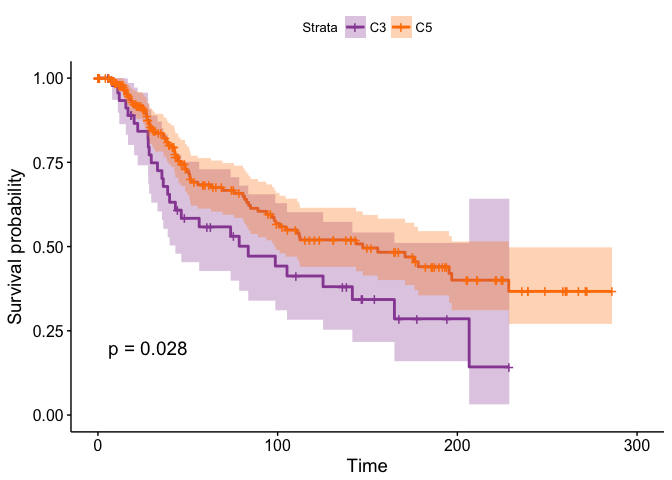

Enrichment and survival analysis from REVOLVER’s groups of breast
cancers
================
Giulio Caravagna
June 10, 2018

This vignette shows how to carry out survival analysis from REVOLVER’s
groups identified from breast cancer analysis.

REVOLVER is available as an R package at
[Github](https://github.com/caravagn/revolver).

``` r
devtools::install_github("caravagn/revolver")
```

We first prepared an RData object with all the survival information that
we need to carry out this analysis. This contains two lists:

  - `data`, which containst the dump of the relevant variables annotated
    in the single-sample cross-sectional cohorts that we used as test
    set;

  - `clinical_data`, the clinical information associated to the patients
    in the test set;

<!-- end list -->

``` r
load('Breast-cancer-survival.RData', verbose = TRUE)
```

    ## Loading objects:
    ##   test.set

``` r
names(test.set)
```

    ## [1] "data"          "clinical_data"

``` r
tibble::as.tibble(test.set$data)
```

    ## # A tibble: 1,752 x 7
    ##    `+8q` `-16q` `-17p` `+1q`  TP53 PIK3CA PIK3CA1
    ##    <dbl>  <dbl>  <dbl> <dbl> <dbl>  <dbl>   <dbl>
    ##  1     0      0      0     0     0      0       0
    ##  2     1      0      1     0     1      1       1
    ##  3     0      1      0     0     0      0       0
    ##  4     1      1      0     0     1      0       0
    ##  5     0      0      0     0     0      0       0
    ##  6     0      1      1     0     0      1       1
    ##  7     0      0      1     1     0      1       1
    ##  8     0      1      0     0     0      1       1
    ##  9     0      1      1     1     0      1       1
    ## 10     0      1      0     0     0      1       1
    ## # ... with 1,742 more rows

``` r
tibble::as.tibble(test.set$clinical_data)
```

    ## # A tibble: 2,805 x 5
    ##      AGE OS_MONTHS OS_STATUS INTCLUST PAM50      
    ##  * <dbl>     <dbl> <chr>     <chr>    <chr>      
    ##  1  75.6     140.  LIVING    4ER+     claudin-low
    ##  2  43.2      84.6 LIVING    4ER+     Luminal A  
    ##  3  48.9     163.  DECEASED  3        Luminal B  
    ##  4  47.7     165.  LIVING    9        Luminal B  
    ##  5  77.0      41.4 DECEASED  9        Luminal B  
    ##  6  78.8       7.8 DECEASED  7        Luminal B  
    ##  7  56.4     164.  LIVING    3        Luminal B  
    ##  8  70        22.4 DECEASED  4ER-     Normal     
    ##  9  89.1      99.5 DECEASED  3        claudin-low
    ## 10  86.4      36.6 DECEASED  9        Luminal B  
    ## # ... with 2,795 more rows

# Classifications of the test set

We first define the decision tree classifier that we discuss in the main
REVOLVER paper.

``` r
classify = function(patient)
{
  group = 'C1'
  
  if(patient['TP53'] == 1) 
  {
    if(patient['+8q'] == 1)
      { 
      if ((patient['+1q'] == 1) || (patient['-17p'] == 1) ) group = 'C5'
        else group = 'C3'
      } else group = 'C2'
  } else { 
   
  if(patient['-16q'] == 1) 
    {
      if(patient['+8q'] == 1)
      {
        if(patient['PIK3CA'] == 1) group = 'C6'
        else group = 'C4'
      }
    }
  }  
      
  return(group)
}
```

Then we begin by classifying our samples

``` r
data = test.set$data
clinical_data = test.set$clinical_data


classification = rep(NA, nrow(data))
names(classification) = rownames(data)

for(i in 1:nrow(data)) classification[i] = classify(data[i, ])
print(head(classification, 15))
```

    ## MB-0039 MB-0046 MB-0053 MB-0062 MB-0064 MB-0066 MB-0068 MB-0083 MB-0093 
    ##    "C1"    "C5"    "C1"    "C3"    "C1"    "C1"    "C1"    "C1"    "C1" 
    ## MB-0095 MB-0097 MB-0120 MB-0124 MB-0134 MB-0138 
    ##    "C1"    "C1"    "C4"    "C1"    "C1"    "C1"

We use `pheatmap` to plot the data, so we create annotations for
IntClust and Luminal-Basal classification, and define some colours for
the plots

``` r
# The pheatmap annotation data frame
annotations = as.data.frame(classification, stringsAsFactors = FALSE)
colnames(annotations) = 'cluster'

head(annotations)
```

    ##         cluster
    ## MB-0039      C1
    ## MB-0046      C5
    ## MB-0053      C1
    ## MB-0062      C3
    ## MB-0064      C1
    ## MB-0066      C1

``` r
# Colours of the plot
colors = c("#E41A1C","#FFFF33", "#984EA3", "#377EB8", "#FF7F00" , "#4DAF4A")
names(colors) = c("C1", "C2", "C3", "C4", "C5","C6")
```

We plot a piechart for the size of each cluster in the test set.

``` r
slices = as.vector(table(classification))
lbls = as.vector(names(table(classification)))
pct = round(slices/sum(slices)*100)

lbls =  paste(lbls, pct)
lbls =  paste(lbls, "%", sep="")
pie(slices, labels = lbls, col = colors)
legend("topright", lbls, cex=0.8, fill=colors)
```

<!-- -->

We annotate the status of the other classifications as well (IntClust
and PAM50) on our test set.

``` r
annotations = cbind(annotations, 
                    IntClust = c(clinical_data[rownames(annotations), 'INTCLUST']))

# With not much fantasy we use the term Classification to denote the PAM50 grouping of breast cancers
annotations = cbind(annotations, 
                    Classification = c(clinical_data[rownames(annotations), 'PAM50']))

# We control for some NAs and factors
annotations$IntClust = addNA(annotations$IntClust)

annotations$IntClust = factor(
  annotations$IntClust,
  levels = c("1", "2" ,"3","4","4ER-","4ER+","5","6","7","8","9","10" ,"unknown")
  )

# And annotate samples with unknown classification
id.na = which(is.na(annotations$IntClust))
annotations[id.na,'IntClust'] = "unknown"
```

We define colors for annotations

``` r
# IntClust
bpalette = RColorBrewer::brewer.pal(8, 'Accent')
ncols = length(unique(annotations$IntClust))

col.IntClust = colorRampPalette(bpalette)(ncols)

names(col.IntClust) = c("1", "2" ,"3","4","4ER-","4ER+","5","6","7","8","9","10" ,"unknown")    
# PAM50
col.Classification = RColorBrewer::brewer.pal(3, 'Dark2')[1:3]
names(col.Classification) = c("Luminal A", "Luminal B", "Basal")
```

We create a list of colors for `pheatmap`.

``` r
annotation_colors = list(
  cluster = colors, 
  Classification = col.Classification, 
  IntClust = col.IntClust)
```

and we order the columns according to the clusters

``` r
annotations = annotations[order(annotations$cluster),  , drop = FALSE]
annotations = annotations[
  with(annotations, order(annotations$cluster, annotations$Classification)), ]
annotations = annotations[
  with(annotations, order(annotations$Classification, annotations$IntClust)), ]
```

``` r
annotations.ordered = NULL
for(c in names(colors))
{
  sd = annotations[annotations$cluster == c, , drop = FALSE ]
  annotations.ordered = rbind(annotations.ordered, sd)
}
print(head(annotations))
```

    ##         cluster IntClust Classification
    ## MB-4769      C1        1          Basal
    ## MB-3014      C2        1          Basal
    ## MB-3165      C2        1          Basal
    ## MB-3277      C2        1          Basal
    ## MB-4024      C2        1          Basal
    ## MB-7111      C2        1          Basal

Because we have a large number of samples, we transpose the data.

``` r
tdata = t(data)
tdata = tdata[, rownames(annotations.ordered)]

pheatmap::pheatmap(
  tdata, 
  cellheight = 13, 
  cellwidth = 0.3, 
  legend = FALSE,
  main = "Classification of METABRIC/BRCA2012 LumA-LumB-Basal samples", 
  cluster_rows = F,
  cluster_cols = F,
  annotation_col = annotations.ordered,
  color = c('gray88', 'midnightblue'),
  annotation_colors = annotation_colors,
  show_colnames = F)
```

<!-- -->

# Enrichment analysis

Then we do some enrichment analysis via Fisher’s Exact Test.

``` r
classification = as.data.frame(classification, stringsAsFactors = FALSE)

# Enrichment IntClust
data.test = annotations[(annotations$cluster!="unknown"),c("IntClust", "cluster")]
head(data.test)
```

    ##         IntClust cluster
    ## MB-4769        1      C1
    ## MB-3014        1      C2
    ## MB-3165        1      C2
    ## MB-3277        1      C2
    ## MB-4024        1      C2
    ## MB-7111        1      C2

``` r
# Contingency table
ctable = function(G, Clust)
{
  table = table(data.test)
  diff = setdiff(colnames(table), G)
  diff2 = setdiff(rownames(table), Clust)
  ct = matrix(0, nrow = 2, ncol = 2)
  rownames(ct) = c(Clust, paste("Not", Clust))
  colnames(ct) = c(G, paste("Not", G))
  
  ct[1, 1] = table[Clust, G]
  ct[1, 2] =  sum(table[Clust, diff])
  ct[2, 1] =  sum(table[diff2,G])
  ct[2, 2] =  sum(table[diff2,diff])
  print(sum(ct))
  
  return(ct)  
}
```

We begin testing

``` r
IntClust = c("1", "2" , "3","4","4ER-","4ER+","5","6","7","8","9","10")
groups = c("C1", "C2", "C3",  "C4",  "C5", "C6")

# Matrix of p-values
p.value = matrix(0, length(groups), length(IntClust))
rownames(p.value) = groups
colnames(p.value) = IntClust

# Matrix of odds.ratios
odds.ratio = matrix(0, length(groups), length(IntClust))
rownames(odds.ratio) = groups
colnames(odds.ratio) = IntClust


for (i in groups){
  for(j in IntClust){
    cat('\nTesting ', i, '\n')
    print(ctable(i,j))
    
    test = fisher.test(ctable(i,j), alternative = "greater")
    
    p.value[i,j] = test$p.value
    odds.ratio[i, j] = test$estimate
  }
}
```

    ## 
    ## Testing  C1 
    ## [1] 1752
    ##        C1 Not C1
    ## 1      68     33
    ## Not 1 997    654
    ## [1] 1752
    ## 
    ## Testing  C1 
    ## [1] 1752
    ##         C1 Not C1
    ## 2       50     78
    ## Not 2 1015    609
    ## [1] 1752
    ## 
    ## Testing  C1 
    ## [1] 1752
    ##        C1 Not C1
    ## 3     280    103
    ## Not 3 785    584
    ## [1] 1752
    ## 
    ## Testing  C1 
    ## [1] 1752
    ##         C1 Not C1
    ## 4       19     55
    ## Not 4 1046    632
    ## [1] 1752
    ## 
    ## Testing  C1 
    ## [1] 1752
    ##            C1 Not C1
    ## 4ER-        4      7
    ## Not 4ER- 1061    680
    ## [1] 1752
    ## 
    ## Testing  C1 
    ## [1] 1752
    ##           C1 Not C1
    ## 4ER+      88     29
    ## Not 4ER+ 977    658
    ## [1] 1752
    ## 
    ## Testing  C1 
    ## [1] 1752
    ##         C1 Not C1
    ## 5       25     38
    ## Not 5 1040    649
    ## [1] 1752
    ## 
    ## Testing  C1 
    ## [1] 1752
    ##         C1 Not C1
    ## 6       38     28
    ## Not 6 1027    659
    ## [1] 1752
    ## 
    ## Testing  C1 
    ## [1] 1752
    ##        C1 Not C1
    ## 7     121     35
    ## Not 7 944    652
    ## [1] 1752
    ## 
    ## Testing  C1 
    ## [1] 1752
    ##        C1 Not C1
    ## 8     252     16
    ## Not 8 813    671
    ## [1] 1752
    ## 
    ## Testing  C1 
    ## [1] 1752
    ##         C1 Not C1
    ## 9       45     55
    ## Not 9 1020    632
    ## [1] 1752
    ## 
    ## Testing  C1 
    ## [1] 1752
    ##          C1 Not C1
    ## 10       16    135
    ## Not 10 1049    552
    ## [1] 1752
    ## 
    ## Testing  C2 
    ## [1] 1752
    ##        C2 Not C2
    ## 1      14     87
    ## Not 1 210   1441
    ## [1] 1752
    ## 
    ## Testing  C2 
    ## [1] 1752
    ##        C2 Not C2
    ## 2      13    115
    ## Not 2 211   1413
    ## [1] 1752
    ## 
    ## Testing  C2 
    ## [1] 1752
    ##        C2 Not C2
    ## 3      23    360
    ## Not 3 201   1168
    ## [1] 1752
    ## 
    ## Testing  C2 
    ## [1] 1752
    ##        C2 Not C2
    ## 4       2     72
    ## Not 4 222   1456
    ## [1] 1752
    ## 
    ## Testing  C2 
    ## [1] 1752
    ##           C2 Not C2
    ## 4ER-       4      7
    ## Not 4ER- 220   1521
    ## [1] 1752
    ## 
    ## Testing  C2 
    ## [1] 1752
    ##           C2 Not C2
    ## 4ER+      23     94
    ## Not 4ER+ 201   1434
    ## [1] 1752
    ## 
    ## Testing  C2 
    ## [1] 1752
    ##        C2 Not C2
    ## 5      21     42
    ## Not 5 203   1486
    ## [1] 1752
    ## 
    ## Testing  C2 
    ## [1] 1752
    ##        C2 Not C2
    ## 6      16     50
    ## Not 6 208   1478
    ## [1] 1752
    ## 
    ## Testing  C2 
    ## [1] 1752
    ##        C2 Not C2
    ## 7      16    140
    ## Not 7 208   1388
    ## [1] 1752
    ## 
    ## Testing  C2 
    ## [1] 1752
    ##        C2 Not C2
    ## 8      10    258
    ## Not 8 214   1270
    ## [1] 1752
    ## 
    ## Testing  C2 
    ## [1] 1752
    ##        C2 Not C2
    ## 9      10     90
    ## Not 9 214   1438
    ## [1] 1752
    ## 
    ## Testing  C2 
    ## [1] 1752
    ##         C2 Not C2
    ## 10      71     80
    ## Not 10 153   1448
    ## [1] 1752
    ## 
    ## Testing  C3 
    ## [1] 1752
    ##       C3 Not C3
    ## 1      2     99
    ## Not 1 48   1603
    ## [1] 1752
    ## 
    ## Testing  C3 
    ## [1] 1752
    ##       C3 Not C3
    ## 2      4    124
    ## Not 2 46   1578
    ## [1] 1752
    ## 
    ## Testing  C3 
    ## [1] 1752
    ##       C3 Not C3
    ## 3      1    382
    ## Not 3 49   1320
    ## [1] 1752
    ## 
    ## Testing  C3 
    ## [1] 1752
    ##       C3 Not C3
    ## 4      1     73
    ## Not 4 49   1629
    ## [1] 1752
    ## 
    ## Testing  C3 
    ## [1] 1752
    ##          C3 Not C3
    ## 4ER-      0     11
    ## Not 4ER- 50   1691
    ## [1] 1752
    ## 
    ## Testing  C3 
    ## [1] 1752
    ##          C3 Not C3
    ## 4ER+      0    117
    ## Not 4ER+ 50   1585
    ## [1] 1752
    ## 
    ## Testing  C3 
    ## [1] 1752
    ##       C3 Not C3
    ## 5      1     62
    ## Not 5 49   1640
    ## [1] 1752
    ## 
    ## Testing  C3 
    ## [1] 1752
    ##       C3 Not C3
    ## 6      4     62
    ## Not 6 46   1640
    ## [1] 1752
    ## 
    ## Testing  C3 
    ## [1] 1752
    ##       C3 Not C3
    ## 7      2    154
    ## Not 7 48   1548
    ## [1] 1752
    ## 
    ## Testing  C3 
    ## [1] 1752
    ##       C3 Not C3
    ## 8      1    267
    ## Not 8 49   1435
    ## [1] 1752
    ## 
    ## Testing  C3 
    ## [1] 1752
    ##       C3 Not C3
    ## 9     12     88
    ## Not 9 38   1614
    ## [1] 1752
    ## 
    ## Testing  C3 
    ## [1] 1752
    ##        C3 Not C3
    ## 10     19    132
    ## Not 10 31   1570
    ## [1] 1752
    ## 
    ## Testing  C4 
    ## [1] 1752
    ##        C4 Not C4
    ## 1       6     95
    ## Not 1 118   1533
    ## [1] 1752
    ## 
    ## Testing  C4 
    ## [1] 1752
    ##        C4 Not C4
    ## 2       3    125
    ## Not 2 121   1503
    ## [1] 1752
    ## 
    ## Testing  C4 
    ## [1] 1752
    ##       C4 Not C4
    ## 3     32    351
    ## Not 3 92   1277
    ## [1] 1752
    ## 
    ## Testing  C4 
    ## [1] 1752
    ##        C4 Not C4
    ## 4      24     50
    ## Not 4 100   1578
    ## [1] 1752
    ## 
    ## Testing  C4 
    ## [1] 1752
    ##           C4 Not C4
    ## 4ER-       0     11
    ## Not 4ER- 124   1617
    ## [1] 1752
    ## 
    ## Testing  C4 
    ## [1] 1752
    ##           C4 Not C4
    ## 4ER+       0    117
    ## Not 4ER+ 124   1511
    ## [1] 1752
    ## 
    ## Testing  C4 
    ## [1] 1752
    ##        C4 Not C4
    ## 5       0     63
    ## Not 5 124   1565
    ## [1] 1752
    ## 
    ## Testing  C4 
    ## [1] 1752
    ##        C4 Not C4
    ## 6       3     63
    ## Not 6 121   1565
    ## [1] 1752
    ## 
    ## Testing  C4 
    ## [1] 1752
    ##        C4 Not C4
    ## 7       8    148
    ## Not 7 116   1480
    ## [1] 1752
    ## 
    ## Testing  C4 
    ## [1] 1752
    ##        C4 Not C4
    ## 8       2    266
    ## Not 8 122   1362
    ## [1] 1752
    ## 
    ## Testing  C4 
    ## [1] 1752
    ##        C4 Not C4
    ## 9      12     88
    ## Not 9 112   1540
    ## [1] 1752
    ## 
    ## Testing  C4 
    ## [1] 1752
    ##         C4 Not C4
    ## 10       2    149
    ## Not 10 122   1479
    ## [1] 1752
    ## 
    ## Testing  C5 
    ## [1] 1752
    ##        C5 Not C5
    ## 1       9     92
    ## Not 1 213   1438
    ## [1] 1752
    ## 
    ## Testing  C5 
    ## [1] 1752
    ##        C5 Not C5
    ## 2      56     72
    ## Not 2 166   1458
    ## [1] 1752
    ## 
    ## Testing  C5 
    ## [1] 1752
    ##        C5 Not C5
    ## 3      19    364
    ## Not 3 203   1166
    ## [1] 1752
    ## 
    ## Testing  C5 
    ## [1] 1752
    ##        C5 Not C5
    ## 4      21     53
    ## Not 4 201   1477
    ## [1] 1752
    ## 
    ## Testing  C5 
    ## [1] 1752
    ##           C5 Not C5
    ## 4ER-       3      8
    ## Not 4ER- 219   1522
    ## [1] 1752
    ## 
    ## Testing  C5 
    ## [1] 1752
    ##           C5 Not C5
    ## 4ER+       3    114
    ## Not 4ER+ 219   1416
    ## [1] 1752
    ## 
    ## Testing  C5 
    ## [1] 1752
    ##        C5 Not C5
    ## 5      14     49
    ## Not 5 208   1481
    ## [1] 1752
    ## 
    ## Testing  C5 
    ## [1] 1752
    ##        C5 Not C5
    ## 6       5     61
    ## Not 6 217   1469
    ## [1] 1752
    ## 
    ## Testing  C5 
    ## [1] 1752
    ##        C5 Not C5
    ## 7       4    152
    ## Not 7 218   1378
    ## [1] 1752
    ## 
    ## Testing  C5 
    ## [1] 1752
    ##        C5 Not C5
    ## 8       2    266
    ## Not 8 220   1264
    ## [1] 1752
    ## 
    ## Testing  C5 
    ## [1] 1752
    ##        C5 Not C5
    ## 9      17     83
    ## Not 9 205   1447
    ## [1] 1752
    ## 
    ## Testing  C5 
    ## [1] 1752
    ##         C5 Not C5
    ## 10      43    108
    ## Not 10 179   1422
    ## [1] 1752
    ## 
    ## Testing  C6 
    ## [1] 1752
    ##       C6 Not C6
    ## 1      2     99
    ## Not 1 65   1586
    ## [1] 1752
    ## 
    ## Testing  C6 
    ## [1] 1752
    ##       C6 Not C6
    ## 2      2    126
    ## Not 2 65   1559
    ## [1] 1752
    ## 
    ## Testing  C6 
    ## [1] 1752
    ##       C6 Not C6
    ## 3     28    355
    ## Not 3 39   1330
    ## [1] 1752
    ## 
    ## Testing  C6 
    ## [1] 1752
    ##       C6 Not C6
    ## 4      7     67
    ## Not 4 60   1618
    ## [1] 1752
    ## 
    ## Testing  C6 
    ## [1] 1752
    ##          C6 Not C6
    ## 4ER-      0     11
    ## Not 4ER- 67   1674
    ## [1] 1752
    ## 
    ## Testing  C6 
    ## [1] 1752
    ##          C6 Not C6
    ## 4ER+      3    114
    ## Not 4ER+ 64   1571
    ## [1] 1752
    ## 
    ## Testing  C6 
    ## [1] 1752
    ##       C6 Not C6
    ## 5      2     61
    ## Not 5 65   1624
    ## [1] 1752
    ## 
    ## Testing  C6 
    ## [1] 1752
    ##       C6 Not C6
    ## 6      0     66
    ## Not 6 67   1619
    ## [1] 1752
    ## 
    ## Testing  C6 
    ## [1] 1752
    ##       C6 Not C6
    ## 7      5    151
    ## Not 7 62   1534
    ## [1] 1752
    ## 
    ## Testing  C6 
    ## [1] 1752
    ##       C6 Not C6
    ## 8      1    267
    ## Not 8 66   1418
    ## [1] 1752
    ## 
    ## Testing  C6 
    ## [1] 1752
    ##       C6 Not C6
    ## 9      4     96
    ## Not 9 63   1589
    ## [1] 1752
    ## 
    ## Testing  C6 
    ## [1] 1752
    ##        C6 Not C6
    ## 10      0    151
    ## Not 10 67   1534
    ## [1] 1752

``` r
p = as.matrix(p.value)
o = round(odds.ratio, 3)
```

The results of the test can be shown, and we can apply Bonferroni
correction for \(t=72\) tests.

``` r
print(p)
```

    ##            1            2            3            4       4ER-
    ## C1 0.0990949 9.999999e-01 9.120338e-09 1.000000e+00 0.97459188
    ## C2 0.4157841 8.572798e-01 9.999996e-01 9.996059e-01 0.04140296
    ## C3 0.7958294 5.030421e-01 9.999964e-01 8.879949e-01 1.00000000
    ## C4 0.7352165 9.961897e-01 1.608506e-01 2.630257e-11 1.00000000
    ## C5 0.9126224 3.656675e-20 1.000000e+00 1.763732e-04 0.15371391
    ## C6 0.9088827 9.635814e-01 1.461840e-04 2.044920e-02 1.00000000
    ##            4ER+            5           6            7            8
    ## C1 0.0004956642 9.998250e-01 0.750991846 2.603747e-06 4.089015e-41
    ## C2 0.0191931955 1.372178e-05 0.006843889 8.696622e-01 1.000000e+00
    ## C3 1.0000000000 8.439626e-01 0.115979752 9.468087e-01 9.997817e-01
    ## C4 1.0000000000 1.000000e+00 0.859704606 8.802546e-01 1.000000e+00
    ## C5 0.9999865711 2.216987e-02 0.936270004 9.999993e-01 1.000000e+00
    ## C6 0.8385008541 7.050099e-01 1.000000000 7.278552e-01 9.999883e-01
    ##               9           10
    ## C1 9.996530e-01 1.000000e+00
    ## C2 8.451446e-01 3.840501e-28
    ## C3 1.223828e-05 5.876596e-09
    ## C4 4.515413e-02 9.998757e-01
    ## C5 1.199893e-01 3.767973e-08
    ## C6 5.395350e-01 1.000000e+00

``` r
# Apply Bonferroni correction
p < (0.05/72)
```

    ##        1     2     3     4  4ER-  4ER+     5     6     7     8     9    10
    ## C1 FALSE FALSE  TRUE FALSE FALSE  TRUE FALSE FALSE  TRUE  TRUE FALSE FALSE
    ## C2 FALSE FALSE FALSE FALSE FALSE FALSE  TRUE FALSE FALSE FALSE FALSE  TRUE
    ## C3 FALSE FALSE FALSE FALSE FALSE FALSE FALSE FALSE FALSE FALSE  TRUE  TRUE
    ## C4 FALSE FALSE FALSE  TRUE FALSE FALSE FALSE FALSE FALSE FALSE FALSE FALSE
    ## C5 FALSE  TRUE FALSE  TRUE FALSE FALSE FALSE FALSE FALSE FALSE FALSE  TRUE
    ## C6 FALSE FALSE  TRUE FALSE FALSE FALSE FALSE FALSE FALSE FALSE FALSE FALSE

``` r
# Correlation plot
corrplot::corrplot(p.value,
         p.mat = p.value,
         is.corr = FALSE,
         sig.level = -1,
         insig = "p-value", 
         cl.lim = c(0,1), 
         tl.cex = 1, 
         cl.cex = 1, 
         tl.col = "black")
```

<!-- -->

And then we do the same thing for the enrichment of Pam50 subtypes.

``` r
data.test = annotations[,c("Classification", "cluster")]

Class = c("Luminal A", "Luminal B", "Basal")

p.value = matrix(0, length(groups), length(Class))
rownames(p.value) = groups
colnames(p.value) = Class

odds.ratio = matrix(0, length(groups), length(Class))
rownames(odds.ratio) = groups
colnames(odds.ratio) = Class

for (i in groups) {
  for(j in Class) {
    cat('\nTesting ', i, '\n')
    print(ctable(i,j))
    
    test = fisher.test(ctable(i,j), alternative = "greater")
    
    p.value[i,j] = test$p.value
    odds.ratio[i, j] = test$estimate
  }
}
```

    ## 
    ## Testing  C1 
    ## [1] 1752
    ##                C1 Not C1
    ## Luminal A     686    201
    ## Not Luminal A 379    486
    ## [1] 1752
    ## 
    ## Testing  C1 
    ## [1] 1752
    ##                C1 Not C1
    ## Luminal B     349    227
    ## Not Luminal B 716    460
    ## [1] 1752
    ## 
    ## Testing  C1 
    ## [1] 1752
    ##             C1 Not C1
    ## Basal       30    259
    ## Not Basal 1035    428
    ## [1] 1752
    ## 
    ## Testing  C2 
    ## [1] 1752
    ##                C2 Not C2
    ## Luminal A      67    820
    ## Not Luminal A 157    708
    ## [1] 1752
    ## 
    ## Testing  C2 
    ## [1] 1752
    ##                C2 Not C2
    ## Luminal B      59    517
    ## Not Luminal B 165   1011
    ## [1] 1752
    ## 
    ## Testing  C2 
    ## [1] 1752
    ##            C2 Not C2
    ## Basal      98    191
    ## Not Basal 126   1337
    ## [1] 1752
    ## 
    ## Testing  C3 
    ## [1] 1752
    ##               C3 Not C3
    ## Luminal A      5    882
    ## Not Luminal A 45    820
    ## [1] 1752
    ## 
    ## Testing  C3 
    ## [1] 1752
    ##               C3 Not C3
    ## Luminal B     15    561
    ## Not Luminal B 35   1141
    ## [1] 1752
    ## 
    ## Testing  C3 
    ## [1] 1752
    ##           C3 Not C3
    ## Basal     30    259
    ## Not Basal 20   1443
    ## [1] 1752
    ## 
    ## Testing  C4 
    ## [1] 1752
    ##               C4 Not C4
    ## Luminal A     52    835
    ## Not Luminal A 72    793
    ## [1] 1752
    ## 
    ## Testing  C4 
    ## [1] 1752
    ##               C4 Not C4
    ## Luminal B     60    516
    ## Not Luminal B 64   1112
    ## [1] 1752
    ## 
    ## Testing  C4 
    ## [1] 1752
    ##            C4 Not C4
    ## Basal      12    277
    ## Not Basal 112   1351
    ## [1] 1752
    ## 
    ## Testing  C5 
    ## [1] 1752
    ##                C5 Not C5
    ## Luminal A      30    857
    ## Not Luminal A 192    673
    ## [1] 1752
    ## 
    ## Testing  C5 
    ## [1] 1752
    ##                C5 Not C5
    ## Luminal B      73    503
    ## Not Luminal B 149   1027
    ## [1] 1752
    ## 
    ## Testing  C5 
    ## [1] 1752
    ##            C5 Not C5
    ## Basal     119    170
    ## Not Basal 103   1360
    ## [1] 1752
    ## 
    ## Testing  C6 
    ## [1] 1752
    ##               C6 Not C6
    ## Luminal A     47    840
    ## Not Luminal A 20    845
    ## [1] 1752
    ## 
    ## Testing  C6 
    ## [1] 1752
    ##               C6 Not C6
    ## Luminal B     20    556
    ## Not Luminal B 47   1129
    ## [1] 1752
    ## 
    ## Testing  C6 
    ## [1] 1752
    ##           C6 Not C6
    ## Basal      0    289
    ## Not Basal 67   1396
    ## [1] 1752

``` r
p = as.matrix(p.value)
o = round(odds.ratio, 3)
```

And then correct for multiple testing as before, with \(t=18\) tests.

``` r
# Bonferroni correction
p < (0.05/18)
```

    ##    Luminal A Luminal B Basal
    ## C1      TRUE     FALSE FALSE
    ## C2     FALSE     FALSE  TRUE
    ## C3     FALSE     FALSE  TRUE
    ## C4     FALSE      TRUE FALSE
    ## C5     FALSE     FALSE  TRUE
    ## C6      TRUE     FALSE FALSE

``` r
corrplot::corrplot(p.value,
         p.mat = p.value,
         is.corr = FALSE,
         sig.level = -1,
         insig = "p-value", 
         cl.lim = c(0,1), 
         tl.cex = 2, 
         cl.cex = 1, 
         tl.col = "black",
         mar = c(0,0,1,0))
```

<!-- -->

# Survival Analysis

We carry this out with two standard packages.

``` r
library(survival)
library(survminer)
```

    ## Warning: package 'survminer' was built under R version 3.4.3

    ## Loading required package: ggplot2

    ## Loading required package: ggpubr

    ## Loading required package: magrittr

``` r
# We use overall survival as readout
clinical_data = clinical_data[,c('OS_MONTHS', 'OS_STATUS')]   
clinical_data = clinical_data[complete.cases(clinical_data),] 

clinical_data$OS_STATUS = sapply(
  clinical_data$OS_STATUS, function(x) if(x=="DECEASED") 1 else 0)
```

We take as colours the one used in the main figures of the paper, and we
start creating the structures that we need to use Cox regression.

``` r
groups =  c("C1", "C2", "C3", "C4", "C5", "C6")

colors = c("#E41A1C","#FFFF33", "#984EA3", "#377EB8", "#FF7F00" , "#4DAF4A")
names(colors) = groups

# We can analyze the samples for which we have all the required data
patients = intersect(rownames(clinical_data),  rownames(classification)) 

# We use a copy of clinic_data
cclinic_data = clinical_data[patients, , drop = FALSE]
classification = classification[patients, , drop = FALSE]

cclinic_data = cbind(cclinic_data, cluster = classification) 
colnames(cclinic_data) = c( "time", "death", "cluster")

# These will be used for survival computation
cclinic_data$time = as.numeric(cclinic_data$time)
cclinic_data$death = as.numeric(cclinic_data$death)
cclinic_data = cclinic_data[order(cclinic_data$cluster),]
```

We begin the actual analysis of survival. First we plot the survival
curve of each group separately.

``` r
# Plots for separate groups
for(c in groups)
{
  cd = cclinic_data[cclinic_data$cluster == c, ] 
  fit = survfit(Surv(cd$time, cd$death)~cd$cluster)
  
  pl = ggsurvplot(fit,
                  censor=F,
                  data = cd,  
                  surv.median.line = "hv",
                  linetype = 1, 
                  pval = TRUE,
                  ylab = 'Censored obs.',
                  ggtheme = theme_light(),
                  title = paste('Cluster', c),
                  color = colors[c],
                  ncensor.plot = TRUE)
  print(pl)
}
```

    ## Warning: Now, to change color palette, use the argument palette= '#E41A1C'
    ## instead of color = '#E41A1C'

    ## Warning in .pvalue(fit, data = data, method = method, pval = pval, pval.coord = pval.coord, : There are no survival curves to be compared. 
    ##  This is a null model.

    ## Warning: Now, to change color palette, use the argument palette= '#FFFF33'
    ## instead of color = '#FFFF33'

    ## Warning in .pvalue(fit, data = data, method = method, pval = pval, pval.coord = pval.coord, : There are no survival curves to be compared. 
    ##  This is a null model.

<!-- -->

    ## Warning: Now, to change color palette, use the argument palette= '#984EA3' instead of color = '#984EA3'
    
    ## Warning: There are no survival curves to be compared. 
    ##  This is a null model.

<!-- -->

    ## Warning: Now, to change color palette, use the argument palette= '#377EB8' instead of color = '#377EB8'
    
    ## Warning: There are no survival curves to be compared. 
    ##  This is a null model.

<!-- -->

    ## Warning: Now, to change color palette, use the argument palette= '#FF7F00' instead of color = '#FF7F00'
    
    ## Warning: There are no survival curves to be compared. 
    ##  This is a null model.

<!-- -->

    ## Warning: Now, to change color palette, use the argument palette= '#4DAF4A' instead of color = '#4DAF4A'
    
    ## Warning: There are no survival curves to be compared. 
    ##  This is a null model.

<!-- --><!-- -->

Then we perform an overall survival analysis and compute a global
p-value.

``` r
# Survival for all groups
fit = survfit(Surv(cclinic_data$time, cclinic_data$death) ~ cclinic_data$cluster)
colors = colors[groups]

pl = ggsurvplot(fit,
                censor = F,
                data = cclinic_data,
                risk.table = T, 
                risk.table.height = 0.3, 
                linetype = 1, 
                pval = TRUE,
                palette = colors,
                legend.labs = names(colors),
                ncensor.plot = FALSE)
print(pl)
```

<!-- -->

As we can see, even if the p-value is significant, survival curves
cross, suggesting that the assumption of constant hazards employed by
Cox regression is not valid in these patients. Thus, the observed
p-value is not very interesting, and it is better to focus on a pairwise
test.

We can render this formal with a log-rank test that compares the
survival curves for tow groups

``` r
# We write a function to repeat some operations
pairwise.test = function(clinical_data, groups) 
{
  clinical_data = clinical_data[which(clinical_data$cluster%in%groups), ]
  
  p = survdiff(
    Surv(clinical_data$time, clinical_data$death) ~ clinical_data$cluster, 
    data = clinical_data)
  
  # the p-valye is obtained as usual
  p.val = 1 - pchisq(p$chisq, length(p$n) - 1)
  
  return(p.val)
}

# We create a matrix of tests
test = matrix(0, length(groups),length(groups))
test = as.data.frame(test)
colnames(test) = sort(unique(cclinic_data$cluster))
rownames(test) = sort(unique(cclinic_data$cluster))

# ... and compute pairwise the values
for(i in rownames(test)){
  for (j in setdiff(colnames(test), i)) {
    test[i,j] = pairwise.test(cclinic_data, groups = c(i,j))  
  }
}

# These are the p-values
test
```

    ##             C1         C2          C3          C4         C5         C6
    ## C1 0.000000000 0.04534693 0.000032389 0.525347262 0.11501331 0.96268899
    ## C2 0.045346926 0.00000000 0.033462126 0.285365311 0.63393929 0.28618991
    ## C3 0.000032389 0.03346213 0.000000000 0.009620524 0.02838135 0.01377066
    ## C4 0.525347262 0.28536531 0.009620524 0.000000000 0.42176687 0.40865446
    ## C5 0.115013312 0.63393929 0.028381348 0.421766868 0.00000000 0.38750766
    ## C6 0.962688994 0.28618991 0.013770659 0.408654460 0.38750766 0.00000000

``` r
# These are the significant one at level 0.05
test < 0.05
```

    ##       C1    C2   C3    C4    C5    C6
    ## C1  TRUE  TRUE TRUE FALSE FALSE FALSE
    ## C2  TRUE  TRUE TRUE FALSE FALSE FALSE
    ## C3  TRUE  TRUE TRUE  TRUE  TRUE  TRUE
    ## C4 FALSE FALSE TRUE  TRUE FALSE FALSE
    ## C5 FALSE FALSE TRUE FALSE  TRUE FALSE
    ## C6 FALSE FALSE TRUE FALSE FALSE  TRUE

We conclude creating some plots of the most interesting findings.

``` r
corrplot::corrplot(as.matrix(test),
         col = colorRampPalette(RColorBrewer::brewer.pal(8, 'Greens'))(200),
         type = "upper", 
         p.mat = as.matrix(test), 
         number.font = 9,
         number.cex = 9,
         number.digits = 2,
         sig.level = -1,
         tl.cex = 1.5,
         insig = "p-value",
         tl.col = "black",
         cl.cex = 1,
         is.corr = F, 
         diag = F)


# Plots for separate groups
for (i in rownames(test)) {
  for (j in setdiff(colnames(test), i)) {
    if (test[i, j] < 0.05) 
    {
      cd1 = cclinic_data[which(cclinic_data$cluster%in%i), ] 
      cd2 = cclinic_data[which(cclinic_data$cluster%in%j), ] 
      
      cd = rbind(cd1,cd2)
      
      fit = survfit(Surv(cd$time, cd$death)~cd$cluster)
      
      pl = ggsurvplot(fit,
                      data = cd,  
                      linetype=c(1,1),
                      pval = TRUE,
                      palette = colors[c(i,j)],
                      legend.labs = names(colors[c(i,j)]),
                      risk.table=F,
                      censor=F,
                      ncensor.plot = F)
      print(pl)
    }
  }
}
```

<!-- --><!-- --><!-- --><!-- --><!-- --><!-- --><!-- --><!-- --><!-- --><!-- --><!-- --><!-- --><!-- -->
